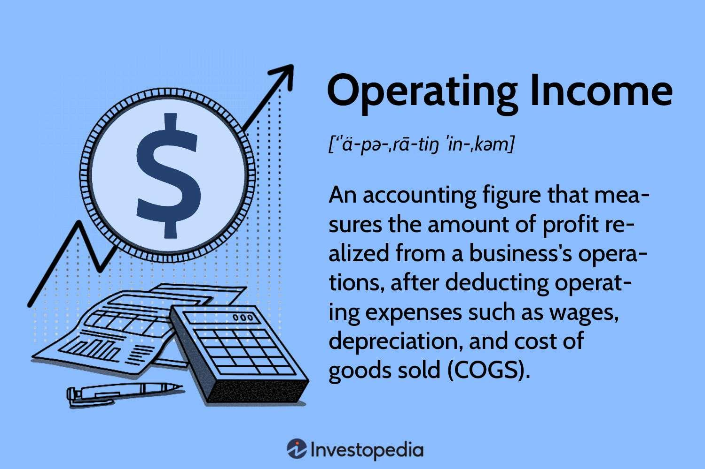

## Table of Contents

## What is income from operations?

Income from operations is the profit a company makes from its main business activities, before taking away things like taxes and interest. It's also called operating income or operating profit. To find it, you start with the company's total revenue, then subtract the costs of making and selling the products or services, like the cost of goods sold and operating expenses.

This number is important because it shows how well the company is doing at its core business, without considering other things like investments or loans. If a company has a high income from operations, it means its main business is doing well. But if it's low, the company might need to look at ways to cut costs or increase sales to improve its performance.

## How is income from operations calculated?

Income from operations is figured out by taking the money a company makes from selling its products or services and then subtracting the costs of making and selling those products or services. This includes the cost of goods sold, which is the money spent on materials and labor to make the products, and operating expenses, which are the costs of running the business day-to-day, like rent, utilities, and salaries for employees not directly involved in making the product.

This calculation gives you the operating income, which shows how much profit the company is making from its main business activities before paying taxes or interest on loans. It's a key number because it tells you if the company's core business is doing well. If the operating income is high, it means the company is making good money from what it does best. If it's low or negative, the company might need to find ways to save money or sell more to improve its profits.

## What are the components of income from operations?

Income from operations is made up of a few key parts. The first part is the money a company makes from selling its products or services, which is called revenue. This is the total amount of money coming into the company from its main business activities. The second part is the cost of goods sold, which is the money the company spends on making the products or services it sells. This includes things like the cost of materials and the wages paid to workers who make the products.

The third part is operating expenses, which are the costs of running the business day-to-day. This includes things like rent for the office or store, utility bills, and salaries for employees who are not directly involved in making the products, like managers and salespeople. To find the income from operations, you take the revenue and subtract both the cost of goods sold and the operating expenses. This gives you the profit the company makes from its main business activities before paying taxes or interest on loans.

## Why is income from operations important for businesses?

Income from operations is important for businesses because it shows how well the company is doing at its main job. It tells business owners and managers if they are making money from what they do every day, like selling products or services. If the income from operations is high, it means the company is doing well at its core business. This can help the company decide if it should keep doing what it's doing or if it needs to make changes.

This number is also useful for people outside the company, like investors and lenders. They look at income from operations to see if the company is a good investment or if it can pay back loans. If a company has a strong income from operations, it might be easier for them to get money from investors or banks. This can help the company grow or improve its business. Knowing the income from operations helps everyone understand the health of the company's main business activities.

## Can you provide a simple example of how to calculate income from operations?

Let's say a small bakery sells cakes. In one month, the bakery makes $10,000 from selling cakes. This is their revenue. To make these cakes, they spend $4,000 on ingredients and wages for the bakers. This is their cost of goods sold. The bakery also has to pay $3,000 for rent, utilities, and salaries for the salespeople. These are their operating expenses.

To find the income from operations, you take the revenue and subtract the cost of goods sold and the operating expenses. So, for the bakery, you start with $10,000 in revenue. You subtract $4,000 for the cost of goods sold, which leaves $6,000. Then you subtract the $3,000 in operating expenses, which gives you $3,000. This $3,000 is the bakery's income from operations for that month. It shows how much profit the bakery made from selling cakes before paying taxes or interest on any loans.

## How does income from operations differ from net income?

Income from operations and net income are both important numbers that show how much money a company is making, but they are different in what they include. Income from operations, also called operating income, is the profit a company makes from its main business activities before paying taxes and interest on loans. It's calculated by taking the company's revenue and subtracting the cost of goods sold and operating expenses. This number shows how well the company is doing at its core business, without considering other things like investments or loans.

Net income, on the other hand, is the total profit a company makes after all expenses are taken away, including taxes and interest on loans. It's the final number at the bottom of the income statement and shows the company's overall profitability. To find net income, you start with the income from operations, then subtract interest and taxes. This gives you a complete picture of the company's financial health, showing how much money is left after all costs are paid.

## What are common adjustments made to arrive at income from operations?

When figuring out income from operations, businesses often need to make some adjustments to their numbers. One common adjustment is to take out any money made or lost from things that are not part of the main business, like selling off old equipment or earning interest from investments. These are not related to the company's main job, so they are not included in income from operations. Another adjustment is to remove any one-time or unusual costs, like the money spent on a big lawsuit or a natural disaster. These costs do not happen every day and can make the numbers look worse than they really are.

Another important adjustment is to take out any money spent on or earned from non-operating activities, like interest paid on loans or taxes. These are important for the overall health of the business but do not show how well the main business is doing. By making these adjustments, the company can see a clear picture of its core business performance. This helps business owners and managers make better decisions about how to run the company and where to focus their efforts.

## How can income from operations be used to assess a company's performance?

Income from operations is a key number that helps people see how well a company is doing at its main job. It shows the profit the company makes from selling its products or services, after taking away the costs of making and selling them. This number is important because it tells business owners and managers if their core business is making money. If the income from operations is high, it means the company is doing well at what it does every day. This can help them decide if they should keep doing things the same way or if they need to make changes to improve their business.

People outside the company, like investors and lenders, also look at income from operations to see if the company is a good investment or if it can pay back loans. A strong income from operations can show that the company is healthy and likely to keep making money in the future. This can make it easier for the company to get money from investors or banks, which can help them grow or improve their business. By looking at income from operations, everyone can get a clear picture of how well the company's main business activities are doing.

## What are the limitations of using income from operations as a performance metric?

Income from operations is a good way to see how well a company is doing at its main job, but it has some limits. One big limit is that it does not include all the costs a company has to pay, like taxes and interest on loans. This means that even if a company has a high income from operations, it might not be making as much money as it seems once all the bills are paid. Also, income from operations does not show how well the company is using its money to grow or make more money in the future. It only shows the profit from what the company is doing right now.

Another limit is that income from operations can be affected by things that do not happen every day. For example, if a company has to pay a lot of money for a lawsuit or a natural disaster, it might make the income from operations look lower than it usually is. This can make it hard to see how well the company is really doing over time. Also, different companies might count things differently when they figure out their income from operations, which can make it hard to compare one company to another. So, while income from operations is a helpful number, it is important to look at other things too to get a full picture of a company's health.

## How do different industries report income from operations differently?

Different industries might report income from operations in different ways because they have different kinds of costs and ways of making money. For example, a manufacturing company might include the cost of raw materials and factory workers in its cost of goods sold, while a service company like a law firm might include the salaries of lawyers in its operating expenses. This means that what goes into the income from operations can look different from one industry to another, even if they are both trying to show the same thing: how much profit they make from their main business activities.

Another reason industries report income from operations differently is because of the rules and standards they follow. For instance, in the tech industry, companies might have a lot of research and development costs, and they might choose to include these costs in their operating expenses or treat them differently. On the other hand, a retail company might focus more on the cost of inventory and sales. These differences can make it hard to compare income from operations across different industries, but they help each industry show a true picture of their business performance.

## What advanced techniques can be used to analyze trends in income from operations?

To analyze trends in income from operations, one advanced technique is to use time series analysis. This means looking at the income from operations over many time periods, like months or years, to see if there are patterns or changes. By using special math tools, you can see if the income is going up, down, or staying the same over time. This can help you predict what might happen in the future and make better plans for the business. For example, if you see that income from operations goes up every summer, you might decide to put more money into marketing during that time to make even more profit.

Another technique is to use ratio analysis, which compares income from operations to other numbers in the company's financial statements. One common ratio is the operating margin, which is the income from operations divided by the total revenue. This shows how much of each dollar of revenue is left as profit after paying for the costs of making and selling the products or services. By looking at this ratio over time, you can see if the company is getting better or worse at making money from its main business. If the operating margin is going up, it means the company is keeping more of its revenue as profit, which is a good sign.

## How can income from operations be optimized through strategic business decisions?

To make more money from operations, a company can make smart choices about how it runs its business. One way is to cut down on the costs of making and selling products or services. This might mean finding cheaper materials, using machines to do some of the work, or finding ways to make things faster and with less waste. Another way is to sell more by making the products or services better or by finding new customers. This could mean spending money on advertising, making the products easier to use, or offering special deals to attract more people. By looking at all these things, a company can figure out the best way to make more profit from what it does every day.

Another important part of making more money from operations is to keep an eye on the numbers and make changes when needed. This means checking the income from operations regularly to see if it's going up or down and figuring out why. If the costs are too high, the company might need to find ways to spend less money. If the sales are low, it might need to try new ways to sell more. By always looking at the numbers and making smart choices, a company can keep improving its main business and make more profit over time.

## What is the difference between Understanding Income from Operations and Operating Income?

Income from operations, also known as operating income, represents the profit generated from a company's primary business activities. This metric is crucial as it provides a more accurate reflection of a company's core profitability by excluding non-operational income such as interest, taxes, and other ancillary revenues or expenses. By isolating income from primary business functions, stakeholders can better assess the fundamental business health and operational efficiency of a company.

Calculating operating income involves the subtraction of cost of goods sold (COGS) and operating expenses from total revenue. The formula is succinctly expressed as:

$$
\text{Operating Income} = \text{Revenue} - \text{Cost of Goods Sold} - \text{Operating Expenses}
$$

Understanding this calculation is key to evaluating management efficiency. Operating income highlights a company's ability to generate profit from its regular business operations before accounting for financial and extraordinary items. A consistent or rising operating income over a period suggests that a company is effectively managing its core operations, controlling costs, and generating sales efficiently. For example, if a manufacturing firm witnesses steady growth in operating income, it indicates effective production processes, efficient use of resources, and potentially successful sales strategies, signaling robust operational management.

Moreover, operating income serves as a focal point in financial analysis, allowing investors and analysts to benchmark a company's performance against its peers. This benchmarking, in conjunction with other financial metrics, aids in making informed decisions regarding investments and managerial strategies. The ability to grow or maintain steady operating income, even amidst fluctuating market conditions, can significantly impact a company's long-term sustainability and valuation.

## What is the Role of Financial Analysis in Business?

Financial analysis is a systematic approach to evaluating a company's financial statements, which is fundamental to making informed economic decisions. This process involves scrutinizing an organization’s income statement, balance sheet, and cash flow statement. Each of these documents provides critical insights into different facets of a company's financial health, forming a comprehensive picture of its operational efficiency and financial stability.

The income statement is a vital document that details a company's revenues, expenses, and profits over a specific period. It allows analysts to determine operating income, a crucial metric for financial evaluation. Operating income is calculated by subtracting the cost of goods sold and operating expenses from the total revenue, mathematically expressed as:

$$
\text{Operating Income} = \text{Revenue} - (\text{Cost of Goods Sold} + \text{Operating Expenses})
$$

This metric is essential because it focuses on the core profitability derived from a company's regular business operations, excluding non-operational factors like taxes or financing costs. A company with a robust operating income indicates effective management and healthy business practices, making it an attractive prospect for investors.

The balance sheet complements the income statement by providing a snapshot of a company's assets, liabilities, and shareholders' equity at a given point in time. This static representation helps analysts understand the company's financial structure, solvency, and [liquidity](/wiki/liquidity-risk-premium), influencing strategic decisions concerning investments and financing.

The cash flow statement is another critical component of financial analysis, illustrating how a company generates and uses cash over time. It highlights cash flows from operations, investing, and financing activities, offering insights into the company's cash management practices and its ability to generate cash to meet obligations.

Operating income, as a component of financial analysis, helps businesses enhance transparency and strategic planning. By concentrating on financial fundamentals, organizations can identify operational inefficiencies, optimize resource allocation, and improve overall performance metrics.

In conclusion, financial analysis plays a pivotal role in business by offering a detailed examination of financial statements. Understanding these components allows businesses to make data-driven decisions, facilitating better transparency and strategic foresight. As companies navigate complex financial landscapes, robust financial analysis becomes indispensable for sustaining growth and profitability.

## References & Further Reading

[1]: ["Advances in Financial Machine Learning"](https://www.amazon.com/Advances-Financial-Machine-Learning-Marcos/dp/1119482089) by Marcos Lopez de Prado

[2]: ["Evidence-Based Technical Analysis: Applying the Scientific Method and Statistical Inference to Trading Signals"](https://www.amazon.com/Evidence-Based-Technical-Analysis-Scientific-Statistical/dp/0470008741) by David Aronson

[3]: ["Machine Learning for Algorithmic Trading"](https://github.com/stefan-jansen/machine-learning-for-trading) by Stefan Jansen

[4]: ["Quantitative Trading: How to Build Your Own Algorithmic Trading Business"](https://www.amazon.com/Quantitative-Trading-Build-Algorithmic-Business/dp/1119800064) by Ernest P. Chan

[5]: Hull, J.C. (2018). ["Options, Futures, and Other Derivatives"](https://www.semanticscholar.org/paper/Options%2C-Futures%2C-and-Other-Derivatives-Hull/89bdee500c8623864fc9eb7a471546aa713acc44). Pearson. 

[6]: Pardo, R. (2008). ["The Evaluation and Optimization of Trading Strategies"](https://onlinelibrary.wiley.com/doi/book/10.1002/9781119196969). Wiley. 

[7]: Nagpal, G. (2015). ["A Guide to Creating A Successful Algorithmic Trading Strategy"](https://www.wiley.com/en-us/A+Guide+to+Creating+A+Successful+Algorithmic+Trading+Strategy-p-9781119224747). Nasdaq. 