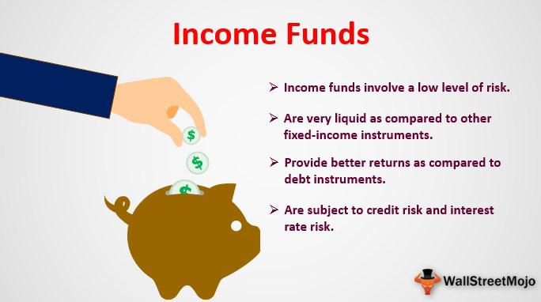

Income funds and algorithmic trading represent two significant facets of modern investment strategies, each offering distinct advantages to enhance an investor's portfolio. Income funds are designed to provide a steady stream of income with lower risk compared to more volatile investment options. These funds primarily focus on generating regular income through diversified portfolios consisting of dividend-paying stocks, bonds, or other interest-bearing assets. Such funds are appealing to conservative investors or those seeking consistent returns, as they aim to mitigate risks associated with market fluctuations.

Algorithmic trading, on the other hand, is characterized by the use of computer algorithms to execute trades based on pre-defined criteria. This innovative strategy leverages technological advancements to improve the efficiency and accuracy of trading, offering a modern approach that contrasts with traditional, manual trading methods. By utilizing algorithms, traders can analyze vast amounts of historical and real-time market data to identify trading opportunities with speed and precision. This approach not only increases the potential for profitability but also reduces the likelihood of human error.



The intersection of income funds and algorithmic trading offers a promising avenue for investors seeking to optimize their portfolios. By integrating algorithmic strategies with income funds, investors can enhance their ability to identify high-yield opportunities within various income-producing assets. For example, algorithms can quickly analyze market trends and data to pinpoint optimal entry and exit points for income fund investments, allowing for dynamic adjustments in response to shifting market conditions.

Some investors have successfully employed these technologies to balance the need for stable income with the agility of modern trading methods. Through the adoption of algorithmic trading, they can effectively manage risk by leveraging the predictive capabilities of sophisticated models to anticipate market movements and adjust their income fund allocations accordingly.

Overall, the integration of income funds with algorithmic trading highlights a significant trend in the evolution of financial strategies. This synergy not only underscores the potential for enhanced portfolio performance but also exemplifies the continuous innovation shaping the future of investment management. As technology continues to evolve, investors are encouraged to explore these groundbreaking strategies to achieve a fine-tuned balance between income stability and growth potential in their investment portfolios.

## Table of Contents

## Understanding Income Funds

Income funds are investment vehicles designed to provide a steady stream of income, primarily through interest and dividends. They are particularly appealing to investors seeking regular income payouts, including retirees, who prioritize stability over capital growth. These funds typically invest in income-generating assets such as bonds, equity dividends, and other securities, aiming to deliver consistent returns with a lower risk profile compared to growth-oriented funds.

### Types of Income Funds

#### Money Market Funds
Money market funds are a type of income fund that invests in short-term, high-quality debt securities like Treasury bills, certificates of deposit, and commercial paper. These funds are characterized by their low-risk profile and high [liquidity](/wiki/liquidity-risk-premium), making them suitable for investors with a short investment horizon looking to preserve capital. The returns from money market funds are modest, reflecting the stability and safety of the underlying assets.

#### Bond Funds
Bond funds pool resources to invest in various types of bonds, which can be categorized into government and corporate options. Government bond funds often include securities like Treasury bonds, which are backed by national governments and typically offer lower yields but with minimal default risk. In contrast, corporate bond funds invest in bonds issued by companies, offering higher yields but accompanied by increased risk. Bond funds provide diversification and regular interest income, attracting investors with medium to long-term investment horizons.

#### Equity Income Funds
Equity income funds focus on dividend-paying stocks, aiming to deliver both income and potential capital appreciation. These funds invest in companies with a strong track record of paying regular dividends, typically from stable, mature sectors such as utilities and consumer goods. While equity income funds [carry](/wiki/carry-trading) higher risk compared to money market and bond funds due to stock market [volatility](/wiki/volatility-trading-strategies), they also offer the potential for higher returns and inflation protection.

### Key Takeaways and Benefits of Investing in Income Funds

1. **Regular Income:** Income funds provide investors with a consistent income stream through interest payments, dividends, or both, making them ideal for individuals requiring periodic cash flow.
2. **Diversification:** By investing in a broad range of securities, income funds reduce the overall investment risk through diversification.
3. **Professional Management:** Income funds are managed by professional fund managers who possess the expertise to select and manage the fund's investment portfolio, aligning it with the fund's income objectives.
4. **Accessibility and Liquidity:** With relatively low minimum investment requirements and the ability to redeem shares at any time (for most funds), investors can easily access and manage their investments.

### Risk Considerations and Investment Horizons

While income funds offer several benefits, they are not without risks. Interest rate fluctuations can impact bond funds, leading to potential capital losses, especially in a rising [interest rate](/wiki/interest-rate-trading-strategies) environment. Credit risk is also a [factor](/wiki/factor-investing), particularly for corporate bond funds, where the issuer's creditworthiness may affect the bond's value.

Market volatility impacts equity income funds, albeit this can be partially mitigated through the selection of stocks with strong, consistent dividend payouts. Investors should align their choice of income funds with their individual risk tolerance levels and investment horizons, recognizing that longer horizons may allow for greater tolerance and recovery from potential market fluctuations.

### Examples of Popular Income Funds and Their Performance Metrics

Identifying popular income funds offers insight into their performance and the potential benefits they provide. For instance, the Vanguard Wellesley Income Fund is a well-known balanced fund that invests approximately 60-65% in bonds and the remainder in dividend-paying stocks. Over the past decade, this fund has provided consistent and robust returns, maintaining volatility at relatively lower levels than the broader market.

Another prominent example is the Fidelity Strategic Income Fund, which seeks to provide a high level of current income consistent with the preservation of capital. This fund diversifies across various bond sectors and has consistently ranked favorably in terms of yield while managing risks effectively.

Investors should assess fund performance through metrics such as yield, expense ratios, and historical return patterns to ensure alignment with their financial goals and risk preferences. By understanding these characteristics, investors can better navigate the landscape of income funds to achieve their income objectives.

## Types of Investment in Income Funds

Income funds are a vital component of diversified investment portfolios, designed to provide investors with regular income and balanced risk. This section will examine the various types of income funds, including money market funds, bond funds, and equity income funds, along with other income-producing vehicles such as Real Estate Investment Trusts (REITs) and Master Limited Partnerships (MLPs).

### Money Market Funds

Money market funds are a type of mutual fund investing in short-term, high-quality money market instruments, which include treasury bills, certificates of deposit, and commercial paper. These funds are characterized by their low-risk profile and aim to offer high liquidity with minimal price fluctuations. Their primary aim is capital preservation with modest income generation. Due to the low-risk nature, money market funds typically yield lower returns compared to other income funds.

### Bond Funds

Bond funds aggregate investments in various fixed-income securities and are primarily distinguished by the type of bonds they hold: government bonds or corporate bonds.

- **Government Bond Funds**: These funds invest in debt securities issued by national governments. They are perceived as safer due to government backing, and are subject to interest rate risk. Funds investing in U.S. Treasury bonds are popular due to their safety amidst varying economic conditions.

- **Corporate Bond Funds**: Focused on bonds issued by corporations, these funds carry higher credit risk than government bonds but offer potentially higher yields. They vary widely in risk based on the creditworthiness of the issuing companies, resulting in a broad spectrum of available corporate bond funds tailored to different risk appetites.

### Equity Income Funds

Equity income funds prioritize investing in dividend-paying stocks, providing a steady income stream complemented by potential capital appreciation. They typically focus on companies with a history of long-term dividend payouts, which can increase during periods of economic growth. These funds offer a balance between income generation and exposure to market volatility, making them suitable for investors seeking both income and growth. 

### Other Income-Producing Funds

Other investment vehicles like Real Estate Investment Trusts (REITs) and Master Limited Partnerships (MLPs) are notable for their regular income distributions.

- **REITs**: These are companies that own, operate, or finance income-generating real estate and are required by law to distribute at least 90% of taxable income as dividends. REITs offer high dividend yields and the opportunity for capital appreciation but are subject to real estate market risks.

- **MLPs**: Primarily involved in energy infrastructure, MLPs provide significant income potential due to their tax-advantageous structure, which mandates distributions to unit holders. While MLPs often yield higher returns, they come with sector-specific risks, particularly linked to energy price volatility.

### Comparing Yields

Comparing yields is crucial for aligning investment choices with investor goals. Money market funds offer the lowest yields due to their safety, while corporate bond funds and equity income funds provide relatively higher returns that match varying risk profiles. REITs and MLPs, though riskier due to sectorial market fluctuations, often yield the highest returns, appealing to income-focused investors willing to assume more risk.

By understanding these varied income fund options, investors can tailor portfolios to meet specific income needs and risk tolerances, promoting balanced investment strategies that safeguard capital while maximizing potential returns.

## Algorithmic Trading: A Modern Approach

Algorithmic trading represents a significant advancement in modern finance, revolutionizing the way trades are executed in various financial markets. This innovative approach employs sophisticated algorithms to automate trading decisions, allowing processes to occur with remarkable speed and precision. Algorithms are sets of defined rules or instructions that systematically evaluate a multitude of factors, including market conditions and historical data, to execute trades. By eliminating the emotional aspects of decision-making, [algorithmic trading](/wiki/algorithmic-trading) enhances efficiency and consistency in trading.

One of the key advantages of algorithmic trading is its ability to execute trades based on pre-defined strategies and current market conditions. This automatic execution minimizes the reaction time to market movements, optimizing the entry and [exit](/wiki/exit-strategy) points for trades. The algorithms consider a wide range of variables such as price, [volume](/wiki/volume-trading-strategy), timing, and other market signals, enabling traders to capitalize on fleeting opportunities that might be missed manually.

Speed and precision are critical components of algorithmic trading. The speed with which these algorithms can process information and execute trades provides a competitive edge, especially in high-frequency trading scenarios where milliseconds can make a significant difference. The precise nature of algorithms ensures that trades are executed according to the specified criteria without human errors or delays.

Backtesting is a crucial aspect of algorithmic trading strategy development. This process involves testing the viability of trading strategies using historical data to assess how they would have performed under past market conditions. By analyzing historical performance, traders can refine and optimize their algorithms, enhancing their predictive capabilities and reducing potential risks. For instance, a simple [backtesting](/wiki/backtesting) scenario in Python might look like this:

```python
import pandas as pd
import numpy as np

# Load historical market data
data = pd.read_csv('historical_data.csv')

# Define a simple moving average strategy
short_window = 40
long_window = 100

# Signals generation
signals = pd.DataFrame(index=data.index)
signals['signal'] = 0.0
signals['short_mavg'] = data['Close'].rolling(window=short_window, min_periods=1, center=False).mean()
signals['long_mavg'] = data['Close'].rolling(window=long_window, min_periods=1, center=False).mean()
signals['signal'][short_window:] = np.where(signals['short_mavg'][short_window:] > signals['long_mavg'][short_window:], 1.0, 0.0)
signals['positions'] = signals['signal'].diff()

# Evaluate performance
initial_capital = float(100000.0)
positions = pd.DataFrame(index=signals.index).fillna(0.0)
positions['Asset'] = 100 * signals['signal']  # Number of shares
portfolio = positions.multiply(data['Close'], axis=0)
pos_diff = positions.diff()
portfolio['cash'] = initial_capital - (pos_diff.multiply(data['Close'], axis=0)).cumsum()
portfolio['total'] = portfolio['cash'] + portfolio['Asset']*data['Close']
portfolio['returns'] = portfolio['total'].pct_change()

# Plot and analysis
portfolio['total'].plot(figsize=(10, 5), title='Portfolio Total Value')
```

The applications of algorithmic trading extend across different financial markets, including equities, foreign exchange, and derivatives. In the equities market, algorithms can exploit small price discrepancies for [arbitrage](/wiki/arbitrage) opportunities or implement [statistical arbitrage](/wiki/statistical-arbitrage) strategies. In [forex](/wiki/forex-system) markets, algorithms are used to manage large portfolios and hedge currency risk, while in derivatives markets, they are applied to execute complex trading strategies involving options and futures.

Algorithmic trading continues to shape modern finance, bringing efficiency, speed, and precision to the forefront of trading methodologies. This modern approach allows for enhanced decision-making processes and offers significant opportunities to optimize investments in diverse financial markets.

## Types of Algorithmic Trading Strategies

Algorithmic trading strategies leverage computer algorithms to execute trades with speed and precision, based on pre-set parameters and market conditions. These strategies aim to optimize investment returns while minimizing risks. Below are some of the most prominent types of algorithmic trading strategies:

### Trend-Following Strategies

Trend-following strategies operate on the principle that prices tend to move in a persistent direction over time. These strategies seek to capitalize on market [momentum](/wiki/momentum) by buying assets when prices are rising and selling when they are falling. The Moving Average Crossover, for example, is a popular trend-following approach, where buy or sell signals are generated based on the crossing of short-term and long-term moving averages. The simplicity of these strategies makes them attractive, though they may also be susceptible to whipsaws in volatile markets.

### Arbitrage Strategies

Arbitrage strategies exploit price inefficiencies between different markets or instruments. An example is the statistical arbitrage strategy, which identifies pairs of assets displaying a historically correlated price movement. Once the prices deviate from their established relationship, the strategy profits from the reversion to the mean. Algorithmic systems monitor numerous markets simultaneously, making high-frequency arbitrage viable.

### Market-Making Strategies

Market-making strategies involve providing liquidity to the market by simultaneously placing bid and ask orders. The algorithm generates profit by capturing the spread between these orders. Market-making requires rapid order execution and continuous market monitoring, making it a typical domain for high-frequency trading firms.

### Statistical Arbitrage Strategies

Statistical arbitrage involves complex mathematical models to identify pricing inefficiencies in the market. This strategy relies on mean reversion principles, where assets are expected to return to their historical average prices. By analyzing massive datasets, statistical models predict price corrections, allowing algorithms to profit from deviations in expected asset prices.

### Mean Reversion Strategies

Mean reversion is based on the idea that asset prices will revert to their historical averages over time. Strategies like the Bollinger Bands use statistical measures such as standard deviation to identify overbought or oversold conditions. A typical mean reversion strategy might buy an asset when its price drops below a certain threshold and sell it when the price exceeds another threshold.

### Impact on Markets

Algorithmic trading significantly impacts equities, forex, and derivatives markets by improving liquidity and narrowing spreads. However, it can also lead to increased volatility, as seen in events like the 2010 Flash Crash in the US stock market. Algorithms must balance the benefits of rapid execution with the potential for market disruptions.

### Advantages and Challenges

The primary advantage of algorithmic trading is its ability to process large volumes of data quickly, executing orders, and leveraging market inefficiencies more effectively than manual trading. Algorithms eliminate emotional biases, ensuring disciplined adherence to trading strategies. Challenges include the risk of algorithmic errors, overfitting models to historical data, and regulatory concerns. Furthermore, market conditions may change, rendering once-profitable strategies obsolete.

Algorithmic trading strategies continue to evolve, offering sophisticated tools for modern investors seeking to maximize returns with precision. However, the inherent challenges necessitate comprehensive risk management and vigilant monitoring of market conditions.

## Integrating Income Funds with Algorithmic Strategies

Algorithmic trading has revolutionized how investors approach income fund portfolios by employing sophisticated software capable of executing trades at speeds impossible for human traders. These algorithms optimize investments by analyzing massive datasets to identify high-yield opportunities within various income funds. 

For instance, algorithms scrutinize market trends, interest rate fluctuations, and macroeconomic indicators, making real-time decisions to maximize income fund yields. By leveraging [machine learning](/wiki/machine-learning) techniques and statistical models, these algorithms predict price movement patterns and assess credit risks associated with different income funds.

Risk management is another critical aspect where algorithmic strategies play a pivotal role. Algorithms monitor and adjust portfolios by evaluating key risk factors, such as interest rate changes, to ensure that the investments remain within acceptable risk parameters. This process is vital for minimizing potential losses while maximizing returns, especially in volatile markets.

Technological advancements have made significant contributions to integrating algorithmic strategies with income fund investments. The development of high-speed trading platforms and enhanced data analytic tools enables investors to deploy more complex strategies efficiently. Cloud computing and [artificial intelligence](/wiki/ai-artificial-intelligence) further facilitate real-time analysis and decision-making, allowing for seamless adjustments to the composition of income fund portfolios.

Several case studies underscore the successful integration of algorithmic trading in income fund investment. For example, some hedge funds have used quant-driven approaches to consistently outperform benchmarks by identifying mispriced assets and exploiting arbitrage opportunities. Another example involves asset management firms employing predictive analytics to rebalance portfolios in response to changing market conditions continually.

By incorporating algorithmic trading into income fund strategies, investors can achieve a more dynamic, data-driven approach that enhances both performance and risk management. As technology continues to evolve, the integration of these advanced financial strategies promises even greater potential for optimizing income fund portfolios.

## Conclusion

Income funds present a robust investment avenue, providing stability and reducing risk through their structured mechanisms for generating regular returns. These funds, by focusing on interest, dividends, or other fixed-income strategies, cater well to investors seeking consistent income, safeguarding against market volatility. Their diversified nature enables substantial risk mitigation while targeting reasonable yields, a combination appealing to conservative and balanced investors alike.

Algorithmic trading stands as a revolutionary component in modern finance, showcasing efficiency, precision, and the ability to handle vast data sets promptly. By utilizing algorithms, investors can execute trades based on pre-defined criteria with incredible speed, enhancing decision-making across volatile market conditions. This technology enables a powerful data-driven approach that surpasses traditional methodologies, promising substantial improvements in return generation and risk management.

The merging of income funds with algorithmic trading paves the way for creating more dynamic, optimized portfolios. Algorithms can effectively scrutinize income fund markets to uncover high-yield opportunities, address potential risks, and allocate resources in real time, based on current market conditions. This integration not only enhances portfolio performance but also provides a sophisticated level of risk management that is less susceptible to human error. It invites investors to consider new dimensions of portfolio enhancement that are both innovative and resourceful.

Looking ahead, technological advancements continue to mold the landscape of finance, promising an era where synergy between traditional strategies and modern technology becomes increasingly profound. As these integrations advance, investors willing to adapt and embrace these changes will potentially achieve significant gains. The future of finance is bright, with technological evolution fostering environments conducive to novel investment strategies and improved financial outcomes.

For potential investors, understanding the benefits and applications of income funds combined with algorithmic trading is critical. Being open to innovation, willing to analyze risk-reward scenarios, and ready to employ cutting-edge technologies can position them advantageously in an ever-evolving financial market.

## FAQs

### What are income funds and how do they work?

Income funds are mutual funds or exchange-traded funds (ETFs) that primarily aim to provide investors with a steady stream of income. They achieve this by investing in income-producing assets such as bonds, dividend-paying stocks, real estate investment trusts (REITs), and master limited partnerships (MLPs). The primary goal of income funds is to generate regular payouts, which can be monthly, quarterly, or annual, depending on the fund's specific structure.

The workings of income funds involve collecting income from the underlying assets, which is then distributed to investors. For instance, bond funds earn interest from their bond investments, while equity income funds collect dividends from stocks. Investors in income funds benefit from diversification, as these funds spread investments across a range of securities, thereby reducing the impact of poor performance by any single asset.

### How does algorithmic trading differ from traditional trading?

Algorithmic trading, also known as algo-trading, employs computer programs to execute trades based on predefined strategies. Unlike traditional trading, which relies heavily on human decision-making and manual execution, algorithmic trading leverages technology for speed and precision. 

In traditional trading, traders use their discretion and judgment to make trading decisions, often based on fundamental and technical analysis. In contrast, algorithmic trading utilizes data-driven models and mathematical algorithms to identify trading opportunities and execute trades instantly, often within milliseconds. This approach can take advantage of short-lived market trends and inefficiencies more effectively than human traders.

### Can algorithmic trading be integrated with income fund investments?

Yes, algorithmic trading can be integrated with income fund investments to optimize portfolio performance. By utilizing algorithms, investors can automate the selection and rebalancing of income fund portfolios to maximize yields while maintaining desired risk levels. Algorithms can analyze vast amounts of market data to identify high-yield income opportunities and execute trades at the most favorable prices.

For example, algorithmic strategies can be used to rotate between different types of income funds based on prevailing interest rates or economic conditions, ensuring that the portfolio remains aligned with the investor's income and risk objectives. This integration can enhance the overall efficiency and effectiveness of income fund investments.

### What are the risks associated with algorithmic trading and income funds?

Both algorithmic trading and income funds come with their own set of risks. For income funds, the main risks include interest rate risk, credit risk, and market risk. Changes in interest rates can significantly impact the value of bonds held within income funds. Similarly, credit risk arises if an issuer of bonds or securities defaults on payments. Market risk is a factor due to fluctuations in the overall market that can impact the value of the fund’s holdings.

Algorithmic trading poses additional risks related to technology and strategy design. Technical failures, such as bugs in the algorithm or connectivity issues, can lead to substantial losses. Moreover, if poorly designed, an algorithm might execute trades based on erroneous assumptions or outdated data, leading to suboptimal outcomes. As algorithmic trading often involves high-frequency trading, it may also contribute to market volatility.

### How do I start investing in income funds using algorithmic trading strategies?

To start investing in income funds using algorithmic trading strategies, you can follow these steps:

1. **Education and Research**: Gain a solid understanding of both income funds and algorithmic trading strategies. Read articles, books, and attend workshops or online courses related to these topics.

2. **Platform and Tools**: Choose a trading platform that supports algorithmic trading. Many brokerage firms offer APIs that allow you to connect your own trading algorithms.

3. **Develop or Acquire Algorithms**: Either develop your own trading strategies using programming languages such as Python or purchase existing algorithmic strategies from reputable sources. Backtesting is crucial here to ensure the strategies perform well historically.

    ```python
    import pandas as pd

    # Example of defining a simple moving average crossover strategy
    def simple_moving_average(data, short_window, long_window):
        signals = pd.DataFrame(index=data.index)
        signals['short_mavg'] = data['price'].rolling(window=short_window, min_periods=1).mean()
        signals['long_mavg'] = data['price'].rolling(window=long_window, min_periods=1).mean()
        signals['signal'] = 0.0
        signals['signal'][short_window:] = np.where(signals['short_mavg'][short_window:] 
                                                   > signals['long_mavg'][short_window:], 1.0, 0.0)   
        signals['positions'] = signals['signal'].diff()
        return signals

    # Usage with historical price data
    price_data = pd.DataFrame({'price': [105, 102, 110, 108, 115]})
    signals = simple_moving_average(price_data, short_window=2, long_window=4)
    ```

4. **Risk Management**: Establish a risk management framework to protect your investments. This includes setting stop-loss limits and position sizing rules to prevent significant losses.

5. **Monitoring and Adjusting**: Continuously monitor the performance of your investments and algorithms. Be prepared to adjust strategies as market conditions change or as you gather more insights.

6. **Consult Professionals**: If you're new to investing, consider consulting financial advisors or professionals with experience in algorithmic trading and income funds.

## References & Further Reading

[1]: Bergstra, J., Bardenet, R., Bengio, Y., & Kégl, B. (2011). ["Algorithms for Hyper-Parameter Optimization."](https://dl.acm.org/doi/10.5555/2986459.2986743) Advances in Neural Information Processing Systems 24.

[2]: ["Advances in Financial Machine Learning"](https://www.amazon.com/Advances-Financial-Machine-Learning-Marcos/dp/1119482089) by Marcos Lopez de Prado

[3]: ["Evidence-Based Technical Analysis: Applying the Scientific Method and Statistical Inference to Trading Signals"](https://www.amazon.com/Evidence-Based-Technical-Analysis-Scientific-Statistical/dp/0470008741) by David Aronson

[4]: ["Machine Learning for Algorithmic Trading"](https://github.com/stefan-jansen/machine-learning-for-trading) by Stefan Jansen

[5]: ["Quantitative Trading: How to Build Your Own Algorithmic Trading Business"](https://www.amazon.com/Quantitative-Trading-Build-Algorithmic-Business/dp/1119800064) by Ernest P. Chan