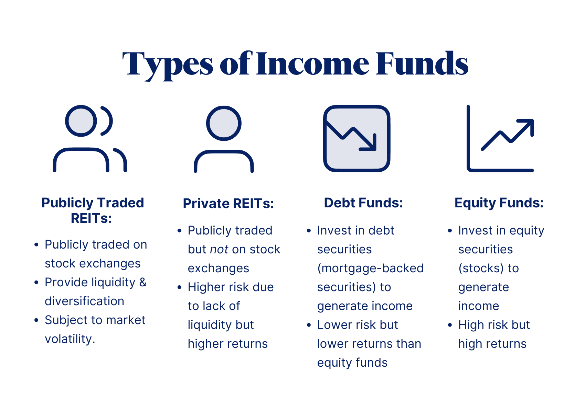

## Table of Contents

## What are income funds?

Income funds are a type of investment fund that focuses on generating regular income for investors. They do this by investing in assets that pay out money regularly, like bonds, dividend-paying stocks, and real estate investment trusts (REITs). The main goal of income funds is to provide a steady stream of income, which can be especially helpful for people who are retired or looking for a regular source of money.

These funds can be a good choice for people who want to earn income without having to sell their investments. Instead of selling parts of their investment to get money, investors in income funds receive payments from the interest, dividends, or rental income that the fund earns. However, it's important to know that income funds can also have risks, like changes in interest rates or the performance of the companies they invest in, which can affect the amount of income they generate.

## How do income funds generate income?

Income funds make money by investing in things that pay out regularly. They might put money into bonds, which are like loans to companies or governments that pay back interest over time. They also invest in stocks that give dividends, which are parts of a company's profits shared with shareholders. Another common investment is real estate investment trusts, or REITs, which own properties and earn money from rent.

The money these investments make is then shared with the people who own parts of the income fund. This sharing happens regularly, often every month or every three months. So, if you own part of an income fund, you get a piece of the interest, dividends, or rent that the fund earns. This way, you can get a steady flow of money without having to sell your investment.

## What are the main types of income funds?

Income funds come in different types, but the main ones are bond funds, equity income funds, and real estate income funds. Bond funds invest mostly in bonds, which are like loans that pay back interest. These can be from governments or companies. The interest that comes from these bonds is shared with the people who own the fund. This makes bond funds a popular choice for people who want a steady income without too much risk.

Equity income funds focus on stocks that pay dividends. Dividends are parts of a company's profits that get shared with people who own the stocks. These funds look for companies that have a good history of paying dividends regularly. This way, the people who own the fund get a regular income from these dividends. Equity income funds might be a bit riskier than bond funds because stock prices can go up and down a lot.

Real estate income funds invest in real estate investment trusts, or REITs. REITs own properties like apartments, shopping centers, or office buildings and earn money from the rent people pay. This rent money is then shared with the people who own the real estate income fund. These funds can be a good choice for people who want to earn money from real estate without having to buy and manage properties themselves. However, the income from these funds can change based on how well the properties are doing or changes in the real estate market.

## What are bond income funds and how do they work?

Bond income funds are a type of investment fund that mainly puts money into bonds. Bonds are like loans that you give to a company or a government. When you buy a bond, they promise to pay you back the money you lent them plus some extra money called interest. Bond income funds collect this interest from lots of different bonds and then share it with the people who own the fund. This way, if you own part of a bond income fund, you get a regular payment from the interest the fund earns.

These funds are often seen as a safer way to get regular income because bonds are usually less risky than stocks. But, the amount of interest you get can change based on things like how well the company or government is doing, or changes in interest rates. If interest rates go up, the value of the bonds the fund owns might go down, which can affect how much money the fund makes. Still, bond income funds can be a good choice for people who want a steady income without taking too much risk.

## What are dividend income funds and what are their characteristics?

Dividend income funds are a type of investment fund that focuses on buying stocks that pay dividends. Dividends are parts of a company's profits that get shared with people who own the stocks. These funds look for companies that have a good history of paying dividends regularly. This way, the people who own the fund get a regular income from these dividends. It's like getting a little piece of the company's earnings without having to sell your stocks.

These funds can be a bit riskier than bond funds because stock prices can go up and down a lot. But, they can also offer a chance for the value of your investment to grow over time, not just the income from dividends. Dividend income funds are popular with people who want to earn money from their investments without selling them. They can be a good choice for people who are retired or looking for a steady source of income, but they need to be okay with the ups and downs of the stock market.

## What are real estate income funds and what makes them unique?

Real estate income funds are a type of investment fund that puts money into real estate investment trusts, or REITs. REITs own properties like apartments, shopping centers, or office buildings and earn money from the rent people pay. This rent money is then shared with the people who own the real estate income fund. So, if you own part of a real estate income fund, you get a piece of the rent money without having to buy and manage properties yourself.

What makes real estate income funds unique is that they let you invest in real estate without the hassle of being a landlord. You don't have to worry about finding tenants, fixing things, or dealing with property taxes. But, the income from these funds can change based on how well the properties are doing or changes in the real estate market. So, while they can offer a steady income, they also come with some risks tied to the ups and downs of real estate.

## How do income funds differ from growth funds?

Income funds and growth funds are two different types of investment funds with different goals. Income funds focus on giving investors a regular income. They do this by investing in things like bonds, stocks that pay dividends, and real estate that earns rent. The main idea is to give people a steady stream of money, which can be helpful for people who are retired or need regular income. But, income funds might not grow in value as much over time because they focus more on [earning](/wiki/earning-announcement) money now than on growing in the future.

On the other hand, growth funds aim to increase the value of the investment over time. They invest in stocks of companies that are expected to grow a lot in the future. These funds don't usually pay out regular income because they want to use the money to buy more stocks and help the companies grow. Growth funds can be riskier because the value of the stocks can go up and down a lot, but they also have the potential to make more money in the long run. So, while income funds are about getting money now, growth funds are about making more money later.

## What are the risks associated with investing in income funds?

Investing in income funds comes with some risks that you should know about. One big risk is that the income you get from the fund can change. This can happen if interest rates go up or down, or if the companies the fund invests in don't do well. For example, if a bond fund owns a lot of bonds and interest rates go up, the value of those bonds might go down, which can mean less income for you. Also, if a company that pays dividends has a bad year, it might cut or stop paying dividends, which would affect the income from an equity income fund.

Another risk is that the value of the fund itself can go up and down. This is called market risk. If the stock market or the bond market has a bad time, the value of your income fund can drop. This might not matter as much if you're just looking for income and not planning to sell your investment soon. But if you need to sell your investment at a time when the market is down, you might get less money than you put in. Real estate income funds have their own special risks too, like changes in the real estate market or problems with the properties the fund owns.

Overall, while income funds can give you a steady stream of money, they're not without risks. It's important to think about these risks and maybe talk to a financial advisor to see if income funds are a good fit for your investment goals and how much risk you're okay with taking.

## Can you provide examples of successful income funds?

One example of a successful income fund is the Vanguard High Dividend Yield Index Fund (VHYAX). This fund focuses on stocks that pay good dividends. It tries to match the performance of the FTSE High Dividend Yield Index, which includes companies that have a history of paying high dividends. People like this fund because it gives them a steady income and also has the potential to grow over time. It's popular with people who want to earn money from their investments without selling them.

Another successful income fund is the PIMCO Income Fund (PIMIX). This fund mainly invests in bonds, but it also puts money into other things like mortgage-backed securities and corporate loans. It's known for giving investors a high level of income compared to other bond funds. The fund is managed by experienced people who try to pick the best bonds and other investments to make the most money. People who invest in this fund like it because it gives them a good income and is managed carefully to keep risks low.

The Cohen & Steers Quality Income Realty Fund (RQI) is a successful real estate income fund. It invests in real estate investment trusts, or REITs, which own properties and earn money from rent. This fund tries to give investors a high level of income from the rent money it gets. It's a good choice for people who want to earn money from real estate without having to buy and manage properties themselves. People like this fund because it gives them a steady income and lets them invest in real estate without the hassle.

## How should one evaluate the performance of an income fund?

When you want to see how well an income fund is doing, you should look at a few important things. First, check the income the fund gives you. This is usually shown as the yield, which tells you how much money you get back each year compared to what you put in. A higher yield can mean more money in your pocket, but be careful because a very high yield might also mean more risk. Also, look at the total return of the fund, which includes both the income you get and any changes in the fund's value. This gives you a full picture of how the fund is doing.

Another thing to think about is how the fund has done over time. Look at its performance over different periods like one year, three years, and five years. This can help you see if the fund gives you a steady income and if it grows in value over time. It's also good to compare the fund to others that are similar or to a benchmark, like an index, to see if it's doing better or worse than expected. By looking at all these things, you can get a good idea of how well the income fund is working for you.

## What are the tax implications of investing in income funds?

When you invest in income funds, you need to think about taxes. The money you get from these funds, like interest from bonds or dividends from stocks, is usually taxed as regular income. This means you pay taxes on it at the same rate as your salary or wages. If the fund makes money by selling investments, like stocks or bonds, you might also have to pay taxes on those profits. These profits are called capital gains, and they can be taxed at a lower rate if you hold onto the investment for more than a year.

Some income funds invest in things like municipal bonds, which can be tax-free at the federal level. This means you don't have to pay federal taxes on the interest you get from these bonds. But, you might still have to pay state or local taxes, depending on where you live and where the bonds come from. It's a good idea to talk to a tax advisor to understand all the tax rules and how they affect your income from these funds. They can help you figure out the best way to invest and keep more of your money.

## How can income funds fit into a diversified investment portfolio?

Income funds can be a great addition to a diversified investment portfolio because they provide a steady stream of income. This can be really helpful for people who need regular money, like retirees, or anyone who wants to balance out riskier investments like stocks. By putting some money into income funds, you can get regular payments from interest, dividends, or rent, which can make your overall investment plan more stable and less affected by ups and downs in the market.

Including income funds in your portfolio also helps spread out your investments across different types of assets, like bonds, stocks, and real estate. This diversification can lower your risk because if one type of investment does badly, the others might still do well. For example, if the stock market goes down, the bonds in your income fund might still give you steady income. So, income funds can help you build a balanced portfolio that aims to grow your money over time while also giving you regular income.

## References & Further Reading

[1]: Bergstra, J., Bardenet, R., Bengio, Y., & Kégl, B. (2011). ["Algorithms for Hyper-Parameter Optimization."](https://dl.acm.org/doi/10.5555/2986459.2986743) Advances in Neural Information Processing Systems 24.

[2]: ["Advances in Financial Machine Learning"](https://www.amazon.com/Advances-Financial-Machine-Learning-Marcos/dp/1119482089) by Marcos Lopez de Prado

[3]: ["Evidence-Based Technical Analysis: Applying the Scientific Method and Statistical Inference to Trading Signals"](https://www.amazon.com/Evidence-Based-Technical-Analysis-Scientific-Statistical/dp/0470008741) by David Aronson

[4]: ["Machine Learning for Algorithmic Trading"](https://github.com/stefan-jansen/machine-learning-for-trading) by Stefan Jansen

[5]: ["Quantitative Trading: How to Build Your Own Algorithmic Trading Business"](https://www.amazon.com/Quantitative-Trading-Build-Algorithmic-Business/dp/1119800064) by Ernest P. Chan