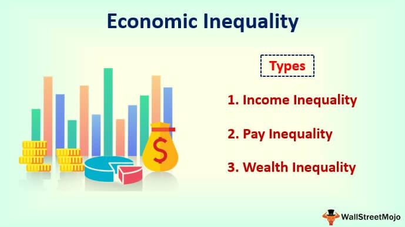

Economic disparity, income inequality, and wealth distribution are critical issues in today's global economy, affecting social stability and sustainable development. As technological advancements accelerate, particularly within financial sectors, they reshape these economic patterns. One notable innovation is algorithmic trading, which has dramatically altered the landscape of financial markets by utilizing automated and pre-programmed trading strategies. This sophisticated trading method, representing a pinnacle of technological evolution, plays a significant role in influencing wealth distribution. 

Algorithmic trading employs complex algorithms to make rapid trading decisions, often outpacing human traders. This capability to execute large volumes of transactions at high speeds can lead to increased market efficiency by providing liquidity, reducing spreads, and ensuring more accurate pricing. However, it also creates a competitive advantage for entities with access to advanced technologies and substantial financial resources, potentially exacerbating economic disparities. Entities that can afford cutting-edge algorithmic systems can tap into significant market gains, thereby increasing their wealth relative to players with limited technological access. 

The implications of such technological advantages extend beyond individual or corporate wealth accumulation. They challenge traditional financial structures and contribute to broader patterns of economic inequality by concentrating financial power within a select group of technologically adept institutions. This shift underscores the growing interconnectedness between economic disparity, income inequality, and financial innovation. 

To effectively understand these dynamics, it is essential to analyze economic patterns shaped by technological progress and the systemic impact of algorithmic trading. Through this exploration, the article aims to illuminate the complex relationship between technological advancements in financial markets and their role in shaping global economic landscapes.

## Table of Contents

## Understanding Wealth Distribution and Economic Disparity

Wealth distribution is a crucial measure of how income and assets are shared among a population. It reflects the economic health of a society and provides insights into the levels of economic inequality present within different communities. The Lorenz Curve and the Gini Coefficient are traditional tools used to represent wealth distribution numerically and graphically.

Mathematically, the Gini Coefficient (G) can be defined as:

$$
G = \frac{\sum_{i=1}^{n} \sum_{j=1}^{n} |x_i - x_j|}{2n^2 \mu}
$$

where $n$ is the population size, $x_i$ and $x_j$ are income levels, and $\mu$ is the mean income. A Gini Coefficient of 0 represents perfect equality, while a coefficient of 1 indicates extreme inequality.

Economic disparity underscores the significant divide in terms of income and assets among different societal segments. This disparity is marked by unequal access to necessary resources and opportunities, which often manifests as disparities in education, healthcare, and employment potential. Indicators such as educational attainment level, availability and quality of healthcare, and job market stability play a crucial role in measuring this economic disparity. 

Educational access is one key determinant of economic disparity. Individuals with higher educational qualifications often enjoy higher income trajectories and better job opportunities, contributing to greater wealth accumulation over time. Conversely, limited access to quality education can trap individuals and communities in cycles of poverty.

Healthcare access is another critical [factor](/wiki/factor-investing). Populations with inadequate healthcare services are more likely to experience poor health outcomes, which can diminish productivity and economic potential. Healthy individuals tend to contribute more effectively to the workforce, promoting economic growth and personal wealth accumulation.

Lastly, job opportunities—or the lack thereof—profoundly influence economic disparity. Regions with robust job markets and diverse employment opportunities typically exhibit lower economic disparity, while areas with high unemployment rates or jobs that offer low wages and poor working conditions often show higher disparities. 

Understanding and addressing wealth distribution and economic disparity require analyzing these indicators collectively to form data-driven strategies for fostering equitable economic growth and enhancing the well-being of all population segments.

## The Impact of Income Inequality

Income inequality indicates the uneven distribution of income among individuals or groups within a population. This inequality is chiefly affected by factors such as globalization, technological advancements, and policy decisions. Globalization introduces a wider market for businesses, allowing companies, particularly those with competitive advantages, to reap higher profits and consequently distribute income inequitably across different economic strata. The mobility of capital and labor in a globalized economy often benefits skilled workers over unskilled workers, exacerbating income disparities.

Technological advancements, while driving economic growth, often favor those with the skills to leverage these innovations. High-skilled labor that can adapt to or enhance technology stands to gain significantly, whereas low-skilled workers may face job displacement or stagnant wages. For instance, automation and [artificial intelligence](/wiki/ai-artificial-intelligence) can displace certain job categories but also create demand for high-tech roles, skewing income distribution towards those who can operate or create such technologies.

Policy decisions critically shape income distribution through taxation, labor laws, and social welfare policies. Progressive taxation, where higher earners pay a larger percentage of their income, can mitigate income inequality by redistributing wealth. Conversely, policies favoring capital gains or providing limited social support can widen the income gap. Social welfare policies such as healthcare, education access, and unemployment benefits also play essential roles in stabilizing income distribution and providing opportunities for upward mobility.

Understanding income inequality involves analyzing how these factors influence income distribution across different demographics and geographies. Geographically, income inequality varies significantly, with developed countries generally displaying less disparity compared to developing nations. However, this is not universal; certain developed nations have higher inequality due to economic structures or policy frameworks.

Income inequality can also vary across demographics such as gender, age, and ethnicity. For example, gender wage gaps persist globally, contributing to broader income disparities. Similarly, youth unemployment and underemployment can skew income distribution, particularly in regions with inadequate job opportunities for younger populations. Ethnic and racial disparities in income arise from various factors, including systemic discrimination and unequal access to educational and employment opportunities.

In analyzing the impact of income inequality, it is crucial to observe these disparities through robust statistical tools. The Gini coefficient, a widely used measure, quantifies inequality on a scale from 0 (perfect equality) to 1 (maximum inequality), helping compare income distributions over time and across different regions. Such analysis reveals trends such as whether income inequality is widening or narrowing, the efficacy of policy interventions, and the role of economic conditions in shaping income distribution.

## Algorithmic Trading and Its Influence on Wealth Distribution

Algorithmic trading, also known as automated trading, employs algorithms to perform trading tasks at speeds and frequencies impossible for human traders. These algorithms are designed to make decisions based on pre-defined criteria or quantitative models, executing trades in milliseconds. The utilization of [algorithmic trading](/wiki/algorithmic-trading) has become pervasive, particularly in large financial institutions, hedge funds, and [quantitative trading](/wiki/quantitative-trading) firms, owing to its ability to process vast amounts of data and act on opportunities rapidly.

The implications of algorithmic trading extend significantly across financial markets. It enhances market efficiency by providing [liquidity](/wiki/liquidity-risk-premium) and enabling tighter spreads, which can theoretically benefit all market participants. However, the impact on wealth distribution is notably asymmetric. Institutional investors and wealthy individuals often have unparalleled access to cutting-edge technologies that facilitate algorithmic trading. This access allows them to capitalize on market inefficiencies and execute high-frequency trades effectively. Consequently, they can potentially accrue disproportionate benefits compared to individual or smaller-scale investors, thereby widening the wealth gap.

Algorithmic trading's ability to leverage high-speed decision-making and execute large volumes of trades with minimal latency endows those with advanced computational infrastructure a competitive advantage. This technology-driven advantage can result in significant financial gains, reinforcing the economic clout of those already well-placed within the financial hierarchy. As a result, entities or individuals with the resources to develop and maintain sophisticated algorithmic systems are often better positioned to maximize returns, thus exacerbating economic disparities.

Moreover, while algorithmic trading can stabilize markets by alleviating temporary imbalances through [arbitrage](/wiki/arbitrage), it also introduces risks of market manipulation and flash crashes, incidents where the market plummets within moments before recovering. Such market disruptions can disproportionately affect less-resourced participants who lack the protective mechanisms of advanced trading algorithms.

In summary, while algorithmic trading plays a pivotal role in enhancing market liquidity and efficiency, its unequal accessibility suggests that it contributes to existing economic disparities. Policymakers and regulators face the ongoing challenge of ensuring that the benefits of technological advancements in trading are more evenly distributed across the financial spectrum. This includes fostering a regulatory environment that monitors algorithmic practices and mitigates their potential adverse effects on economic inequality.

## Analyzing Global Income Inequality Trends

Income inequality is a pressing global issue characterized by disparities in income distribution within and between countries. This inequality manifests in various economic and social outcomes, affecting access to resources, opportunities, and overall quality of life.

### Measuring Income Inequality: The Gini Index

A primary tool for measuring income inequality is the Gini Index, a coefficient that ranges from 0 to 1, where 0 corresponds to perfect equality (everyone has the same income) and 1 corresponds to perfect inequality (one individual has all the income, and all others have none). The Gini coefficient is calculated using the Lorenz curve, which represents income distribution, and the formula is given by:

$$
G = 1 - 2\int_0^1 L(x) \, dx
$$

where $L(x)$ is the Lorenz curve, representing the cumulative proportion of income earned by the bottom $x$ proportion of the population. The Gini Index allows for the comparison of income distributions across different regions and time periods, providing insights into the effectiveness of economic and social policies.

### Historical Trends in Income Inequality

Over recent decades, income inequality has shown varying trends across the globe, influenced by economic policies, globalization, and technological advancements. In many developed countries, income inequality has increased, particularly since the 1980s, due in part to factors such as deregulation, reduced union influence, and technological changes favoring skilled labor. This has led to a concentration of wealth among the top earners, exacerbating income disparities.

Conversely, some developing nations have experienced a reduction in income inequality, thanks to strong economic growth and targeted social programs. For instance, countries in Latin America have seen improvements due to enhanced educational access and conditional cash transfer programs that aim to lift families out of poverty.

### The Role of Economic Policies and Globalization

Economic policies significantly impact income distribution, with tax structures, welfare systems, and labor market regulations playing crucial roles. Progressive tax systems and robust social safety nets can help reduce inequality, while regressive policies may exacerbate it.

Globalization's effects on income inequality are multifaceted. On one hand, it has contributed to economic growth and poverty reduction in some regions by facilitating access to international markets and technology. On the other hand, it has widened the income gap in advanced economies by outsourcing low-skilled jobs and increasing the demand for high-skilled workers.

### Current Global Income Inequality Landscape

Today, the global landscape of income inequality reflects a complex interplay of historical, economic, and policy-driven factors. Policymakers and economists continue to monitor these trends, utilizing tools like the Gini Index to guide decisions and implement strategies aimed at achieving equitable growth and development. Addressing income inequality remains a priority, requiring both national and international efforts to ensure a more balanced distribution of wealth and opportunities.

## Potential Solutions to Address Economic Disparity and Income Inequality

Efforts to mitigate economic disparity and income inequality must be comprehensive and multifaceted, addressing the root causes and implementing policies aimed at equitable outcomes. Central to these efforts is improving access to education and healthcare, which are fundamental in providing individuals the tools to improve their socioeconomic status. Ensuring equitable access to quality education can significantly reduce income inequality by equipping people with the skills necessary to compete in a knowledge-based economy. Moreover, access to healthcare is vital for maintaining a healthy workforce, thereby enhancing productivity and reducing economic strain due to illness and other health-related factors.

Fair taxation policies are crucial in addressing income inequality. Progressive tax systems, where higher income earners pay a higher percentage of their income in taxes, can help redistribute wealth and fund social programs that benefit lower-income individuals. Implementing or enhancing tax credits and deductions for low- and middle-income families can also alleviate financial burdens, thus reducing the income gap.

Global cooperation is essential in tackling economic disparity. International organizations and agreements can play a pivotal role in ensuring that developing nations have the support and resources needed to improve their economic standing. By sharing technological advancements and promoting open and fair trade, wealthier nations can assist in elevating poorer economies, thus narrowing the global income gap. Furthermore, technology offers innovative solutions to economic disparity. Digital platforms and financial technologies can provide wider access to banking and financial services, especially in underserved areas, fostering economic inclusion.

Fiscal policies must be tailored to align with equitable goals, promoting social welfare and reducing inequality. Effective fiscal strategies include investing in infrastructure, which can create jobs and boost economic growth, and sustaining social safety nets that support vulnerable populations. For example, universal basic income (UBI) initiatives are being explored in various regions as a potential measure to provide a safety net for all citizens, ensuring basic living standards and reducing poverty.

Social programs must be designed to empower individuals and communities, focusing on long-term outcomes rather than short-term relief. Initiatives that promote skill development, entrepreneurship, and job creation can enhance economic mobility. Additionally, policies that aim to reduce discrimination and promote diversity in the workplace can ensure that all individuals have equal opportunities to advance economically.

In summary, addressing economic disparity and income inequality requires a concerted effort involving improved access to essential services, equitable taxation, global cooperation, and strategic fiscal policies. By fostering an inclusive economy, societies can work towards reducing the income gap and promoting sustainable economic development.

## Conclusion

Economic disparity and income inequality are amongst the most persistent global challenges, characterized by their multifaceted origins and far-reaching consequences. These issues manifest in both developed and developing regions, fueled by a complex interplay of socioeconomic, political, and technological factors. The emergence of advanced technological systems, such as algorithmic trading, illustrates how innovations can both alleviate and exacerbate economic inequalities.

Algorithmic trading, with its ability to execute trades in fractions of a second, has reshaped the financial markets, highlighting technology's impact on wealth distribution. These systems often benefit those with access to cutting-edge resources and expertise, potentially widening the economic divide. The capacity for high-frequency trading to generate significant profits for financial institutions or wealthy investors underscores the importance of equitable access to technological advancements.

To effectively tackle economic disparity and income inequality, there must be concerted policy efforts across nations. Policies should aim to ensure technological inclusion, allowing broader sections of society to benefit from advancements like algorithmic trading. Governments and institutions must collaborate to create fair economic practices that balance technological progress with social equity. This may involve regulatory frameworks designed to mitigate the monopolization of financial tools by a limited few, as well as promoting transparency in trading activities.

Furthermore, a commitment to equitable economic practices necessitates comprehensive strategies that integrate fiscal policies, education, and social welfare programs. By improving access to quality education and healthcare, nations can empower individuals, bridge economic gaps, and promote upward mobility. Fair taxation systems and global cooperation are also essential to redistributing wealth and enabling sustainable development.

Ultimately, addressing economic disparity and income inequality requires a holistic approach, prioritizing not only technological integration but also a steadfast dedication to fostering a fairer economic landscape for all.

## References & Further Reading

[1]: Bergstra, J., Bardenet, R., Bengio, Y., & Kégl, B. (2011). ["Algorithms for Hyper-Parameter Optimization."](https://papers.nips.cc/paper/4443-algorithms-for-hyper-parameter-optimization) Advances in Neural Information Processing Systems 24.

[2]: ["Advances in Financial Machine Learning"](https://www.amazon.com/Advances-Financial-Machine-Learning-Marcos/dp/1119482089) by Marcos Lopez de Prado

[3]: ["Evidence-Based Technical Analysis: Applying the Scientific Method and Statistical Inference to Trading Signals"](https://www.amazon.com/Evidence-Based-Technical-Analysis-Scientific-Statistical/dp/0470008741) by David Aronson

[4]: ["Machine Learning for Algorithmic Trading"](https://github.com/stefan-jansen/machine-learning-for-trading) by Stefan Jansen

[5]: ["Quantitative Trading: How to Build Your Own Algorithmic Trading Business"](https://www.amazon.com/Quantitative-Trading-Build-Algorithmic-Business/dp/1119800064) by Ernest P. Chan