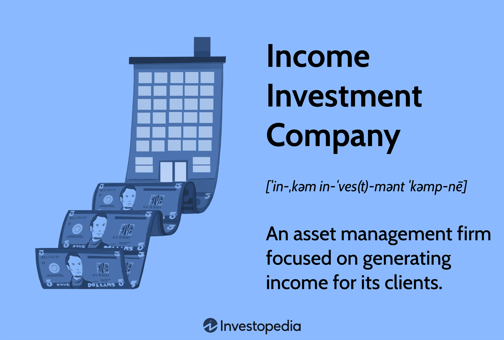

## Table of Contents

## What is an income investment company?

An income investment company is a type of investment company that focuses on generating regular income for its investors. These companies usually invest in assets that pay out dividends or interest, like stocks that pay dividends, bonds, or real estate investment trusts (REITs). The main goal is to provide a steady stream of income, which can be especially appealing to people who are retired or looking for a regular income from their investments.

These companies manage a portfolio of income-generating assets and distribute the earnings to their shareholders. This can be done monthly, quarterly, or annually, depending on the company's policy. By investing in an income investment company, individuals can benefit from a diversified portfolio without having to manage the investments themselves. This makes it a convenient option for those who want income without the hassle of picking and managing individual assets.

## How does an income investment company generate income?

An income investment company makes money by putting its money into things that pay back regularly. These things can be stocks that give dividends, bonds that pay interest, or even real estate that earns rent. When these investments pay out, the company collects the money. The company then shares this money with its investors, usually every month, every three months, or once a year.

The goal is to give investors a steady flow of money. This is good for people who need regular income, like retirees. By investing in many different things, the company spreads out the risk. This way, if one investment doesn't do well, the others might still be okay. This makes it easier for people to get income without having to pick and watch over each investment themselves.

## What are the typical investment vehicles used by an income investment company?

An income investment company usually puts its money into things that pay out regularly. They often invest in stocks that give dividends. These are payments companies make to their shareholders from their profits. Another common investment is bonds. Bonds are like loans to companies or governments, and they pay interest over time. Real estate investment trusts, or REITs, are also popular. REITs own and manage properties that earn rent, and they have to pay out most of their income to investors.

These investment choices help the company make a steady income for its investors. By choosing a mix of these investments, the company can spread out the risk. If one type of investment does not do well, the others might still be okay. This way, the company can keep paying out income to its investors regularly. It's like having a bunch of different money-making tools in a toolbox, and using them to keep the income flowing.

## What are the benefits of investing in an income investment company?

Investing in an income investment company can be a smart move if you want a regular income without having to pick and watch over your own investments. These companies manage a bunch of different things that pay out money, like stocks that give dividends, bonds that pay interest, and real estate that earns rent. By spreading their money across many different investments, they lower the risk. If one investment doesn't do well, the others might still be okay. This way, you can get a steady flow of income without worrying too much about losing your money.

This kind of investment can be really helpful for people who are retired or just want some extra money coming in regularly. Instead of having to figure out which stocks or bonds to buy, you can let the income investment company handle it all for you. They do the hard work of [picking](/wiki/asset-class-picking) the right investments and making sure they keep paying out. Plus, it's easy to get started because you can usually buy shares in these companies just like you would with any other stock. It's a simple way to earn income without a lot of hassle.

## What are the risks associated with income investment companies?

Investing in an income investment company can be good for getting regular money, but it comes with risks. One big risk is that the investments the company picks might not do well. If the stocks, bonds, or real estate they invest in lose value or stop paying out, the company might not have enough money to keep giving you income. This means you could get less money than you expected or even lose some of your investment.

Another risk is that interest rates can change. When interest rates go up, the value of bonds usually goes down. This can hurt the company's portfolio and lower the income it can pay out to you. Also, the company might need to pay fees to manage the investments. These fees can eat into the income you get, making your returns smaller. It's important to think about these risks and see if the potential for regular income is worth it for you.

## How can someone start investing in an income investment company?

To start investing in an income investment company, you first need to find one that fits your needs. You can do this by looking at different companies that focus on income investments. These companies are often called income funds or dividend funds. You can find information about them online, in financial news, or by talking to a financial advisor. Once you pick a company, you'll need to open an account with a brokerage firm. This is where you'll buy shares of the income investment company, just like you would buy any other stock.

After you've opened your account and bought shares, you'll start getting regular payments from the company. These payments come from the income the company makes from its investments in things like stocks, bonds, and real estate. It's a good idea to keep an eye on how the company is doing and how much income it's paying out. This way, you can make sure it's still a good fit for your investment goals. Remember, investing always comes with risks, so it's important to think about those before you start.

## What are the key performance indicators to look for in an income investment company?

When looking at an income investment company, one of the key things to watch is the dividend yield. This is the amount of money the company pays out to investors compared to the price of the shares. A higher yield can mean more income for you, but be careful because a very high yield might mean the company is taking bigger risks or the share price is going down. Another thing to look at is the payout ratio, which shows how much of the company's earnings are being paid out as dividends. A high payout ratio might mean the company can't keep paying out dividends if its earnings drop.

It's also important to check the company's total return, which includes both the income from dividends and any changes in the share price. This gives you a fuller picture of how well the company is doing. Also, look at the company's expense ratio, which is how much it costs to run the company. Lower expenses mean more money can be paid out to investors. Finally, think about the diversification of the company's investments. A company that spreads its money across different types of investments like stocks, bonds, and real estate might be less risky than one that puts all its money in one place.

## How do income investment companies differ from growth-oriented investment companies?

Income investment companies focus on giving their investors a steady stream of money. They do this by putting their money into things like stocks that pay dividends, bonds that pay interest, and real estate that earns rent. The main goal is to make sure investors get regular payments, which can be really helpful for people who need a regular income, like retirees. These companies often try to keep their investments safe and spread out the risk by investing in a mix of different assets. This way, even if one investment doesn't do well, the others might still be okay.

On the other hand, growth-oriented investment companies aim to increase the value of their investors' money over time. They usually invest in stocks of companies that are expected to grow a lot in the future. These companies might not pay out much income right now, but they hope that the value of their investments will go up a lot. This can be riskier because if the companies they invest in don't grow as expected, the value of the investments could drop. Growth-oriented companies are often better for people who are willing to take more risk and can wait for their money to grow over a long time.

## What regulatory considerations should be taken into account when investing in an income investment company?

When you invest in an income investment company, you need to think about the rules and laws that affect them. In the United States, these companies are usually watched by the Securities and Exchange Commission (SEC). The SEC makes sure that these companies follow the rules and tell the truth about what they're doing with your money. They have to give you a lot of information, like how they're doing and what they're investing in, so you can make good choices. It's important to look at this information to see if the company is doing what it says it will do.

Also, income investment companies might have to follow other rules depending on where they are and what they invest in. For example, if they invest in real estate, they might have to follow rules about property. If they invest in stocks or bonds, they might have to follow rules about those too. It's a good idea to know what these rules are because they can affect how the company makes money and how safe your investment is. Talking to a financial advisor can help you understand these rules better and make sure you're making a smart investment.

## How do tax implications affect investments in income investment companies?

When you invest in an income investment company, you need to think about taxes. The money you get from the company, like dividends or interest, is usually considered income. This means you'll have to pay taxes on it every year, even if you don't sell your shares. The tax rate can be different depending on where you live and how much money you make. Sometimes, the income might be taxed at a lower rate if it's considered "qualified dividends," but it's important to check with a tax advisor to know for sure.

Another thing to think about is if you decide to sell your shares in the income investment company. If the value of the shares has gone up since you bought them, you might have to pay capital gains tax on the profit. The tax rate for capital gains can be different from the tax rate for income, and it depends on how long you held the shares. If you held them for more than a year, you might pay a lower rate. It's a good idea to talk to a tax professional to understand how taxes will affect your investment and plan accordingly.

## What strategies can be employed to maximize returns from an income investment company?

To get the most out of your investment in an income investment company, you should first look at the dividend yield. This tells you how much money you're getting back compared to what you paid for the shares. A higher yield can mean more money for you, but be careful because a very high yield might mean the company is taking bigger risks or the share price is going down. Another thing to do is to keep an eye on the payout ratio, which shows how much of the company's earnings are being paid out as dividends. If the payout ratio is too high, the company might not be able to keep paying out dividends if its earnings drop. Also, think about the total return, which includes both the income from dividends and any changes in the share price. This gives you a better picture of how well the company is doing.

Another good strategy is to choose an income investment company that keeps its costs low. The expense ratio tells you how much it costs to run the company. If the expenses are low, more money can be paid out to you as income. It's also smart to look for a company that spreads its investments across different types of assets, like stocks, bonds, and real estate. This diversification can lower the risk because if one investment doesn't do well, the others might still be okay. Finally, don't forget to think about taxes. The income you get from the company might be taxed, so talking to a tax advisor can help you plan better and keep more of your money.

## How does global economic change impact the performance of income investment companies?

Global economic changes can really affect how well income investment companies do. When the economy is doing well, companies might make more money, which means they can pay out bigger dividends to their investors. But if the economy starts to slow down or goes into a recession, companies might not make as much money, and they might have to cut back on the dividends they pay out. Also, when interest rates change, it can affect the value of the bonds that income investment companies own. If interest rates go up, the value of bonds usually goes down, which can hurt the company's overall performance and the income it can pay out to investors.

Another way global economic changes can impact income investment companies is through currency changes. If the company invests in assets from different countries, changes in currency values can make a big difference. If the currency of the country where the company has invested goes down compared to the investor's home currency, the income from those investments might be worth less when it's converted back. On the other hand, if the currency goes up, the income could be worth more. Keeping an eye on these global economic changes can help investors understand why their income from the investment company might go up or down.

## What are Income Investment Companies and how can one understand them?

Income investment companies function as asset management firms with a primary focus on generating consistent income streams for their clients. These companies tailor their portfolios to be rich in income-generating securities, such as bonds and dividend-yielding stocks. Unlike growth-focused entities, income investment companies prioritize stability and regular income, attracting investors who are looking for reliable returns rather than capital appreciation.

One of the primary securities income investment companies invest in is bonds. These fixed-income instruments typically offer predictable interest payments over a specified period, providing a stable income stream. In addition, these companies frequently invest in high-dividend stocks. These stocks pay out a significant portion of their earnings as dividends, ensuring a regular cash flow to investors. 

The selection of securities by income investment companies hinges on key financial metrics. One critical metric is the dividend yield, which is calculated as:

$$
\text{Dividend Yield} = \left(\frac{\text{Annual Dividends Per Share}}{\text{Price Per Share}}\right) \times 100
$$

A higher dividend yield indicates a greater income relative to the stock's market price, making it attractive for income-focused portfolios. Another important metric is the growth of dividend per share relative to earnings per share (EPS). This relationship helps assess the sustainability of dividends:

$$
\text{Dividend Payout Ratio} = \left(\frac{\text{Dividends Per Share}}{\text{Earnings Per Share}}\right) \times 100
$$

A lower payout ratio often suggests that the company has room to maintain or increase its dividends, adding a layer of security to the income investment.

Risk management is integral to the operations of income investment companies. These firms employ diversification strategies by spreading investments across different asset classes and sectors to mitigate risks associated with market [volatility](/wiki/volatility-trading-strategies). Additionally, they regularly evaluate the creditworthiness of bond issuers and the financial health of dividend-paying companies to minimize the risk of default or dividend cuts.

Performance evaluation is another crucial aspect. Income investment companies regularly assess their portfolios to ensure they meet the target income objectives. This involves monitoring dividend yields, checking interest payments, and conducting scenario analyses to forecast future income under various market conditions.

In summary, income investment companies focus on creating portfolios that provide steady income through careful selection of bonds and dividend-paying stocks, utilizing key financial metrics and robust risk management practices to ensure consistent returns for their clients.

## How can one craft effective financial strategies?

An effective financial strategy is essential for aligning investment objectives with prevailing market conditions, employing a combination of methods to optimize returns while mitigating risks. In modern finance, income investing and diversification are crucial for building resilient and consistently performing portfolios. 

### Income Investing

Income investing focuses on assets that generate regular income, predominantly through dividends and interest payments. This approach appeals to those seeking stable cash flows rather than relying solely on capital gains. One of the core metrics investors consider is the dividend yield, calculated as:

$$
\text{Dividend Yield} = \frac{\text{Annual Dividends per Share}}{\text{Price per Share}}
$$

This ratio helps assess the income-generating potential relative to the stock price. Additionally, the growth of dividends relative to earnings, known as the payout ratio, provides insight into the sustainability of income streams:

$$
\text{Payout Ratio} = \frac{\text{Dividends per Share}}{\text{Earnings per Share}}
$$

A lower payout ratio suggests a company has ample room to sustain or increase future dividends, enhancing the investment's attractiveness for income-focused investors.

### Diversification

Diversification involves spreading investments across various asset classes, sectors, or geographic regions to reduce exposure to any single risk. This strategy is based on the principle that different assets often react differently to the same economic event. By combining stocks, bonds, real estate, and other instruments, investors can create a balanced portfolio that cushions against market volatility.

### Strategies and Trends

Financial institutions and retail investors employ a wide array of strategies to maximize returns and minimize risks. One popular method is asset allocation, adjusting the proportion of different asset classes based on economic forecasts and personal risk tolerance. Strategic asset allocation remains relatively fixed, whereas tactical asset allocation allows for adjustments in response to market conditions.

Another emerging trend is the adoption of Environmental, Social, and Governance ([ESG](/wiki/esg-investing)) criteria in investment decision-making. ESG investing evaluates corporate behavior and its impact on society and the environment, responding to growing investor demand for responsible investment opportunities.

The use of technology and data analytics also plays a significant role. Advanced algorithms analyze market trends, identify opportunities, and automate trades. This data-driven approach enhances decision-making efficiency and accuracy.

### Challenges

Despite these strategies' potential, challenges persist. Market volatility can disrupt carefully crafted investment plans, requiring constant monitoring and adjustment. The unpredictable nature of global events further demands flexibility in strategy. In addition, while diversification can reduce risk, overdiversification may dilute potential returns.

In conclusion, crafting effective financial strategies entails a fine balance between income generation and risk management. With a focus on income investing, diversification, and adaptive methodologies, investors can navigate current market landscapes and seize emerging opportunities while mitigating potential risks.

## References & Further Reading

[1]: Bergstra, J., Bardenet, R., Bengio, Y., & Kégl, B. (2011). ["Algorithms for Hyper-Parameter Optimization."](https://dl.acm.org/doi/10.5555/2986459.2986743) Advances in Neural Information Processing Systems 24.

[2]: ["Advances in Financial Machine Learning"](https://www.amazon.com/Advances-Financial-Machine-Learning-Marcos/dp/1119482089) by Marcos Lopez de Prado

[3]: ["Evidence-Based Technical Analysis: Applying the Scientific Method and Statistical Inference to Trading Signals"](https://www.amazon.com/Evidence-Based-Technical-Analysis-Scientific-Statistical/dp/0470008741) by David Aronson

[4]: ["Machine Learning for Algorithmic Trading"](https://github.com/stefan-jansen/machine-learning-for-trading) by Stefan Jansen

[5]: ["Quantitative Trading: How to Build Your Own Algorithmic Trading Business"](https://www.amazon.com/Quantitative-Trading-Build-Algorithmic-Business/dp/1119800064) by Ernest P. Chan