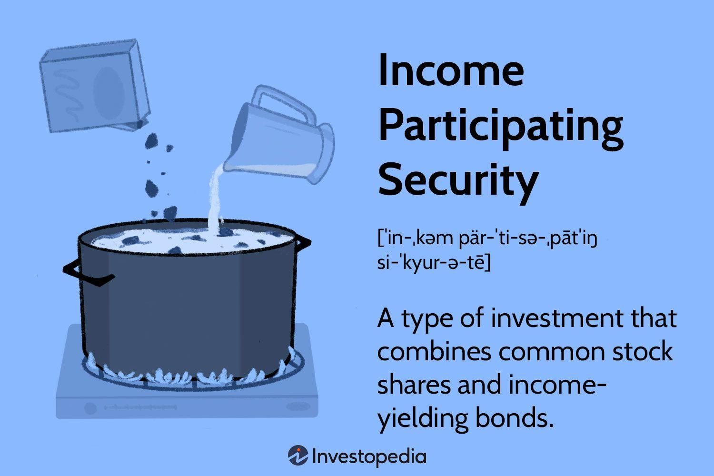

## Table of Contents

## What is an Income Participating Security (IPS)?

An Income Participating Security (IPS) is a type of investment that combines features of both stocks and bonds. It is designed to provide investors with a steady income, similar to what they would get from bonds, while also giving them the chance to benefit from the company's growth, like stocks. This means that if the company does well, the investors can receive more money, not just the fixed interest they would get from a regular bond.

IPS is often used by companies that want to raise money without issuing regular stocks or bonds. It can be attractive to investors because it offers a bit of safety with the regular income, but also the excitement of potentially earning more if the company performs well. However, like any investment, it comes with risks, and investors need to understand how the IPS works before putting their money into it.

## How does an Income Participating Security differ from traditional bonds?

An Income Participating Security (IPS) is different from traditional bonds because it offers investors a chance to earn more money if the company does well. Traditional bonds give you a fixed interest payment no matter how the company is doing. But with an IPS, if the company makes more profit, you might get extra money on top of your regular interest. This makes an IPS more like a mix between a bond and a stock.

Traditional bonds are usually safer because you know exactly how much money you'll get back, as long as the company doesn't go bankrupt. An IPS, on the other hand, can be riskier because your extra earnings depend on the company's performance. But this also means that if the company does really well, you could end up earning more than you would with a traditional bond. So, an IPS can be a good choice if you want a bit of safety but are also willing to take on some risk for the chance of higher rewards.

## What are the key features of an Income Participating Security?

An Income Participating Security (IPS) is a special kind of investment that mixes features of both stocks and bonds. It gives investors a regular income, just like a bond does. But it also lets them earn more money if the company does well, which is something you usually see with stocks. This means that if the company makes more profit, the investors can get extra money on top of their regular payments.

The main thing that makes an IPS different from a regular bond is this chance to earn more. With a traditional bond, you get a fixed amount of money no matter how the company is doing. But with an IPS, your earnings can go up if the company's profits go up. This makes an IPS a bit riskier than a regular bond, but it also means you could earn more if the company does well. So, an IPS can be a good choice if you want some safety but are also willing to take on some risk for the chance of higher rewards.

## Who typically issues Income Participating Securities?

Income Participating Securities (IPS) are often issued by companies that want to raise money in a different way than using regular stocks or bonds. These companies might be looking for a way to attract investors who want a bit of safety but also the chance to earn more if the company does well. So, they create an IPS, which gives investors a steady income like a bond, but also the possibility of extra money if the company's profits go up.

Usually, the companies that issue IPS are ones that are growing and want to share their success with investors. They might be in industries where they expect to make more money in the future, and they want to use an IPS to show investors that they can offer both safety and the chance for higher returns. This makes IPS a good choice for companies that want to stand out and attract a different kind of investor.

## What are the benefits of investing in Income Participating Securities?

Investing in Income Participating Securities (IPS) can be a good choice because they offer a mix of safety and the chance to earn more money. With an IPS, you get regular payments like you would with a bond, which gives you some security. But if the company does well and makes more profit, you can also get extra money on top of your regular payments. This means you could end up earning more than you would with a regular bond, which is exciting for investors who want to take a bit of risk for the chance of higher rewards.

Another benefit of IPS is that they can be a good way to invest in growing companies. Companies that issue IPS are often ones that expect to make more money in the future. By investing in an IPS, you can share in the company's success and potentially earn more as the company grows. This makes IPS a great option if you want to support a company you believe in and also have the chance to benefit from its growth.

## What are the risks associated with Income Participating Securities?

Investing in Income Participating Securities (IPS) comes with some risks that you should know about. One big risk is that your extra earnings depend on how well the company does. If the company doesn't make as much profit as expected, you might not get the extra money you were hoping for. This means that IPS can be riskier than regular bonds, where you get a fixed amount no matter what.

Another risk is that if the company runs into financial trouble, it might not be able to pay you back at all. Just like with any investment, there's always a chance the company could go bankrupt. If that happens, you could lose the money you invested. So, it's important to think about how much risk you're willing to take before you decide to invest in an IPS.

## How is the income distributed in an Income Participating Security?

In an Income Participating Security (IPS), the income is distributed in two main ways. First, you get a regular payment, kind of like interest from a bond. This part of the income is fixed, so you know how much you'll get as long as the company can pay it. This gives you some safety because you can count on getting this regular income.

Second, if the company does well and makes more profit, you might get extra money on top of your regular payment. This extra money is called a participation in the company's profits. How much extra you get depends on how well the company is doing. So, if the company has a great year, your total income from the IPS could be higher than what you would get from a regular bond. But if the company doesn't do so well, you might only get the regular payment and no extra money.

## Can you explain the tax implications of holding an Income Participating Security?

The tax implications of holding an Income Participating Security (IPS) can be a bit tricky, but I'll explain it in simple terms. The regular payments you get from an IPS are usually treated like interest from a bond. This means you have to pay income tax on these payments. The tax rate you pay depends on your income and the tax laws where you live. So, you'll need to report these payments on your tax return and pay the tax that's due.

If you get extra money because the company did well, that part is treated differently. This extra money is usually considered a dividend, which is taxed at a different rate than regular income. In many places, dividend tax rates are lower than income tax rates, but it still depends on your specific situation and local tax laws. So, when you get this extra money, you'll need to report it as a dividend on your tax return and pay the right amount of tax. It's always a good idea to talk to a tax professional to make sure you're doing everything correctly.

## How do Income Participating Securities perform in different economic conditions?

Income Participating Securities (IPS) can perform differently depending on the economy. When the economy is doing well, companies usually make more money. This is good for IPS because you might get extra money on top of your regular payments. If the company's profits go up, your total income from the IPS can be higher than what you would get from a regular bond. So, in a strong economy, IPS can be a great way to earn more money.

But when the economy is not doing so well, IPS can be riskier. If companies are struggling to make profits, you might only get the regular payments and no extra money. In the worst case, if a company is in real trouble, it might not be able to pay you at all. This means that in a weak economy, IPS might not be as safe as regular bonds, where you get a fixed amount no matter what. So, it's important to think about the economy when deciding if IPS are right for you.

## What are some real-world examples of Income Participating Securities?

One real-world example of an Income Participating Security (IPS) is the one issued by the Canadian company Algoma Steel in 1991. Algoma Steel was facing financial difficulties and needed to raise money without going bankrupt. They issued an IPS that offered investors a fixed interest rate of 7% per year, plus the chance to get extra money if the company made more profit. This helped Algoma Steel get the money it needed while giving investors a chance to earn more if the company did well.

Another example is the IPS issued by the South African company Sappi Limited in 1997. Sappi wanted to raise money to expand its business and decided to use an IPS. The IPS offered investors a steady income with a fixed interest rate, but also the possibility of additional payments if Sappi's profits increased. This was attractive to investors who wanted some safety but were also willing to take on some risk for the chance of higher returns.

## How can an investor evaluate the potential return of an Income Participating Security?

To evaluate the potential return of an Income Participating Security (IPS), an investor should first look at the fixed interest rate that comes with the IPS. This is the regular payment you get no matter how the company does. You can compare this rate to what you would get from a regular bond to see if the IPS offers a good base return. It's important to think about how safe this fixed income is and whether the company can keep paying it.

Next, the investor should consider the potential for extra money if the company makes more profit. This part of the return can be harder to predict because it depends on the company's performance. You'll want to look at the company's past earnings, its growth plans, and how it's doing compared to other companies in its industry. By understanding these factors, you can get a better idea of how likely it is that you'll get extra money on top of your regular payments. Remember, the more the company grows, the more you might earn, but there's also more risk involved.

## What advanced strategies can be used to optimize a portfolio including Income Participating Securities?

To optimize a portfolio that includes Income Participating Securities (IPS), an investor can use a strategy called diversification. This means spreading your money across different types of investments, not just IPS. By doing this, you can reduce the risk that comes with investing in just one company or one type of security. For example, you might put some money in IPS, some in regular bonds, and some in stocks. This way, if the IPS doesn't perform well because the company has a bad year, your other investments might still do well and help balance out your returns.

Another strategy is to pay close attention to the economic cycle. Since IPS can offer extra money when a company does well, it's smart to invest more in IPS when you think the economy is going to grow. You can do this by keeping an eye on economic indicators like unemployment rates, GDP growth, and company earnings reports. If you see signs that the economy is getting stronger, you might want to increase your investment in IPS to take advantage of the potential for higher returns. But if the economy looks like it might slow down, you might want to shift some of your money into safer investments like regular bonds to protect your portfolio.

## What are Investment Strategies with IPS?

Income Participating Securities (IPS) are used as a strategic tool by investors focusing on regular income generation. These financial instruments, composed of a blend of common stocks and income-yielding bonds, provide a dual source of revenue: dividends from stocks and interest from bonds. This combination not only aims to generate consistent income but also allows investors to benefit from potential capital appreciation and risk diversification.

One of the primary advantages of investing in companies that issue IPS is the potential for enhanced income streams. The equity component of IPS offers dividends, which can grow over time if the issuing company performs well and increases its dividend payouts. On the other hand, the bond component generally provides the advantage of fixed interest payments, contributing to predictable cash flows for investors. This dual-income structure can be particularly attractive to investors seeking to supplement their regular income beyond what traditional fixed-income securities might offer.

Moreover, IPS can provide stability within an investor's portfolio. The bond component typically exhibits lower [volatility](/wiki/volatility-trading-strategies) compared to equities, helping cushion the portfolio against stock market fluctuations. This can be particularly beneficial during periods of economic uncertainty when equity markets may experience increased volatility. By including IPS, investors can diversify their holdings, potentially reducing the overall risk of their portfolio. This diversification is achieved because the bond component may perform differently than equities in varying market conditions, providing a balancing effect.

Mathematically, the total expected return from an IPS investment can be expressed as follows:

$$
\text{Total Expected Return} = \left( \frac{D + I}{P} \right) \times 100
$$

Where:
- $D$ is the dividend received from the stock component.
- $I$ is the interest earned from the bond component.
- $P$ is the initial price of the IPS purchase.

This formula helps investors quantify the income generated relative to their initial investment, aiding in performance assessment and strategy planning. Real-time data analysis through tools like Python can be used to track and forecast IPS performance by implementing algorithms to optimize the balance between risk and return.

Overall, IPS offer a compelling option for investors seeking steady income while mitigating risk through diversification. By investing in companies that issue IPS, individuals can harness the benefits of both equity and fixed-income markets, potentially enhancing portfolio stability and achieving investment objectives centered on regular income generation.

## References & Further Reading

[1]: Bergstra, J., Bardenet, R., Bengio, Y., & Kégl, B. (2011). ["Algorithms for Hyper-Parameter Optimization."](https://dl.acm.org/doi/10.5555/2986459.2986743) Advances in Neural Information Processing Systems 24.

[2]: ["Advances in Financial Machine Learning"](https://www.amazon.com/Advances-Financial-Machine-Learning-Marcos/dp/1119482089) by Marcos Lopez de Prado

[3]: ["Evidence-Based Technical Analysis: Applying the Scientific Method and Statistical Inference to Trading Signals"](https://www.amazon.com/Evidence-Based-Technical-Analysis-Scientific-Statistical/dp/0470008741) by David Aronson

[4]: ["Machine Learning for Algorithmic Trading"](https://github.com/stefan-jansen/machine-learning-for-trading) by Stefan Jansen

[5]: ["Quantitative Trading: How to Build Your Own Algorithmic Trading Business"](https://github.com/LucindaYa/quant-resources/blob/master/Quantitative%20Trading%20How%20to%20Build%20Your%20Own%20Algorithmic%20Trading%20Business.pdf) by Ernest P. Chan