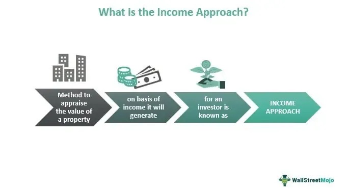

Real estate investment has consistently proven to be a robust strategy for wealth creation, as it offers both capital appreciation and steady income streams. This asset class accommodates a diverse range of properties, including residential, commercial, and industrial, each providing unique opportunities and benefits for investors. 

With technological advancements, traditional real estate investment methods are experiencing a transformation, highlighted by the integration of algorithmic trading. This innovation utilizes computer models to automate and optimize investment decisions, offering a data-driven approach to identifying lucrative opportunities in the real estate market. Algorithms analyze vast datasets, incorporating economic indicators and market trends, to reduce emotional bias and increase precision in investment choices.



This article examines the convergence of real estate investment, property management, income properties, and algorithmic trading. It provides insights into how technology can enhance decision-making processes, help investors stay ahead of market dynamics, and maximize returns. Embracing these developments allows for greater precision and efficiency, ensuring the consistent success of investment portfolios. By understanding and leveraging these technological tools, investors can make informed choices that lead to substantial financial gains in the ever-evolving real estate landscape.

## Table of Contents

## Understanding Real Estate Investment

Real estate investment is a dynamic and multifaceted approach to generating income, where investors acquire properties with the intention of securing financial returns. These properties can be categorized into residential, commercial, or industrial sectors, each offering distinct advantages based on investor goals and market conditions.

**Types of Properties**  
- **Residential Properties**: These include single-family homes, apartments, and multi-family units. They are generally sought after for their potential to provide steady income through rent, coupled with the possibility of appreciation in value over time.
- **Commercial Properties**: Office buildings, retail spaces, and hotels form the backbone of commercial real estate. These properties typically have longer lease agreements and yield higher rental income compared to residential properties.
- **Industrial Properties**: Warehouses, distribution centers, and manufacturing plants are termed industrial real estate. These properties are often valued for their utility in supporting business operations and can attract substantial long-term investments.

**Assessing Market Trends, Valuation, and Location**  
Investors must conduct comprehensive assessments of market trends to make informed decisions. This process involves analyzing factors such as:
- **Economic Indicators**: Employment rates, interest rates, and GDP growth that can affect property demand and valuation.
- **Demographic Trends**: Population growth, migration patterns, and age demographics which influence the type of housing or commercial spaces in demand.
- **Valuation Metrics**: Tools such as the capitalization rate (cap rate), which is calculated as Net Operating Income (NOI) divided by the property value, help assess the potential return on investment.

```python
def calculate_cap_rate(noi, property_value):
    return noi / property_value

noi = 50000  # Example Net Operating Income
property_value = 1000000  # Example Property Value
cap_rate = calculate_cap_rate(noi, property_value)
cap_rate
```

**Understanding Neighborhood Dynamics and Future Development**  
An essential part of successful real estate investment is understanding neighborhood dynamics. Factors such as the quality of local schools, crime rates, and amenities like parks and public transportation influence property desirability and, consequently, value.

Monitoring planned infrastructure projects and zoning changes is crucial for anticipating shifts in property valuation. These developments can lead to heightened demand and increased property prices, thus offering strategic investment opportunities.

**Diversifying Portfolios and Ensuring Steady Cash Flow**  
Real estate investment serves as a powerful tool for portfolio diversification. It provides a tangible asset that can protect against market [volatility](/wiki/volatility-trading-strategies) typical of stocks and bonds. Moreover, consistent rental income acts as a reliable cash flow source, buffering against economic fluctuations.

By synthesizing these various elements, investors can strategically position themselves to harness the full potential of real estate investments. This approach not only aids in generating income but also plays a vital role in wealth preservation and growth over the long term.

## Property Management for Income Generating

Successful property management is crucial for maximizing rental income and ensuring the long-term value of an income-generating property. It encompasses a range of responsibilities including maintenance, tenant services, and cost control. The effectiveness of property management directly influences tenant satisfaction, which in turn impacts occupancy rates and rental income stability.

**Maintenance, Tenant Services, and Cost Control**

Routine maintenance is fundamental to preserving property value and preventing costly repairs. This involves regular inspections, timely repairs, and scheduled upkeep of essential systems like HVAC, plumbing, and electrical installations. Providing excellent tenant services, such as responsive communication and addressing tenant concerns swiftly, fosters a positive living environment. Cost control is another vital component, where the objective is to optimize expenses related to maintenance and operations without compromising on quality. Efficient budgeting, vendor negotiations, and resource allocation are parts of effective cost management strategies.

**Automation and Efficiency**

The adoption of automated systems in property management enhances operational efficiency. Technologies such as property management software can automate tasks like rent collection, maintenance requests, and lease administration. For instance, using a centralized platform to track maintenance tickets and schedule property tasks can reduce manual errors and save time. Automated data analytics tools can also provide insights on market trends, tenant demographics, and financial metrics, enabling informed decision-making. Python, a versatile programming language, can be utilized for data analysis to predict maintenance schedules or tenant needs through [machine learning](/wiki/machine-learning) models.

```python
import pandas as pd

# Sample code snippet for predicting maintenance needs
df = pd.read_csv('maintenance_data.csv')
df['predicted_maintenance'] = df['previous_maintenance'].rolling(window=12).mean()
```

**Enhancing Tenant Experiences**

Property managers should prioritize tenant experience as it contributes to tenant retention and referral. Elements such as clear communication channels, offering community-building activities, and providing amenities can significantly enhance the tenant experience. Building strong relationships with tenants through regular feedback collection and addressing concerns can lead to higher satisfaction rates.

**Revenue and Property Value Appreciation**

Efficient management not only ensures consistent revenue through reduced vacancies and timely rent payments but also contributes to property value appreciation. Well-maintained properties tend to appreciate more due to their attractive living conditions. Moreover, maintaining high occupancy rates through excellent tenant service ensures a steady cash flow, making income properties a reliable source for wealth generation. Implementing modern property management practices can thus add significant value to an income property.

## Income Property as a Wealth Generator

Income properties play a vital role in generating consistent cash flow by capitalizing on rental income. Essentially, these properties serve as a foundation for a sustainable wealth strategy, primarily due to their potential for long-term appreciation. The ability of an income property to increase in value over time can significantly bolster an investor's financial portfolio, making it an attractive option for those looking to diversify assets and create a reliable revenue stream.

The success of investing in income properties largely hinges upon the strategic evaluation of various factors. Investors must pay close attention to the property's location, as it is a determinant of both rental demand and future value appreciation. Properties situated in growth-prone areas or those that are part of planned urban developments often promise higher returns. Further, demographic trends and regional economic indicators can provide insights into potential rental market performance.

Analyzing rental yields against mortgage obligations is a critical component when assessing the viability of an income property. Rental yield is calculated as:

$$
\text{Rental Yield} = \left(\frac{\text{Annual Rental Income}}{\text{Property Value}}\right) \times 100
$$

A higher rental yield typically suggests that the property can generate substantial income relative to its cost. However, this must be weighed against ongoing expenses such as mortgage payments, property taxes, maintenance costs, and vacancy rates. It's crucial for investors to ensure that the rental income not only covers these costs but also provides a positive cash flow that contributes to overall wealth growth.

Properly selected income properties can serve as a robust financial cushion, offering a backup source of income during economic downturns. Moreover, they contribute to asset diversification, minimizing risk by spreading investments across various asset classes.

In summary, when approached with thorough research and strategic planning, income properties can serve as a formidable tool in an investor's portfolio, providing both immediate income and long-term wealth accumulation.

 to Algorithmic Trading in Real Estate

Algorithmic trading, traditionally associated with the financial markets, has found a new application within real estate investment. This method employs computer algorithms to automate investment decisions, offering a structured and data-driven approach to identifying and executing real estate transactions.

In the context of real estate, these algorithms sift through vast datasets to uncover investment opportunities. They analyze numerous variables, such as economic indicators, market trends, and property-specific data points, to assess the potential of various properties. This process helps in detecting trends and shifts in property values, providing investors with a predictive edge in the market.

Algorithms are adept at processing large and complex datasets quickly, allowing for real-time analysis and decision-making. They can, for example, evaluate historical market data, geographical trends, and consumer behavior patterns to forecast future movements in property prices. This capability significantly enhances an investor’s ability to optimize buying and selling decisions, mitigating risks associated with emotional biases.

For instance, a machine learning model can be trained to predict property price trends using a dataset that includes variables such as location, size, historical prices, interest rates, and local economic conditions. This can be implemented in Python using libraries like `pandas` for data handling, `scikit-learn` for model training, and `numpy` for numerical operations. A simple linear regression model might look like this:

```python
import pandas as pd
from sklearn.model_selection import train_test_split
from sklearn.linear_model import LinearRegression

# Load data from a hypothetical dataset
data = pd.read_csv('real_estate_data.csv')

# Features and target variable
X = data[['location_index', 'property_size', 'historical_price', 'interest_rate', 'economic_index']]
y = data['current_price']

# Split the data
X_train, X_test, y_train, y_test = train_test_split(X, y, test_size=0.2, random_state=42)

# Train the model
model = LinearRegression()
model.fit(X_train, y_train)

# Make predictions
predictions = model.predict(X_test)

# Evaluate the model
print(model.score(X_test, y_test))
```

Such models are invaluable not just for their analytic power, but also for removing the emotional component from decision-making processes. By relying on algorithmic predictions rooted in real data, investors can maintain a disciplined approach to real estate investment, potentially leading to better long-term outcomes. This technological evolution thus represents a significant opportunity for investors seeking to optimize and modernize their portfolio management strategies.

## Benefits of Integrating Algorithmic Trading with Real Estate

Integrating [algorithmic trading](/wiki/algorithmic-trading) into real estate investment provides a multitude of benefits, fundamentally transforming how investors engage with the market. Algorithms, at their core, offer precision and efficiency in property acquisition by automating complex calculations and rapidly processing vast datasets. This capability enables investors to quickly identify and seize opportunities while minimizing human error and emotional bias, a prevalent issue in traditional investing.

By enhancing data analysis capabilities, algorithms can reveal underlying market patterns that may not be immediately apparent to human analysts. For instance, machine learning models can be trained on historical data to identify trends, seasonality, and economic indicators that impact property values. These insights allow investors to make data-driven decisions based on predictive modeling, rather than relying solely on intuition or limited analysis. The utilization of algorithms also facilitates real-time monitoring of market shifts, empowering investors to adjust their strategies proactively and remain competitive.

Algorithm-driven decision-making ensures consistency across investment strategies. With predefined criteria and models, algorithms execute trades or investment decisions based on quantifiable parameters, eliminating the influence of subjective judgment. This consistency is critical in maintaining a disciplined investment strategy, particularly in volatile markets where quick, rational decisions can significantly affect returns.

Additionally, algorithms reduce errors through their capacity to handle repetitive tasks with high accuracy. For example, a Python-based algorithm could continuously evaluate property listings for specific investment criteria and automatically notify the investor when a suitable match is found, thereby streamlining the acquisition process.

Integration of algorithmic trading with real estate investment also opens the door to sophisticated risk management tools. By analyzing volatility, price fluctuations, and other risk factors, algorithms can optimize portfolios according to specified risk tolerance levels. This adaptability is crucial in maintaining a balanced portfolio that aligns with the investor’s long-term objectives.

In conclusion, leveraging algorithmic trading in real estate empowers investors with enhanced analytical tools, improved decision-making processes, and a structured approach to market participation. This integration not only increases efficiency but also enhances the potential for higher returns by allowing investors to operate with a level of discipline and foresight unattainable through manual methods alone. As technological advancements continue, the symbiosis of traditional real estate and modern algorithmic techniques will undoubtedly become an indispensable aspect of effective investment strategy.

## Challenges and Considerations

Data accuracy is pivotal for the efficacy of algorithmic trading in real estate. Precise data ensures that algorithms can make informed predictions about property values, investment opportunities, and market dynamics. The reliability of these predictions stems from the quality of input data, which involves property prices, economic indicators, and market trends. Inaccuracies or outdated information can lead to erroneous trading decisions, thus underlining the importance of comprehensive data collection and regular updates.

Market volatility presents a significant challenge to algorithmic trading systems. Fluctuations in property prices and economic conditions can lead to unpredictable outcomes, even when models are based on large datasets and sophisticated algorithms. Algorithms must be robust enough to account for and adapt to sudden changes in the market, thereby minimizing potential financial losses. This entails incorporating volatility measures and sensitivity analyses within the algorithmic models to enhance their resilience against market shocks.

Legal and regulatory implications are another crucial consideration in this domain. Real estate and financial markets operate under a set of complex legal frameworks that govern transactions, data privacy, and trading practices. Investors and developers of algorithmic trading systems must stay informed about these regulations to ensure compliance. Failure to adhere to legal standards can result in significant penalties and hinder investment opportunities. Regular audits and compliance checks should be integrated within operational protocols to mitigate such risks.

Balancing the use of algorithmic trading with traditional real estate insights is essential for successful investment strategies. While technology offers precision and scalability, traditional insights provide context and qualitative assessments that algorithms might overlook. Experienced investors themselves bring a nuanced understanding of market conditions and human factors influencing property markets. It's beneficial to complement algorithmic models with human expertise, ensuring a well-rounded approach to decision-making.

In summary, addressing these challenges and considerations requires a multi-faceted approach. Combining accurate data, robust systems to handle market volatility, awareness of legal frameworks, and traditional investment wisdom will create a solid foundation for leveraging algorithmic trading in real estate. Continuous learning and adaptation in these areas will be vital to maintaining a competitive edge in an increasingly digital investment landscape.

## Future Trends and Opportunities

Proptech and fintech advancements are significantly reshaping the real estate industry. As technology evolves, the adoption of [artificial intelligence](/wiki/ai-artificial-intelligence) (AI) and machine learning in property valuations has made significant strides. These technologies enable more accurate and efficient assessments by analyzing a vast range of variables, such as market trends, historical sales data, and neighborhood dynamics. Machine learning models can predict future property values, offering investors insights that were previously inaccessible. For instance, a regression model could be used to evaluate property price movements based on input variables like interest rates and local economic indicators.

```python
from sklearn.linear_model import LinearRegression

# Example of a simple linear regression model
# Assuming X is the matrix of input features (e.g., interest rates, economic indicators)
# And y is the target variable (property prices)

model = LinearRegression()
model.fit(X, y)

# Predict future property prices
predicted_prices = model.predict(future_X)
```

Blockchain technology is another crucial development, offering enhanced transparency and security in real estate transactions. By recording property details, ownership, and transaction history on a blockchain, the technology ensures that all parties have equal access to verified information, reducing the risk of fraud. Smart contracts can automate and enforce contractual terms, streamlining transactions and minimizing delays.

Emerging trends provide new opportunities for competitive investment. The rise of fractional ownership platforms allows investors to purchase shares in real estate assets, democratizing access to property investments. Additionally, digital real estate platforms are making it easier for investors to explore global opportunities, breaking the traditional geographical barriers that once limited investment choices.

To remain competitive, investors must continuously adapt to these dynamic changes. Staying informed about technological innovations and regulatory updates is essential. Comprehensive risk management and strategic planning, informed by both traditional insights and advanced analytics, will be crucial for capitalizing on new opportunities. As the industry continues to evolve, those embracing innovation will likely gain a significant advantage in a rapidly changing market landscape.

## Conclusion

The integration of real estate investing, property management, and algorithmic trading offers substantial benefits, facilitating a more sophisticated and effective approach to wealth building. By leveraging technology, investors can enhance investment precision and maximize returns, moving beyond traditional methods that are often hampered by emotional biases and limited data analysis capabilities. Algorithmic trading, in particular, uses complex algorithms to analyze vast swathes of data, providing insights that allow for more informed decision-making and timely interventions in property markets.

To fully realize these benefits, it is essential to adopt a balanced approach that incorporates both traditional investing wisdom and modern technological advancements. Traditional methods provide valuable insights into market dynamics and human behavior, which remain critical in real estate markets. Technology, however, enhances these insights by improving data processing capabilities and offering real-time analytics, thus allowing for an agile and responsive investment strategy.

Continued learning and adaptation to technological trends will be crucial for ensuring sustained success. The rapid pace of technological advancement demands that investors remain informed about new tools and methodologies that can offer a competitive edge. Engaging with the latest developments in property technology (proptech) and financial technology (fintech) ensures that investors can adapt strategies to accommodate evolving market conditions and regulatory requirements.

In conclusion, embracing these strategies—merging technology with traditional real estate investment approaches—can transform real estate investing into a robust tool for wealth building. The integration offers a pathway to increased efficiency, lessened risk exposures, and optimized returns, embodying a future-forward approach to real estate market participation.

## References & Further Reading

Explore recent literature on real estate investment strategies to gain insights into innovative methodologies and approaches. Understanding contemporary perspectives can equip investors with the tools to make informed decisions. Key publications often address the evolving landscape of property investment and adaptive strategies to navigate market fluctuations.

Review case studies on the impact of algorithmic trading in property investing to understand practical applications of technology in real-world scenarios. These case studies often highlight how algorithms have been employed to enhance decision-making processes, mitigate risks, and improve investment outcomes. This knowledge is crucial for recognizing the potential advantages and challenges associated with integrating technology into investment strategies.

Stay updated on regulatory changes affecting real estate and trading, as these can significantly influence market dynamics and investment viability. Regulatory environments can vary substantially across regions and can impact everything from property valuation practices to trading protocols. Regularly consulting authoritative sources can help investors stay compliant and adaptive to legal requirements.

Engage with fintech and proptech journals for the latest innovations in technology that are driving change in the real estate sector. These publications often feature developments in artificial intelligence, blockchain, and other technologies transforming property investment, management, and transactions. Keeping abreast of these advancements is vital for investors seeking to leverage cutting-edge tools for competitive advantage.

Consult expert opinions and analyses for informed decision-making. Engaging with thought leaders and seasoned professionals provides valuable perspectives on market trends, technology adoption, and strategic planning. Accessing a diverse range of expert insights can help refine investment strategies and anticipate future market shifts, ensuring a well-rounded understanding of the real estate landscape.

