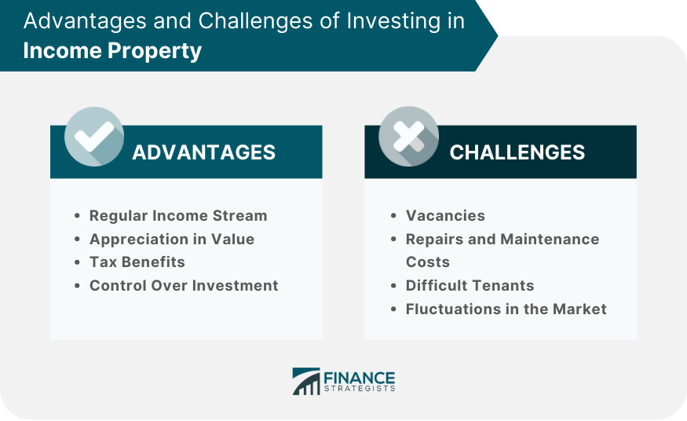

## Table of Contents

## What is an income property?

An income property is a type of real estate that someone buys to make money from it. Instead of living in the property themselves, the owner rents it out to other people. The money they get from rent is called rental income. This can help the owner pay for the property and maybe even make extra money.

People like income properties because they can be a good way to earn money over time. If the property goes up in value, the owner can sell it later for more money than they paid for it. This is called appreciation. Also, if the owner manages the property well, they can keep getting rental income for many years. But, owning an income property also means the owner has to take care of the property and deal with any problems that come up with tenants or repairs.

## How does an income property generate income?

An income property makes money mainly by renting it out to people who need a place to live. The owner charges rent every month, and this money is called rental income. It helps pay for things like the mortgage, taxes, and any repairs that need to be done on the property. If the rent money is more than what it costs to keep the property, the owner gets to keep the extra money as profit.

Sometimes, an income property can also make money in another way. If the property becomes worth more over time, the owner can sell it for a higher price than what they paid for it. This increase in value is called appreciation. So, even if the owner decides to sell the property later, they might make a profit from the difference between the selling price and the original purchase price. This makes income properties a good way to earn money over the long term.

## What are the different types of income properties?

Income properties come in different types, and each one can be a good way to make money. One common type is a single-family home. This is a house that you rent out to one family. It's simple to manage because you only have one tenant to deal with. Another type is a multi-family home, like a duplex or a triplex. These have more than one unit, so you can rent them out to different families. This can mean more rental income, but it also means more work because you have to take care of several tenants.

Another type of income property is an apartment building. These are bigger and have many units, so they can bring in a lot of rental income. But they also need more work to manage and might need a property manager to help. Commercial properties are another kind, like office buildings or shopping centers. These are rented out to businesses instead of people. They can make a lot of money, but they can also be more complicated to manage and might need special knowledge.

Lastly, there are vacation rentals, like a house or condo that people rent for short stays, often in popular vacation spots. These can make a lot of money during busy times, but they might not bring in as much during slower times. Each type of income property has its own benefits and challenges, so it's important to think about what will work best for you.

## What are the initial steps to investing in an income property?

The first step to investing in an income property is to do your homework. You need to learn about the real estate market in the area where you want to buy. Look at how much properties cost, how much rent people are paying, and how the area is growing. This will help you decide if it's a good place to invest. You should also think about how much money you can spend. Make a budget and figure out how much you can afford for a down payment, a mortgage, and other costs like taxes and repairs.

Next, you need to find the right property. Look at different properties and compare them. Think about things like the location, the condition of the property, and how easy it will be to rent it out. You might want to work with a real estate agent who knows the area well. They can help you find good properties and give you advice. Once you find a property you like, you'll need to make an offer and go through the buying process. This includes getting a mortgage, doing a home inspection, and finally closing the deal.

After you buy the property, you need to get it ready for tenants. This might mean fixing things up or making it look nice. Then, you need to find good tenants who will pay rent on time and take care of the place. You can do this yourself or hire a property manager to help. Either way, make sure you have a good lease agreement and follow the rules for renting out property in your area. With the right preparation and management, an income property can be a good way to make money over time.

## How do you evaluate the potential profitability of an income property?

To figure out if an income property will make you money, you need to look at how much rent you can get from it and how much it will cost you to own it. First, find out what other similar places in the area are renting for. This will give you a good idea of how much rent you can charge. Then, add up all the costs of owning the property. This includes the mortgage payment, property taxes, insurance, and any money you'll need for repairs or maintenance. If the rent you get is more than all these costs, you'll make a profit. This difference between the rent and the costs is called the net operating income (NOI).

Another thing to think about is how the property's value might change over time. If the area is growing and more people want to live there, the value of your property might go up. This is called appreciation. If you can sell the property later for more than you paid for it, that's another way to make money. To see if an income property is a good investment, you can use something called the capitalization rate, or cap rate. This is the net operating income divided by the price you paid for the property. A higher cap rate means the property could make you more money. By looking at all these things, you can decide if an income property will be profitable for you.

## What are the common financing options for purchasing an income property?

When you want to buy an income property, one common way to pay for it is with a mortgage. A mortgage is a loan from a bank or a lender that you use to buy the property. You pay back the loan over time, usually with interest. For income properties, you might get a conventional mortgage, which means you put down a certain amount of money, like 20% of the property's price, and borrow the rest. Or, you might get a loan meant just for investment properties, which can have different rules and interest rates.

Another way to finance an income property is by using a home equity loan or a home equity line of credit (HELOC). If you already own a home, you can borrow money against the value of that home to buy the income property. This can be a good option if you have a lot of equity in your home. You can also look into government-backed loans, like those from the Federal Housing Administration (FHA) or the Department of Veterans Affairs (VA), if you qualify. These loans can have lower down payments or better interest rates, but they come with their own set of rules. Each financing option has its pros and cons, so it's important to think about what will work best for you.

## What are the tax benefits associated with owning an income property?

Owning an income property can help you save money on taxes. One big way it does this is through deductions. You can take the money you spend on things like mortgage interest, property taxes, insurance, and repairs off your taxable income. This means you pay less in taxes because these costs lower the amount of money you're taxed on. Another tax benefit is called depreciation. This lets you take a bit of the property's value off your taxes each year, even though the property might actually be going up in value. This can really help lower your tax bill.

Another tax advantage is something called a 1031 exchange. If you sell one income property and use the money to buy another one, you might not have to pay taxes on the profit right away. Instead, you can put off paying those taxes until later, which can help you keep more money to invest in more properties. But, you need to follow the rules carefully to make sure you can do this. Overall, these tax benefits can make owning an income property a smart way to save money and grow your wealth over time.

## How do you manage and maintain an income property effectively?

To manage and maintain an income property well, you need to keep good relationships with your tenants. This means being clear about the rules and quick to fix any problems they have. When someone wants to rent your place, check their background to make sure they will pay rent on time and take care of the property. Have a good lease agreement that spells out what you expect from them and what they can expect from you. Keep in touch with your tenants regularly, and be ready to listen and help when they need it. This helps keep them happy and likely to stay longer, which is good for your income.

Also, you need to take care of the property itself. Do regular checks to see if anything needs to be fixed or updated. Keep the place clean and safe, and fix any problems right away. This helps keep your property in good shape and makes it easier to rent out. You might want to set aside some money each month for repairs and upkeep, so you're ready when something goes wrong. If managing everything feels too hard, you can hire a property manager to help. They can take care of finding tenants, collecting rent, and dealing with any issues that come up, which can make things a lot easier for you.

## What are the potential risks and drawbacks of investing in income properties?

Investing in income properties can have some risks and downsides. One big risk is that you might not always find good tenants. If you have trouble renting out your property, you might not get enough rent money to cover your costs. This can make it hard to pay your mortgage and other bills. Also, if your tenants don't pay rent on time or damage the property, it can cost you a lot of money and stress. Another risk is that property values can go down. If the area where your property is located doesn't do well, the value of your property might drop, and you could lose money if you need to sell it.

Another drawback is that owning an income property can take a lot of work. You need to keep up with repairs and maintenance, which can be time-consuming and expensive. If something big breaks, like the roof or the heating system, it can cost a lot to fix. Plus, you need to follow the laws about renting out properties, which can be complicated. If you don't do things right, you could get into legal trouble. Sometimes, it might feel like a full-time job just to manage your property, especially if you don't hire a property manager to help.

## How can changes in the real estate market affect income property investments?

Changes in the real estate market can have a big impact on income property investments. When the market is doing well, property values might go up. This is good because it means you could sell your property for more money than you paid for it. Also, when the market is strong, it's often easier to find good tenants who will pay higher rent. This can help you make more money from your property. But if the market is not doing well, things can be harder. Property values might go down, which means you could lose money if you need to sell. It might also be harder to find tenants, and you might have to lower your rent to keep your property full.

Another way the real estate market can affect your investment is through interest rates. When interest rates go up, it can cost more to borrow money for a mortgage. This can make it harder to buy a new property or keep up with your payments on an existing one. On the other hand, if interest rates go down, borrowing money becomes cheaper, which can make it easier to invest in more properties. Changes in the economy, like job growth or a recession, can also play a big role. If a lot of people are moving into an area because of new jobs, it can be a great time for income properties. But if the economy slows down and people lose their jobs, it can be harder to find tenants and keep your property profitable.

## What advanced strategies can be used to maximize returns from income properties?

One advanced strategy to maximize returns from income properties is to use something called leverage. This means you borrow money to buy more properties than you could if you just used your own money. If you can get a good deal on a loan and the rent from the properties covers the cost of the loan, you can make more money. Another strategy is to improve the property to increase its value and rent. This could mean fixing it up, adding new features, or making it more energy-efficient. If you spend money on improvements and then charge more rent or sell the property for a higher price, you can make a bigger profit.

Another way to boost returns is through something called value-add investing. This means you buy a property that needs some work, fix it up, and then rent it out for more money or sell it at a higher price. It's important to do this carefully and make sure the cost of the improvements will be worth it in the end. You can also look into diversifying your investments by buying different types of properties in different areas. This can help spread out your risk and make sure you're not depending on just one property or one market. By using these strategies smartly, you can work to get the most out of your income property investments.

## How do regulations and local laws impact the management and profitability of income properties?

Regulations and local laws can have a big impact on how you manage and make money from income properties. Different places have different rules about things like how much rent you can charge, how you can screen tenants, and what kinds of repairs you need to do. For example, some cities have rent control laws that limit how much you can raise the rent each year. This can make it harder to increase your income if costs like taxes or repairs go up. Also, there might be laws about how you handle security deposits or evictions, which can affect how you deal with tenants and how much money you can keep.

Local laws can also affect the costs of owning a property. Some places have high property taxes or special fees for landlords, which can eat into your profits. You might also need to follow rules about safety and building codes, which can mean spending money on inspections and upgrades. Understanding and following these regulations is important because if you don't, you could get fined or face legal problems. Keeping up with changes in the law and working with a good property manager or lawyer can help you manage these challenges and keep your income property profitable.

## Can Income Property Serve as a Wealth Generator?

Income properties play a vital role in generating consistent cash flow by capitalizing on rental income. Essentially, these properties serve as a foundation for a sustainable wealth strategy, primarily due to their potential for long-term appreciation. The ability of an income property to increase in value over time can significantly bolster an investor's financial portfolio, making it an attractive option for those looking to diversify assets and create a reliable revenue stream.

The success of investing in income properties largely hinges upon the strategic evaluation of various factors. Investors must pay close attention to the property's location, as it is a determinant of both rental demand and future value appreciation. Properties situated in growth-prone areas or those that are part of planned urban developments often promise higher returns. Further, demographic trends and regional economic indicators can provide insights into potential rental market performance.

Analyzing rental yields against mortgage obligations is a critical component when assessing the viability of an income property. Rental yield is calculated as:

$$
\text{Rental Yield} = \left(\frac{\text{Annual Rental Income}}{\text{Property Value}}\right) \times 100
$$

A higher rental yield typically suggests that the property can generate substantial income relative to its cost. However, this must be weighed against ongoing expenses such as mortgage payments, property taxes, maintenance costs, and vacancy rates. It's crucial for investors to ensure that the rental income not only covers these costs but also provides a positive cash flow that contributes to overall wealth growth.

Properly selected income properties can serve as a robust financial cushion, offering a backup source of income during economic downturns. Moreover, they contribute to asset diversification, minimizing risk by spreading investments across various asset classes.

In summary, when approached with thorough research and strategic planning, income properties can serve as a formidable tool in an investor's portfolio, providing both immediate income and long-term wealth accumulation.

 to Algorithmic Trading in Real Estate

Algorithmic trading, traditionally associated with the financial markets, has found a new application within real estate investment. This method employs computer algorithms to automate investment decisions, offering a structured and data-driven approach to identifying and executing real estate transactions.

In the context of real estate, these algorithms sift through vast datasets to uncover investment opportunities. They analyze numerous variables, such as economic indicators, market trends, and property-specific data points, to assess the potential of various properties. This process helps in detecting trends and shifts in property values, providing investors with a predictive edge in the market.

Algorithms are adept at processing large and complex datasets quickly, allowing for real-time analysis and decision-making. They can, for example, evaluate historical market data, geographical trends, and consumer behavior patterns to forecast future movements in property prices. This capability significantly enhances an investor’s ability to optimize buying and selling decisions, mitigating risks associated with emotional biases.

For instance, a [machine learning](/wiki/machine-learning) model can be trained to predict property price trends using a dataset that includes variables such as location, size, historical prices, interest rates, and local economic conditions. This can be implemented in Python using libraries like `pandas` for data handling, `scikit-learn` for model training, and `numpy` for numerical operations. A simple linear regression model might look like this:

```python
import pandas as pd
from sklearn.model_selection import train_test_split
from sklearn.linear_model import LinearRegression

# Load data from a hypothetical dataset
data = pd.read_csv('real_estate_data.csv')

# Features and target variable
X = data[['location_index', 'property_size', 'historical_price', 'interest_rate', 'economic_index']]
y = data['current_price']

# Split the data
X_train, X_test, y_train, y_test = train_test_split(X, y, test_size=0.2, random_state=42)

# Train the model
model = LinearRegression()
model.fit(X_train, y_train)

# Make predictions
predictions = model.predict(X_test)

# Evaluate the model
print(model.score(X_test, y_test))
```

Such models are invaluable not just for their analytic power, but also for removing the emotional component from decision-making processes. By relying on algorithmic predictions rooted in real data, investors can maintain a disciplined approach to real estate investment, potentially leading to better long-term outcomes. This technological evolution thus represents a significant opportunity for investors seeking to optimize and modernize their portfolio management strategies.

## References & Further Reading

Explore recent literature on real estate investment strategies to gain insights into innovative methodologies and approaches. Understanding contemporary perspectives can equip investors with the tools to make informed decisions. Key publications often address the evolving landscape of property investment and adaptive strategies to navigate market fluctuations.

Review case studies on the impact of [algorithmic trading](/wiki/algorithmic-trading) in property investing to understand practical applications of technology in real-world scenarios. These case studies often highlight how algorithms have been employed to enhance decision-making processes, mitigate risks, and improve investment outcomes. This knowledge is crucial for recognizing the potential advantages and challenges associated with integrating technology into investment strategies.

Stay updated on regulatory changes affecting real estate and trading, as these can significantly influence market dynamics and investment viability. Regulatory environments can vary substantially across regions and can impact everything from property valuation practices to trading protocols. Regularly consulting authoritative sources can help investors stay compliant and adaptive to legal requirements.

Engage with fintech and proptech journals for the latest innovations in technology that are driving change in the real estate sector. These publications often feature developments in [artificial intelligence](/wiki/ai-artificial-intelligence), blockchain, and other technologies transforming property investment, management, and transactions. Keeping abreast of these advancements is vital for investors seeking to leverage cutting-edge tools for competitive advantage.

Consult expert opinions and analyses for informed decision-making. Engaging with thought leaders and seasoned professionals provides valuable perspectives on market trends, technology adoption, and strategic planning. Accessing a diverse range of expert insights can help refine investment strategies and anticipate future market shifts, ensuring a well-rounded understanding of the real estate landscape.

