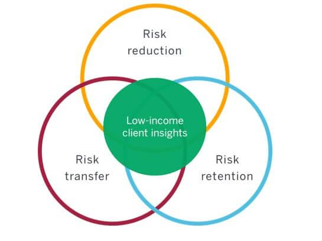

## Table of Contents

## What is income risk?

Income risk is the chance that you might not earn as much money as you expect or need. This can happen because of things like losing your job, getting fewer hours at work, or not being able to find a new job easily. It can also come from changes in the economy, like a recession, or from personal situations, like getting sick or injured.

When you face income risk, it can make it hard to pay your bills and save money. It might force you to use up your savings or even borrow money to get by. Managing income risk is important because it helps you stay financially stable and avoid stress about money. One way to manage it is by having an emergency fund or getting insurance that can help if you lose your income.

## How does income risk affect individuals and families?

Income risk can make life hard for individuals and families. When someone's income goes down or stops, they might not have enough money to pay for things they need, like food, rent, or bills. This can lead to stress and worry about money. If the income drop lasts a long time, people might have to use their savings, borrow money, or even lose their homes. It's tough on families because everyone feels the pressure, and it can make it hard for parents to take care of their kids the way they want to.

To deal with income risk, families often have to make changes. They might need to cut back on spending, which can mean no more fun outings or buying fewer things. Sometimes, they have to find cheaper places to live or switch to less expensive schools. This can be upsetting and might affect how well kids do in school or how happy everyone feels at home. Having a plan, like saving money for emergencies or getting insurance, can help families feel more secure and better handle income risk when it happens.

## What are the common causes of income risk?

Income risk can happen for many reasons. One big reason is losing a job. This can happen if a company decides to let people go, or if the job is temporary and ends. Another reason is when the economy is not doing well, like during a recession. When this happens, many businesses might struggle, and they might have to cut back on workers or close down. Also, if someone gets sick or hurt and can't work, that's another way income risk can come up.

Another cause of income risk is when someone's job changes. For example, if they get fewer hours at work or if their pay gets cut, they will have less money coming in. Sometimes, the type of work someone does can be risky, like if they work in a field where jobs come and go a lot, like construction or freelancing. Personal choices can also play a role, like deciding to go back to school or take time off to care for family, which can mean less income for a while.

Overall, income risk can come from things people can't control, like the economy or health issues, and from choices they make, like changing jobs or taking time off. It's important for people to think about these risks and plan ahead so they can handle them better if they happen.

## What are the different types of income risk?

Income risk comes in different forms. One type is job loss risk, which is when someone might lose their job. This can happen if a company is doing badly and needs to let people go, or if the job is only for a short time. Another type is economic risk, which happens when the whole economy is not doing well. During a recession, many people might lose their jobs or have their hours cut, which means they earn less money.

Another kind of income risk is health risk. If someone gets sick or hurt and can't work, they won't earn money, and this can be a big problem. There's also career risk, which is when someone's job might change in a way that affects their income. For example, if they get fewer hours or if their pay goes down, they will have less money coming in. Lastly, there's personal choice risk, which happens when people make choices that affect their income, like going back to school or taking time off to care for family.

Understanding these types of income risk can help people plan better. They might save money for emergencies, get insurance, or think carefully about the choices they make that could affect their income. By knowing about these risks, people can feel more ready to handle them if they happen.

## How can income risk be measured?

Income risk can be measured by looking at how likely it is that someone will lose their job or have their income go down. One way to do this is by checking the unemployment rate in their area. If a lot of people are out of work, there's a higher chance that someone might lose their job too. Another way is to look at the stability of the job or industry they work in. Some jobs, like those in technology or healthcare, might be more stable than others, like jobs in construction or retail, where work can be less steady.

Another way to measure income risk is by looking at personal factors. This includes things like how healthy someone is, because if they get sick or hurt, they might not be able to work. It also includes how much money they have saved up, because having savings can help them get through tough times without too much trouble. By thinking about both the bigger picture, like the economy and job market, and personal details, like health and savings, people can get a good idea of their income risk.

Overall, measuring income risk involves looking at a mix of things. It's about understanding the chances of losing a job or [earning](/wiki/earning-announcement) less money, based on what's happening in the economy and in the person's own life. By keeping an eye on these factors, people can plan better and feel more ready to handle any income problems that might come up.

## What are the psychological impacts of income risk?

When people face income risk, it can make them feel worried and stressed. Not knowing if they will have enough money can keep them up at night and make them feel anxious all the time. This stress can affect their health, making them feel tired or even sick. It can also change how they act, making them more likely to get angry or upset easily. When someone is always worried about money, it can be hard for them to enjoy life and spend time with family and friends.

Income risk can also make people feel sad or hopeless. If they lose their job or can't find work, they might feel like they are not good enough or that they have failed. This can hurt their self-esteem and make them feel down. Over time, feeling this way can lead to bigger problems like depression or anxiety. It's important for people to talk about these feelings and get help if they need it, because dealing with income risk is not just about money—it's also about taking care of their mental health.

## What strategies can be used to mitigate income risk?

One way to deal with income risk is by saving money for emergencies. This means putting some money aside every month so that if you lose your job or can't work, you have something to fall back on. Another good strategy is to get insurance, like disability insurance, which can help pay your bills if you get sick or hurt and can't work. It's also smart to learn new skills or go back to school, because having more skills can make it easier to find a new job if you need to.

Another thing you can do is to not put all your eggs in one basket. This means trying to have more than one way to make money, like having a side job or investing in something that can bring in extra income. It's also a good idea to keep an eye on the job market and the economy, so you know what's going on and can be ready for changes. Talking to friends, family, or a counselor about your worries can also help, because dealing with income risk is not just about money—it's also about taking care of your mental health.

## How do government policies influence income risk?

Government policies can help lower income risk by giving people more support when they need it. For example, unemployment benefits can help if someone loses their job. These benefits give people money while they look for a new job, which makes it easier to pay for things they need. The government can also make rules about how businesses treat workers, like making sure they get paid fairly and have good working conditions. This can make jobs more stable and reduce the chance of losing income.

Another way government policies affect income risk is through programs like health care and social security. If people can get affordable health care, they are less likely to go broke if they get sick or hurt. Social security helps older people or those who can't work anymore, so they have money coming in even if they can't earn it themselves. By having these safety nets, the government can help people feel more secure and less worried about losing their income.

## What role does diversification play in managing income risk?

Diversification is a big help in managing income risk. It means not relying on just one way to make money. Instead, you can have different sources of income, like a main job, a side job, or money from investments. If one of these sources stops, like if you lose your main job, you still have other ways to earn money. This can make you feel more secure because you're not depending on just one thing.

Having different sources of income can also make it easier to handle tough times. If the economy is not doing well and many people are losing their jobs, having a side job or some investments can help you keep going. It's like having a safety net. By spreading out where your money comes from, you lower the chance that losing one source will leave you in a bad spot.

## How does income risk vary across different demographics and industries?

Income risk can be different for people depending on their age, where they live, and what job they have. Younger people might have a harder time because they usually don't have as much money saved up. They might also have jobs that are not as steady, like working in restaurants or stores. Older people might have more savings, but if they lose their job, it can be harder for them to find a new one. Where someone lives also matters. In places where the economy is not doing well, more people might lose their jobs, making income risk higher.

Different jobs and industries also affect income risk. Some jobs, like working in a hospital or a school, are usually more stable. But jobs in construction or tech startups can be riskier because the work might not last as long. People who work for themselves or do freelance work can have a lot of income risk because they might not always have work coming in. Knowing how income risk can change based on who you are and what you do can help you plan better and feel more ready for any money problems that might come up.

## What are advanced financial instruments used to hedge against income risk?

Advanced financial instruments can help people protect themselves from income risk. One common tool is an income protection insurance policy. This type of insurance pays you money if you can't work because you're sick or hurt. It's like a safety net that helps you keep paying your bills even when you're not earning money from your job. Another tool is an annuity, which is a contract with an insurance company that gives you regular payments over time. This can help make sure you have a steady income even if you lose your job.

Another advanced instrument is a put option on stocks or other investments. This lets you sell your investments at a set price, even if the market goes down. It can help protect the money you've saved if you lose your job and need to use those savings. Some people also use futures contracts to hedge against income risk. Futures contracts are agreements to buy or sell something at a future date for a set price. This can be helpful if you have investments that you think might lose value if you lose your income. By using these tools, people can feel more secure and better prepared for times when their income might drop.

## How can predictive analytics and machine learning be applied to forecast and manage income risk?

Predictive analytics and [machine learning](/wiki/machine-learning) can help people guess when they might lose money from their jobs. These tools look at a lot of information, like how the economy is doing, how many people are out of work, and even personal details like someone's job history and health. By studying this information, the tools can find patterns and make guesses about when someone might face income risk. For example, if the economy is starting to do badly, these tools might warn that more people could lose their jobs soon. This helps people get ready by saving more money or looking for other ways to earn.

Once these tools guess when income risk might happen, they can also help people manage it better. Machine learning can suggest what someone should do, like getting insurance or starting a side job, to lower their risk. It can also help people make smart choices about where to put their money, like in savings or investments, to protect it. By using predictive analytics and machine learning, people can feel more in control and ready for any money problems that might come up. This makes it easier to plan and feel safer about their future.

## What is Understanding Financial Risk and Its Management?

Financial risk refers to the possibility of losing financial resources due to external or internal events that adversely affect investments, businesses, or economic outcomes. It is a multifaceted concept encompassing market risk, credit risk, and operational risk.

**Market Risk** involves the potential loss due to changes in market prices, such as equity prices, interest rates, foreign exchange rates, and commodity prices. Variability in these market factors can significantly affect the value of investments. Mathematically, market risk is often measured using Value at Risk (VaR), which quantifies the potential loss in value of an asset or portfolio over a defined period for a given confidence interval.

$$
\text{VaR} = Z \times \sigma \times \sqrt{T}
$$

Where $Z$ is the z-score associated with the desired confidence level, $\sigma$ is the standard deviation of the portfolio returns, and $T$ is the time period.

**Credit Risk** refers to the possibility that a borrower will default on their obligations, leading to financial losses for the lender. Credit risk assessment involves evaluating the borrower's ability to meet financial commitments, which may include analyzing credit ratings, financial statements, and historical payment behavior.

**Operational Risk** arises from failures in internal processes, systems, human errors, or external events. It encompasses issues such as fraud, system failures, and legal risks. Unlike market and credit risks, operational risk is more diverse and often more challenging to quantify and manage.

Risk management is crucial for preserving capital and ensuring stable financial operations. It involves identifying, assessing, and mitigating risks to minimize their impact on financial outcomes. Effective risk management helps organizations withstand market [volatility](/wiki/volatility-trading-strategies), economic downturns, and unforeseen events, thereby maintaining operational stability and investor confidence.

Various risk management strategies are employed to address different market conditions. **Diversification** is a common technique that involves spreading investments across various assets to reduce exposure to any single risk [factor](/wiki/factor-investing). By holding a variety of assets, the investor mitigates the risk that poor performance of one investment will significantly impact the entire portfolio.

**Stop-loss orders** are another strategy used primarily in trading, designed to limit an investor's loss on a security position. By setting a specific trigger price where an asset is sold automatically, investors can prevent substantial losses due to unfavorable price movements.

**Hedging** involves taking an offsetting position in a related security to reduce the risk of adverse price movements. For example, an investor holding a stock portfolio might use options or futures contracts to protect against potential losses. Hedging can be implemented using financial instruments like derivatives, swaps, or forward contracts.

Together, these strategies and tools allow individuals and institutions to manage financial risk effectively, adapt to changing market conditions, and strive for more predictable financial outcomes. As the financial landscape continues to evolve, the development and refinement of risk management techniques remain indispensable to ensuring sustainable economic success.

## References & Further Reading

[1]: Bergstra, J., Bardenet, R., Bengio, Y., & Kégl, B. (2011). ["Algorithms for Hyper-Parameter Optimization."](https://dl.acm.org/doi/10.5555/2986459.2986743) Advances in Neural Information Processing Systems 24.

[2]: ["Advances in Financial Machine Learning"](https://www.amazon.com/Advances-Financial-Machine-Learning-Marcos/dp/1119482089) by Marcos Lopez de Prado

[3]: ["Evidence-Based Technical Analysis: Applying the Scientific Method and Statistical Inference to Trading Signals"](https://www.amazon.com/Evidence-Based-Technical-Analysis-Scientific-Statistical/dp/0470008741) by David Aronson

[4]: ["Machine Learning for Algorithmic Trading"](https://github.com/stefan-jansen/machine-learning-for-trading) by Stefan Jansen

[5]: ["Quantitative Trading: How to Build Your Own Algorithmic Trading Business"](https://www.amazon.com/Quantitative-Trading-Build-Algorithmic-Business/dp/1119800064) by Ernest P. Chan