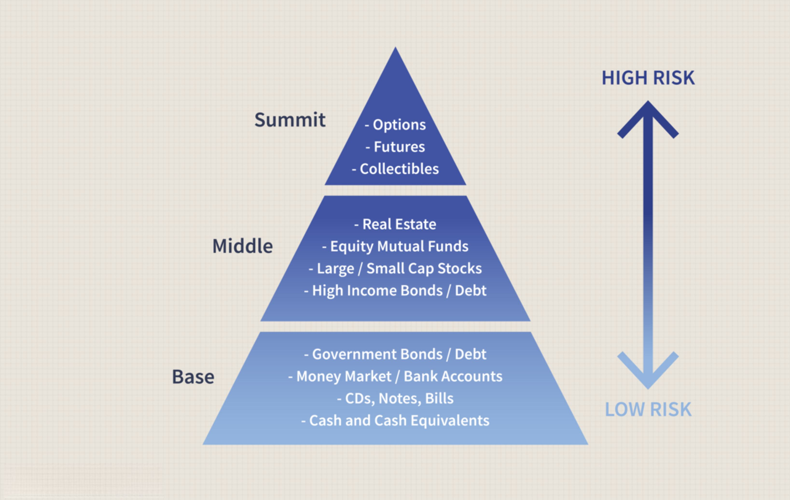

Financial risk encompasses a broad array of uncertainties that can impact the valuation and returns of investments. These include market risk, credit risk, and operational risk, which can significantly influence the stability of financial entities. Risk management is a key discipline focused on identifying, analyzing, and mitigating these uncertainties to preserve capital and maintain steady financial operations. Central to risk management strategies are techniques such as diversification, stop-loss orders, and hedging, which help in buffering the financial system against potential losses.

Income risk is a specific facet of financial risk that pertains to fluctuations in an investor's income, particularly due to changes in interest rates. It holds particular significance for interest-sensitive investments such as bonds and money market funds, where interest rate variations can directly affect asset yields and financial stability. Managing income risk is crucial for both personal and institutional portfolios to ensure stable returns and effective capital allocation.



Algorithmic trading represents a paradigm shift in the financial markets, characterized by the use of complex algorithms to automate trading decisions with increased speed and efficiency. Technological advancements have facilitated the proliferation of algorithmic trading, enabling traders to capitalize on market movements in real time. Despite its benefits, algorithmic trading introduces unique risks, such as technological, operational, and market risks, which require robust risk management strategies to mitigate potential disruptions.

As algorithmic trading continues to evolve, it impacts traditional risk management strategies, demanding a re-evaluation of existing frameworks to incorporate algorithm-specific challenges. This highlights the need for effective risk mitigation techniques, including backtesting, simulation, and the integration of advanced tools like machine learning and AI. These approaches provide traders with insights into potential risks and aid in developing resilient trading algorithms.

This article will explore the interconnected concepts of financial risk, risk management, income risk, and algorithmic trading. It will delve into the significance of managing these risks in the contemporary financial landscape, emphasizing the critical role of algorithmic trading and its influence on traditional risk management practices. Key topics, such as the risks associated with algorithmic trading, income risk, and risk mitigation strategies, will be introduced to underscore the dynamic nature of financial markets today.

## Table of Contents

## Understanding Financial Risk and Its Management

Financial risk refers to the possibility of losing financial resources due to external or internal events that adversely affect investments, businesses, or economic outcomes. It is a multifaceted concept encompassing market risk, credit risk, and operational risk.

**Market Risk** involves the potential loss due to changes in market prices, such as equity prices, interest rates, foreign exchange rates, and commodity prices. Variability in these market factors can significantly affect the value of investments. Mathematically, market risk is often measured using Value at Risk (VaR), which quantifies the potential loss in value of an asset or portfolio over a defined period for a given confidence interval.

$$
\text{VaR} = Z \times \sigma \times \sqrt{T}
$$

Where $Z$ is the z-score associated with the desired confidence level, $\sigma$ is the standard deviation of the portfolio returns, and $T$ is the time period.

**Credit Risk** refers to the possibility that a borrower will default on their obligations, leading to financial losses for the lender. Credit risk assessment involves evaluating the borrower's ability to meet financial commitments, which may include analyzing credit ratings, financial statements, and historical payment behavior.

**Operational Risk** arises from failures in internal processes, systems, human errors, or external events. It encompasses issues such as fraud, system failures, and legal risks. Unlike market and credit risks, operational risk is more diverse and often more challenging to quantify and manage.

Risk management is crucial for preserving capital and ensuring stable financial operations. It involves identifying, assessing, and mitigating risks to minimize their impact on financial outcomes. Effective risk management helps organizations withstand market [volatility](/wiki/volatility-trading-strategies), economic downturns, and unforeseen events, thereby maintaining operational stability and investor confidence.

Various risk management strategies are employed to address different market conditions. **Diversification** is a common technique that involves spreading investments across various assets to reduce exposure to any single risk [factor](/wiki/factor-investing). By holding a variety of assets, the investor mitigates the risk that poor performance of one investment will significantly impact the entire portfolio.

**Stop-loss orders** are another strategy used primarily in trading, designed to limit an investor's loss on a security position. By setting a specific trigger price where an asset is sold automatically, investors can prevent substantial losses due to unfavorable price movements.

**Hedging** involves taking an offsetting position in a related security to reduce the risk of adverse price movements. For example, an investor holding a stock portfolio might use options or futures contracts to protect against potential losses. Hedging can be implemented using financial instruments like derivatives, swaps, or forward contracts.

Together, these strategies and tools allow individuals and institutions to manage financial risk effectively, adapt to changing market conditions, and strive for more predictable financial outcomes. As the financial landscape continues to evolve, the development and refinement of risk management techniques remain indispensable to ensuring sustainable economic success.

## Income Risk and Its Impact on Financial Stability

Income risk refers to the uncertainty associated with the future returns on investments, particularly those that are sensitive to [interest rate](/wiki/interest-rate-trading-strategies) changes. This type of risk is significant for interest-sensitive investments such as bonds and money market funds. The primary concern with income risk is that fluctuations in interest rates can lead to unpredictable variations in the expected income from these investments, affecting the overall financial stability of portfolios and institutions.

Interest rate changes have a direct impact on income risk. When interest rates rise, the prices of existing bonds, which pay lower interest, tend to fall. Conversely, when rates decline, existing bonds with higher rates become more valuable. This inverse relationship between bond prices and interest rates is a fundamental concept in fixed-income investing. As a result, investors in interest-sensitive assets face uncertainty regarding the cash flows and potential depreciation in asset values, which can significantly influence the yields of financial assets.

Strategies to minimize income risk are crucial for maintaining stable returns, especially in personal and institutional portfolios. Diversification is one effective strategy; by holding a mix of assets with varying degrees of interest rate sensitivity, investors can reduce the overall risk. Laddering bond investments—purchasing bonds with different maturities—can also mitigate risk by spreading exposure over varying interest rate environments. Additionally, using interest rate futures or options can hedge against adverse movements in rates, further stabilizing potential income streams.

In real-world scenarios, income risk manifests in various forms. For instance, consider a pension fund heavily invested in long-term bonds. If interest rates surge unexpectedly, the fund's income from these investments may decrease due to falling bond prices and diminished coupon reinvestment opportunities. This scenario forces the fund to reassess its investment strategy, possibly shifting to shorter-duration securities or incorporating floating-rate instruments to counteract the effects of income risk.

In conclusion, understanding and managing income risk is paramount for both individual and institutional investors to preserve financial stability. By implementing effective risk mitigation strategies and anticipating rate fluctuations, investors can make informed decisions to safeguard against the uncertainties of income variations in interest-sensitive markets.

## The Evolution of Algorithmic Trading

Algorithmic trading, a transformative force in financial markets, has experienced a significant rise over the past few decades, largely due to its ability to enhance trading speed and efficiency. This form of trading utilizes complex algorithms to execute orders at a speed and frequency that is unachievable for human traders, thereby optimizing execution quality and minimizing trading costs. The benefits of [algorithmic trading](/wiki/algorithmic-trading) are manifold, including reduced transaction costs, improved accuracy, and the ability to process vast amounts of data swiftly, which has led to its widespread adoption in the financial industry.

The growth of algorithmic trading has been propelled by several technological advancements. The development of high-frequency trading ([HFT](/wiki/high-frequency-trading-strategies)) systems is one of the most notable advancements. These systems rely on sophisticated algorithms that execute trades in fractions of a second by leveraging high-speed networks and powerful computing systems. Technologies such as [machine learning](/wiki/machine-learning) and big data analytics have further enhanced the predictive capabilities of trading algorithms, allowing for more informed decision-making processes. The utilization of cloud computing has also facilitated the storage and processing of massive datasets, making it possible for traders to access and analyze real-time market data from anywhere in the world.

Key players in the algorithmic trading arena include major financial institutions, hedge funds, and proprietary trading firms. These entities leverage algorithmic trading to manage vast portfolios and execute trades across multiple markets, including equities, foreign exchange, commodities, and fixed-income securities. Notable markets that have seen substantial algorithmic trading activity include the New York Stock Exchange (NYSE), NASDAQ, and the London Stock Exchange (LSE), where algorithmic trades account for a significant portion of the trading [volume](/wiki/volume-trading-strategy).

Despite these advancements, algorithmic trading is subject to various myths and perceptions. Common myths include the belief that algorithmic trading guarantees profits or that it operates independently without human intervention. In reality, successful algorithmic trading requires meticulous strategy development, constant monitoring, and risk management by skilled professionals. Additionally, there is a perception that algorithmic trading manipulates markets or lacks transparency, leading to concerns over market fairness. However, regulatory bodies are actively working to ensure that trading practices remain fair and transparent, mitigating risks associated with algorithm-driven market manipulation.

In summary, algorithmic trading represents a significant evolution in financial markets, driven by technological breakthroughs that enable rapid trade execution and improved market analysis. Key players actively utilize these strategies across prominent global markets, challenging traditional perceptions and reshaping the trading landscape.

## Risks Associated with Algorithmic Trading

Algorithmic trading, while providing efficiency and speed in execution, is susceptible to a variety of risks that can significantly impact market operations. These risks can be broadly categorized into technological, operational, and market risks.

**Technological Risks:** Algorithmic trading relies heavily on complex systems and software, elevating the risk of technological failures. This includes system downtimes, latency issues, and bugs in the algorithmic code which can lead to incorrect trades being executed. For instance, a minor coding error in an algorithm can result in substantial financial losses. The infamous "Knight Capital Group Incident" of 2012 serves as a paramount example, where a software glitch caused the company to lose $440 million in 45 minutes, nearly bankrupting the firm.

**Operational Risks:** These encompass risks arising from internal process failures, including poor risk management practices and inadequate monitoring systems. A lack of robustness in the operational frameworks may lead to selecting unsuitable algorithms or decision-making based on faulty data. This can cause unexpected losses, particularly when algorithms are not properly backtested under a variety of market conditions. 

**Market Risks:** Algorithms operate in dynamic markets and are exposed to various market risks such as volatility and liquidity risk. During periods of high volatility, algorithms may execute trades at undesirable prices due to rapid price movements. Additionally, liquidity risk poses a significant threat, especially when an algorithm attempts to execute large trades that the market cannot absorb without moving prices unfavorably, thereby causing slippage.

**Regulatory Risks:** With the growth of algorithmic trading, regulatory bodies have increased scrutiny to ensure fair practices and prevent market manipulation. Compliance with regulations such as the European Union's Markets in Financial Instruments Directive II (MiFID II) is crucial for algorithmic traders. Failure to comply can result in penalties and restrictions. Moreover, regulations are subject to change, which requires continuous adaptation by market participants.

**Algorithm-Induced Market Disruptions:** Algorithmic trading can occasionally lead to significant market disruptions. The "Flash Crash" of May 6, 2010, is a case in point, where the Dow Jones Industrial Average suffered a rapid and severe drop before quickly recovering. The incident was partly attributed to algorithmic trading systems reacting to atypical market activity, demonstrating how algorithm errors or unexpected interactions between different trading algorithms can lead to such disruptions.

Real-life case studies underscore the importance of implementing thorough risk management strategies. For instance, incorporating real-time monitoring tools can help in quickly identifying and mitigating issues as they arise. Risk controls, such as circuit breakers, may also be employed to pause trading operations in the event of detected anomalies. As regulatory landscapes evolve, maintaining compliance through regularly updated practices remains essential for algorithmic traders to operate sustainably and minimize associated risks.

## Effective Risk Management Strategies for Algo Traders

In the rapidly evolving landscape of algorithmic trading, effective risk management is paramount to maintain stability and achieve sustainable profits. One of the foundational strategies in mitigating risks is the use of [backtesting](/wiki/backtesting) and simulation. These processes allow traders to evaluate how their algorithms would perform under various market conditions by using historical data. Backtesting helps in understanding the potential weaknesses of a strategy and provides insights into its possible future performance. Simulations, on the other hand, create hypothetical market scenarios that test the robustness of trading algorithms, helping to refine and optimize them before actual deployment. 

Real-time monitoring and risk control systems are indispensable. These systems facilitate the continuous observation of market conditions and the performance of trading algorithms. They enable traders to identify risks such as unexpected market volatility or algorithmic errors promptly. Effective risk control systems often integrate automated risk alerts and the capability to halt trading when predetermined thresholds are breached. This proactive approach ensures that potential losses are minimized and trading activities align with the firm’s risk tolerance. 

Risk limits, position sizing, and diversification further contribute to sound risk management practices. Risk limits set boundaries on the amount of capital exposed to a single trade or series of trades, hence preventing catastrophic losses. Position sizing — determining the number of units to be invested in each trade — is crucial in managing exposure. Techniques such as the Kelly Criterion can be employed to optimize position sizes based on the expected returns and associated risks. Diversification involves spreading investments across a variety of assets or strategies to mitigate the impact of any single failing trade on the overall portfolio.

The advent of advanced technologies like machine learning and [artificial intelligence](/wiki/ai-artificial-intelligence) has introduced sophisticated tools for predictive risk analytics. These technologies analyze large datasets to identify patterns and potential risk factors, offering predictions about future market movements and aiding in strategic decision-making. Machine learning models can continuously learn and adapt from new data, thereby enhancing the agility and accuracy of risk management models. Python, with libraries such as Scikit-learn and TensorFlow, is often employed for developing such AI-driven risk analytics tools due to its versatility and ease of use.

Addressing algorithmic trading risks through these comprehensive strategies enhances the safety and efficiency of trading operations. By effectively combining traditional risk management principles with advanced technological innovations, algo traders can better navigate the complexities and uncertainties inherent in financial markets.

## Future Trends in Risk Management and Algo Trading

Emerging technologies such as artificial intelligence (AI) and blockchain are revolutionizing risk management approaches in financial markets. AI offers sophisticated tools for predictive analytics, enabling traders to anticipate market trends and manage risks more effectively. Machine learning algorithms can analyze vast datasets to identify patterns and correlations, allowing for more accurate forecasting of market movements. This predictive capability enhances risk management by providing insights that were previously unattainable through traditional statistical methods.

Blockchain technology, with its decentralized and immutable ledger, introduces transparency and security to financial transactions. By providing a tamper-proof record of trades, blockchain reduces the risk of fraud and operational errors. Smart contracts, which execute trades automatically when predefined conditions are met, further minimize counterparty risk and ensure compliance with regulatory requirements.

Real-time data analytics is another significant advancement changing trading strategies. By processing data as soon as it is available, traders can make informed decisions based on current market conditions. This immediacy allows for the dynamic adjustment of trading algorithms, optimizing their performance amidst market volatility. Python libraries such as pandas and NumPy facilitate the processing and analysis of real-time data streams, offering traders valuable tools for live decision-making:

```python
import pandas as pd
import numpy as np

# Example: Simulating real-time data update and analysis
def analyze_real_time_data(data_stream):
    # Convert incoming data stream into a DataFrame
    df = pd.DataFrame(data_stream)

    # Calculate moving averages for trading signals
    df['MovingAverage'] = df['Price'].rolling(window=5).mean()

    # Identify buy/sell signals based on moving average crossover
    df['Signal'] = np.where(df['Price'] > df['MovingAverage'], 'Buy', 'Sell')

    return df

# Simulated data stream of stock prices
data_stream = [{'Price': 100}, {'Price': 102}, {'Price': 101}, {'Price': 104}, {'Price': 103}, {'Price': 106}]
analyze_real_time_data(data_stream)
```

The future outlook of algorithmic trading appears promising as these technologies continue to evolve. In global markets, AI-driven trading systems are expected to become more autonomous, reducing human intervention and increasing execution speed. Additionally, the integration of blockchain in clearing and settlement processes may streamline operations, further enhancing efficiency.

To stay ahead in risk management and algo trading, best practices include continuous research and development in AI technologies, ensuring that systems are robust and adaptive to changes. Traders should focus on enhancing data quality to improve algorithmic accuracy and leveraging machine learning models for adaptive strategies. Regularly updating and backtesting algorithms in varied market conditions can help mitigate potential risks. Furthermore, fostering partnerships with technology providers can offer access to cutting-edge tools and insights, maintaining a competitive edge in the algorithmic trading landscape.

## Conclusion

Effectively managing income risk and algorithmic trading risks is crucial in today's dynamic financial environment. Income risk, which stems from fluctuations in interest rates and market conditions, can significantly influence investment yields and financial stability. Therefore, investors need to adopt strategies that include diversification and hedging to cushion against adverse outcomes.

Algorithmic trading introduces its own set of risks, including technological failures and market volatility. These risks can lead to significant financial losses if not properly managed. Therefore, continuous development and adaptation of risk management strategies are essential. This includes implementing rigorous backtesting and maintaining robust real-time monitoring systems. 

Traders are encouraged to leverage emerging technologies such as artificial intelligence (AI) and machine learning to enhance predictive risk analytics and improve decision-making. AI can process large data sets and identify patterns that may not be immediately visible to human analysts, thus providing a competitive edge in risk management.

There is a strong need for adopting comprehensive risk management practices to ensure financial stability. Traders should establish clear risk limits and engage in regular evaluation of their strategies to adapt to changing market conditions. By doing so, they can mitigate potential threats, optimize their portfolios, and ultimately safeguard their financial interests. Continual adaptation and integration of new tools and strategies remain key to thriving in an ever-evolving financial landscape.

## References & Further Reading

[1]: Bergstra, J., Bardenet, R., Bengio, Y., & Kégl, B. (2011). ["Algorithms for Hyper-Parameter Optimization."](https://dl.acm.org/doi/10.5555/2986459.2986743) Advances in Neural Information Processing Systems 24.

[2]: ["Advances in Financial Machine Learning"](https://www.amazon.com/Advances-Financial-Machine-Learning-Marcos/dp/1119482089) by Marcos Lopez de Prado

[3]: ["Evidence-Based Technical Analysis: Applying the Scientific Method and Statistical Inference to Trading Signals"](https://www.amazon.com/Evidence-Based-Technical-Analysis-Scientific-Statistical/dp/0470008741) by David Aronson

[4]: ["Machine Learning for Algorithmic Trading"](https://github.com/stefan-jansen/machine-learning-for-trading) by Stefan Jansen

[5]: ["Quantitative Trading: How to Build Your Own Algorithmic Trading Business"](https://www.amazon.com/Quantitative-Trading-Build-Algorithmic-Business/dp/1119800064) by Ernest P. Chan