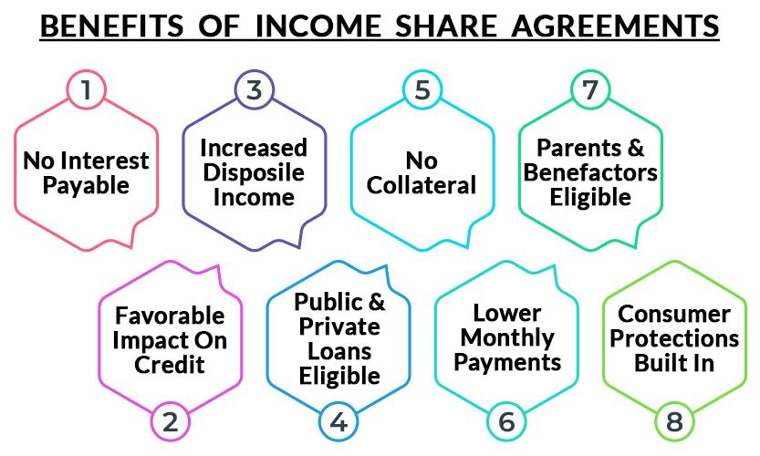

## Table of Contents

## What is an Income Share Agreement (ISA)?

An Income Share Agreement (ISA) is a type of financial agreement where a student gets money for education now and agrees to pay it back later as a percentage of their future income. Instead of borrowing a fixed amount of money and paying it back with interest, the student agrees to pay a part of their earnings for a certain period of time after they start working.

ISAs are often used by students who want to go to school but don't want to take out traditional student loans. The amount they pay back depends on how much money they make after they graduate. If they earn a lot, they pay more; if they earn less, they pay less. This can be helpful because it means the payments are more flexible and based on what the student can afford.

## How does an Income Share Agreement work?

An Income Share Agreement, or ISA, is a way for students to get money for school. Instead of taking out a regular loan, a student agrees to pay back a part of their future earnings. For example, they might agree to pay 10% of their income for 10 years after they start working. The amount of money they get upfront depends on things like what they are studying and how much they are expected to earn after graduation.

After the student finishes school and starts working, they start paying back the money. The payments are based on how much they earn. If they get a high-paying job, they will pay more each month. If they earn less, they will pay less. There is usually a minimum income level, so if the student earns below that, they don't have to pay anything until their income goes up. This makes it easier for students because their payments match what they can afford.

## What are the key components of an ISA?

An Income Share Agreement has several important parts. The first is the funding amount, which is how much money the student gets for their education. This amount depends on things like the student's field of study and their expected future earnings. The second part is the income share percentage, which is the part of the student's future income they agree to pay back. This could be something like 10% or 15% of their earnings.

Another key part is the payment period, which is how long the student will be making payments. This could be a set number of years, like 10 years, or until a certain amount of money has been paid back. There is also a minimum income threshold, which means the student only starts paying back the money once they earn above a certain level. This helps protect students who might not find high-paying jobs right away.

The last important part is the payment cap, which is the maximum amount the student will ever have to pay back. This protects the student from paying back too much if they end up [earning](/wiki/earning-announcement) a very high salary. All these parts together make up an Income Share Agreement, which aims to help students finance their education in a way that matches their future earnings.

## Who typically offers Income Share Agreements?

Income Share Agreements are usually offered by special companies that focus on helping students pay for school. These companies work with colleges and universities to give students money for their education. Some big names in this business are Vemo Education, Merit America, and Lambda School. They make deals with schools to offer ISAs to students who want to study certain subjects.

Sometimes, schools themselves offer Income Share Agreements. This happens more at private colleges or coding bootcamps that want to help their students without making them take out regular loans. These schools might work with the special companies or set up their own ISA programs. Either way, the goal is to help students get the education they need without worrying too much about money right away.

## What are the benefits of an ISA for students?

Income Share Agreements can be really helpful for students. One big benefit is that they don't have to start paying back the money until they get a job and start earning a certain amount. This means they don't have to worry about loan payments right after they finish school. It gives them time to find a good job without the stress of immediate bills.

Another good thing about ISAs is that the payments change based on how much money the student makes. If they get a high-paying job, they will pay more, but if they earn less, they pay less. This makes it easier for students because their payments match what they can afford. It's like a safety net that helps them manage their money better after school.

## How do ISAs compare to traditional student loans?

Income Share Agreements (ISAs) and traditional student loans are two different ways to pay for school. With a traditional student loan, you borrow a fixed amount of money and then pay it back with interest, no matter how much you earn after you graduate. This means you have to start paying back the loan right away, even if you don't have a job yet. The payments stay the same, so if you can't find a good job, it can be hard to keep up with them.

On the other hand, with an ISA, you get money for school and then pay it back as a percentage of your future income. You only start paying back the money once you earn above a certain amount, which gives you time to find a job without worrying about immediate payments. The amount you pay each month changes based on how much you earn, so if you get a high-paying job, you pay more, but if you earn less, you pay less. This can make it easier to manage your money after school because the payments match what you can afford.

## What are the potential risks and drawbacks of ISAs?

Income Share Agreements can have some risks for students. One big risk is that if you get a really high-paying job, you might end up paying back a lot more than you got for school. This is because you have to pay a percentage of your income, so the more you earn, the more you pay. Also, ISAs might not be available for everyone. Some schools or programs might not offer them, so you might not have the option to use an ISA to pay for your education.

Another thing to think about is that ISAs can be hard to understand. They have a lot of rules about when you start paying back the money, how much you pay, and for how long. If you don't read and understand all the details, you might agree to something that's not good for you. Plus, since ISAs are not as common as traditional loans, it can be hard to find good information about them or compare different offers.

## How is the repayment amount calculated in an ISA?

The repayment amount in an Income Share Agreement is based on a percentage of the student's future income. When a student signs an ISA, they agree to pay back a certain part of their earnings, like 10% or 15%, once they start working and earn above a set minimum income. This minimum income level is important because it means the student doesn't have to start paying back the money until they can afford to.

The payments continue for a set period of time, like 10 years, or until a certain amount of money has been paid back. There is also a payment cap, which is the most the student will ever have to pay. This protects the student from paying back too much if they end up earning a very high salary. So, the amount they pay each month changes based on how much they earn, making it easier to manage their money after school.

## What happens if a student does not find a job after graduation?

If a student does not find a job after graduation, they usually do not have to start paying back their Income Share Agreement right away. Most ISAs have a minimum income level, which means the student only starts paying back the money once they earn above that amount. So, if they are not working or not earning enough, they don't have to make any payments until they get a job that pays more than the minimum.

This can be a big help for students because it gives them time to find a good job without the stress of immediate payments. It's different from traditional student loans, where you have to start paying back the money right after you finish school, no matter if you have a job or not. With an ISA, the payments are based on what the student can afford, so it's easier to manage money during the time after graduation when finding a job can be hard.

## Are there any income thresholds or caps in ISAs?

Yes, Income Share Agreements usually have income thresholds and caps. The income threshold is the minimum amount of money a student needs to earn before they start paying back the ISA. This means if a student is not working or earning less than this amount, they don't have to make any payments. It helps students who might take a while to find a good job after they finish school.

The payment cap is the most a student will ever have to pay back. This is important because it stops the student from paying back too much money if they get a very high-paying job. The cap makes sure that no matter how much they earn, there's a limit to how much they have to pay. This way, the ISA is fair and protects the student from paying more than they expected.

## How do regulatory frameworks affect ISAs?

Regulatory frameworks can have a big impact on Income Share Agreements. Different countries and states have their own rules about how ISAs can work. These rules can affect things like how much money students can get, how long they have to pay it back, and what the payments can be based on. For example, some places might say that the payment cap has to be a certain amount, or that the income threshold can't be too high. This means that companies offering ISAs have to follow these rules, which can change how they set up their agreements.

These regulations are important because they help protect students. They make sure that ISAs are fair and that students understand what they are agreeing to. Without these rules, companies might offer agreements that are too hard for students to pay back, or that don't give them enough time to find a job. By having clear rules, governments can make sure that ISAs are a good option for students who want to go to school without taking out traditional loans.

## What future trends might impact the use of Income Share Agreements?

In the future, more schools might start using Income Share Agreements because they help students pay for school without taking out big loans. As more people learn about ISAs, they might become more popular. Also, if the government makes new rules about ISAs, it could make them easier to use or more fair for students. Technology might also help by making it easier to track how much students earn and how much they need to pay back.

Another thing that could change is how companies offer ISAs. They might start working with more types of schools, not just colleges but also trade schools and bootcamps. This would give more students the chance to use ISAs. If the economy gets better and more people can find good jobs, ISAs might become even more useful because students would be able to pay back the money more easily. But if the economy gets worse, it could be harder for students to find jobs and pay back their ISAs.

## References & Further Reading

[1]: Palacios, M., & Kelly, A. P. (2014). ["Investing in a Future Workforce: A Review of Income Share Agreements."](https://aei.org/wp-content/uploads/2014/02/-investing-in-value-sharing-in-risk-financing-higher-education-through-inome-share-agreements_083548906610.pdf) American Enterprise Institute.

[2]: Gurantz, O., & Odder-White, E. (2020). ["An Empirical Evaluation of Purdue University's Back a Boiler Income Share Agreement Program."](https://www.brookings.edu/research/an-empirical-evaluation-of-purdue-universitys-back-a-boiler-income-share-agreement-program/) Brookings Institution.

[3]: Barr, N., & Crawford, I. (2005). ["Financing Higher Education: Answers from the UK."](https://www.taylorfrancis.com/books/edit/10.4324/9780203321515/financing-higher-education-nicholas-barr-iain-crawford) Oxford University Press.

[4]: Wealthfront. (2019). ["Income Share Agreements: Pros, Cons, and Alternatives."](https://raptorfi.com/article/income-share-agreements-pros-and-cons) Wealthfront Blog.

[5]: Zhang, J., & Byrn, M. (2020). ["Towards Better ISAs: Student Perspectives and Policy Design."](https://www.sciencedirect.com/science/article/abs/pii/S1369702119307837) Social Science Research Network.