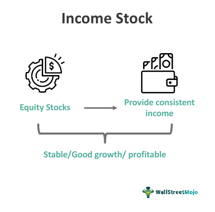

The stock market presents a wide array of investment opportunities, with two of the most popular strategies being income stock investing and algorithmic trading. Income stock investing focuses on the acquisition of securities that provide steady dividend payments, offering investors a reliable source of passive income. These dividends are typically distributed on a regular schedule, providing a financial buffer that can appeal especially to those seeking consistent returns.

On the other hand, algorithmic trading leverages advanced technologies and mathematical models to optimize investment decisions. This form of trading utilizes computer algorithms to execute trades at high speeds and with precision, often making it possible to analyze vast datasets to identify profitable trading opportunities. Algorithms are constructed based on various parameters, including historical data, technical indicators, and market conditions, to enhance decision-making processes and improve trade execution.



This article aims to explore the intersection of these two strategies—income stock investing and algorithmic trading. By integrating algorithmic trading techniques into a dividend-focused portfolio, investors can potentially enhance their wealth generation prospects. The combination of steady dividend income with the advanced capabilities of algorithmic systems promises an intriguing avenue for maximizing returns.

Moreover, this exploration will include an examination of the risks inherent in these strategies and propose methods for mitigating such risks while optimizing returns. A comprehensive understanding of income stocks, the role of algorithmic trading within the broader stock market, and the specific benefits for those interested in dividend investing are essential for leveraging this integration effectively. Through informed strategies, investors can make prudent decisions, aligning their approach with financial goals and market dynamics.

## Table of Contents

## Understanding Income Stocks

Income stocks are securities that pay dividends regularly, offering investors a steady income stream. These stocks typically exhibit lower volatility compared to growth stocks and offer yields higher than the prevailing 10-year Treasury note rate, making them attractive to those seeking a reliable income source. A fundamental characteristic of high-quality income stocks is their ability to maintain stable earnings with a consistent history of increasing dividends, thus keeping up with, or outpacing, inflation. This predictable revenue stream can be highly beneficial for long-term financial planning.

For instance, Walmart serves as an exemplar in the context of income stocks, consistently increasing its dividends over time. This consistency not only reflects the company’s robust financial health but also its commitment to returning value to shareholders. Such companies are often characterized by well-established business models, significant market presence, and a proven track record of profitability, which collectively contribute to their capacity to distribute a portion of their earnings as dividends.

Investors often draw comparisons between income stocks and [growth stocks](/wiki/growth-stocks). While income stocks focus on providing regular income through dividends, growth stocks aim for capital gains, reinvesting earnings into the business to fuel expansion and innovation. Consequently, growth stocks might present higher [volatility](/wiki/volatility-trading-strategies) and potential for substantial price appreciation over the long term, whereas income stocks provide regular payouts and tend to be more stable.

Investors assessing income stocks may consider several key financial ratios and metrics. One important metric is the dividend yield, calculated as the annual dividends per share divided by the stock price per share. This metric provides insight into the income generated relative to the investment cost and aids in comparing potential investment opportunities. Another crucial consideration is the payout ratio, which indicates the proportion of earnings paid out as dividends. A lower payout ratio might suggest that the company retains ample earnings for growth or to buffer against future downturns, enhancing the sustainability of its dividends.

In summary, understanding the dynamics and characteristics of income stocks is essential for investors interested in generating steady income through dividends. By focusing on companies with a strong history of earnings and dividend growth, investors can potentially achieve financial stability and long-term wealth accumulation while maintaining an acceptable risk profile.

## Dividend Investing: Benefits and Strategies

Dividend investing is a strategy that enables investors to secure a reliable source of passive income, with potential capital appreciation as an additional benefit. A dividend is a payment made by a corporation to its shareholders, usually in the form of cash or additional stock, representing a portion of its earnings. Companies that consistently issue dividends often have stable earnings and robust financial health, making such stocks attractive options for investors seeking regular income.

A significant advantage of dividend investing is its capacity to enhance investment returns through the concept of compounding. By reinvesting dividends back into purchasing more shares, investors can increase their ownership stake in the company, leading to greater future income as dividends accrue on an expanding number of shares. Over time, this compounding effect can significantly enhance total returns.

Successful dividend investing strategies prioritize companies with a robust history of increasing dividend payouts. A commitment to regularly raising dividends is indicative of a company's strong financial position and its management's confidence in sustained profitability. Examples of such companies often include blue-chip stocks, which are large, stable companies recognized for their reliability and performance.

Diversification across industries is another critical strategy in dividend investing. This approach mitigates sector-specific risks, ensuring that setbacks in one sector do not disproportionately impact the overall portfolio. For instance, combining stocks from traditionally high-dividend industries like utilities with those from technology firms, which may offer growth prospects, can balance risk and reward.

During periods of market volatility, dividend stocks can provide a buffer as companies strive to maintain dividend payments. Even in turbulent times, firms with established dividend policies often continue their payouts, offering a degree of stability when market prices fluctuate.

Investors also seek stocks with a low payout ratio, which is the proportion of earnings paid out as dividends. A lower payout ratio suggests that a company retains a significant portion of its earnings, providing a cushion for maintaining or growing dividends even if earnings temporarily decline. The formula for the payout ratio is:

$$
\text{Payout Ratio} = \left( \frac{\text{Dividends per Share}}{\text{Earnings per Share}} \right) \times 100
$$

This ensures that the company is not overextending itself, leaving sufficient capital for future growth and investment.

In summary, dividend investing leverages a company's periodic payments to shareholders as a foundation for generating passive income and appreciating investment value. Focusing on companies with a track record of increasing dividends and diversifying across various sectors enhances stability and potential returns. Attention to payout ratios further ensures the sustainability of the income stream, helping investors achieve their financial goals while mitigating risks associated with market volatility.

## Algorithmic Trading in Dividend Investing

Algorithmic trading has revolutionized the way dividend investing strategies are executed, bringing a new level of precision and efficiency to the process. By utilizing sophisticated algorithms, traders can enhance their execution of dividend strategies, aiming to maximize returns and minimize risks. The key advantage of [algorithmic trading](/wiki/algorithmic-trading) lies in its ability to analyze vast sets of data rapidly, pinpointing optimal entry and [exit](/wiki/exit-strategy) points for trades.

One popular strategy that benefits from algorithmic trading is the dividend capture strategy. This involves purchasing stocks shortly before the ex-dividend date—the cut-off date on which the right to receive the next dividend expires—and selling them shortly after. The goal is to "capture" the dividend while maintaining minimal exposure to the stock's price volatility. The precise timing required for this strategy can be challenging for human traders but is well-suited for algorithmic trading systems, which can execute trades with split-second precision.

Algorithmic trading minimizes human error in execution, efficiently managing the complexities involved in timing trades around the ex-dividend date. For instance, by using historical price data and dividend information, algorithms can evaluate the probability of price adjustments and adjust trades accordingly, ensuring that traders exit positions with minimum loss or at optimal gains.

To implement these algorithms, Python has emerged as a preferred programming language due to its robust ecosystem of libraries. Libraries such as Pandas and NumPy are instrumental in algorithmic trading applications. Pandas, known for its powerful data manipulation capabilities, allows traders to handle and analyze large datasets effortlessly. NumPy, with its support for large multidimensional arrays and matrices, offers mathematical functions essential for complex calculations involved in financial strategies.

For example, a simple Python code snippet using Pandas and NumPy to execute a partial dividend capture strategy might look as follows:

```python
import pandas as pd
import numpy as np

# load historical data
data = pd.read_csv('stock_data.csv')

# define ex-dividend function
def calculate_ex_div_strategy(data):
    # Assume 'Date', 'Close', and 'Dividend' columns exist
    data['Dividend_Capture'] = np.where((data['Date'] == 'ex-div-date'), data['Dividend'], 0)
    return data['Dividend_Capture'].sum()

# Apply ex-dividend function
total_dividend_capture = calculate_ex_div_strategy(data)
print(f"Total Dividend Captured: {total_dividend_capture}")
```

This simple setup allows traders to simulate and adjust their strategies based on dividend schedules and historical stock data. Through such algorithmic techniques, investors in dividend stocks can optimize their income capturing methods, ensuring that they make informed, strategic decisions that align with market dynamics and personal financial objectives.

## Maximizing Dividend Income Through Strategy

Maximizing dividend income through effective strategies involves a multi-faceted approach, focusing primarily on dividend growth stocks and sector diversification. Dividend growth stocks are those that have a consistent track record of increasing dividend payouts, thus offering investors not only a steady income but also protection against inflationary pressures. This strategy ensures that the purchasing power of the dividend income is maintained over time. By diversifying investments across various sectors, investors can reduce company-specific and sector-specific risks, thereby creating a more resilient investment portfolio that can withstand market fluctuations. 

The dividend capture strategy is another approach that can optimize income. This strategy involves buying stocks just before the ex-dividend date and selling them shortly after the dividend is paid. If executed with precision, this method can result in additional short-term gains. However, the high-frequency nature of this strategy mandates careful consideration of transaction costs and market dynamics. Investors must be aware of associated risks such as sudden dividend cuts, which can undermine expected returns. 

Tax implications on dividend income require careful examination, as tax rates can significantly impact net returns. Understanding the tax treatment of dividends in one's jurisdiction is essential to formulating a tax-efficient strategy. 

Utilizing algorithmic trading in managing dividend strategies can enhance decision-making accuracy and minimize risks. Algorithms can process vast amounts of data to identify optimal entry and exit points, ensuring precise execution of dividend capture strategies. Python and its associated data manipulation libraries, such as Pandas and NumPy, are valuable tools for creating and optimizing these algorithms. A simple Python function might look like this:

```python
import pandas as pd

def calculate_ex_dividend_dates(stock_data):
    # Calculate the ex-dividend dates based on historical data
    stock_data['ExDividendDate'] = stock_data['DividendDate'] - pd.Timedelta(days=1)
    return stock_data

# Example usage
stock_data = pd.DataFrame({'DividendDate': pd.to_datetime(['2023-01-15', '2023-04-15', '2023-07-15'])})
ex_dividend_dates = calculate_ex_dividend_dates(stock_data)
print(ex_dividend_dates)
```

Long-term investment horizons are crucial for effective dividend investing, as they leverage the power of compounding dividends over time. Continuous monitoring of market trends and company performance further aids in identifying opportunities and risks. Staying informed enables investors to adjust their strategies proactively, ensuring alignment with evolving market conditions and financial goals. 

Combining traditional investment strategies with algorithmic trading technologies can serve to maximize returns and manage the complexities associated with dividend investing.

## Risks and Challenges in Dividend Investing

Investors engaging in dividend investing must navigate various risks and challenges that could impact their returns and overall financial strategy. A primary concern is the potential for dividend cuts. Companies might reduce or eliminate dividend payments if they face financial difficulties or need to reallocate funds for growth or debt reduction. To mitigate this risk, investors should diligently monitor the financial health of the companies within their portfolio. Evaluating key metrics such as payout ratios — the proportion of earnings paid out as dividends — is essential. A prudent approach is to favor companies with a low payout ratio, as this suggests a greater capacity to maintain dividends during economic downturns.

Market volatility further complicates dividend investing. During periods of economic instability, stock prices can fluctuate significantly, impacting both the value of investments and the investor's income stream. Although dividend stocks are typically considered more stable, they are not immune to market pressures. Diversification across industries and geographies can help mitigate these impacts, reducing the overall volatility of the investment portfolio.

Inflation presents another challenge by eroding the purchasing power of dividend income over time. To counteract this, investors may focus on companies with a history of dividend growth that exceeds the rate of inflation. This strategy helps ensure that income keeps pace with rising costs, preserving its real value.

An understanding of tax implications is vital for dividend investors. Tax regimes vary significantly by jurisdiction, affecting net returns on dividend income. Some regions may offer favorable taxation for qualified dividends, while others may impose higher rates. Investors should familiarize themselves with applicable tax laws and consider any potential tax-advantaged accounts that might optimize their after-tax income.

Algorithmic trading can play a significant role in managing the risks associated with dividend investing. By utilizing sophisticated algorithms, investors can process vast amounts of market data, identify trends, and execute trades with precision. This data-driven approach enhances decision-making and reduces human error. For example, algorithmic trading can optimize dividend capture strategies — purchasing a stock just before it goes ex-dividend and selling it shortly after — ensuring transactions occur at the most opportune times.

Incorporating algorithmic strategies alongside traditional investment research provides a comprehensive risk management approach. While algorithms offer speed and data accuracy, human insight and qualitative analysis remain crucial for assessing factors that may not yet be reflected in numbers. By combining these tools, investors are better equipped to build resilient portfolios and achieve their financial goals.

## Conclusion

Dividend investing, combined with algorithmic trading, offers investors the potential to achieve stable income streams and wealth accumulation over time. By strategically utilizing dividends along with technological advancements, such as algorithmic trading, investors can enhance their returns. This integration, however, requires a thorough understanding and disciplined investment practices that take into account the complexities and nuances of both strategies.

For investors to successfully leverage these strategies, a balanced approach is essential. This entails carefully selecting stocks that align with individual financial goals while ensuring diversification to mitigate risks. Dividend stocks with a solid history of increasing payouts and a sustainable payout ratio should be prioritized to ensure ongoing income. Diversification across sectors and industries can further safeguard against market volatility and sector-specific downturns.

Algorithmic trading can serve as a powerful tool when integrated with dividend investing. It allows for efficient analysis and execution, identifying optimal entry and exit points for trades that can maximize dividend capture opportunities. However, investors must maintain a disciplined approach to avoid the potential pitfalls of algorithmic over-reliance which can lead to increased vulnerability to market fluctuations and unforeseen challenges.

Key to success in this integrated strategy is aligning investment choices with personal financial objectives. This involves developing a well-constructed portfolio where dividend income complements overall wealth-building goals. Regular monitoring of portfolio performance and adjustments based on financial health assessments of dividend-paying companies is necessary to sustain growth and income stability.

In conclusion, the amalgamation of dividend investing and algorithmic trading offers considerable potential for income generation and increased wealth accumulation. Investors who devote time to understanding these strategies, maintain discipline, and ensure alignment with their financial aims can capitalize on the benefits of both dividends and technology for long-term success.

## References & Further Reading

[1]: Graham, B. (2003). ["The Intelligent Investor: The Definitive Book on Value Investing."](https://www.amazon.com/Intelligent-Investor-Definitive-Investing-Essentials/dp/0060555661) Harper Business.

[2]: Cogneau, P., & Hubner, G. (2009). ["The 101 Ways to Measure Portfolio Performance."](https://www.researchgate.net/publication/228267339_The_101_Ways_to_Measure_Portfolio_Performance) The Journal of Performance Measurement.

[3]: Raschke, L. B. (1999). ["Professional Trading Strategies."](https://lindaraschke.net/wp-content/uploads/EBook_Updated.pdf) LBRGroup, Inc.

[4]: Narang, R. K. (2009). ["Inside the Black Box: A Simple Guide to Quantitative and High Frequency Trading"](https://onlinelibrary.wiley.com/doi/book/10.1002/9781118267738). Wiley Finance.

[5]: Jagerson, J., & Hansen, S. (2011). ["All About Investing in Gold"](https://www.mhebooklibrary.com/doi/book/10.1036/9780071768351). McGraw-Hill Education.