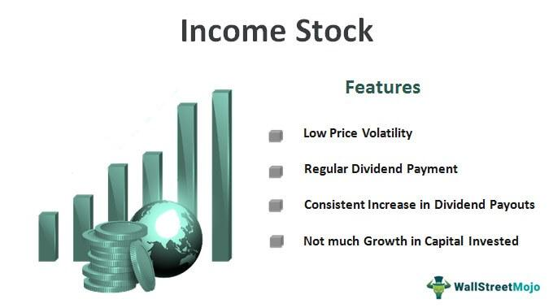

## Table of Contents

## What is an income stock?

An income stock is a type of stock that pays out regular dividends to its shareholders. Dividends are payments made by a company to its investors, usually from the company's profits. People often buy income stocks because they want to receive a steady stream of income without selling their shares. These stocks are popular among people who are retired or looking for a reliable source of money.

Income stocks are usually found in companies that are well-established and have a stable business. These companies might not grow very quickly, but they make consistent profits year after year. Because of this, they can afford to pay out dividends regularly. Examples of companies that might offer income stocks include utility companies, real estate investment trusts (REITs), and large consumer goods companies. When choosing income stocks, investors look for companies with a history of paying steady or increasing dividends over time.

## How do income stocks differ from growth stocks?

Income stocks and growth stocks are two different types of investments that people choose based on what they want from their investments. Income stocks are about getting regular money from the company through dividends. These are payments that companies make to their shareholders, usually from their profits. People who buy income stocks often want a steady income without selling their shares. These stocks are usually from companies that are stable and don't change much, like utility companies or big consumer goods companies. They might not grow quickly, but they make reliable profits and can pay dividends regularly.

Growth stocks, on the other hand, are about the company growing bigger and the value of the stock going up. People who buy growth stocks are hoping that the company will become more valuable over time, so they can sell their shares for more money later. These companies usually reinvest their profits back into the business to help it grow, instead of paying dividends. Growth stocks are often found in newer or smaller companies in industries like technology or biotech, where there's a lot of potential for fast growth. But, they can also be riskier because their future is less certain.

## What are the key characteristics of income stocks?

Income stocks are stocks from companies that pay regular dividends to their shareholders. These dividends are like a share of the company's profits that they give to people who own their stock. People like to buy income stocks because they want to get money regularly without selling their shares. These stocks are good for people who need a steady income, like retirees. The companies that offer income stocks are usually big and stable. They don't grow very fast, but they make steady profits every year. This means they can keep paying dividends to their shareholders.

The key thing about income stocks is that they focus on giving money back to investors through dividends, not on growing the company's value quickly. These companies might be in industries like utilities, real estate, or consumer goods, where things don't change much. When choosing income stocks, people look for companies that have a good track record of paying steady or increasing dividends over time. This shows that the company is reliable and can keep paying out money to its shareholders.

## Why might an investor choose to invest in income stocks?

An investor might choose to invest in income stocks because they want to get regular money from their investments without selling their shares. This is like getting a paycheck from the company they invest in. People who need a steady income, like retirees, find income stocks very helpful. These stocks come from big and stable companies that make reliable profits every year. Because these companies are doing well and making money, they can afford to pay dividends to their shareholders regularly.

Income stocks are different from growth stocks because they focus on giving money back to investors through dividends instead of trying to grow the company's value quickly. The companies that pay these dividends are often in industries that don't change much, like utilities or consumer goods. Investors who pick income stocks look for companies with a good history of paying steady or increasing dividends. This shows that the company is reliable and will likely keep paying out money to its shareholders in the future.

## What are some common sectors where income stocks are found?

Income stocks are often found in sectors where companies are big and stable. These companies make steady profits every year, so they can pay dividends to their shareholders regularly. Some common sectors for income stocks include utilities, like electricity and water companies. These companies provide essential services that people need no matter what, so they have reliable income. Another common sector is real estate investment trusts (REITs). REITs own and manage properties like apartments, malls, and offices, and they have to pay out most of their income as dividends to shareholders.

Consumer goods companies are also a good place to find income stocks. These companies make things like food, drinks, and household items that people buy all the time. Because these products are always in demand, the companies can make consistent profits and pay dividends. Lastly, some big telecom companies are known for paying dividends. They provide services like phone and internet, which are essential for many people, so they have a steady income stream to share with investors.

## How can one identify a good income stock?

To identify a good income stock, you should look at the company's history of paying dividends. A good income stock comes from a company that has been paying steady or increasing dividends for a long time. This shows that the company is stable and can keep giving money to its shareholders. You can check how long the company has been paying dividends and if the amount has gone up over the years. A company that has raised its dividends regularly is a good sign because it means they are doing well and making more money.

Another thing to look at is the company's payout ratio. This is the percentage of the company's profits that they pay out as dividends. A payout ratio that is too high might mean the company is giving away too much money and might not be able to keep it up. A good payout ratio is usually between 50% and 80%. Also, consider the company's business. Good income stocks often come from sectors like utilities, real estate investment trusts (REITs), and consumer goods, where the companies are big and stable. By looking at these things, you can find income stocks that will give you regular money without too much risk.

## What are the risks associated with investing in income stocks?

Investing in income stocks can be a good way to get regular money, but there are some risks to think about. One big risk is that the company might cut or stop paying dividends. This can happen if the company starts making less money or if they need to use their profits for something else, like fixing problems or growing the business. If a company cuts its dividends, the stock price might go down too, which means you could lose money.

Another risk is that income stocks might not grow in value as much as other types of stocks. These stocks are usually from big and stable companies that don't change much. While this can be good for getting regular dividends, it means you might not make as much money if you want to sell the stock later. Also, if interest rates go up, income stocks can become less attractive because people might choose to put their money in safer investments like bonds that now offer better returns. So, it's important to think about these risks before deciding to invest in income stocks.

## How does dividend yield impact the attractiveness of an income stock?

Dividend yield is a big reason why people might find an income stock attractive. It's a number that shows how much money you get back from your investment every year as a percentage of the stock's price. If a stock has a high dividend yield, it means you get more money back for every dollar you put into it. This is good for people who want to get a steady income from their investments without selling their shares. So, a high dividend yield can make an income stock look very appealing.

But, it's important to look at the whole picture. A very high dividend yield might sound great, but it could also mean that the company is having problems. Sometimes, the stock price goes down because people think the company might cut its dividends soon. If the company does cut its dividends, you might end up getting less money than you expected. So, while a high dividend yield can make an income stock attractive, you should also check if the company is stable and can keep paying those dividends over time.

## Can you explain the concept of dividend reinvestment with income stocks?

Dividend reinvestment is when you take the money you get from dividends and use it to buy more shares of the same stock instead of taking the cash. This is a good way to grow your investment over time. When you reinvest your dividends, you get more shares without spending more money. Over time, these extra shares can also pay dividends, and you can use those dividends to buy even more shares. This can help your investment grow bigger and bigger, like a snowball rolling down a hill.

For example, if you own income stocks that pay dividends every three months, you could choose to reinvest those dividends. Let's say you get $100 in dividends and the stock price is $50 per share. Instead of taking the $100, you could use it to buy 2 more shares. Now, you have more shares, so the next time dividends are paid, you'll get more money. If you keep doing this, your number of shares and the amount of dividends you get can keep growing. This is a smart way to make your investment bigger without putting in more of your own money.

## What are some advanced strategies for managing a portfolio of income stocks?

One advanced strategy for managing a portfolio of income stocks is to diversify across different sectors. This means you should not put all your money into one type of company, like only utilities or only real estate investment trusts (REITs). By spreading your money across different sectors, you can lower the risk that one bad thing happening in one industry will hurt your whole portfolio. For example, if you have stocks in utilities, consumer goods, and telecom, a problem in one sector might not affect the others as much. This way, you can still get a steady income from your dividends even if one part of your portfolio is not doing well.

Another strategy is to use a dividend reinvestment plan (DRIP) and also look at the company's payout ratio. A DRIP lets you use your dividends to buy more shares of the same stock, which can help your investment grow over time. But you should also check the payout ratio, which is how much of the company's profits they pay out as dividends. A payout ratio that is too high might mean the company can't keep paying those dividends in the future. So, you want to find companies with a good balance - a payout ratio that is not too high but still gives you a nice dividend. By using these strategies, you can make your income stock portfolio stronger and more likely to keep giving you money over the long term.

## How do tax considerations affect income stock investments?

Tax considerations can have a big impact on income stock investments. When you get dividends from income stocks, you have to pay taxes on that money. The tax rate you pay depends on whether the dividends are qualified or non-qualified. Qualified dividends are taxed at a lower rate, like the capital gains tax rate, which can be 0%, 15%, or 20% depending on your income. Non-qualified dividends are taxed at your regular income tax rate, which can be much higher. So, it's important to know what kind of dividends you are getting because it can affect how much money you keep after taxes.

Another thing to think about is where you hold your income stocks. If you have them in a tax-deferred account like an IRA or a 401(k), you don't have to pay taxes on the dividends right away. This can be a good way to let your investments grow without losing money to taxes each year. But if you have your income stocks in a regular brokerage account, you'll have to pay taxes on the dividends every year. So, thinking about where to put your income stocks can help you keep more of your money and make your investments work better for you in the long run.

## What role do income stocks play in a diversified investment portfolio?

Income stocks are a key part of a diversified investment portfolio because they help you get regular money from your investments. When you own income stocks, you get dividends, which are like a share of the company's profits. This can be really helpful if you need a steady income, like if you're retired. By having income stocks in your portfolio, you can balance out riskier investments like growth stocks. While growth stocks might go up and down a lot, income stocks usually come from big and stable companies that don't change much. This can make your overall portfolio more stable and give you peace of mind.

Another important role of income stocks in a diversified portfolio is to help you reinvest and grow your money over time. You can use the dividends you get to buy more shares of the same stock or other investments. This is called dividend reinvestment, and it can help your investment grow bigger without you putting in more of your own money. By having a mix of income stocks and other types of investments, you spread out your risk and can still get a good return. This way, you can have a balanced portfolio that gives you both regular income and the chance for your money to grow.

## What are the benefits and strategies of dividend investing?

Dividend investing is a strategy that enables investors to secure a reliable source of passive income, with potential capital appreciation as an additional benefit. A dividend is a payment made by a corporation to its shareholders, usually in the form of cash or additional stock, representing a portion of its earnings. Companies that consistently issue dividends often have stable earnings and robust financial health, making such stocks attractive options for investors seeking regular income.

A significant advantage of dividend investing is its capacity to enhance investment returns through the concept of compounding. By reinvesting dividends back into purchasing more shares, investors can increase their ownership stake in the company, leading to greater future income as dividends accrue on an expanding number of shares. Over time, this compounding effect can significantly enhance total returns.

Successful dividend investing strategies prioritize companies with a robust history of increasing dividend payouts. A commitment to regularly raising dividends is indicative of a company's strong financial position and its management's confidence in sustained profitability. Examples of such companies often include blue-chip stocks, which are large, stable companies recognized for their reliability and performance.

Diversification across industries is another critical strategy in dividend investing. This approach mitigates sector-specific risks, ensuring that setbacks in one sector do not disproportionately impact the overall portfolio. For instance, combining stocks from traditionally high-dividend industries like utilities with those from technology firms, which may offer growth prospects, can balance risk and reward.

During periods of market volatility, dividend stocks can provide a buffer as companies strive to maintain dividend payments. Even in turbulent times, firms with established dividend policies often continue their payouts, offering a degree of stability when market prices fluctuate.

Investors also seek stocks with a low payout ratio, which is the proportion of earnings paid out as dividends. A lower payout ratio suggests that a company retains a significant portion of its earnings, providing a cushion for maintaining or growing dividends even if earnings temporarily decline. The formula for the payout ratio is:

$$
\text{Payout Ratio} = \left( \frac{\text{Dividends per Share}}{\text{Earnings per Share}} \right) \times 100
$$

This ensures that the company is not overextending itself, leaving sufficient capital for future growth and investment.

In summary, dividend investing leverages a company's periodic payments to shareholders as a foundation for generating passive income and appreciating investment value. Focusing on companies with a track record of increasing dividends and diversifying across various sectors enhances stability and potential returns. Attention to payout ratios further ensures the sustainability of the income stream, helping investors achieve their financial goals while mitigating risks associated with market volatility.

## References & Further Reading

[1]: Graham, B. (2003). ["The Intelligent Investor: The Definitive Book on Value Investing."](https://www.amazon.com/Intelligent-Investor-Definitive-Investing-Essentials/dp/0060555661) Harper Business.

[2]: Cogneau, P., & Hubner, G. (2009). ["The 101 Ways to Measure Portfolio Performance."](https://www.researchgate.net/publication/228267339_The_101_Ways_to_Measure_Portfolio_Performance) The Journal of Performance Measurement.

[3]: Raschke, L. B. (1999). ["Professional Trading Strategies."](https://lindaraschke.net/wp-content/uploads/EBook_Updated.pdf) LBRGroup, Inc.

[4]: Narang, R. K. (2009). ["Inside the Black Box: A Simple Guide to Quantitative and High Frequency Trading"](https://onlinelibrary.wiley.com/doi/book/10.1002/9781118267738). Wiley Finance.

[5]: Jagerson, J., & Hansen, S. (2011). ["All About Investing in Gold"](https://www.mhebooklibrary.com/doi/book/10.1036/9780071768351). McGraw-Hill Education.