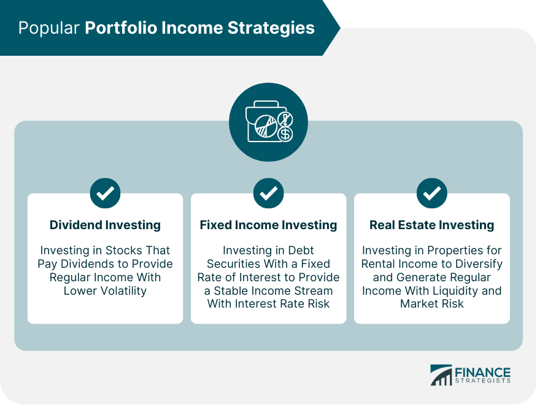

## Table of Contents

## What are the basic concepts of a portfolio and how can it generate regular income?

A portfolio is like a collection of different investments that someone owns. These investments can be things like stocks, bonds, real estate, or even cash. The idea is to spread out the money across different types of investments to lower the risk. If one investment does poorly, the others might do well and balance it out. A well-managed portfolio aims to grow in value over time and can be adjusted based on the owner's goals and how much risk they are willing to take.

To generate regular income from a portfolio, you can focus on investments that pay out money regularly. For example, dividend-paying stocks give you a part of the company's profits on a regular schedule, usually every three months. Bonds also pay interest regularly, which can be monthly, quarterly, or yearly. You can also invest in real estate and rent it out to get a steady stream of rental income. By choosing the right mix of these income-generating investments, you can create a portfolio that provides you with regular income while still growing in value over time.

## What are the different types of income-generating assets suitable for beginners?

For beginners, one of the simplest income-generating assets to consider is dividend stocks. These are shares in companies that pay out a portion of their profits to shareholders regularly, usually every quarter. You can buy these stocks through a brokerage account, and the dividends can provide a steady income stream. It's important to choose companies that have a history of paying consistent dividends, as this can help ensure a more reliable income.

Another option for beginners is bonds. Bonds are like loans you give to a government or company, and in return, they pay you interest over time. Government bonds, like U.S. Treasury bonds, are considered very safe and pay interest usually every six months. Corporate bonds can offer higher interest rates but come with more risk. By holding a mix of bonds, you can get regular interest payments, which can be a good source of income.

Real estate investment trusts (REITs) are also a good choice for beginners looking to generate income. REITs are companies that own or finance income-generating real estate. They are required by law to pay out at least 90% of their taxable income as dividends to shareholders, which can provide a steady income. You can buy shares in a REIT just like you would buy stocks, making it an easy way to get into real estate without having to buy property directly.

## How can dividend stocks be used to create a steady income stream?

Dividend stocks can help you create a steady income stream by giving you a part of the company's profits regularly. When you buy shares in a company that pays dividends, you get a payment usually every three months. If you pick companies that have a good track record of paying dividends, you can count on getting this money regularly. This can help you plan your finances because you know when the money will come in.

To make this income stream even steadier, you can spread your money across different companies and industries. This way, if one company has a bad year and cuts its dividend, the others might still pay you. Over time, as companies grow, they might also increase their dividends, which means your income can grow too. By choosing a mix of reliable dividend stocks, you can build a portfolio that gives you a steady and growing income over time.

## What are bond ladders and how do they help in managing regular income?

Bond ladders are a way to manage your investments in bonds to get regular income. You buy bonds that mature at different times, like steps on a ladder. For example, you might buy bonds that mature in one year, two years, three years, and so on. When each bond matures, you get your money back and can buy a new bond to keep the ladder going. This way, you get money coming in regularly, instead of all at once.

Using a bond ladder helps you manage your income because it spreads out when you get paid. If all your bonds matured at the same time, you might get a big chunk of money all at once, but then nothing until you buy new bonds. With a ladder, you get smaller payments more often, which can help you plan your finances better. It also helps you manage risk because you can reinvest at different interest rates over time, instead of betting everything on one rate.

## How can real estate investment trusts (REITs) contribute to a regular income portfolio?

Real estate investment trusts (REITs) can be a great way to get regular income without having to buy and manage actual property. REITs are companies that own or finance income-generating real estate, like apartments, malls, or office buildings. By law, they have to pay out at least 90% of their taxable income as dividends to shareholders. This means if you buy shares in a REIT, you can get regular dividend payments, usually every quarter. It's like getting rent money without having to be a landlord.

Adding REITs to your portfolio can help you get a steady income stream. Since they have to pay out most of their income, you can count on getting those dividends regularly. Plus, REITs often invest in different types of properties in different areas, which can help spread out your risk. By [picking](/wiki/asset-class-picking) a few different REITs, you can build a part of your portfolio that gives you regular income, while also having the chance to grow in value over time.

## What role do mutual funds and ETFs play in generating regular portfolio earnings?

Mutual funds and ETFs can help you get regular income from your investments. Both of these are ways to invest in a bunch of different things at once, like stocks or bonds. Some mutual funds and ETFs focus on investments that pay out money regularly, like dividend stocks or bonds. When you invest in these funds, you get a share of the income they earn from those investments. This can give you a steady stream of money, usually every three or six months, depending on the fund.

Using mutual funds and ETFs can make it easier to get regular income because they do a lot of the work for you. Instead of picking individual stocks or bonds, you can buy into a fund that already has a mix of income-generating investments. This can help spread out your risk because if one investment does poorly, the others might do well. Plus, many funds are managed by professionals who keep an eye on things and make changes to keep the income coming. By including these funds in your portfolio, you can build a more reliable and diverse source of regular earnings.

## How can options strategies like covered calls enhance income from a portfolio?

Covered calls are an options strategy that can help you make more money from the stocks you already own. When you use this strategy, you sell the right for someone else to buy your stock at a set price for a certain time. In return, they pay you a fee, called a premium. This premium is extra income that you get on top of any dividends your stock might pay. It's like renting out your stock for a little while and getting paid for it. The key is that you still own the stock, so you keep getting any dividends it pays out.

This strategy can help make your portfolio give you more regular income. But there's a catch: if the stock price goes above the set price, the person who bought the option can take your stock. You still get to keep the premium, but you lose the stock. So, it's best to use this strategy with stocks you wouldn't mind selling at the set price. By carefully picking which stocks to use for covered calls, you can add a bit more steady income to your portfolio without taking on too much risk.

## What are the tax implications of different income strategies and how can they be optimized?

Different income strategies have different tax effects. When you get money from dividend stocks, you might have to pay taxes on those dividends. But the good news is that qualified dividends are usually taxed at a lower rate than regular income. Bonds give you interest, and that interest is taxed as regular income, which can be higher than the tax on dividends. If you use options like covered calls, the money you get from selling the option, called the premium, is usually taxed as regular income too. Real estate investment trusts (REITs) dividends are often taxed as regular income, but part of it might be considered a return of capital, which isn't taxed right away.

To make the most of your taxes, you can think about where you put your investments. For example, you can put bonds and REITs in tax-deferred accounts like an IRA, where you don't have to pay taxes on the income until you take the money out. This can help you keep more of your money now. For dividend stocks, you might want to hold them in a regular brokerage account to take advantage of the lower tax rate on qualified dividends. If you use options, think about the timing of when you sell them to manage your tax bill. By being smart about where and how you invest, you can lower your taxes and keep more of your income.

## How can annuities be integrated into a portfolio for guaranteed income?

Annuities can be a good way to get guaranteed income from your portfolio. An annuity is like a contract with an insurance company where you give them money, and they promise to pay you back over time. You can choose to get payments right away or start them later. This can be really helpful if you want to make sure you have a steady income, especially when you're retired. It's like having a paycheck that you can count on, no matter what's happening with the stock market or other investments.

When you add annuities to your portfolio, you can mix them with other investments like stocks, bonds, and real estate. This way, you get the best of both worlds: the guaranteed income from the annuity and the chance for your other investments to grow. It's important to pick the right kind of annuity for your needs. Some annuities give you payments for the rest of your life, while others pay out for a set number of years. By choosing wisely, you can build a portfolio that gives you both security and the chance to make more money over time.

## What advanced strategies involve using leverage to increase income from a portfolio?

Using leverage means borrowing money to invest more than you have. This can help you make more money from your portfolio, but it's also riskier. For example, you might take out a loan to buy more stocks or real estate. If your investments go up in value, you can make a lot more money because you're investing more. But if they go down, you still have to pay back the loan, which can be tough if you lose money on your investments. It's like using a magnifying glass: it can make things bigger, but it can also burn you if you're not careful.

One way to use leverage to increase income is through margin trading. This is when you borrow money from your broker to buy stocks. You can use the money you make from dividends and stock price increases to pay back the loan and keep the extra as income. Another way is to use leverage in real estate by taking out a mortgage to buy a property. You can then rent it out and use the rental income to pay the mortgage and keep the rest as profit. Both of these methods can help you earn more, but they also come with more risk because you have to pay back the borrowed money no matter what happens to your investments.

## How can one assess and manage the risks associated with various income-generating strategies?

Managing the risks of different income strategies starts with understanding what could go wrong. For example, with dividend stocks, the company might cut its dividend or the stock price might fall. With bonds, there's a chance the issuer might not pay you back, especially with riskier corporate bonds. Real estate investment trusts (REITs) can be affected by changes in the real estate market or interest rates. Options like covered calls come with the risk of losing your stock if the price goes up a lot. And using leverage to increase income can lead to big losses if your investments go down. To manage these risks, you need to spread your money across different types of investments. This way, if one goes bad, the others might still do well and help balance things out.

It's also important to keep an eye on your portfolio and make changes when needed. If a stock you own starts to look risky, you might want to sell it and buy something safer. With bonds, you can use a bond ladder to spread out when you get paid and reinvest at different interest rates. For REITs, you should check the health of the real estate market and the company's financials regularly. If you use options or leverage, make sure you only use a small part of your portfolio for these riskier strategies. By staying on top of things and adjusting your investments as needed, you can lower your risks and keep your income coming in steadily.

## What are the latest trends and innovations in income strategies for portfolio earnings?

One big trend in income strategies is using technology to make things easier and smarter. For example, robo-advisors are becoming popular because they use computer programs to pick and manage your investments for you. They can put your money into dividend stocks, bonds, or ETFs that give you regular income without you having to do much work. Another innovation is the rise of fractional shares, which let you buy small pieces of expensive stocks or ETFs. This means you can get income from high-quality investments even if you don't have a lot of money to start with. Technology is also making it easier to use options like covered calls through apps and online platforms, helping people add extra income to their portfolios in a more user-friendly way.

Another trend is the growing interest in sustainable and socially responsible investing. More and more people want their investments to not just make money, but also help the world. This includes investing in companies that pay dividends and focus on things like clean energy, fair labor practices, or reducing waste. These investments can provide regular income while also supporting causes you care about. Additionally, there's a move towards more flexible income strategies, like using dynamic asset allocation. This means changing your investments based on what's happening in the market to keep your income steady. By staying up to date with these trends and innovations, you can find new ways to make your portfolio work harder for you and keep your income flowing.

## What is Understanding Portfolio Earnings?

Portfolio earnings are a critical component of any investment strategy, representing the cumulative returns generated from a diverse array of financial assets. These assets typically include equities (stocks), fixed-income securities (bonds), exchange-traded funds (ETFs), real estate, and other investment vehicles. Understanding the dynamics of portfolio earnings is essential for investors aiming to achieve financial growth and meet specific income goals.

Diversification is a fundamental principle in enhancing portfolio earnings while managing risk. By spreading investments across various asset classes, sectors, and geographic regions, investors can minimize the impact of adverse performance in any single area. Diversification helps in smoothing returns and reducing the [volatility](/wiki/volatility-trading-strategies) associated with concentrated investments. For instance, if equities underperform due to market downturns, bonds in the portfolio may provide stability and consistent income through interest payments, thus balancing overall returns.

A practical example of portfolio diversification can be seen in the construction of a balanced portfolio. Such a portfolio might allocate assets as follows: 60% in stocks for growth, 30% in bonds for income and stability, and 10% in alternative investments like real estate or commodities. This diversification ensures that the portfolio is not overly exposed to the risks inherent in a single asset class.

Regular monitoring and adjustments of a portfolio are imperative to ensure it remains aligned with the investor's evolving financial goals and risk appetite. Market conditions and personal circumstances can change, necessitating rebalancing to maintain the desired asset allocation. Rebalancing involves adjusting the proportions of different assets in the portfolio back to predefined targets. For example, if significant appreciation in stock values leads to an overweight in equities, selling some stocks and reallocating the capital to bonds or cash may be warranted.

Mathematically, portfolio returns can be represented as a weighted average of the returns on individual assets, calculated as follows:

$$
R_p = \sum_{i=1}^{n} w_i R_i
$$

where $R_p$ is the portfolio return, $w_i$ is the weight of asset $i$ in the portfolio, and $R_i$ is the return of asset $i$. Adjusting the weights $w_i$ in response to market conditions and income needs is at the core of portfolio management.

In practice, modern portfolio management often employs technology and analytical tools to enhance decision-making processes. Software platforms provide data analytics, risk assessment, and historical performance tracking, enabling investors to make informed choices efficiently. Utilizing these tools for portfolio analysis helps in optimizing asset allocation and achieving target earnings while minimizing risks.

Investors must continuously evaluate their portfolios, considering not only current market trends but also future economic forecasts and personal financial objectives. Such proactive management of portfolio earnings ensures the investor is on track to meet his or her income goals, ultimately leading to sustained financial stability and growth.

## References & Further Reading

[1]: ["Advances in Financial Machine Learning"](https://www.amazon.com/Advances-Financial-Machine-Learning-Marcos/dp/1119482089) by Marcos Lopez de Prado

[2]: ["Evidence-Based Technical Analysis: Applying the Scientific Method and Statistical Inference to Trading Signals"](https://www.amazon.com/Evidence-Based-Technical-Analysis-Scientific-Statistical/dp/0470008741) by David Aronson

[3]: ["Machine Learning for Algorithmic Trading"](https://github.com/stefan-jansen/machine-learning-for-trading) by Stefan Jansen

[4]: ["Quantitative Trading: How to Build Your Own Algorithmic Trading Business"](https://www.amazon.com/Quantitative-Trading-Build-Algorithmic-Business/dp/1119800064) by Ernest P. Chan

[5]: Bergstra, J., Bardenet, R., Bengio, Y., & Kégl, B. (2011). ["Algorithms for Hyper-Parameter Optimization."](https://dl.acm.org/doi/10.5555/2986459.2986743) Advances in Neural Information Processing Systems 24.