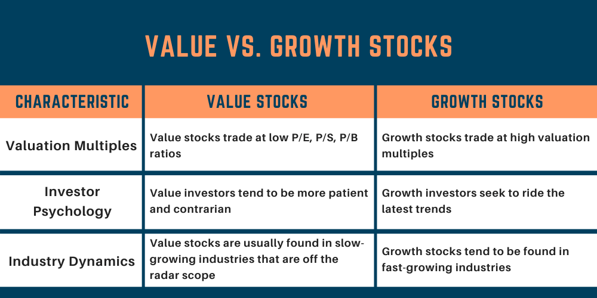

## Table of Contents

## What is a stock?

A stock is a piece of a company that you can buy. When you buy a stock, you become a part-owner of that company. The price of a stock can go up or down based on how well the company is doing and what people think about it. If the company does well, the stock price might go up, and you could make money. But if the company does poorly, the stock price might go down, and you could lose money.

People buy stocks to try to make money over time. They can make money in two main ways. First, if the stock price goes up, they can sell the stock for more than they paid for it. Second, some companies pay dividends, which are like little payments to the stockholders. Stocks can be a good way to grow your money, but they can also be risky because the prices can change a lot. It's important to learn about a company before you buy its stock.

## What are the different types of stocks based on income, value, and growth?

Stocks can be grouped into different types based on how they make money for investors. Income stocks are from companies that pay out regular dividends. These dividends are like little payments to the people who own the stock. People who want a steady income from their investments often like income stocks. They are usually from big, stable companies that don't grow a lot but give out money regularly.

Value stocks are from companies that people think are priced lower than they should be. Investors who buy value stocks believe that the stock price will go up once other people realize how good the company really is. These stocks might not pay big dividends, but they can grow a lot if the company does well. People who like to find good deals in the stock market often look for value stocks.

Growth stocks are from companies that are growing fast and are expected to keep growing. These companies usually don't pay dividends because they use their money to grow even more. Investors buy [growth stocks](/wiki/growth-stocks) hoping that the stock price will go up a lot as the company gets bigger. Growth stocks can be riskier because their prices can change a lot, but they can also make a lot of money if the company does well.

## How do income stocks generate returns for investors?

Income stocks generate returns for investors mainly through dividends. Dividends are payments that companies make to their shareholders out of their profits. When you own an income stock, you get a piece of the company's earnings regularly, usually every three months. This can be like getting a little paycheck from the company just for owning its stock. People who need a steady income, like retirees, often like income stocks because they can count on getting these payments.

The other way income stocks can generate returns is through stock price appreciation. Even though income stocks are known for their dividends, their stock prices can still go up over time. If the company does well and grows, more people might want to buy its stock, which can push the price up. If you decide to sell your stock when the price is higher than what you paid, you can make a profit. So, while the main attraction of income stocks is the regular dividend payments, you can also make money if the stock price goes up.

## What characteristics define a value stock?

Value stocks are stocks that people think are priced lower than they should be. They are like good deals in the stock market. Investors look for value stocks by checking if a company's stock price is low compared to how much money the company makes or how much it owns. They use things like the price-to-earnings ratio or the price-to-book ratio to find these stocks. If these numbers are low, it might mean the stock is a good value.

People who buy value stocks believe that the stock price will go up once other people see how good the company really is. These stocks might not pay big dividends, but they can grow a lot if the company does well. Value stocks can be from companies that are not doing great right now but have the potential to get better. So, value investors are looking for hidden gems in the market that others might have overlooked.

## What are the key indicators of a growth stock?

Growth stocks are from companies that are growing fast and are expected to keep growing. These companies usually don't pay dividends because they use their money to grow even more. Investors buy growth stocks hoping that the stock price will go up a lot as the company gets bigger. Growth stocks can be riskier because their prices can change a lot, but they can also make a lot of money if the company does well.

Key indicators of a growth stock include high earnings growth rates. This means the company is making more money each year. Another sign is a high price-to-earnings ratio, which shows that people are willing to pay a lot for the stock because they believe the company will grow a lot in the future. Growth stocks often come from new or innovative industries, like technology or biotech, where there's a lot of potential for the company to get bigger quickly.

## How can an investor identify income stocks?

To find income stocks, an investor should look for companies that pay regular dividends. Dividends are payments that companies give to their shareholders from their profits. These payments usually come every three months. You can find out if a company pays dividends by checking their financial reports or looking at stock market websites. Companies that pay dividends are often big and stable, like utility companies or big consumer goods companies. They might not grow a lot, but they give out money regularly, which is good for people who want a steady income.

Another way to spot income stocks is by looking at the dividend yield. The dividend yield is like a percentage that shows how much money you get from dividends compared to the price of the stock. A higher dividend yield means you get more money for each dollar you spend on the stock. But be careful, because a very high yield might mean the company is not doing well, and the stock price might go down. So, it's important to check if the company is healthy and can keep paying those dividends. By looking at these things, an investor can find good income stocks that will give them regular payments.

## What financial ratios are important for evaluating value stocks?

When you want to find value stocks, you need to look at some important financial ratios. One key ratio is the price-to-earnings ratio, or P/E ratio. This ratio tells you how much you pay for each dollar of the company's earnings. A low P/E ratio might mean the stock is a good deal because it's cheaper than other stocks. Another important ratio is the price-to-book ratio, or P/B ratio. This ratio compares the stock price to the value of the company's assets. If the P/B ratio is low, it could mean the stock is undervalued because you're paying less for the company's stuff than it's worth.

Another ratio to consider is the dividend yield. This tells you how much money you get back from dividends compared to the stock price. A higher yield can be good for value stocks, but make sure the company can keep paying those dividends. The last ratio is the debt-to-equity ratio. This shows how much the company owes compared to what it owns. A lower debt-to-equity ratio means the company is not too risky because it doesn't have a lot of debt. By looking at these ratios, you can find stocks that might be undervalued and could be a good investment.

## What metrics should be used to assess the potential of growth stocks?

When you want to check if a stock has good growth potential, you should look at the earnings growth rate. This tells you how fast the company is making more money each year. A high earnings growth rate is a good sign that the company is growing quickly. Another important metric is the price-to-earnings ratio, or P/E ratio. For growth stocks, this number is often high because people are willing to pay a lot for the stock, thinking the company will keep growing. But be careful, because a very high P/E ratio might mean the stock is too expensive and might not grow as much as people hope.

You should also look at the company's revenue growth. This shows how fast the company is selling more stuff or services. If revenue is growing fast, it's a good sign the company is doing well. Another thing to check is the return on equity, or ROE. This tells you how good the company is at making money from the money people have put into it. A high ROE means the company is using its money well to grow. By looking at these metrics, you can get a better idea of whether a stock has the potential to grow a lot in the future.

## How do income, value, and growth stocks perform during different economic cycles?

Income stocks usually do well when the economy is not growing fast or is shrinking. People like income stocks during these times because they give steady payments called dividends. These payments can help investors when other parts of the market are not doing well. Big, stable companies that pay dividends, like utility companies or big consumer goods companies, often do okay even when the economy is bad. But, if the economy gets really bad, even these companies might cut their dividends, which can hurt income stocks.

Value stocks can do well when the economy starts to get better after a bad time. When things start to improve, people start to see that some companies are worth more than their stock prices show. This can make value stocks go up in price. But, if the economy stays bad for a long time, value stocks might not do well because people might not want to take risks on companies that are not doing great right now. So, value stocks can be good when the economy is turning around, but they can be risky if the bad times last a long time.

Growth stocks usually do best when the economy is growing fast. During good times, people are more willing to pay a lot for stocks from companies that are growing quickly. These companies often don't pay dividends because they use their money to grow even more. But, when the economy slows down or gets bad, growth stocks can do poorly because people might not want to take big risks. So, growth stocks can make a lot of money when the economy is good, but they can lose a lot when things get tough.

## What are the risks associated with investing in each type of stock?

Income stocks can be a good choice for people who want steady payments, but they come with risks too. One big risk is that the company might cut or stop paying dividends if it runs into money problems. This can happen if the economy gets really bad or if the company doesn't make as much money as it used to. Another risk is that income stocks might not grow as fast as other types of stocks. If the stock price doesn't go up much, you might not make as much money as you could with other investments. So, while income stocks can give you regular payments, they can also lose value if the company struggles.

Value stocks can be risky because they are often from companies that are not doing great right now. If the company doesn't get better, the stock price might stay low or even go down. It can take a long time for people to see that the company is worth more than its stock price, and sometimes that never happens. Another risk is that value stocks might be cheap for a reason, like the company has a lot of debt or other problems. If you don't do your homework, you might end up buying a stock that never goes up in price. So, value stocks can be a good deal, but they can also be a bad investment if the company doesn't improve.

Growth stocks can be very exciting because they can make a lot of money if the company grows fast. But they are also very risky. One big risk is that the stock price can go up and down a lot. If people stop believing the company will grow as fast as they thought, the stock price can drop quickly. Another risk is that growth stocks often don't pay dividends, so you only make money if the stock price goes up. If the company doesn't grow as fast as expected, or if the economy gets bad, growth stocks can lose a lot of value. So, while growth stocks can make you a lot of money, they can also lose a lot if things don't go well.

## How can a diversified portfolio include income, value, and growth stocks?

A diversified portfolio can include income, value, and growth stocks by mixing them in a way that balances risk and reward. You might start by [picking](/wiki/asset-class-picking) some income stocks from big, stable companies that pay regular dividends. These can give you steady payments and help your portfolio stay strong even when the economy is not doing well. Then, you can add some value stocks from companies that you think are priced too low. These can help your portfolio grow if the companies do better than people expect. Finally, you can include some growth stocks from companies that are growing fast. These can make your portfolio grow a lot if the companies keep doing well.

The key to a good diversified portfolio is to spread your money across different types of stocks. This way, if one type of stock does badly, the others might do well and help balance things out. For example, if the economy slows down, your income stocks might still give you dividends, while your growth stocks might go down in price. But if the economy starts to get better, your value stocks might start to go up, and your growth stocks might do even better. By having a mix of income, value, and growth stocks, you can make your portfolio stronger and more likely to do well over time.

## What advanced strategies can be used to optimize returns from income, value, and growth stocks?

To optimize returns from income stocks, you can use a strategy called dividend reinvestment. This means taking the money you get from dividends and using it to buy more shares of the same stock. Over time, this can help your investment grow faster because you're getting more shares without spending more money. Another strategy is to look for companies that have a history of increasing their dividends. These are called dividend growth stocks. If you find a company that keeps raising its dividends, you can get more money each year, which can help your returns grow even more. But remember, always check if the company can keep paying those dividends, because if they cut them, it can hurt your returns.

For value stocks, one advanced strategy is to use a technique called value averaging. This means you decide how much you want your investment to grow each month, and then you buy more shares if the stock price is low or fewer shares if the price is high. This can help you buy more shares when they're cheap and fewer when they're expensive, which can boost your returns over time. Another strategy is to look for companies that are going through a turnaround. These are companies that are not doing well now but have plans to get better. If you can find a good turnaround story, you might be able to buy the stock at a low price and then sell it for a lot more once the company improves.

When it comes to growth stocks, one strategy is to use dollar-cost averaging. This means you invest a fixed amount of money at regular times, no matter what the stock price is. This can help you buy more shares when the price is low and fewer when it's high, which can smooth out the ups and downs of the stock price. Another strategy is to focus on sectors that are expected to grow a lot in the future, like technology or healthcare. By picking growth stocks in these sectors, you can increase your chances of finding companies that will grow fast and make your returns bigger. But remember, growth stocks can be risky, so it's important to do your homework and not put all your money in one place.

## References & Further Reading

[1]: Graham, B. & Dodd, D. (1934). ["Security Analysis"](https://books.google.com/books/about/Security_Analysis_The_Classic_1934_Editi.html?id=wXlrnZ1uqK0C). McGraw Hill.

[2]: Damodaran, A. (2012). ["Investment Valuation: Tools and Techniques for Determining the Value of Any Asset"](https://books.google.com/books/about/Investment_Valuation.html?id=5SRHAAAAQBAJ). John Wiley & Sons.

[3]: Chan, E. P. (2009). ["Quantitative Trading: How to Build Your Own Algorithmic Trading Business"](https://github.com/ftvision/quant_trading_echan_book). Wiley Trading.

[4]: Lopez de Prado, M. (2018). ["Advances in Financial Machine Learning"](https://www.amazon.com/Advances-Financial-Machine-Learning-Marcos/dp/1119482089). Wiley.

[5]: Jansen, S. (2018). ["Machine Learning for Algorithmic Trading: Predictive Models to Extract Signals from Market and Alternative Data for Systematic Trading Strategies with Python"](https://www.amazon.com/Machine-Learning-Algorithmic-Trading-alternative/dp/1839217715). Packt Publishing.

[6]: Pettengill, G. N., Sundaram, S. & Mathur, I. (1995). ["The Conditional Relation between Beta and Returns"](https://www.jstor.org/stable/2331255). Journal of Financial and Quantitative Analysis, 30(1), 101-116.