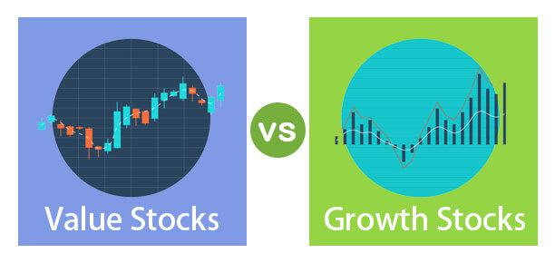

In the world of investment, understanding different types of stocks is crucial to building a diverse portfolio. A well-structured investment strategy often includes a balanced mix of income stocks, growth stocks, and value stocks. Each category offers distinct benefits and risks, appealing to different investor objectives. 

Income stocks are typically sought by those who prioritize steady returns via dividend payments over capital gains. In contrast, growth stocks attract investors looking for companies with significant expansion potential, often foregoing current dividends in pursuit of future stock price appreciation. Value stocks pique the interest of investors who aim to acquire shares at prices deemed lower than their intrinsic worth, hoping for a price correction in the market. 



Algorithmic trading has revolutionized trading strategies, offering automated and swift decision-making processes. This innovation allows rapid execution of trades, which is vital in today's fast-paced financial markets. By leveraging algorithmic models, investors can optimize their portfolios, integrating a blend of income, growth, and value stocks to meet their investment goals. This article will explore these stock categories and the transformative impact of algorithmic trading in contemporary investing.

## Table of Contents

## Defining Income Stocks

Income stocks are characterized by their ability to provide consistent dividend payments to shareholders. Unlike stocks that focus primarily on capital appreciation, income stocks offer a dependable income stream, which is appealing to investors who prioritize regular returns over long-term growth. These stocks are generally issued by well-established companies with stable and predictable earnings, allowing them to distribute a portion of their profits as dividends.

Typically, income stocks belong to mature companies operating in industries with little fluctuation, such as utilities, real estate, and telecommunications. These industries have stable demand and predictable revenue streams, which contribute to the reliability of dividend payments. For instance, utility companies are a prime example of income stock providers due to their essential services and regulated pricing structures, which ensure steady earnings. Preferred stocks also fall under the category of income stocks because they offer fixed dividend payments and have priority over common stocks in the event of liquidation.

Investors who favor income stocks are often those seeking to supplement their income, such as retirees or individuals nearing retirement. The dividends generated by these stocks can be reinvested to purchase additional shares, compounding the investment over time, or they can be used as a source of immediate income. The primary attraction of income stocks lies in their lower risk profile compared to growth stocks, as their value is buffered by the regular dividend payments.

While the growth potential of income stocks may be limited compared to [growth stocks](/wiki/growth-stocks), they serve as a stabilizing [factor](/wiki/factor-investing) within a diversified investment portfolio. Their consistent returns can balance the [volatility](/wiki/volatility-trading-strategies) associated with other types of investments, offering a cushion during economic downturns. As such, income stocks play a crucial role in investment strategies that emphasize income generation and financial stability.

## Exploring Growth Stocks

Growth stocks are shares in companies anticipated to expand at a rate that exceeds the average pace of their respective industries. This category of stocks is particularly appealing to investors looking for the opportunity to realize significant stock price appreciation over time. These companies primarily focus on reinvesting their profits into the business operations to support additional growth and development. Consequently, they often forego paying dividends, as their priority is expanding their market reach, innovating new products, or enhancing operational capacities.

A notable feature of growth stocks is their strong association with sectors such as technology and biotechnology. These industries are typically characterized by rapid innovation, which can drive substantial revenue increases and, consequently, stock price growth. For instance, technology firms may invest heavily in research and development to pioneer groundbreaking software solutions or hardware devices that capture new market segments. Similarly, biotech companies invest in clinical trials and the development of next-generation medical therapies, both of which can result in exponential business growth if successful.

Investors are drawn to growth stocks for their potential to achieve significant gains in stock value, as these companies often disrupt traditional markets or create entirely new ones. There is a risk element tied to growth investing, however, as high growth prospects may already be priced into the stock, and unforeseen developments can negatively impact projected growth. Despite these risks, growth stocks remain an integral component of investment portfolios focused on long-term capital appreciation.

Mathematically, expected growth can be assessed through different models, such as the Gordon Growth Model, which, despite traditionally being used for dividend-paying stocks, can provide insights when adapted for growth stocks by estimating potential price appreciation. Investors typically evaluate the Price-to-Earnings (P/E) ratio to gauge if a growth stock is overvalued or undervalued compared to its growth prospects.

Python can be useful in analyzing growth stocks by automating financial data collection and performing statistical analyses to forecast growth potential. For instance, by using libraries such as pandas and numpy, investors can handle large datasets efficiently and derive meaningful insights about growth trends:
```python
import pandas as pd
import numpy as np

# Create a simple dataframe to simulate growth stock data
data = {'Year': [2020, 2021, 2022, 2023],
        'Revenue': [100, 150, 225, 337.5]}  # Hypothetical growth data
df = pd.DataFrame(data)

# Calculate the annual growth rate
df['Growth Rate'] = df['Revenue'].pct_change() * 100

# Calculate the mean growth rate
mean_growth_rate = np.mean(df['Growth Rate'].dropna())
print(f"Average Growth Rate: {mean_growth_rate}%")
```

This script will help determine past growth rates and project future revenue growth, aiding investors in making more informed decisions about potential growth stock investments.

## Understanding Value Stocks

Value stocks are typically characterized as shares in companies that, when evaluated on current market prices against fundamental indicators, appear undervalued. These fundamental indicators might include factors like the company's earnings, dividends, cash flow, or book value. A key financial metric often used to identify value stocks is the price-to-earnings (P/E) ratio, which compares a company's share price to its earnings per share (EPS). A low P/E ratio suggests that the stock might be undervalued relative to others in the same industry or the broader market.

These stocks tend to belong to companies with solid fundamentals that, for various reasons, have lost favor among investors. This disfavor can stem from market overreactions to negative news, broader economic factors adversely affecting the industry, or temporary setbacks in the company's operation. Despite these challenges, the underlying financials of value stocks generally remain strong, thereby presenting a potential opportunity for investors.

Investors often seek out value stocks as these securities have the potential to provide substantial long-term benefits. The primary strategy is based on the assumption that the broader market will eventually adjust to realize the stock's true value, leading to price appreciation. Value investors typically exhibit patience, waiting for the market to correct itself and recognize the intrinsic value they see in these stocks.

However, there is a notable risk associated with investing in value stocks. The market might not ever correctly identify or appreciate the stock's intrinsic value, leaving the stock perpetually undervalued. This risk underscores the importance of thorough research and due diligence in selecting potential value stocks. Moreover, changes in the company's industry or broad market conditions could lead to sustained undervaluation.

To illustrate, consider the Python snippet below, which calculates the P/E ratio for a company:

```python
# Example calculation of Price-to-Earnings (P/E) Ratio

def calculate_pe_ratio(stock_price, earnings_per_share):
    if earnings_per_share == 0:
        return "EPS cannot be zero."
    pe_ratio = stock_price / earnings_per_share
    return pe_ratio

# Example usage
stock_price = 120  # Assume $120 per share
earnings_per_share = 8  # Assume $8 EPS

pe_ratio = calculate_pe_ratio(stock_price, earnings_per_share)
print(f"The P/E Ratio is: {pe_ratio}")
```

In this example, a lower P/E ratio in comparison to industry standards may indicate a value stock. While investing in such stocks, it's crucial for investors to analyze multiple financial metrics and remain aware of the market dynamics that might affect the company's valuation. 

## The Role of Algorithmic Trading

Algorithmic trading employs sophisticated algorithms to automatically execute trades based on pre-set criteria. These algorithms can analyze multiple market conditions simultaneously, enabling swift decision-making and execution in today's rapid market environment. The speed and precision offered by [algorithmic trading](/wiki/algorithmic-trading) are unmatched, allowing for trades to be executed at optimal prices, which is critical when market conditions change rapidly.

This technology is not restricted to any particular type of stock, making it versatile for trading income, growth, and value stocks alike. By automating the trading process, algorithmic trading enhances efficiency, potentially reducing transaction costs and slippage — the difference between the expected price of a trade and the actual price at which the trade is executed.

Additionally, algorithmic trading supports complex strategies that can enhance profitability. For instance, algorithms can be designed to perform multi-leg strategies across different stock categories or financial instruments, capitalizing on [arbitrage](/wiki/arbitrage) opportunities or market inefficiencies. This capability extends to implementing strategies like mean reversion, [market making](/wiki/market-making), and [statistical arbitrage](/wiki/statistical-arbitrage), which require real-time data analysis and rapid trade execution.

An example of a simple algorithmic trading strategy could involve the moving average crossover strategy, where buy and sell signals are generated by the crossover of short-term moving averages over long-term moving averages. A basic Python implementation might look like this:

```python
import pandas as pd

def moving_average_strategy(data, short_window, long_window):
    signals = pd.DataFrame(index=data.index)
    signals['price'] = data['Close']
    signals['short_mavg'] = data['Close'].rolling(window=short_window, min_periods=1).mean()
    signals['long_mavg'] = data['Close'].rolling(window=long_window, min_periods=1).mean()

    signals['signal'] = 0.0
    signals['signal'][short_window:] = np.where(signals['short_mavg'][short_window:] > signals['long_mavg'][short_window:], 1.0, 0.0)
    signals['positions'] = signals['signal'].diff()

    return signals

# Example usage
# data = pd.DataFrame with a 'Close' column
# moving_average_strategy(data, short_window=40, long_window=100)
```

This code calculates short-term and long-term moving averages and generates buy or sell signals when these averages cross, demonstrating the streamlined decision-making process that algorithms enable. By using similar automated strategies, traders can consistently monitor multiple markets and stocks, making algorithmic trading an indispensable tool in modern finance.

## Strategies for Investing in Stocks

When developing strategies for investing in stocks, investors must first clearly define their investment goals. These goals may range from seeking regular income through dividends to prioritizing capital appreciation or finding undervalued stocks with the potential for a price rebound. The alignment of investment strategies with personal financial objectives is crucial for portfolio success.

A well-constructed portfolio often combines various stock types, such as income, growth, and value stocks, diversifying to mitigate risk and enhance potential returns. Each stock category provides unique benefits; income stocks offer steady dividends, growth stocks present opportunities for significant price increases, and value stocks promise potential gains as their market prices align with intrinsic values.

Algorithmic trading has emerged as a powerful tool in modern investment strategies. By utilizing automated, pre-programmed trading strategies, investors can quickly capitalize on fleeting market opportunities with heightened efficiency. Algorithms can process vast volumes of data in real-time, enabling the timely execution of trades and enhancing market responsiveness.

Here is a basic Python example of how one might use a simple moving average strategy to inform trading decisions:

```python
import pandas as pd
import numpy as np

def simple_moving_average(df, window=30):
    return df['Close'].rolling(window=window).mean()

def trading_strategy(df):
    df['SMA'] = simple_moving_average(df)
    df['Signal'] = np.where(df['Close'] > df['SMA'], 'Buy', 'Sell')
    return df

# Assuming 'data' is a pandas DataFrame with a 'Close' column of stock prices
data_with_signals = trading_strategy(data)
print(data_with_signals[['Close', 'SMA', 'Signal']])
```

Whether employing algorithmic strategies or traditional methods, continuous education and thorough market research are indispensable. Investors should stay informed about evolving market conditions, technological advancements, and economic indicators that could impact stock performance. Regularly updating and reviewing investment strategies ensures that they remain aligned with the investor’s objectives and responsive to dynamic market landscapes.

Ultimately, the effectiveness of any stock investment strategy lies in its adaptability and the investor's commitment to refining their approach in response to market changes. Balancing analytical insights with pragmatic decision-making can significantly enhance the probability of achieving long-term investment success.

## Conclusion

Income, growth, and value stocks each present distinct investment opportunities and associated risks. Income stocks provide consistent dividends, making them appealing to investors seeking stable returns. In contrast, growth stocks attract those looking for significant capital appreciation, albeit often with higher volatility. Value stocks appeal to investors searching for undervalued firms with the potential for price corrections as market perceptions change.

Combining various stock types with algorithmic trading can produce a more dynamic and responsive investment strategy. Algorithmic trading facilitates the rapid processing of data and execution of trades based on pre-defined criteria, allowing investors to leverage short-lived market opportunities that may arise across the spectrum of stock categories. This approach can enhance the ability to manage risk, improve precision in trade execution, and potentially increase overall portfolio efficiency.

Remaining informed and adaptive to evolving market conditions is crucial for investors aiming to optimize their portfolios. As financial markets and technologies progress, continuous education ensures that investors are equipped to integrate new tools and adapt strategies accordingly. Understanding and contextualizing income, growth, and value stocks alongside modern trading methodologies like algorithmic trading provides a robust framework for achieving long-term investment success.

While each stock type offers varying benefits and risks, their convergence with modern trading approaches like algorithmic strategies ensures that investors can build comprehensive and sophisticated portfolios. In this rapidly changing financial landscape, an adaptive and informed investment strategy is essential for identifying and seizing emerging opportunities.

## References & Further Reading

[1]: Graham, B. & Dodd, D. (1934). ["Security Analysis"](https://books.google.com/books/about/Security_Analysis_The_Classic_1934_Editi.html?id=wXlrnZ1uqK0C). McGraw Hill.

[2]: Damodaran, A. (2012). ["Investment Valuation: Tools and Techniques for Determining the Value of Any Asset"](https://books.google.com/books/about/Investment_Valuation.html?id=5SRHAAAAQBAJ). John Wiley & Sons.

[3]: Chan, E. P. (2009). ["Quantitative Trading: How to Build Your Own Algorithmic Trading Business"](https://github.com/ftvision/quant_trading_echan_book). Wiley Trading.

[4]: Lopez de Prado, M. (2018). ["Advances in Financial Machine Learning"](https://www.amazon.com/Advances-Financial-Machine-Learning-Marcos/dp/1119482089). Wiley.

[5]: Jansen, S. (2018). ["Machine Learning for Algorithmic Trading: Predictive Models to Extract Signals from Market and Alternative Data for Systematic Trading Strategies with Python"](https://www.amazon.com/Machine-Learning-Algorithmic-Trading-alternative/dp/1839217715). Packt Publishing.

[6]: Pettengill, G. N., Sundaram, S. & Mathur, I. (1995). ["The Conditional Relation between Beta and Returns"](https://www.jstor.org/stable/2331255). Journal of Financial and Quantitative Analysis, 30(1), 101-116.