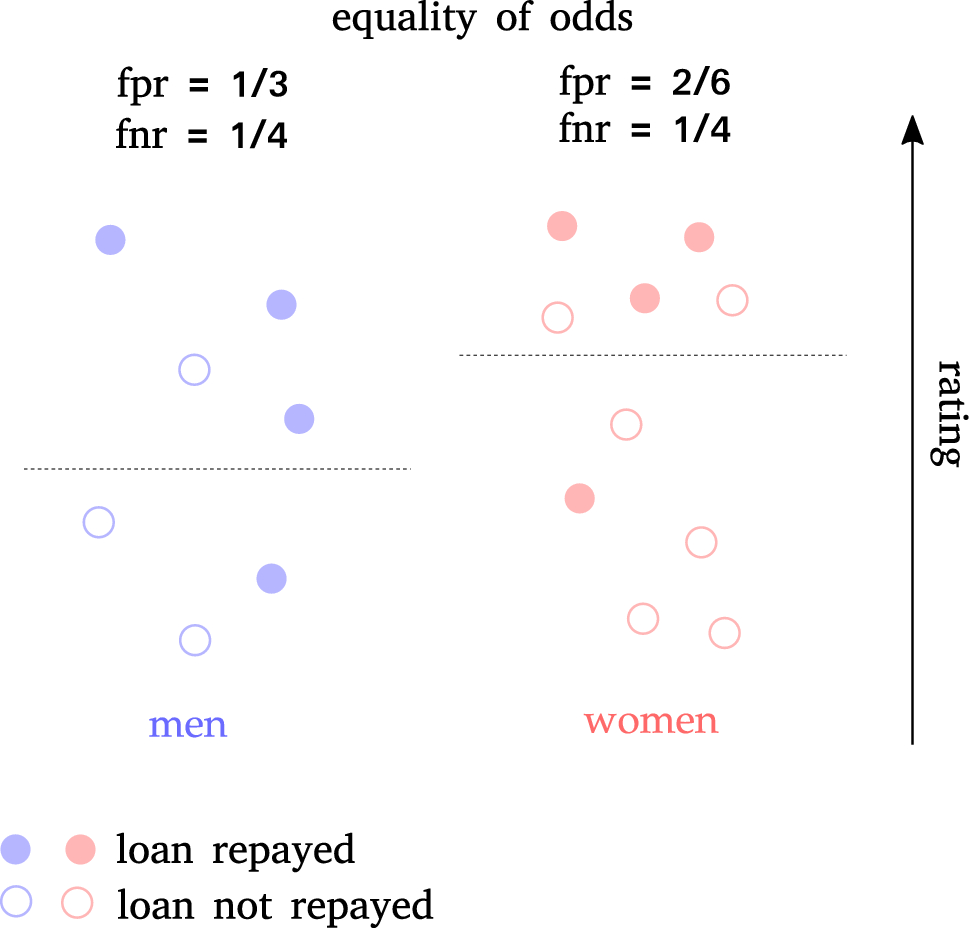

## Table of Contents

## What is fairness in machine learning?

Fairness in machine learning means making sure that the decisions or predictions made by a computer program are fair and do not unfairly affect certain groups of people. For example, if a machine learning model is used to decide who gets a loan, it should not unfairly reject people because of their race, gender, or other personal characteristics that should not matter. Fairness is important because machine learning models can sometimes learn and repeat the biases that exist in the data they are trained on, which can lead to unfair treatment of some groups.

To achieve fairness, people who work on machine learning try to use different methods and techniques. They might adjust the data used to train the model, change how the model makes decisions, or check the results to make sure they are fair. For example, they might use a method called "fairness-aware learning" where the model is trained to pay attention to fairness as well as accuracy. This helps to make sure that the model does not just focus on being correct but also on being fair to everyone.

## Why is fairness important in machine learning models?

Fairness is important in machine learning models because these models can affect people's lives in big ways. For example, a model might decide if someone gets a job, a loan, or medical treatment. If the model is not fair, it might treat some people unfairly just because of their race, gender, or other personal details that should not matter. This can lead to unfairness and inequality in society, which is not good for anyone.

To make sure machine learning models are fair, people who work on them use special methods. They might change the data the model learns from, or they might change how the model makes its decisions. For example, they might use something called "fairness-aware learning." This means the model is taught to think about fairness as well as being correct. By doing this, the model can help make sure everyone is treated fairly, no matter who they are.

## What are fairness metrics in machine learning?

Fairness metrics in [machine learning](/wiki/machine-learning) help us check if a model treats everyone fairly. These metrics measure how much a model's decisions might unfairly affect different groups of people. For example, a fairness metric can tell us if a model is more likely to approve loans for men than for women, even if they have the same qualifications. Common fairness metrics include demographic parity, equalized odds, and predictive parity. These metrics help us understand and fix any unfairness in the model's decisions.

Demographic parity means that the model's decisions are the same for different groups of people. For example, if a model is used to approve loans, demographic parity would mean the same percentage of loans are approved for men and women. Equalized odds is another metric that looks at how well the model predicts outcomes for different groups. It checks if the model is equally good at predicting true positives and true negatives for all groups. Predictive parity focuses on the positive predictions of the model and checks if the rate of true positives is the same across groups. By using these metrics, we can make sure our machine learning models are fair to everyone.

## Can you explain the concept of incompatibility in fairness metrics?

Incompatibility in fairness metrics means that different ways of measuring fairness can sometimes give opposite results. Imagine you have two fairness metrics, like demographic parity and equalized odds. Demographic parity says that the model's decisions should be the same for different groups of people. Equalized odds says that the model should be equally good at predicting true positives and true negatives for all groups. Sometimes, trying to make the model fair according to one metric can make it less fair according to another metric. This is a big problem because it means that we can't always make a model perfectly fair in every way.

For example, if we try to make a loan approval model fair according to demographic parity, we might approve the same percentage of loans for men and women. But this might make the model less accurate at predicting who will actually pay back the loan, which could lead to unfairness according to equalized odds. This shows us that fairness is not simple and that we need to carefully think about which fairness metrics are most important for our specific situation. By understanding the trade-offs between different fairness metrics, we can make better decisions about how to build and use machine learning models that are as fair as possible.

## What are some common fairness metrics used in machine learning?

Fairness metrics in machine learning are tools that help us check if a model treats everyone fairly. One common metric is demographic parity, which means that the model's decisions should be the same for different groups of people. For example, if a model is used to approve loans, demographic parity would mean the same percentage of loans are approved for men and women. Another important metric is equalized odds, which looks at how well the model predicts outcomes for different groups. It checks if the model is equally good at predicting true positives and true negatives for all groups. Predictive parity is another metric that focuses on the positive predictions of the model, checking if the rate of true positives is the same across groups.

These metrics can sometimes give us different results, which is why it's important to understand them well. For instance, trying to make a model fair according to demographic parity might mean approving the same percentage of loans for men and women. But this might make the model less accurate at predicting who will actually pay back the loan, which could lead to unfairness according to equalized odds. By using these metrics, we can see where a model might be unfair and try to fix it. This helps us make sure that machine learning models are as fair as possible to everyone.

## How do different fairness metrics conflict with each other?

Different fairness metrics can sometimes give opposite results, which means they conflict with each other. For example, demographic parity says that a model's decisions should be the same for different groups of people. If a model is used to approve loans, demographic parity would mean the same percentage of loans are approved for men and women. But trying to make a model fair according to demographic parity might make it less accurate at predicting who will actually pay back the loan. This can lead to unfairness according to another metric called equalized odds, which checks if the model is equally good at predicting true positives and true negatives for all groups.

Equalized odds and predictive parity are other common fairness metrics. Equalized odds looks at how well the model predicts outcomes for different groups, making sure it's equally good at predicting true positives and true negatives. Predictive parity focuses on the positive predictions of the model, checking if the rate of true positives is the same across groups. If we try to make a model fair according to equalized odds, we might find that it becomes less fair according to predictive parity. For example, if we adjust the model to predict true positives equally well for men and women, it might not predict true positives at the same rate for both groups, leading to a conflict between these two metrics.

Understanding these conflicts is important because it helps us see that fairness is not simple. We can't always make a model perfectly fair in every way. By understanding the trade-offs between different fairness metrics, we can make better decisions about how to build and use machine learning models that are as fair as possible. This means we need to carefully think about which fairness metrics are most important for our specific situation and try to balance them to achieve the best overall fairness.

## What are the implications of using incompatible fairness metrics in a model?

Using incompatible fairness metrics in a model can lead to big problems. When different fairness metrics give opposite results, it means that trying to make the model fair in one way might make it unfair in another way. For example, if we try to make sure the same percentage of loans are approved for men and women (demographic parity), the model might become less accurate at predicting who will pay back the loan. This can make the model unfair according to another metric, like equalized odds, which checks if the model is equally good at predicting true positives and true negatives for all groups.

These conflicts make it hard to create a model that is fair for everyone. We need to carefully think about which fairness metrics are most important for our specific situation. By understanding the trade-offs between different fairness metrics, we can try to balance them to achieve the best overall fairness. This means we might have to accept that the model cannot be perfectly fair in every way, but we can still work to make it as fair as possible for the people it affects.

## Can you provide examples of situations where fairness metrics are incompatible?

Imagine a bank using a machine learning model to decide who gets a loan. They want to make sure the model is fair, so they use demographic parity. This means the same percentage of men and women should get loans. But when they try to make the model fair this way, it becomes less accurate at predicting who will actually pay back the loan. This makes the model unfair according to equalized odds, which checks if the model is equally good at predicting true positives (people who will pay back the loan) and true negatives (people who won't) for both men and women. So, trying to be fair in one way makes the model unfair in another way.

Another example is a company using a model to hire new employees. They want to use predictive parity, which means the model should predict true positives (good hires) at the same rate for different groups, like different races. But when they adjust the model to meet this goal, it might not be as good at predicting true negatives (bad hires) equally well for all groups. This can make the model unfair according to equalized odds, which looks at both true positives and true negatives. So, the company faces a problem: making the model fair for one thing can make it unfair for another.

## How can incompatibility of fairness metrics affect model performance?

When fairness metrics are incompatible, trying to make a model fair in one way can make it unfair in another way. For example, if a bank uses a model to approve loans and wants to make sure the same percentage of men and women get loans (demographic parity), the model might become less accurate at predicting who will actually pay back the loan. This can make the model unfair according to another metric, like equalized odds, which checks if the model is equally good at predicting true positives (people who will pay back the loan) and true negatives (people who won't) for both men and women. So, the model's overall performance can suffer because it can't be perfectly fair in every way.

In another situation, a company might use a model to hire new employees and want to make sure it predicts good hires (true positives) at the same rate for different groups (predictive parity). But when they adjust the model to meet this goal, it might not be as good at predicting bad hires (true negatives) equally well for all groups. This can make the model unfair according to equalized odds, which looks at both true positives and true negatives. Because of these conflicts, the model's performance can be affected, and the company might have to choose which fairness metric is more important for their specific situation.

## What strategies can be used to address the incompatibility of fairness metrics?

When fairness metrics are incompatible, one strategy to address this is to prioritize certain metrics based on the specific context of the model's use. For example, if a bank is using a model to approve loans, they might decide that equalized odds is more important than demographic parity because accurately predicting who will pay back the loan is crucial for the bank's financial stability. By focusing on the most relevant fairness metric, the bank can improve the model's performance in a way that aligns with their goals, even if it means the model is less fair according to another metric.

Another strategy is to use a fairness-aware learning approach, where the model is trained to consider multiple fairness metrics at the same time. This method tries to balance different fairness metrics, even if they conflict with each other. For instance, a company hiring new employees might use a model that tries to achieve both predictive parity and equalized odds. While it might not be perfect in either metric, this approach can lead to a more balanced outcome, where the model is fair enough across different groups. By carefully tuning the model and understanding the trade-offs, companies can create models that are as fair as possible given the limitations of incompatible fairness metrics.

## How do advanced machine learning techniques attempt to resolve fairness metric incompatibilities?

Advanced machine learning techniques try to solve the problem of fairness metric incompatibilities by using special methods that balance different fairness goals. One way they do this is by using fairness-aware learning. This means the model is trained to think about fairness as well as being correct. For example, a model might be taught to consider both demographic parity and equalized odds at the same time. By doing this, the model can find a middle ground where it is fair enough according to both metrics, even if it can't be perfect in either one.

Another way to handle fairness metric incompatibilities is by using techniques like multi-objective optimization. This means the model tries to do well on several goals at once. For instance, a model might be set up to improve its accuracy while also trying to be fair according to different metrics. The model can use a formula to weigh the importance of each fairness metric and find the best balance. This helps the model be as fair as possible, even when the fairness metrics don't agree with each other.

## What are the ongoing research areas focused on resolving the incompatibility of fairness metrics?

One ongoing research area focused on resolving the incompatibility of fairness metrics is the development of new algorithms that can handle multiple fairness goals at the same time. Researchers are working on fairness-aware learning techniques, where the model is trained to consider different fairness metrics like demographic parity and equalized odds together. For example, they might use a method called multi-objective optimization, where the model tries to balance different goals. This means the model can use a formula to weigh the importance of each fairness metric and find the best balance. By doing this, researchers hope to create models that are fair enough according to multiple metrics, even if they can't be perfect in every way.

Another area of research involves understanding the trade-offs between different fairness metrics more deeply. Scientists are studying how changes in one fairness metric affect others and trying to find ways to minimize these conflicts. They are also looking at how to make fairness metrics more flexible, so they can be adjusted based on the specific situation. For instance, if a model is used for loan approvals, researchers might focus on making sure the model is accurate at predicting who will pay back the loan while still being fair to different groups. By understanding these trade-offs better, researchers can help create machine learning models that are as fair as possible in real-world situations.