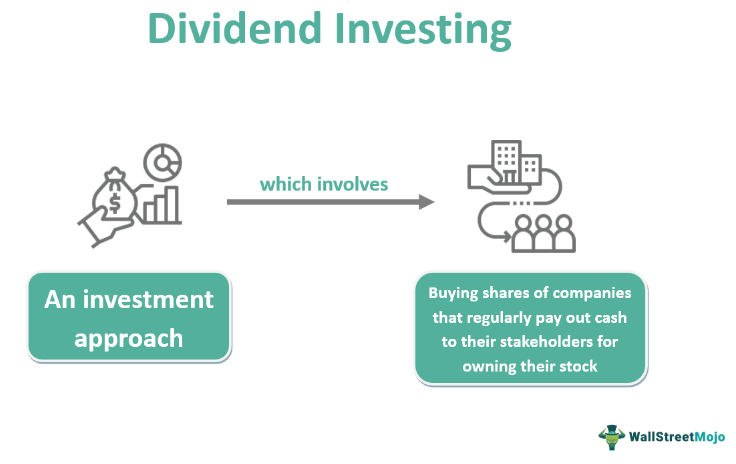

The world of investment offers a spectrum of opportunities, with dividends and algorithmic trading emerging as popular strategies. Dividend investing is centered around generating regular income through payouts derived from a company's profits, signifying a lucrative method for investors seeking stable returns. This strategy involves selecting companies known for their consistent profit-sharing policies, providing a steady income stream that can form the backbone of a financial portfolio.

On the other hand, algorithmic trading leverages sophisticated algorithms to optimize investment decisions and maximize returns. This approach involves using predefined criteria and computational models to execute trades at speeds and volumes unachievable by manual trading. By analyzing vast datasets and real-time market conditions, algorithmic trading identifies trends and opportunities that can significantly enhance trading outcomes.



Combining dividend investing with algorithmic trading can potentially amplify portfolio performance, providing a balanced strategy that marries the stability of dividend yields with the precision of algorithmic trades. This convergence allows investors to capitalize on the regular income generated from dividends while utilizing algorithmic trading to bolster their overall investment strategy with enhanced timing and precision.

This article will explore how dividend investment portfolios can be augmented with algorithmic trading strategies, offering insights into how both methods can be harmonized to achieve a robust and adaptive investment approach.

## Table of Contents

## Understanding Dividends and Their Benefits

Dividends are integral components of the investment landscape, representing periodic payments from a company's earnings, distributed to its shareholders. These financial distributions serve as indicators of a company's robust financial health and its commitment to delivering value to its shareholders. Companies that offer dividends generally project stability and profitability, making them attractive to investors seeking consistent returns.

Dividend investing is valued for its ability to provide regular income streams, helping to stabilize investment portfolios. This model of investing attracts those who prioritize income during uncertain market conditions, as dividends can offer a buffer against market volatility. Over time, the reinvestment of dividends can significantly enhance the overall return on investment, leading to compounded growth.

Investors frequently select dividend stocks not just for the immediate income they provide, but also for their potential for growth in both share price and income. Such stocks can offer a dual benefit: the chance for capital appreciation alongside regular income, appealing to a broad spectrum of investors.

Key metrics play a crucial role in the evaluation of dividend stocks. Two prominent metrics are:

1. **Dividend Yield**: This is calculated as the annual dividends per share divided by the price per share. It is expressed as a percentage and provides insight into the return on investment from dividends alone:
$$
   \text{Dividend Yield} = \left( \frac{\text{Annual Dividends per Share}}{\text{Price per Share}} \right) \times 100

$$
   A higher dividend yield can suggest a potentially lucrative investment, though it is essential to assess the overall health of the company to understand sustainability.

2. **Payout Ratio**: This metric determines the fraction of earnings paid to shareholders in the form of dividends, defined by:
$$
   \text{Payout Ratio} = \left( \frac{\text{Dividends per Share}}{\text{Earnings per Share}} \right) \times 100

$$
   A healthy payout ratio demonstrates a balanced corporate strategy that divides profits between reinvestment in growth initiatives and rewarding shareholders.

In summary, dividends symbolize a company's financial robustness and commitment to its shareholders, while dividend investing provides regular income and portfolio stabilization. By leveraging metrics like dividend yield and payout ratio, investors can refine their stock selections to align with their financial goals.

## Building a Dividend Investment Portfolio

Creating a robust dividend investment portfolio begins with the identification of companies that have demonstrated a consistent capacity for dividend payments and growth. This involves an examination of a company's financial health, historical dividend issuance, and future growth potential. Companies with a solid track record of paying dividends reflect their commitment to returning value to shareholders and often exhibit stability, making them attractive to dividend-focused investors.

Diversification across various sectors is a fundamental strategy to mitigate industry-specific risks. By spreading investments among different sectors, investors reduce the impact of adverse sector-specific and economic events. High-dividend yield stocks, although attractive for income generation, should be balanced with growth-oriented stocks to optimize overall returns and minimize risk exposure.

Incorporating Dividend Aristocrats into a portfolio can further enhance its stability and growth potential. Dividend Aristocrats are companies within the S&P 500 that have consistently increased their dividends for at least 25 consecutive years. Their inclusion can provide investors with the confidence of predictable returns, owing to these companies' demonstrated resilience through varying market conditions.

Dividend Reinvestment Plans (DRIPs) offer an effective mechanism for compounding growth within a dividend-focused portfolio. By reinvesting dividends into additional shares of the issuing company, investors can enhance their returns through compounding. This strategy leverages the power of reinvestment, where future dividend returns are based on an increasing number of shares, thereby accelerating portfolio growth over time.

Regular review and rebalancing of the portfolio are critical to maintaining alignment with investment goals. Rebalancing involves adjusting the weightings of various assets in the portfolio to maintain desired levels of risk and return. This process can entail selling overrepresented assets and purchasing underrepresented ones, ensuring the portfolio remains diversified and aligned with an investor's risk tolerance and financial objectives.

Overall, building a dividend investment portfolio involves strategic selection and management of assets, consistent monitoring, and timely adjustments to navigate market dynamics and capitalize on income opportunities.

## The Role of Algorithmic Trading in Investment Strategies

Algorithmic trading has revolutionized investment strategies by employing automated systems to execute trades based on predefined criteria. At its core, [algorithmic trading](/wiki/algorithmic-trading) leverages computational algorithms capable of processing vast amounts of financial data rapidly, which facilitates the identification of market trends and trading opportunities.

The algorithms used in this domain can handle large volumes of data inputs, such as stock prices, trading volumes, and other market indicators, to make split-second decisions. This capability enhances the timing and precision of trades, which can be critical in maximizing returns from dividend investments. For example, when incorporated into dividend investing, algorithmic trading can optimize the timing of trades to take advantage of dividend capture strategies and other income-generating opportunities.

Common algorithms used in algorithmic trading include mean reversion, [trend following](/wiki/trend-following), and [arbitrage](/wiki/arbitrage). Each type of strategy is designed to exploit different market conditions. Mean reversion algorithms, for instance, are based on the expectation that stock prices will revert to their mean or average over time. Trend following strategies, on the other hand, capitalize on the continuation of existing market trends, while arbitrage strategies seek risk-free profit by exploiting price differentials across different markets or financial instruments.

Technology and big data are at the heart of the development of sophisticated trading algorithms. Modern algorithmic trading systems integrate [machine learning](/wiki/machine-learning) techniques and [artificial intelligence](/wiki/ai-artificial-intelligence) to continuously improve their predictive accuracy. These systems can analyze historical and real-time data to forecast market moves, allowing traders to implement strategies that adapt to changing market conditions.

For instance, in Python, a simple moving average crossover strategy can be implemented as follows:

```python
import pandas as pd
import numpy as np

# Load your trading data
# Assuming data contains 'Close' price column
data = pd.read_csv('stock_data.csv')

# Calculate moving averages
short_window = 40
long_window = 100

data['Short_MA'] = data['Close'].rolling(window=short_window, min_periods=1).mean()
data['Long_MA'] = data['Close'].rolling(window=long_window, min_periods=1).mean()

# Generate signals
data['Signal'] = 0
data['Signal'][short_window:] = np.where(data['Short_MA'][short_window:] > data['Long_MA'][short_window:], 1, 0)
data['Position'] = data['Signal'].diff()

# Output the signals
buy_signals = data[data['Position'] == 1]
sell_signals = data[data['Position'] == -1]
```

In this example, buy and sell signals are generated based on a simple moving average crossover strategy, which can be a fundamental component of a trend following system.

Overall, the integration of algorithmic trading in investment strategies enhances the ability to predict, adapt, and act on market insights with greater speed and accuracy than human traders. This approach is becoming increasingly vital as markets grow more complex and data-driven decision-making becomes the standard.

## Integrating Dividends with Algorithmic Trading

Algorithmic trading can significantly augment dividend investment strategies by leveraging sophisticated models that prioritize stocks with robust historical dividend performance. Through the use of quantitative algorithms, investors can automate processes such as identifying dividend capture opportunities that arise around ex-dividend dates. This automation allows for the efficient realization of gains associated with dividend payments, particularly through the technique known as dividend capture, where shares are purchased just before a dividend is declared and sold shortly after.

Artificial intelligence (AI) plays a pivotal role in predicting potential dividend increases, enabling investors to adjust their investment strategies in anticipation of changes. AI models may analyze various data points, including earnings reports, cash flow statements, and historical dividend trends, to forecast possible dividend hikes. For instance, using machine learning, algorithms can examine patterns and financial indicators to provide proactive alerts about possible increases or cuts in dividends.

Implementing risk management protocols is crucial for protecting investments against market [volatility](/wiki/volatility-trading-strategies) while ensuring consistent returns. Techniques such as stop-loss orders or dynamic hedging strategies help mitigate risks associated with sudden market fluctuations. Additionally, algorithmic trading systems are often designed to include volatility filters that adjust trading activity based on market conditions, thereby preserving capital and reducing exposure during turbulent periods.

The successful integration of dividends with algorithmic trading requires balancing the predictable income from dividends with the fast-paced nature of algorithmic trading. Investors can achieve this through a thoughtfully constructed framework that combines the steady growth and income potential of dividend-paying stocks with the adaptability and precision of algorithmic systems.

Overall, the fusion of these strategies offers promising prospects for enhancing portfolio performance. By continually monitoring and refining algorithmic models, investors can align their investment strategies with evolving market dynamics, thereby maximizing returns while maintaining a stable income stream.

## Potential Risks and Considerations

Dividend investing and algorithmic trading, while promising, require careful consideration of risks. A critical concern in dividend investing is the potential for dividend cuts, which can significantly reduce portfolio income. Companies may reduce or eliminate dividends during financial difficulties, and such actions can impact an investor's regular income stream. Diversification across sectors and asset classes can help mitigate this risk, offering a buffer against the negative impact of dividend cuts from any single investment.

Algorithmic trading systems, on their part, introduce unique challenges. These systems are susceptible to errors, including software bugs or misconfigurations, which can lead to unintended trades and potential financial loss. Rigorous testing and continuous monitoring of algorithms are therefore essential to identify and rectify errors promptly. It is also crucial to conduct stress tests and [backtesting](/wiki/backtesting) under various market conditions to ensure the robustness of these systems.

Market conditions play a vital role in the success of both dividend and algorithmic strategies. Economic shifts, geopolitical events, and market volatility can all affect the efficacy of dividend payouts and the performance of trading algorithms. Investors must be agile in adapting their strategies to the evolving economic landscape, which may involve revising investment priorities, reallocating assets, or updating algorithmic models to better cope with changing conditions.

Regulatory considerations are another important [factor](/wiki/factor-investing) to bear in mind. Financial markets are subject to regulatory oversight, and algorithmic trading strategies, in particular, may face stringent regulatory scrutiny. Compliance with regulations such as the Markets in Financial Instruments Directive II (MiFID II) in Europe or the Securities and Exchange Commission (SEC) rules in the United States is necessary to avoid legal repercussions. Keeping abreast of regulatory changes and ensuring that trading systems adhere to these frameworks is vital for long-term sustainability.

To summarize, managing the risks associated with dividend investing and algorithmic trading necessitates a comprehensive approach that includes diversification, rigorous system testing, adaptive strategies, and regulatory compliance. By addressing these risks proactively, investors can better position themselves to capitalize on the benefits of combining dividends with algorithmic trading while minimizing vulnerabilities.

## Conclusion

Dividend investing and algorithmic trading, when strategically combined, offer distinct advantages that can enhance overall portfolio performance. This synergy capitalizes on the strengths of both strategies: the stability of dividend income and the dynamic capabilities of algorithmic trading. However, optimizing a portfolio using these methods necessitates thorough research, diversification, and innovation. Investors must remain vigilant, employing detailed analysis to identify sustainable dividend stocks and effective algorithmic models.

As financial markets continue to evolve, the integration of technology within investment strategies will inevitably grow. This evolution is largely driven by advancements in computational power, data analytics, and artificial intelligence. Such technologies enable more precise and efficient trade execution, improving the potential for returns while minimizing risks. Consequently, investors can leverage these advancements to achieve long-term stability and growth.

The key to maximizing returns in this ever-changing financial landscape lies in continuous learning and adaptation. Savvy investors consistently update their knowledge base, staying informed about technological developments and economic shifts. The ability to adapt strategies in response to new information and market conditions is crucial for maintaining a competitive edge. By balancing the stability provided by dividend investments with the innovative potential of algorithmic trading, investors can navigate the complexities of the financial world, positioning themselves for sustained success.

## References & Further Reading

[1]: ["The Little Book of Common Sense Investing: The Only Way to Guarantee Your Fair Share of Stock Market Returns"](https://www.amazon.com/Little-Book-Common-Sense-Investing/dp/1119404509) by John C. Bogle

[2]: ["Dividends Still Don't Lie: The Truth About Investing in Blue Chip Stocks and Winning in the Stock Market"](https://www.amazon.com/Dividends-Still-Dont-Lie-Investing/dp/0470581565) by Kelley Wright

[3]: ["Algorithmic Trading: Winning Strategies and Their Rationale"](https://www.amazon.com/Algorithmic-Trading-Winning-Strategies-Rationale-ebook/dp/B00CY5HC0U) by Ernie Chan

[4]: ["Artificial Intelligence in Finance: A Review"](https://link.springer.com/article/10.1007/s43546-023-00618-x) by Robert Brooks and Jon Matson, Journal of Applied Finance & Banking

[5]: ["Python for Finance: Mastering Data-Driven Finance"](https://www.amazon.com/Python-Finance-Mastering-Data-Driven/dp/1492024333) by Yves Hilpisch