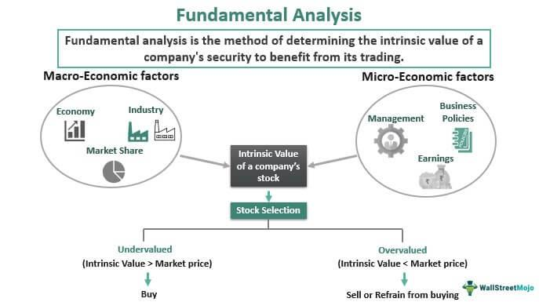

In the world of investing, fundamental analysis serves as a pivotal strategy for evaluating securities. This analytical process involves examining both quantitative elements—such as earnings, revenue, and other financial data—and qualitative factors, including management expertise, competitive advantages, and industry trends, to assess a security's intrinsic value. Fundamental analysis aims to provide a holistic view of a company’s worth, beyond the fluctuations of the market, enabling investors to make informed investment decisions.

Algorithmic trading has significantly transformed the landscape of investment strategies by integrating fundamental analysis into automation. This innovative approach allows for the execution of trades at high speeds and large volumes, relying on predefined criteria. Traditionally, algorithmic trading has been dominated by quantitative analysis due to its reliance on numerical data that can be easily processed by computers. However, the growing complexity of financial markets has highlighted the importance of qualitative factors, which offer additional insights that numbers alone cannot capture.



This article emphasizes the critical role of qualitative factors in fundamental analysis, especially within the context of algorithmic trading. While quantitative analysis provides numerical insights, qualitative factors contribute context and strategic understanding of a company’s performance and potential. These qualitative assessments may include subjective evaluations but are invaluable for capturing the full picture of a company’s health and market position.

By integrating qualitative factors with quantitative metrics, investors can achieve a comprehensive understanding of business entities. This synergy not only enriches investment strategies but also enhances decision-making, offering a nuanced view that aligns with both short-term market conditions and long-term investment goals. As technology evolves, the blend of qualitative analysis in algorithmic trading strategies is set to become increasingly sophisticated, offering investors a more competitive edge.

## Table of Contents

## Understanding Fundamental Analysis

Fundamental analysis is a key methodology in investment strategy, allowing investors to assess a company's intrinsic value by examining various factors. This comprehensive evaluation is crucial for making informed decisions about the purchase, retention, or sale of securities.

The analysis is comprised of two main components: quantitative and qualitative analysis. Quantitative analysis involves the scrutiny of numerical data primarily found in a company's financial statements. These statements include the balance sheet, income statement, and cash flow statement, each offering distinct insights into the company's fiscal health and operational efficiency. For instance, critical metrics such as revenue, earnings, and profit margins are examined to gauge a company's performance against market expectations or historical data.

Qualitative analysis, on the other hand, emphasizes non-numeric elements that might affect a company's valuation. This includes factors such as management quality, brand reputation, business model, market position, and the regulatory environment in which the company operates. While this data does not lend itself to easy quantification, it provides context that can significantly influence long-term performance potential.

Through this bifurcated approach, investors seek to ascertain the true value of an asset, aiming to understand whether the market has overvalued or undervalued a security. This understanding enables investors to capitalize on price discrepancies and align their investment strategies to maximize returns. Fundamental analysis remains integral in distinguishing sound investment opportunities within an ever-evolving market landscape.

## Qualitative Factors in Investment Analysis

Qualitative factors in investment analysis refer to non-quantifiable elements that can significantly influence a company's valuation. Understanding these elements is crucial for investors seeking a comprehensive view of a company's potential performance beyond what is visible in financial statements. Management effectiveness, for instance, plays a pivotal role as it reflects the capabilities and strategic vision of a company's leadership in navigating market challenges and achieving corporate goals. A competent management team can drive a company towards sustainable growth and profitability, thereby enhancing its intrinsic value.

Brand strength is another critical qualitative [factor](/wiki/factor-investing). It denotes the reputation and recognition a company has in the eyes of its consumers, which can lead to customer loyalty and pricing power. Companies with strong brands are often able to maintain or increase their market share, even amidst competitive pressures. This brand equity can translate into a competitive advantage, which pertains to a company's ability to sustain profitability over its competitors. Factors such as unique business models, proprietary technologies, or exclusive customer relationships are examples of competitive advantages that can fortify a company's market position.

Customer satisfaction is a reflection of how well a company's products or services meet or exceed consumer expectations. High customer satisfaction often leads to repeat business, positive word-of-mouth, and increased sales, directly impacting a company's long-term performance. Furthermore, the regulatory environment in which a company operates can substantially affect its operations and profitability. Regulatory changes can either pose risks, in terms of increased compliance costs and restrictions, or create opportunities, such as new markets opening or incentives being offered for certain business practices.

Incorporating qualitative analysis requires a nuanced understanding and a keen eye for factors that may not immediately influence short-term performance but can be pivotal for sustainable long-term success. By considering elements such as management decisions, brand perception, market position, customer experiences, and regulatory landscapes, investors can complement quantitative data and better assess a company's true potential value.

## Algorithmic Trading and Qualitative Analysis

Algorithmic trading, a method widely adopted in financial markets, entails the use of sophisticated computer programs to execute trading orders at speeds and volumes that surpass human capabilities. These algorithms rely on predefined criteria to initiate trades, optimizing for factors such as price, timing, and [volume](/wiki/volume-trading-strategy). A pivotal enhancement to this automated trading approach is the integration of qualitative analysis, which incorporates non-quantifiable information to refine trading strategies and decisions.

Incorporating qualitative analysis into [algorithmic trading](/wiki/algorithmic-trading) involves evaluating market sentiment and other intangible factors that can impact asset pricing. Sentiment analysis, a popular technique within this domain, interprets vast amounts of unstructured data, such as social media outputs, news articles, and analyst reports, to gauge the market's emotional response to various events. By employing natural language processing (NLP) and [machine learning](/wiki/machine-learning) models, these algorithms can sift through text data to identify sentiment trends and potential market-moving information.

For instance, an algorithm might be calibrated to adjust buy and sell strategies based on the frequency and tone of news coverage regarding a company. If positive sentiment is detected in real-time news feeds, indicating a favorable reception to a corporate announcement, the algorithm could increase the likelihood of placing buy orders on the company's stock, anticipating a potential price increase. This dynamic adjustment enhances a trading model's responsiveness to evolving market conditions, which might not be immediately apparent through quantitative data alone.

The process involves parsing textual content to score sentiment using methods like the Valence Aware Dictionary and sEntiment Reasoner (VADER) or machine learning classifiers trained on labeled sentiment data. Python, a popular language for algorithmic traders, offers libraries such as TextBlob and NLTK (Natural Language Toolkit) to facilitate sentiment analysis. Below is an illustration of how Python can be used to perform sentiment analysis:

```python
from textblob import TextBlob

# Example text from a financial news article
text = "The company reported a significant increase in quarterly revenue, surpassing market expectations."

# Perform sentiment analysis
sentiment_score = TextBlob(text).sentiment.polarity

# Decision-making based on sentiment score
if sentiment_score > 0:
    print("Increase position or initiate buy order based on positive sentiment.")
else:
    print("Consider sell order or maintain current position.")
```

Integrating sentiment insights into trading algorithms not only amplifies decision-making capability but also advances strategies to align more closely with real-world conditions. As technological advancements continue, particularly in natural language processing and machine learning, the ability to process qualitative data on a large scale is set to further enrich algorithmic trading frameworks, lending a competitive edge in increasingly complex market environments.

## Case Study: Applying Qualitative Analysis in Algo Trading

In a case study illustrating the application of qualitative analysis in algorithmic trading, consider a scenario involving a company unveiling an innovative product that rapidly gains market traction. It is common for traditional quantitative data, such as financial statements and earnings reports, to lag behind actual market events. In such cases, qualitative analysis becomes invaluable for capturing real-time market sentiment and perceptions that quantitative metrics fail to immediately reflect.

For instance, the success of the new product could be measured through various qualitative indicators, such as positive media coverage, customer reviews, and increased consumer interest on social media platforms. This qualitative data can be harvested and processed using advanced techniques like sentiment analysis. Sentiment analysis leverages natural language processing (NLP) algorithms to evaluate the sentiment conveyed in textual data sources, allowing traders to gauge public opinion and predict potential impacts on stock performance. 

Here is an example of how one might implement sentiment analysis in Python for this purpose:

```python
import requests
from textblob import TextBlob
from bs4 import BeautifulSoup

def fetch_news(company_name):
    # Simplified HTTP request for fetching news
    url = f"https://news.google.com/search?q={company_name}"
    response = requests.get(url)
    soup = BeautifulSoup(response.text, 'html.parser')
    headlines = soup.find_all('h3')
    return [headline.text for headline in headlines]

def analyze_sentiment(headlines):
    polarity_scores = [TextBlob(headline).sentiment.polarity for headline in headlines]
    average_polarity = sum(polarity_scores) / len(polarity_scores)
    return average_polarity

company = 'Innovative Product Company'
news_headlines = fetch_news(company)
sentiment_score = analyze_sentiment(news_headlines)

print(f"Sentiment score for {company}: {sentiment_score}")
```

In this code snippet, news headlines related to the company are fetched using web scraping methods. Sentiment analysis is then applied to assess whether the general tone is positive, negative, or neutral, quantified through a sentiment score. A high positive score may indicate strong positive reception of the product, suggesting a potential upward movement in the company's stock price.

Incorporating such real-time qualitative insights enables trading algorithms to adapt dynamically, potentially giving traders an advantage by allowing them to adjust their strategies before the information affects quantitative data. This proactive adjustment could involve buying more shares of the company if the sentiment is overwhelmingly positive or selling if negative sentiment prevails. Hence, qualitative analysis serves as a crucial complement to quantitative methods, enhancing the efficacy of algorithmic trading strategies.

## Challenges and Opportunities

Incorporating qualitative factors into algorithmic trading presents significant challenges, primarily due to their subjective nature. These factors, such as management competence, brand reputation, and industry trends, often require human judgment for accurate evaluation. Unlike quantitative data, which can be measured and analyzed through numerical models, qualitative factors do not have standard metrics, making them harder to quantify and integrate into algorithmic systems.

Despite these challenges, recent advancements in natural language processing (NLP) and [artificial intelligence](/wiki/ai-artificial-intelligence) (AI) offer promising opportunities for better integration of qualitative assessments in trading algorithms. NLP techniques allow computers to process and interpret large volumes of text data, including news articles, social media sentiment, and company reports. This capability is crucial for extracting valuable insights from qualitative data sources that might otherwise be overlooked in traditional quantitative analysis.

Using sentiment analysis, NLP models can gauge public perception and sentiment towards a company. For instance, by analyzing tweets or news articles, traders can derive sentiment scores reflecting market sentiment towards a specific company or product. These scores can then be used as variables in trading algorithms to adjust positions based on shifts in public opinion. 

```python
from textblob import TextBlob

def calculate_sentiment(text):
    analysis = TextBlob(text)
    # Determines polarity: Positive (+1) to Negative (-1)
    return analysis.sentiment.polarity

text = "The new product launch was a tremendous success, boosting customer satisfaction and sales."
sentiment_score = calculate_sentiment(text)
print("Sentiment Score:", sentiment_score)
```

Additionally, AI models can be trained to recognize patterns and relationships in qualitative data, providing a structured assessment of factors traditionally considered unquantifiable. Machine learning algorithms can identify correlations between qualitative indicators and stock price movements, enhancing the predictive power of trading systems.

The ability to process extensive qualitative data in real-time enables more informed and adaptable trading strategies. Algorithms that incorporate these insights can make more nuanced decisions, capitalizing on subtle market shifts that purely quantitative models might miss. As NLP and AI technologies continue to evolve, their application in algorithmic trading is expected to become more refined, creating richer, more dynamic investment strategies. This evolution positions qualitative analysis as an essential complement to traditional quantitative approaches, offering investors a more holistic view of market opportunities.

## Conclusion

Qualitative factors play a crucial role in providing a complete perspective on a company's intrinsic value, complementing the quantitative data traditionally used in [fundamental analysis](/wiki/fundamental-analysis). Their inclusion offers insights that are not immediately discernible through numerical evaluations alone, thereby furnishing a deeper understanding of a company's potential in the market.

Incorporating qualitative factors such as management effectiveness, brand reputation, and market sentiment into algorithmic trading systems enhances the sophistication of trading models and enriches investment approaches. Such integration aids in adapting strategies based on real-world, dynamic inputs, ultimately leading to more informed decision-making. This approach allows investors to anticipate market movements and capitalize on opportunities that might be overlooked by purely quantitative models.

As technology continues to evolve, particularly with advancements in artificial intelligence and natural language processing, the integration of qualitative analysis in algorithmic trading is set to become increasingly refined. These advancements empower trading algorithms to process vast amounts of qualitative data efficiently, improving the accuracy and responsiveness of trading strategies. This technological sophistication provides investors with a significant competitive edge, enabling them to navigate complex market environments with greater agility and insight. 

Thus, the future of investment strategies lies in the harmonious blend of quantitative and qualitative analyses, paving the way for more robust and adaptive algorithmic trading frameworks.

## References & Further Reading

[1]: Bergstra, J., Bardenet, R., Bengio, Y., & Kégl, B. (2011). ["Algorithms for Hyper-Parameter Optimization."](https://dl.acm.org/doi/10.5555/2986459.2986743) Advances in Neural Information Processing Systems 24.

[2]: ["Advances in Financial Machine Learning"](https://www.amazon.com/Advances-Financial-Machine-Learning-Marcos/dp/1119482089) by Marcos Lopez de Prado

[3]: ["Evidence-Based Technical Analysis: Applying the Scientific Method and Statistical Inference to Trading Signals"](https://www.amazon.com/Evidence-Based-Technical-Analysis-Scientific-Statistical/dp/0470008741) by David Aronson

[4]: ["Machine Learning for Algorithmic Trading"](https://github.com/PacktPublishing/Machine-Learning-for-Algorithmic-Trading-Second-Edition) by Stefan Jansen

[5]: ["Quantitative Trading: How to Build Your Own Algorithmic Trading Business"](https://books.google.com/books/about/Quantitative_Trading.html?id=j70yEAAAQBAJ) by Ernest P. Chan