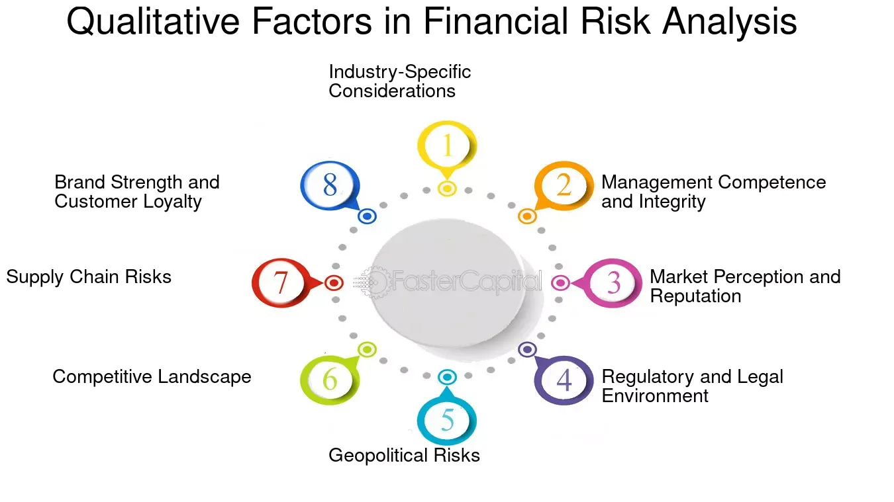

## Table of Contents

## What is fundamental analysis and why is it important in investing?

Fundamental analysis is a way to look at a company to decide if its stock is a good buy. It involves studying things like the company's earnings, how much money it makes, its debts, and how it's run. By looking at these details, investors can figure out if the company is healthy and if its stock price makes sense. It's like checking the engine of a car before buying it to see if it's a good deal.

This type of analysis is important in investing because it helps people make smarter choices. Instead of just guessing or following trends, investors can use fundamental analysis to find companies that are likely to do well in the future. This can lead to better returns on their investments. It's a bit like doing homework before a big test; it might take some time, but it can really pay off in the end.

## How do qualitative factors differ from quantitative factors in fundamental analysis?

In fundamental analysis, qualitative factors are about the things you can't easily measure with numbers. They include stuff like how good the company's leaders are, what people think about the company's brand, and how it treats its workers. These things can be really important because they can affect how well the company does in the long run. For example, if people love a company's products and trust its brand, it might be able to keep making money even when times are tough.

On the other hand, quantitative factors are all about the numbers. This includes things like how much money the company makes, its debts, and how much it's worth. These numbers can tell you a lot about how healthy the company is right now and how it might do in the future. Investors often use these numbers to figure out if a stock is a good buy or if it's too expensive. While numbers can give you a clear picture, they don't tell the whole story, which is why both qualitative and quantitative factors are important in [fundamental analysis](/wiki/fundamental-analysis).

## What are some common qualitative factors that investors should consider?

When looking at a company, investors should think about the people running it. The leaders, or management team, are really important. If they have a good track record and know their stuff, the company is more likely to do well. Also, how the company treats its employees matters. If workers are happy and feel valued, they'll probably work harder and stay longer, which is good for the company.

Another big thing to consider is the company's brand and reputation. If people trust and like the company's products or services, it can keep making money even when times are tough. It's also good to look at the company's business model. If it has a unique way of making money that's hard for others to copy, it might be a safer bet for the future. These qualitative factors can give investors a fuller picture of how a company might do down the road.

## How can a company's management quality be assessed as a qualitative factor?

To figure out how good a company's management is, you can start by looking at the leaders' past work. If they have done well in other jobs or have made smart choices before, that's a good sign. You can also see if they are good at talking to people. If they can explain their plans clearly and honestly, it shows they know what they're doing. Another thing to check is how long they've been with the company. If they've stuck around for a while, it might mean they believe in the company's future.

Another way to judge management quality is by seeing how they handle tough times. If they can keep the company going strong even when things are hard, it shows they're good at their job. You can also look at what other people say about them. If workers and customers think the leaders are doing a good job, that's a positive sign. In the end, good management can make a big difference in how well a company does, so it's worth taking the time to check it out.

## What role does a company's brand strength play in qualitative analysis?

A company's brand strength is a big deal in qualitative analysis because it shows how much people trust and like the company. If a company has a strong brand, it means customers are more likely to keep buying its products or services, even when times are tough. This can help the company make money and stay ahead of others in the market. For example, if people think of a certain brand when they need something, like how many people think of Coca-Cola when they want a soda, that's a sign of a strong brand.

Also, a strong brand can make it easier for a company to start selling new things. If people already trust the brand, they might be more willing to try new products from that company. This can help the company grow and make more money in the future. So, when investors are looking at a company, they should think about how strong its brand is because it can tell them a lot about how well the company might do down the road.

## How do industry dynamics and competitive positioning influence qualitative assessments?

Industry dynamics and competitive positioning are important parts of qualitative assessments because they show how a company fits into its market. If a company is in an industry that's growing fast, it might have more chances to make money. But if the industry is shrinking, it could be harder for the company to do well. Also, if there are a lot of other companies trying to do the same thing, it can be tough for a company to stand out. But if a company has something special that others don't, like a new way of doing things or a product that's better than others, it might have a better chance of doing well.

Competitive positioning is about where a company stands compared to others in its industry. If a company is a leader in its field, it might have more power to set prices and make more money. Being a leader can also mean the company has a strong brand and loyal customers, which is good for the future. On the other hand, if a company is always trying to catch up with others, it might have a harder time making money and growing. So, when investors are looking at a company, they need to think about how it's doing compared to others and how the industry is changing. This can help them decide if the company is a good investment.

## Can you explain how corporate governance impacts a company's qualitative evaluation?

Corporate governance is all about how a company is run and who makes the big decisions. It includes things like the board of directors, how they are chosen, and how they work with the company's leaders. Good corporate governance means the company is run in a fair and open way. This can make investors feel more confident because they know the company is being watched over by people who want to do what's best for everyone, not just a few at the top. If a company has good governance, it's more likely to make smart choices and avoid big problems, which can help it do better in the long run.

On the other hand, if a company has bad corporate governance, it can be a red flag for investors. This might mean the leaders are making decisions that only help themselves, or that there's not enough oversight to stop them from doing things that could hurt the company. Bad governance can lead to scandals, legal problems, and a drop in the company's value. So, when investors are looking at a company, they should pay attention to how it's run. Good corporate governance can be a sign that the company is a safer and more reliable investment.

## What methods can be used to gather qualitative data for analysis?

To gather qualitative data for analysis, you can start by reading what people say about the company. This includes looking at news articles, reports from analysts, and what customers and employees say on social media or review websites. These sources can give you a good idea of how people feel about the company's products, leaders, and overall reputation. Talking to people who work at the company or know a lot about it can also be helpful. They can share their thoughts and experiences, which can give you a deeper understanding of the company's culture and how it's run.

Another way to gather qualitative data is by looking at the company's own documents. This includes things like their mission statement, annual reports, and any letters from the CEO. These documents can tell you about the company's goals, how they plan to reach them, and what they think is important. You can also attend meetings where the company talks to investors, like earnings calls or shareholder meetings. Listening to what the leaders say and how they answer questions can give you clues about their honesty and how well they understand the business. By using these different methods, you can gather a lot of useful information to help you make better investment choices.

## How should qualitative factors be integrated with quantitative data in a comprehensive analysis?

When you're looking at a company to decide if it's a good investment, you need to think about both qualitative and quantitative factors. Qualitative factors are things you can't measure with numbers, like how good the company's leaders are, what people think about its brand, and how it treats its workers. Quantitative factors are all about the numbers, like how much money the company makes, its debts, and its value. To get a full picture of a company, you have to look at both types of information. For example, a company might look good on paper with strong financial numbers, but if its leaders are not trusted or its brand is weak, it might not be a smart investment.

To integrate qualitative and quantitative data, start by gathering all the information you can. Look at the company's financial reports to see how it's doing with money, but also read news articles, customer reviews, and listen to what employees say about the company. Then, think about how these pieces of information fit together. If the numbers show the company is making a lot of money but people are unhappy with its products or leaders, you might want to be careful. On the other hand, if the company has strong financials and a good reputation, it could be a solid choice. By considering both qualitative and quantitative factors, you can make a more informed decision about whether to invest in the company.

## What are the challenges of relying on qualitative factors in investment decisions?

Relying on qualitative factors in investment decisions can be tricky because these factors are not as clear-cut as numbers. For example, how do you measure how good a company's leaders are or how strong its brand is? These things are hard to put a number on, so it can be tough to compare different companies or to be sure you're making the right choice. Also, people can have different opinions about qualitative factors. What one person thinks is a strong brand, another might not like as much. This can make it hard to trust your judgment when you're deciding whether to invest.

Another challenge is that qualitative information can change quickly. A company's reputation can go up or down based on what people are saying about it right now. This means you have to keep up with the news and what people are saying on social media, which can be a lot of work. Plus, sometimes the information you find might not be true or might be biased. If you're not careful, you could make a decision based on bad information. So, while qualitative factors are important, they can be hard to use and can add a lot of uncertainty to your investment choices.

## How can advanced analytical tools enhance the evaluation of qualitative factors?

Advanced analytical tools can help investors understand qualitative factors better by turning things like customer reviews, news articles, and social media posts into useful information. These tools can look at a lot of data quickly and find patterns or feelings that might be hard for a person to see. For example, they can tell if people are talking about a company in a good or bad way, which can give you an idea of the company's reputation. They can also look at what people are saying about the company's leaders to see if they are trusted and respected.

Using these tools can make it easier to keep up with how people feel about a company, which can change fast. They can help you see the big picture and make better guesses about how a company might do in the future. But, it's important to remember that these tools are not perfect. They can make mistakes or miss important details, so you should always use them along with your own thinking and other ways of gathering information.

## What case studies illustrate the successful use of qualitative factors in fundamental analysis?

One good example of using qualitative factors in fundamental analysis is the case of Apple Inc. When Apple was growing in the early 2000s, many investors looked at more than just the numbers. They saw that Apple had a strong brand and loyal customers who loved their products. They also noticed that Steve Jobs, the company's leader, had a clear vision and was good at making new products that people wanted. These qualitative factors, along with the company's financials, helped investors see that Apple was a good investment. As a result, many of them made a lot of money as Apple grew into one of the biggest companies in the world.

Another example is the case of Southwest Airlines. Investors who looked at qualitative factors saw that Southwest had a unique way of doing business. They treated their employees well and had a fun, friendly culture that made people want to fly with them. This helped Southwest stand out from other airlines and keep making money even when times were tough. By paying attention to these qualitative factors, along with the numbers, investors could see that Southwest was a strong company. This helped them make smart choices and do well with their investments in the airline.

## References & Further Reading

[1]: Bergstra, J., Bardenet, R., Bengio, Y., & Kégl, B. (2011). ["Algorithms for Hyper-Parameter Optimization."](https://dl.acm.org/doi/10.5555/2986459.2986743) Advances in Neural Information Processing Systems 24.

[2]: ["Advances in Financial Machine Learning"](https://www.amazon.com/Advances-Financial-Machine-Learning-Marcos/dp/1119482089) by Marcos Lopez de Prado

[3]: ["Evidence-Based Technical Analysis: Applying the Scientific Method and Statistical Inference to Trading Signals"](https://www.amazon.com/Evidence-Based-Technical-Analysis-Scientific-Statistical/dp/0470008741) by David Aronson

[4]: ["Machine Learning for Algorithmic Trading"](https://github.com/PacktPublishing/Machine-Learning-for-Algorithmic-Trading-Second-Edition) by Stefan Jansen

[5]: ["Quantitative Trading: How to Build Your Own Algorithmic Trading Business"](https://books.google.com/books/about/Quantitative_Trading.html?id=j70yEAAAQBAJ) by Ernest P. Chan