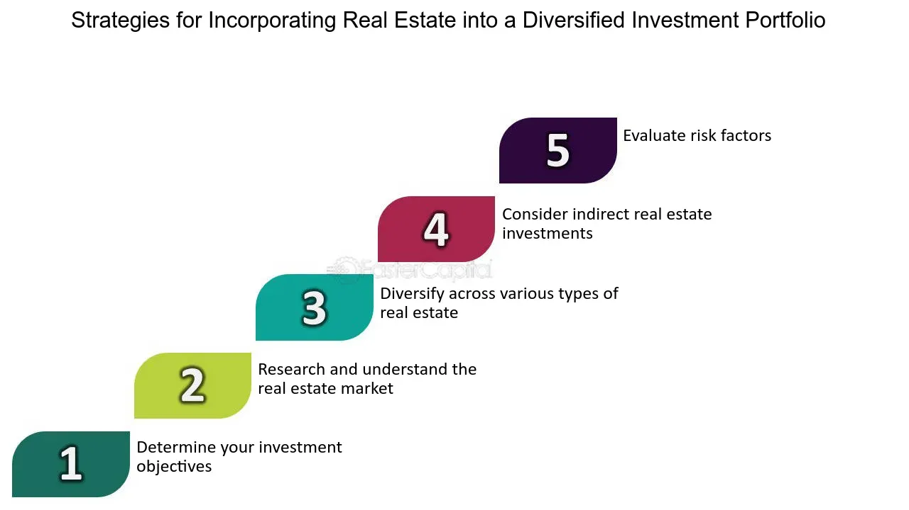

## Table of Contents

## What is real estate investment and why should it be considered in a portfolio?

Real estate investment involves buying, owning, managing, renting, or selling property for profit. This can include residential homes, commercial buildings, or land. People invest in real estate to earn money through rental income, or by selling the property for more than they paid for it. It's different from other investments like stocks or bonds because you can actually see and touch what you're investing in.

Including real estate in a portfolio can be a smart move for several reasons. First, it can provide a steady income through rent, which can be especially helpful during times when other investments might not be doing well. Second, real estate often grows in value over time, which means you could sell it later for a profit. Also, real estate can help spread out risk in your investment portfolio. If the stock market goes down, your real estate might still hold its value or even go up. This balance can make your overall investments more stable and secure.

## How does real estate investment differ from other types of investments like stocks and bonds?

Real estate investment is different from stocks and bonds because it involves physical property. When you invest in real estate, you buy a house, an apartment building, or land. You can make money by renting it out or selling it for more than you paid. With stocks, you're buying a small piece of a company, and your money grows if the company does well. Bonds are like loans you give to a company or government, and they pay you back with interest over time. Real estate gives you something you can see and touch, while stocks and bonds are more like pieces of paper or digital entries.

Another big difference is how you can use real estate to make money. With real estate, you can borrow money to buy a property, and then use the rent from tenants to help pay off the loan. This is called leverage, and it can make your investment grow faster than if you just used your own money. Stocks and bonds don't work this way. You usually can't borrow money to buy them and then use the dividends or interest to pay off the loan. Also, real estate can give you tax benefits, like being able to deduct the interest on your mortgage, which you don't get with stocks or bonds.

## What are the different ways to invest in real estate (e.g., direct ownership, REITs, real estate crowdfunding)?

One way to invest in real estate is through direct ownership. This means you buy a property yourself, like a house or an apartment building. You can then rent it out to tenants and earn money from the rent they pay. You might also make money if the property's value goes up and you sell it for more than you bought it. Direct ownership gives you control over the property, but it also means you have to take care of things like repairs and finding tenants.

Another way to invest in real estate is through Real Estate Investment Trusts (REITs). REITs are companies that own and manage lots of properties. When you buy shares in a REIT, you're investing in a big group of properties all at once. REITs have to pay out most of their income as dividends, so they can be a good way to earn regular income from real estate without having to manage properties yourself. It's a bit like buying stocks, but the money comes from real estate.

Real estate crowdfunding is another option. This is when a lot of people pool their money together to buy a property. You can invest a small amount of money and get a share of the profits from the property. Crowdfunding platforms make it easier for regular people to invest in real estate without having to buy a whole property on their own. It's a way to get into real estate investing without a lot of money upfront, but you have less control over what happens with the property.

## What are the potential benefits of adding real estate to an investment portfolio?

Adding real estate to an investment portfolio can offer many benefits. One big benefit is that real estate can give you a steady income. If you own a rental property, you can earn money from tenants every month. This income can help balance out times when other investments, like stocks, aren't doing so well. Another benefit is that real estate often goes up in value over time. This means you might be able to sell your property for more than you paid for it, making a profit.

Real estate also helps spread out risk in your portfolio. If the stock market goes down, your real estate might still hold its value or even go up. This balance can make your overall investments more stable and secure. Plus, with real estate, you can use leverage, which means borrowing money to buy a property. If the property's value goes up, your profit can be bigger than if you had just used your own money. So, adding real estate to your portfolio can help you earn regular income, grow your wealth, and protect against market ups and downs.

## What are the risks associated with real estate investments?

Real estate investments come with several risks that you should know about. One big risk is that property values can go down. If the economy is not doing well, or if something bad happens in the area where your property is, it might be worth less than what you paid for it. This means you could lose money if you have to sell it. Another risk is that you might not be able to find tenants to rent your property. If your property stays empty, you won't get any rental income, and you still have to pay for things like the mortgage and repairs. This can make it hard to keep up with your costs.

Another thing to think about is that real estate needs a lot of work. You have to take care of the property, fix things when they break, and deal with tenants. If something goes wrong, like a big repair, it can cost a lot of money. Also, real estate is not as easy to sell as stocks or bonds. It can take a long time to find a buyer, and you might have to lower the price to sell it quickly. This can be stressful and can affect your plans for your money.

Lastly, real estate can be affected by interest rates and laws. If interest rates go up, it can be harder to get a loan to buy a property, and your costs can go up too. Changes in laws, like new taxes or rules about renting, can also affect how much money you make from your property. These things can be hard to predict and can make real estate a riskier investment than others.

## How can real estate help in diversifying an investment portfolio?

Real estate can help diversify an investment portfolio by spreading out your risk. When you invest in different things like stocks, bonds, and real estate, you're not putting all your eggs in one basket. If the stock market goes down, your real estate might still be worth the same or even more. This can help protect your money because even if one type of investment isn't doing well, the others might be okay. This balance can make your overall investments more stable and secure.

Another way real estate helps with diversification is that it often grows in value over time and can provide a steady income. While stocks might go up and down a lot, real estate tends to increase slowly but surely. Plus, if you rent out your property, you get money every month, which can help pay for other investments or living expenses. By having real estate in your portfolio, you're adding something that behaves differently from stocks and bonds, which can help smooth out the ups and downs of your overall investments.

## What are the tax implications of investing in real estate?

Investing in real estate can have some good tax benefits. One big one is that you can deduct the interest you pay on your mortgage from your taxes. This means you pay less in taxes because the interest reduces how much money you're taxed on. You can also deduct other costs like property taxes, insurance, and repairs. These deductions can make a big difference in how much you owe the government each year. Another cool thing is called depreciation. Even though your property might be going up in value, you can claim that it's losing value over time on your taxes. This can lower your taxable income even more.

But there are also some tax downsides to think about. When you sell your property, you might have to pay capital gains tax if you made a profit. This is a tax on the money you made from selling the property for more than you paid for it. The rate you pay can be different depending on how long you owned the property. If you own the property for less than a year, you might pay a higher rate. Also, if you're making money from renting out your property, that income is taxable. You have to report it on your taxes and pay income tax on it. So while there are good tax breaks, there are also some taxes you have to keep in mind when investing in real estate.

## How much capital is typically required to start investing in real estate?

Starting to invest in real estate usually needs a good amount of money. If you want to buy a house or an apartment building, you might need to pay a down payment, which can be around 20% of the property's price. For a $200,000 house, that's $40,000 just to start. Plus, you'll need money for closing costs, repairs, and other expenses that come up. If you're thinking about buying a bigger building or land, the price can be even higher, and you'll need more money to get started.

But there are other ways to get into real estate with less money. Real Estate Investment Trusts (REITs) let you buy shares in a company that owns lots of properties. You can start investing in REITs with a lot less money than buying a whole property. Real estate crowdfunding is another option where you can pool your money with other people to buy a property. This way, you can start investing with a smaller amount, maybe just a few hundred or thousand dollars. So, while direct ownership can be pricey, there are ways to get started in real estate with less capital if you look into REITs or crowdfunding.

## What are the key factors to consider when choosing a real estate investment?

When choosing a real estate investment, it's important to look at where the property is located. A good location can make a big difference in how much money you can make. You want to find a place that people want to live or work in. Think about things like good schools, safe neighborhoods, and easy access to shops and public transport. Also, consider if the area is growing or if there are new businesses or developments coming. A growing area can mean your property will go up in value over time.

Another key factor is the condition of the property itself. You need to check if the property needs a lot of repairs or if it's ready to rent out right away. Big repairs can cost a lot of money, so make sure you have enough to fix things up if needed. Also, think about how much you can charge for rent and if it will cover your costs like the mortgage, taxes, and maintenance. It's a good idea to do some research and see what similar properties in the area are renting for. This can help you figure out if the investment will make you money.

Lastly, consider your own goals and how much risk you're willing to take. Real estate can be a good way to earn steady income or grow your wealth over time, but it also comes with risks like not finding tenants or property values going down. Think about how long you plan to keep the property and if you're okay with the work that comes with managing it. If you're not sure about handling everything yourself, you might want to look into other options like REITs or crowdfunding, which can be easier to manage but might give you less control over your investment.

## How can one evaluate the performance of real estate investments?

To evaluate the performance of real estate investments, you can start by looking at how much money you're making from rent. This is called your rental income. Compare this to your costs, like the mortgage, taxes, insurance, and any repairs you have to pay for. If your rental income is more than your costs, you're making a profit. You can also look at the cash flow, which is the money left over after all your expenses. Good cash flow means your investment is doing well.

Another way to evaluate your real estate investment is by checking if the property's value is going up. This is called appreciation. You can find out the current value of your property by getting it appraised or by looking at what similar properties in the area are selling for. If the value has gone up since you bought it, that's a good sign. You can also look at the return on investment (ROI), which is how much money you're making compared to how much you put into the property. A higher ROI means your investment is performing better.

Lastly, consider how the real estate fits into your overall investment portfolio. Real estate can help spread out your risk, so think about how it's doing compared to your other investments like stocks or bonds. If your real estate is doing well when other investments are not, it's helping to balance your portfolio. Also, think about any tax benefits you're getting, like being able to deduct mortgage interest or depreciation. These can make your real estate investment even more valuable.

## What advanced strategies can be used to optimize real estate within a portfolio?

One advanced strategy to optimize real estate in a portfolio is to use leverage. This means borrowing money to buy more properties than you could with just your own money. If the properties go up in value, your profit can be much bigger because you're controlling more real estate. But be careful, because if the property values go down, you could lose more money too. Another strategy is to focus on value-add properties. These are properties that need some work but can be improved to increase their value and rent. By fixing them up, you can charge more rent and sell them for a higher price later, making your investment more profitable.

Another way to optimize real estate is through diversification within the real estate sector itself. Instead of just investing in one type of property, like residential homes, you can spread your money across different kinds of real estate, like commercial buildings, industrial spaces, or even land. This can help balance out the risks because different types of properties might do well at different times. You can also use real estate investment trusts (REITs) or crowdfunding to get into different areas of real estate without having to manage properties yourself. This can give you more exposure to real estate and help your portfolio grow in different ways.

## How do macroeconomic factors influence real estate investment decisions?

Macroeconomic factors like interest rates, inflation, and the overall health of the economy can really affect real estate investments. When interest rates are low, it's easier to borrow money to buy properties because the cost of loans goes down. This can make real estate a more attractive investment. But when interest rates go up, borrowing money becomes more expensive, which might make people less likely to buy or invest in real estate. Inflation also plays a part. If prices are going up, real estate can be a good way to protect your money because property values often rise with inflation. But if the economy is doing badly, like during a recession, people might not want to buy or rent, which can hurt real estate values and make it harder to earn money from your investments.

Another big factor is the job market. When there are a lot of jobs and the economy is growing, more people can afford to buy or rent homes, which can push up property values and rental income. But if a lot of people are out of work, it can be harder to find tenants and property values might go down. Government policies can also influence real estate. For example, tax laws or regulations about renting can change how much money you make from your properties. Keeping an eye on these macroeconomic factors can help you make better decisions about when to buy, sell, or hold onto your real estate investments.

## What are the key metrics in real estate investment?

Real estate investment metrics are essential tools for evaluating and improving the profitability of property investments. They provide investors with valuable insights into financial performance and potential returns. Here, we examine four key metrics widely used in the industry: Net Operating Income (NOI), Capitalization Rate (Cap Rate), Cash on Cash Return, and Internal Rate of Return (IRR).

1. **Net Operating Income (NOI)** is a fundamental metric used to assess a property's ability to generate income. It is calculated by subtracting operating expenses from the gross operating income. The formula is as follows:
$$
   \text{NOI} = \text{Gross Operating Income} - \text{Operating Expenses}

$$

   Gross operating income includes rental income and other revenues like parking, while operating expenses cover property costs such as maintenance, insurance, and property management fees. A higher NOI indicates a more profitable property from an operational standpoint.

2. **Capitalization Rate (Cap Rate)** is used to evaluate the potential return on investment for a real estate asset. It is derived by dividing the NOI by the property’s current market value or purchase price:
$$
   \text{Cap Rate} = \frac{\text{NOI}}{\text{Property Value}}

$$

   Cap Rate helps investors assess the attractiveness of an investment, comparing potential returns with other investment opportunities. A higher Cap Rate typically indicates a higher risk and potentially higher return.

3. **Cash on Cash Return** focuses on the immediate cash flow relative to the initial cash investment. It is particularly useful for investors interested in income-producing properties:
$$
   \text{Cash on Cash Return} = \frac{\text{Annual Pre-Tax Cash Flow}}{\text{Total Cash Invested}}

$$

   This metric provides a clear picture of the investment's cash flow efficiency, helping investors understand their leveraging gains.

4. **Internal Rate of Return (IRR)** is a dynamic metric that accounts for the time value of money, providing a long-term profitability assessment. It is the discount rate that makes the net present value (NPV) of all cash flows from a particular investment equal to zero, calculated using the formula:

   ```python
   import numpy as np

   cash_flows = [-initial_investment, cash_flow_year_1, cash_flow_year_2, ..., final_cash_flow]
   irr = np.irr(cash_flows)
   ```

   IRR is advantageous in evaluating the viability of an investment over time, with higher IRR values indicating more lucrative opportunities.

The accurate application of these metrics allows investors to make informed strategic decisions. By understanding and employing NOI, Cap Rate, Cash on Cash Return, and IRR, investors can optimize their real estate portfolios, identify profitable opportunities, and manage risks effectively.

## What are some case studies in real estate algorithmic trading?

In recent years, algorithmic trading has significantly optimized real estate portfolios, providing a competitive edge to savvy investors. This section examines several case studies demonstrating how these data-driven strategies have transformed real estate investment practices.

One notable example involves a real estate investment firm that increased its return on investment (ROI) through strategic integration of real estate metrics with algo trading models. By leveraging algorithms to analyze key metrics such as Net Operating Income (NOI) and Capitalization Rate (Cap Rate), the firm created a dynamic investment strategy that maximized property profitability. Algorithms processed vast amounts of historical and current market data, enabling the firm to make timely buy or sell decisions and adjust rental rates based on predicted market conditions.

Successful investors also use algorithms to predict property value fluctuations, allowing for more precise entry and [exit](/wiki/exit-strategy) points in the market. By employing machine learning models, these investors can forecast real estate trends with a higher degree of accuracy than traditional methods. For example, using regression algorithms, investors can predict property values based on variables such as location, economic indicators, and historical price trends. The formula below illustrates a simple linear regression model used to predict property prices:

$$
\text{Price} = \beta_0 + \beta_1 \times \text{Location} + \beta_2 \times \text{Economic Indicators} + \cdots + \epsilon
$$

Another case highlights the reduction of acquisition costs through efficient algo models. A firm integrated algorithmic trading tools to streamline property acquisition processes, significantly lowering transaction costs. By automating the due diligence phase, the firm reduced manual errors and sped up transaction completion times. Their algorithms quickly assessed property values, financing terms, and potential legal issues, which allowed for rapid decision-making and negotiation, ultimately reducing costs.

These case studies underscore the transformative power of data-driven strategies in real estate investing. Algorithms provide a foundation for more informed investment choices, allowing investors to anticipate market movements and optimize their portfolios more effectively. This integration of technology not only improves the precision and efficiency of real estate investments but also highlights the necessity for continual adaptation to technological advances in financial markets. The success of these firms indicates a promising future for those who embrace the convergence of algorithmic trading and real estate investment.

## References & Further Reading

[1]: Bergstra, J., Bardenet, R., Bengio, Y., & Kégl, B. (2011). ["Algorithms for Hyper-Parameter Optimization."](https://dl.acm.org/doi/10.5555/2986459.2986743) Advances in Neural Information Processing Systems 24.

[2]: ["Advances in Financial Machine Learning"](https://www.amazon.com/Advances-Financial-Machine-Learning-Marcos/dp/1119482089) by Marcos Lopez de Prado

[3]: ["Evidence-Based Technical Analysis: Applying the Scientific Method and Statistical Inference to Trading Signals"](https://www.amazon.com/Evidence-Based-Technical-Analysis-Scientific-Statistical/dp/0470008741) by David Aronson

[4]: ["Machine Learning for Algorithmic Trading"](https://github.com/stefan-jansen/machine-learning-for-trading) by Stefan Jansen

[5]: ["Quantitative Trading: How to Build Your Own Algorithmic Trading Business"](https://www.amazon.com/Quantitative-Trading-Build-Algorithmic-Business/dp/1119800064) by Ernest P. Chan