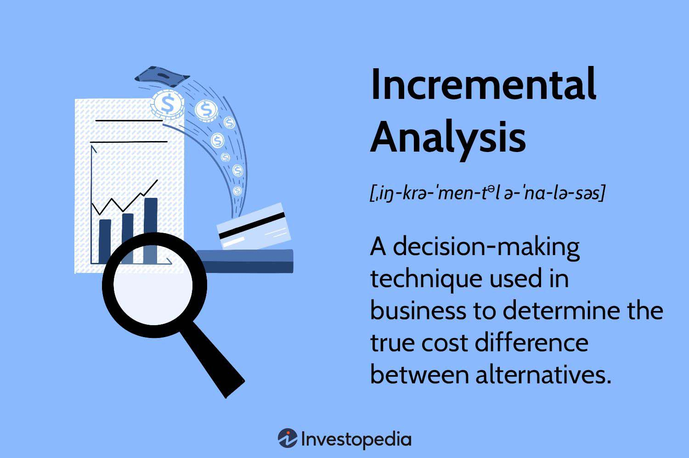

In today's fast-paced business environment, making informed decisions quickly is crucial for success. Businesses need to employ robust analytical tools to evaluate options and optimize their strategies. Incremental analysis and cost-benefit analysis are two pivotal tools used in business decision-making processes. Incremental analysis focuses on determining the financial impact of small changes or decisions by comparing the additional costs and benefits of alternatives. It is particularly useful for decisions involving additional production, special orders, and resource allocation. 

Cost-benefit analysis, on the other hand, quantifies and compares the total anticipated costs and benefits of an investment or action. This approach helps businesses evaluate whether the benefits outweigh the costs, guiding strategic decisions such as launching new products or entering markets.



Algorithmic trading, with its rapid decision-making capabilities, has become increasingly popular in financial markets. It involves using computer algorithms to automate trading strategies based on market conditions. The integration of incremental and cost-benefit analyses in algorithmic trading enhances decision-making by refining strategies, assessing risks, and optimizing performance. Algorithmic trading relies on these analyses to adapt quickly to market changes, ensuring profitability and competitive advantage.

This article explores how incremental analysis and cost-benefit analysis aid business decisions, particularly in the context of algorithmic trading. Understanding these concepts can help businesses optimize their resources and maximize profits. Leveraging these analytical tools allows for more effective resource management and ensures that strategic decisions lead to the best possible financial outcomes.

## Table of Contents

## Understanding Incremental Analysis

Incremental analysis, also known as marginal or differential analysis, is a critical tool in business decision-making that allows organizations to evaluate the financial implications of various options by focusing on the costs and benefits that vary among alternatives. Unlike other analyses that might consider all historical costs, incremental analysis specifically disregards sunk costs—expenses that have already been incurred and cannot be recovered. This focus on relevant costs provides a clearer understanding of the financial impact of decisions, enabling businesses to optimize their resources effectively.

Businesses apply incremental analysis to a variety of decision-making scenarios. For example, when considering whether to produce in-house or outsource, companies can calculate the differences in costs and revenues associated with each option. Incremental analysis can also inform decisions about accepting special orders by evaluating how these orders would affect future profits without impacting regular operations. Additionally, businesses can use this analysis to determine the most efficient allocation of resources, such as deciding between increasing production capacity or investing in new projects.

In [algorithmic trading](/wiki/algorithmic-trading), incremental analysis is vital for assessing the costs and benefits of different trading strategies. Traders use this analysis to fine-tune their strategies by evaluating factors such as changes in transaction costs, slippage, or asset prices. The goal is to enhance profitability through informed decision-making. By only considering costs that change with each trading scenario, traders can focus on optimizing their algorithms to achieve better financial outcomes.

For instance, let's suppose a trading algorithm has two strategies: Strategy A and Strategy B. Incremental analysis would compare the incremental costs and revenues of shifting from Strategy A to Strategy B. If the incremental benefits (increased profits) of using Strategy B outweigh the incremental costs (such as higher transaction fees), it may be advantageous to implement Strategy B.

In Python, a simple example of how one might perform an incremental analysis between two strategies could look like this:

```python
# Define cost and revenue of each strategy
strategy_A_cost = 1000
strategy_A_revenue = 1500
strategy_B_cost = 1200
strategy_B_revenue = 1800

# Calculate incremental costs and revenues
incremental_cost = strategy_B_cost - strategy_A_cost
incremental_revenue = strategy_B_revenue - strategy_A_revenue

# Determine if switching to Strategy B is beneficial
if incremental_revenue > incremental_cost:
    print("Switching to Strategy B is beneficial.")
else:
    print("Stick with Strategy A.")
```

In this code snippet, if the incremental revenue of Strategy B exceeds its incremental cost compared to Strategy A, switching strategies may be deemed beneficial. This simple determination process exemplifies how incremental analysis aids in algorithmic trading by ensuring resources are directed towards more profitable strategies.

## Principles of Cost-Benefit Analysis

Cost-benefit analysis (CBA) is a systematic approach to evaluating the overall value of business decisions by comparing the benefits and costs associated with them. This technique is integral across various industries and aids in effective decision-making by providing a clear monetary-based evaluation. The core idea of CBA is to weigh the total expected costs against the total expected benefits of a decision to determine its feasibility and profitability.

In cost-benefit analysis, the key tasks involve identifying all relevant costs and benefits, quantifying them in monetary terms, and calculating the net benefits by subtracting the total costs from the total benefits. The formula for net benefits can be expressed as:

$$
\text{Net Benefit} = \sum (\text{Benefits}) - \sum (\text{Costs})
$$

Implementing a CBA effectively requires thorough identification of direct, indirect, tangible, and intangible costs and benefits. Direct costs include explicit expenditures like capital costs, operational costs, and other financial obligations. Indirect costs could cover opportunity costs and potential risks. Similarly, benefits must account for revenue increases, cost savings, and intangible factors like improved customer satisfaction or enhanced brand reputation.

In algorithmic trading, CBA is particularly useful for assessing various trading strategies. Traders use CBA to balance potential returns against the risks and associated costs of executing particular algorithmic strategies. For example, they evaluate transaction costs, slippage, and market impact against predicted profit margins to ensure strategies are financially sound. By quantifying these variables, traders can prioritize those strategies which provide the highest net benefits while minimizing risks.

The effectiveness of CBA lies in its objective framework, enabling decision-makers to make informed, evidence-based choices. However, its precision depends on the accuracy of cost and benefit estimations, emphasizing the necessity of reliable data and robust analytical models. As CBA continues to evolve with advancements in data analysis techniques, its application is likely to expand, further contributing to strategic decision-making in dynamic business environments.

## Application of Incremental Analysis in Business Decision Making

Incremental analysis serves as a critical component in making strategic financial decisions across various business operations, including pricing, manufacturing, and outsourcing. This method proves essential when businesses face decisions that require evaluating the financial outcomes of distinct alternatives. By focusing on the costs and benefits that change with each potential decision, incremental analysis enables businesses to allocate resources effectively and maximize their benefits. 

One significant application of incremental analysis is in the assessment of special orders. Companies often receive requests for custom orders that deviate from regular production. These situations require businesses to decide whether accepting the order will yield a net benefit. Incremental analysis facilitates this decision by comparing the additional revenues generated by the order to the incremental costs incurred, such as additional labor or materials required. The focus here is on variable costs that will change due to the decision, while ignoring fixed costs, as they remain unaffected. Mathematically, this can be expressed as:

$$
\text{Incremental Profit} = \text{Incremental Revenue} - \text{Incremental Cost}
$$

In manufacturing, incremental analysis aids in optimal resource allocation and capacity considerations. Businesses assessing whether to expand their production capacity must consider the additional costs of expansion against the potential revenue. The analysis helps identify the point where the marginal cost of production equals the marginal revenue, known as the 'break-even point', which is essential for maximizing operating efficiency and profitability.

Outsourcing decisions are another critical area where incremental analysis is invaluable. Companies must decide whether to produce in-house or outsource based on cost-benefit criteria. Incremental analysis helps businesses compare the internal costs to the price of outsourcing. This involves analyzing all variable costs related to production, such as materials and labor, and comparing them to the outsourcing costs. The decision to outsource is favorable if the outsourcing cost is lower than the internal production cost, thereby freeing up resources for more profitable activities.

When considering resource allocation, incremental analysis ensures that scarce resources are used where they can generate the highest return. Managers can assess various project bids or product lines by calculating the incremental profit associated with each option, thus allowing for an effective prioritization of resource distribution. This principle is crucial in scenarios where businesses must decide between competing projects within limited budgets.

To illustrate this using Python, consider a simplified scenario where a business evaluates two production strategies for a new product line—each has different incremental costs and expected sales revenues. By calculating the incremental profit for each strategy, the decision-makers can choose the more financially advantageous option. Below is a basic Python script demonstrating this calculation:

```python
def incremental_profit(incremental_revenue, incremental_cost):
    return incremental_revenue - incremental_cost

strategy_a_revenue = 50000
strategy_a_cost = 30000
strategy_b_revenue = 60000
strategy_b_cost = 40000

profit_a = incremental_profit(strategy_a_revenue, strategy_a_cost)
profit_b = incremental_profit(strategy_b_revenue, strategy_b_cost)

print("Incremental Profit for Strategy A:", profit_a)
print("Incremental Profit for Strategy B:", profit_b)

if profit_a > profit_b:
    print("Strategy A is more profitable.")
else:
    print("Strategy B is more profitable.")
```

This code calculates and compares the incremental profits for two strategies, providing a clear basis for a financially sound decision.

In summary, incremental analysis empowers business managers to make informed decisions by concentrating solely on the costs and benefits that are directly affected by potential courses of action. Through strategic focus on relevant financial metrics, companies can enhance their decision-making processes, ensuring the optimal allocation of resources for the greatest financial benefit.

## Algorithmic Trading and Incremental Analysis

Algorithmic trading leverages computer algorithms to execute trading strategies automatically by analyzing market data and conditions. This approach offers several advantages, including speed and precision, which are essential in modern financial markets. Algorithms can process complex mathematical models and large volumes of data much faster than human traders, allowing them to exploit market opportunities as they arise.

Incremental analysis is a critical tool within algorithmic trading, used to refine and optimize trading strategies by evaluating the marginal changes in key factors such as transaction costs, slippage, and asset prices. Transaction costs, which include fees, spreads, and other expenses incurred during trading, can significantly impact the profitability of a strategy. Incremental analysis allows traders to evaluate how small variations in transaction costs affect the overall economic outcome, enabling them to adjust the strategy to ensure cost efficiency.

Slippage refers to the difference between the expected price of a trade and the actual price at which the trade is executed. This discrepancy is often due to market [volatility](/wiki/volatility-trading-strategies) and [liquidity](/wiki/liquidity-risk-premium) constraints. By employing incremental analysis, algorithmic traders can assess how variations in slippage influence the performance of their strategies. Identifying the factors that contribute to slippage and mitigating their effects can enhance the strategy's execution accuracy.

Another important element is the fluctuation of asset prices. Algorithmic trading strategies often rely on real-time data analysis to capture price movements and execute trades accordingly. Incremental analysis helps in understanding how small changes in asset prices impact the strategy's success rate and overall profitability. By focusing on these incremental changes, traders can adapt their strategies to maximize returns.

Python is a preferred programming language in algorithmic trading, given its rich ecosystem of libraries for data analysis and [machine learning](/wiki/machine-learning). For example, the following Python snippet showcases how one might use incremental analysis to evaluate transaction costs:

```python
def incremental_cost_analysis(initial_cost, new_cost):
    incremental_cost = new_cost - initial_cost
    return incremental_cost

initial_cost = 0.0025  # Example initial cost per share
new_cost = 0.0030      # Example new cost per share

incremental_cost = incremental_cost_analysis(initial_cost, new_cost)
print(f"Incremental Cost per Share: {incremental_cost}")
```

In this example, the incremental analysis determines whether changes in transaction costs warrant a revision of the trading strategy. By continuously applying incremental analysis to all relevant factors, algorithmic traders can enhance performance and profitability through informed strategy adjustments. Thus, incremental analysis serves as a foundational component in the effective operation of algorithmic trading systems, ensuring that trades are conducted efficiently and cost-effectively in a rapidly changing market landscape.

## Challenges and Limitations

Both incremental analysis and cost-benefit analysis (CBA) are essential tools for effective decision-making in business and finance. However, their accuracy and usefulness are heavily dependent on the quality and precision of the data used. In the context of algorithmic trading, the challenges associated with these analyses become even more pronounced due to the reliance on real-time data and computational resources.

Accurate data is vital for both incremental analysis and CBA, as errors or inaccuracies can lead to faulty conclusions. In algorithmic trading, where decisions are based on real-time market data, the quality of this data can significantly influence outcomes. Poor data quality may result in incorrect trading signals, leading to potential financial losses. For instance, inaccurate or stale data could cause an algorithm to execute trades that are no longer profitable or increase slippage, where the expected trade price is different from the actual execution price.

Moreover, computational resources play a crucial role in executing these analyses effectively. Algorithmic trading demands substantial processing power to conduct real-time analyses and deliver fast execution of trades. Limitations in computing capabilities can hinder the speed and efficiency of these processes, potentially leading to missed trading opportunities or suboptimal decision-making.

Another critical challenge is the formulation of cost assumptions. Incorrect cost assumptions in CBA can skew the analysis, leading to decisions that do not maximize potential benefits or minimize costs. For example, underestimating transaction costs in a trading strategy might overstate the expected profitability, resulting in an overcommitment to a less-than-ideal trading strategy.

External market factors also present significant limitations to both analyses. Market volatility, regulatory changes, or unexpected geopolitical events can alter the viability of business decisions made using incremental analysis or CBA. These factors can introduce an element of unpredictability that is difficult to quantify within these frameworks, leading to less reliable outcomes.

Understanding these limitations is paramount for leveraging incremental analysis and CBA effectively. Users must ensure high-quality data sources, verify assumptions rigorously, and remain cognizant of external variables that could influence their analyses. This awareness allows businesses and traders to make adjustments as necessary, ensuring these analytical tools provide the maximum possible value in their decision-making processes.

## Future Trends in Incremental Analysis and Algorithmic Trading

The integration of [artificial intelligence](/wiki/ai-artificial-intelligence) (AI) and machine learning (ML) in trading is poised to significantly enhance the capabilities of incremental analysis. These technologies enable sophisticated data analysis algorithms that can improve the accuracy and efficiency of decision-making processes in trading. AI and ML facilitate the development of predictive models that can assess market trends and anomalies, offering traders valuable insights into potential trading dynamics.

Advancements in data processing technologies are transforming the landscape of real-time incremental analysis. With the ongoing improvement in computational power and data processing speeds, traders can now analyze large volumes of market data in real time, swiftly adjusting their strategies to capitalize on transient opportunities. This capability is central to algorithmic trading, where slight market changes can have significant financial implications. By employing high-frequency trading models powered by real-time incremental analysis, traders can enhance their capacity for rapid decision-making, which is crucial for maintaining a competitive edge.

Regulatory developments are anticipated to influence how incremental analysis and algorithmic trading analyses are applied, especially in financial markets where transparency and compliance are of utmost importance. As financial regulations evolve, there may be new requirements on data usage, reporting standards, and ethical trading practices that traders must adhere to. Compliance with such regulations will necessitate incorporating checks and balances in trading algorithms, possibly affecting the design and application of incremental analysis tools.

Emerging tools and platforms are increasingly making incremental analysis more accessible, even for individuals who are not experts in algorithmic trading. User-friendly software solutions driven by AI and ML are being developed to assist traders in understanding complex trading strategies and the underlying quantitative models. These platforms often provide visual analytics and intuitive interfaces, enabling users to implement incremental analysis effectively without deep domain expertise.

In conclusion, the future of incremental analysis in algorithmic trading will likely be characterized by heightened integration with AI and ML, improved real-time data processing capabilities, regulatory adaptations, and the democratization of analysis tools. These advancements will collectively enhance the precision, speed, and accessibility of decision-making processes in the dynamic sphere of financial markets.

## Conclusion

Incremental analysis and cost-benefit analysis play a crucial role in informed business and financial decision-making processes. These analytical tools are particularly effective in algorithmic trading, where they contribute significantly to strategy refinement, risk management, and profitable decision-making. By focusing on relevant costs and benefits, businesses can streamline their operations and strategies to better adapt to dynamic market conditions.

As technology continues to advance, the capabilities and applications of these analytical methods are expected to grow, particularly in the context of algorithmic trading. The integration of artificial intelligence and machine learning offers promising enhancements, allowing for more sophisticated and real-time incremental analysis. This progress will enable businesses to analyze vast amounts of data more efficiently, leading to more precise and actionable insights.

Moreover, leveraging these analyses allows businesses to gain a competitive edge by making quicker, more accurate decisions. This alignment with strategic objectives translates into higher operational efficiency and achievement of financial goals. As a result, organizations that effectively utilize incremental analysis and cost-benefit analysis can position themselves better in competitive markets, optimizing their resource allocation and maximizing their profitability potential.

## References & Further Reading

[1]: Bergstra, J., Bardenet, R., Bengio, Y., & Kégl, B. (2011). ["Algorithms for Hyper-Parameter Optimization."](https://dl.acm.org/doi/10.5555/2986459.2986743) Advances in Neural Information Processing Systems 24.

[2]: ["Advances in Financial Machine Learning"](https://www.amazon.com/Advances-Financial-Machine-Learning-Marcos/dp/1119482089) by Marcos Lopez de Prado

[3]: ["Evidence-Based Technical Analysis: Applying the Scientific Method and Statistical Inference to Trading Signals"](https://www.amazon.com/Evidence-Based-Technical-Analysis-Scientific-Statistical/dp/0470008741) by David Aronson

[4]: ["Machine Learning for Algorithmic Trading"](https://github.com/stefan-jansen/machine-learning-for-trading) by Stefan Jansen

[5]: ["Quantitative Trading: How to Build Your Own Algorithmic Trading Business"](https://www.amazon.com/Quantitative-Trading-Build-Algorithmic-Business/dp/1119800064) by Ernest P. Chan