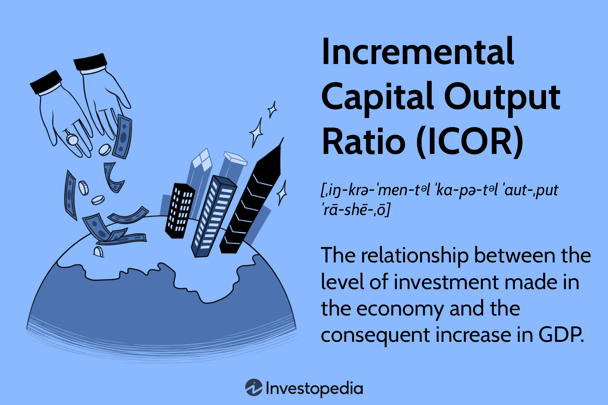

## Table of Contents

## What is the Incremental Capital Output Ratio (ICOR)?

The Incremental Capital Output Ratio (ICOR) is a measure used to understand how efficiently an economy or a company is using its capital to produce goods and services. It tells us how much additional capital is needed to generate one more unit of output. For example, if a country needs $5 of new investment to produce an extra $1 of GDP, then its ICOR is 5. A lower ICOR means that the economy or company is using its capital more efficiently, as less investment is needed to produce additional output.

ICOR is important for planning and policy-making because it helps governments and businesses decide how much to invest to achieve desired growth. If the ICOR is high, it means a lot of capital is needed for a small increase in output, which can be challenging for developing economies. On the other hand, a low ICOR suggests that investments are being used effectively, leading to stronger economic growth with less capital. By understanding and monitoring ICOR, decision-makers can better manage resources and set realistic growth targets.

## How is ICOR calculated?

ICOR is calculated by dividing the amount of new investment by the increase in output it creates. For a country, this means dividing the change in its capital stock by the change in its Gross Domestic Product (GDP). For example, if a country invests an extra $100 billion in its economy and this leads to a $20 billion increase in GDP, the ICOR would be $100 billion divided by $20 billion, which equals 5.

This calculation helps us see how efficiently an economy or a business is turning investment into more goods and services. A lower ICOR means that less investment is needed to grow the economy or increase production, showing good efficiency. A higher ICOR indicates that more investment is required for the same amount of growth, which could mean the economy or business is not using its resources as effectively.

## Why is ICOR important in economic analysis?

ICOR is important in economic analysis because it helps us understand how well a country or a business is using its money to grow. When a country wants to make its economy bigger, it needs to spend money on things like factories, roads, and schools. ICOR tells us how much extra money is needed to make the economy grow by a certain amount. If the ICOR is low, it means the country is good at turning money into more goods and services, which is a good sign for the economy.

Economists and policymakers use ICOR to plan how much money they should invest to reach their growth goals. For example, if a country wants its GDP to grow by $10 billion and its ICOR is 4, it knows it needs to invest $40 billion. This helps them set realistic targets and make smart decisions about where to spend money. If the ICOR is high, it might mean the country needs to find ways to use its money more efficiently, or it might need more investment to achieve the same growth.

## What does a low ICOR indicate about an economy?

A low ICOR means an economy is good at turning money into more goods and services. When a country has a low ICOR, it doesn't need to spend a lot of money to make its economy grow. This is a good sign because it shows the country is using its resources well.

For example, if a country only needs to invest $3 to get $1 more in GDP, its ICOR is 3. This low number tells us that the economy is efficient. It can grow quickly without needing a lot of new money, which makes it easier for the country to plan and reach its growth goals.

## What does a high ICOR suggest about an economy's efficiency?

A high ICOR means an economy needs a lot of money to grow a little bit. If a country has a high ICOR, it's not using its money very well. For example, if it takes $10 of new investment to make the GDP grow by $1, the ICOR is 10. This high number shows the economy isn't efficient. It's like trying to fill a bucket with a tiny hole; you need a lot of water to make the level go up.

This can be a problem for a country because it makes it harder to grow. If the economy needs so much money just to get a small increase in GDP, it can slow down progress. Leaders might need to find ways to use money better, or they might need to invest even more to reach their goals. A high ICOR tells us the economy needs to work on being more efficient with its resources.

## How does ICOR relate to the concept of capital productivity?

ICOR and capital productivity are closely related because they both tell us about how well an economy uses its money. Capital productivity looks at how much output, like goods and services, a country gets from its capital, like machines and buildings. If an economy has high capital productivity, it means it's good at turning money into more stuff. ICOR, on the other hand, shows how much new money is needed to make the economy grow a little bit. If the ICOR is low, it means the economy doesn't need a lot of new money to grow, which is a sign of high capital productivity.

When we look at ICOR, we can learn a lot about an economy's capital productivity. A low ICOR means the economy is using its money well, which is the same as having high capital productivity. It's like getting a lot of bang for your buck. On the other hand, a high ICOR means the economy needs a lot of new money just to grow a little, which shows low capital productivity. It's like trying to push a heavy cart uphill; it takes a lot of effort for a small gain. By understanding ICOR, we can see how productive an economy's capital is and make better plans for growth.

## Can ICOR be used to compare the efficiency of different countries?

Yes, ICOR can be used to compare how well different countries are using their money to grow their economies. If one country has a lower ICOR than another, it means the first country needs less new money to make its economy bigger. This shows that the first country is using its money more efficiently. For example, if Country A has an ICOR of 3 and Country B has an ICOR of 6, Country A is better at turning money into more goods and services.

However, comparing ICOR across countries isn't always straightforward. Different countries have different kinds of economies, and things like the quality of their infrastructure, the skills of their workers, and even their political systems can affect how well they use their money. So while ICOR can give us a good idea about efficiency, it's important to look at other factors too to get the full picture.

## What are the limitations of using ICOR as an economic indicator?

Using ICOR to understand how well a country uses its money has some problems. One big problem is that ICOR doesn't take into account things like how good the country's roads and buildings are, or how skilled its workers are. These things can make a big difference in how well a country can turn money into more goods and services. Also, ICOR can be affected by things like how much a country is already spending on its economy. If a country is already spending a lot, it might need more money just to keep growing, which can make its ICOR look worse than it really is.

Another issue with ICOR is that it can be hard to compare between different countries. Every country has its own way of doing things, and what works well in one place might not work the same in another. For example, a country with a lot of factories might need less money to grow than a country that relies more on farming. So, while ICOR can give us a good idea about how well a country is using its money, it's important to look at other things too to get the full picture.

## How does ICOR influence investment decisions in businesses?

ICOR helps businesses figure out how much money they need to spend to grow. If a business has a low ICOR, it means they don't need to spend a lot of money to make more products or services. This is good because it shows the business is using its money well. For example, if a company only needs to spend $2 to make $1 more in sales, it has an ICOR of 2. This low number tells the business leaders that they can grow without spending too much, which can help them decide to invest more in new projects or expand their business.

On the other hand, if a business has a high ICOR, it means they need to spend a lot of money just to grow a little bit. This can be a problem because it shows the business isn't using its money as well as it could. For example, if a company needs to spend $10 to make $1 more in sales, its ICOR is 10. This high number might make business leaders think twice about new investments because they know it will take a lot of money to see any growth. They might look for ways to use their money more efficiently or decide to wait until they can find better ways to grow.

## What historical trends can be observed in ICOR across different economies?

Over time, we can see that ICOR has changed in different ways across various economies. In many developed countries, like the United States and Japan, ICOR has generally been lower than in developing countries. This means these countries have been better at turning money into more goods and services. For example, after World War II, many developed countries had ICORs around 3 or 4, which helped them grow quickly. But as these economies got bigger and more complex, their ICORs started to rise a bit because it became harder to keep growing at the same pace.

In developing countries, ICORs have often been higher, sometimes reaching 5 or even higher. This means these countries need more money to grow their economies. For example, in the 1970s and 1980s, many countries in Africa and Latin America had high ICORs because they were still building up their infrastructure and industries. Over time, some of these countries, like China and South Korea, managed to lower their ICORs by improving how they used their money, which helped them grow faster. But for others, high ICORs have remained a challenge, making it harder to achieve strong economic growth.

## How do changes in technology affect the ICOR?

Changes in technology can make the ICOR go down because new technology helps businesses and countries use their money better. For example, when new machines or computers come out, they can help factories make more stuff without needing to spend as much money. This means that the same amount of money can now make more goods and services, which makes the ICOR lower. When countries or companies use new technology, they can grow their economies or businesses without spending a lot of extra money, which is good for them.

But sometimes, new technology can also make the ICOR go up at first. This happens because it can cost a lot of money to buy and set up new technology. If a country or business spends a lot on new machines but doesn't see a big increase in what they produce right away, their ICOR can go up. Over time, though, as they get better at using the new technology, their ICOR usually goes back down. So, while new technology can help make things more efficient in the long run, it might take some time and money to get there.

## What advanced methodologies can be used to refine ICOR calculations for more accurate economic forecasting?

To make ICOR calculations more accurate for economic forecasting, economists can use advanced methods like econometric modeling. This means using math and [statistics](/wiki/bayesian-statistics) to look at how different things in the economy affect each other. For example, they can use regression analysis to see how changes in technology, education, or infrastructure might change the ICOR. By including these factors in their models, economists can get a better idea of how much money a country needs to spend to grow its economy. This helps them make better predictions about future growth and plan more effectively.

Another way to refine ICOR calculations is by using panel data analysis. This method looks at data from many different countries or regions over time. By comparing how ICOR changes in different places, economists can see what works well and what doesn't. They can also use this data to understand how things like government policies or global economic trends affect ICOR. By using these advanced methods, economists can make their ICOR calculations more accurate and useful for planning and forecasting economic growth.

## What is the Incremental Capital Output Ratio (ICOR)?

The Incremental Capital Output Ratio (ICOR) is an essential economic metric that bridges the relationship between the level of investment in an economy and its growth in output, typically measured by Gross Domestic Product (GDP). It evaluates the amount of additional capital required to produce an additional unit of output. This measure plays a pivotal role in understanding the efficiency of capital deployment within an economy.

A key premise of ICOR is that a lower ratio signifies higher capital investment efficiency, suggesting that less capital is needed to generate additional output. Conversely, a higher ICOR denotes relative inefficiency, indicating that more capital is needed to achieve the same increment in output.

The foundation of ICOR lies in the Harrod-Domar growth model, a classical economic theory which postulates that an economy’s growth rate is directly tied to its level of savings and investment. According to this model, sustainable economic growth can be achieved by boosting savings that fuel investments, which in turn, lead to an increase in output and income. Thus, ICOR can be expressed mathematically as:

$$
\text{ICOR} = \frac{\text{Annual Investment}}{\text{Annual Increase in GDP}}
$$

This calculation serves as a critical indicator for policymakers and investors, providing insights into how effectively an economy transforms investment into economic growth. The eventual aim is to achieve a lower ICOR, reflecting a more efficient allocation of capital that could potentially result in rapid economic expansion.

## How is the ICOR Calculated?

The Incremental Capital Output Ratio (ICOR) is calculated using the formula:

$$
\text{ICOR} = \frac{\text{Annual Investment}}{\text{Annual Increase in GDP}}
$$

This straightforward calculation is integral in measuring the effectiveness of investment in an economy. By dividing the total annual investment by the corresponding annual increase in GDP, the ICOR value provides a numerical representation of investment efficiency. 

The resulting ratio is crucial for assessing the productivity of capital investments. A lower ICOR indicates that less capital is needed to generate additional output, signifying higher investment efficiency. Conversely, a higher ICOR suggests that more capital is required for the same level of output, indicating inefficiency.

Understanding the ICOR allows economists to evaluate how effectively an economy converts investment into economic growth. It serves as a tool for pinpointing areas where capital is used efficiently or where there is substantial room for improvement in investment practices. This efficiency assessment is pivotal for both policymakers and investors, as it impacts economic planning and strategic investment decisions. 

In [algorithmic trading](/wiki/algorithmic-trading), the knowledge of ICOR plays a significant role in informing trading algorithms and strategies by highlighting countries or sectors with effective capital allocation, thereby optimizing investment portfolios. This quantitative measure, while simple, provides substantial insights into the economic environment and the productivity gains derived from capital investments.

## References & Further Reading

[1]: Harrod, R. F. (1939). "An Essay in Dynamic Theory." The Economic Journal, 49(193), 14-33.

[2]: Domar, E. D. (1946). "Capital Expansion, Rate of Growth, and Employment." Econometrica, 14(2), 137-147.

[3]: ["Advances in Financial Machine Learning"](https://www.amazon.com/Advances-Financial-Machine-Learning-Marcos/dp/1119482089) by Marcos Lopez de Prado

[4]: ["Quantitative Trading: How to Build Your Own Algorithmic Trading Business"](https://www.amazon.com/Quantitative-Trading-Build-Algorithmic-Business/dp/1119800064) by Ernest P. Chan

[5]: ["Macroeconomic Theory and the Harrod-Domar Model"](https://www.economicsdiscussion.net/harrod-domar-model/the-harrod-domar-economic-growth-model-with-assumptions/14789) via Economics Discussion

[6]: Solow, R. M. (1956). "A Contribution to the Theory of Economic Growth." The Quarterly Journal of Economics, 70(1), 65–94.