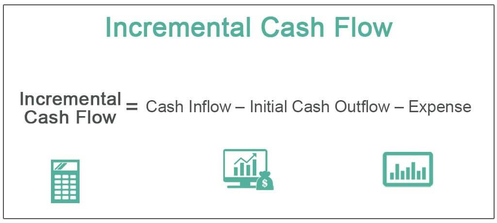

## Table of Contents

## What is incremental cash flow?

Incremental cash flow is the additional cash that a company gains or loses from taking a specific action, like starting a new project or buying new equipment. It helps businesses figure out if a new project will be worth the investment by looking at how much more money it will bring in compared to how much it will cost.

To find incremental cash flow, you need to compare the cash flows with and without the new action. This means adding up all the extra money coming in from the project and subtracting all the extra costs, like new materials or labor. It's important because it shows the real financial impact of a decision, helping companies make smarter choices about where to invest their money.

## Why is incremental cash flow important in financial analysis?

Incremental cash flow is really important in financial analysis because it helps businesses see the exact financial effect of a new project or investment. By looking at the extra money coming in and going out because of the new action, companies can figure out if it's a good idea to go ahead with it. This is key for making smart choices about where to put their money, making sure they pick projects that will actually make them more money in the end.

Understanding incremental cash flow also helps avoid mistakes in financial planning. Sometimes, businesses might think a project will be profitable just by looking at the big picture, but they might miss out on the smaller, yet important, details like increased costs or decreased sales in other areas. By focusing on incremental cash flow, companies can see these details clearly and make more accurate predictions about their future finances. This way, they can avoid projects that might look good on the surface but could actually lose them money.

## How does incremental cash flow differ from total cash flow?

Incremental cash flow and total cash flow are different ways to look at a company's money. Incremental cash flow is all about the extra money that comes in or goes out because of a specific action, like starting a new project. It helps a company decide if doing something new will make them more money. On the other hand, total cash flow is the whole amount of money a company gets and spends over a certain time. It's like looking at the big picture of all the money moving in and out of the business.

When a company wants to see if a new project is worth it, they use incremental cash flow. This way, they can focus on just the changes caused by the new project, without getting mixed up with the money from everything else the company is doing. Total cash flow, however, doesn't separate out these changes. It's more about understanding the overall financial health of the company, showing how much money is coming in from all sources and going out for all expenses. So, while incremental cash flow helps with specific decisions, total cash flow gives a broader view of the company's money situation.

## What are the key components of incremental cash flow?

Incremental cash flow includes the extra money coming in and going out because of a new project. This means looking at the additional sales or revenue that the project brings in. For example, if a company starts selling a new product, the money from those sales is part of the incremental cash flow. It also includes any other ways the project might increase money coming into the business, like new customers or higher prices for existing products.

On the other hand, incremental cash flow also accounts for the extra costs that come with the project. This includes things like the cost of new materials, labor, or equipment needed for the project. It also covers any increase in operating expenses, like higher utility bills or more advertising. Sometimes, starting a new project might even reduce money coming in from other parts of the business, like if it takes customers away from existing products. All these changes in costs and revenues are what make up the incremental cash flow, helping a company see if the project is worth it.

## Can you provide a basic example of calculating incremental cash flow?

Imagine a small bakery thinking about adding a new line of gluten-free cookies. They want to figure out if it's a good idea by calculating the incremental cash flow. They expect to sell 500 boxes of these cookies each month at $5 per box. That's an extra $2,500 in revenue every month. But, they'll need to buy special ingredients that cost $1,000 a month and hire someone to help with baking, which will cost another $800 a month. So, the total extra costs are $1,800 a month.

To find the incremental cash flow, the bakery subtracts the extra costs from the extra revenue. That's $2,500 in revenue minus $1,800 in costs, which equals $700. This means that adding the gluten-free cookies would bring in an extra $700 a month. If this number stays positive and the bakery thinks it's worth the effort, then it might be a good idea to start selling the new cookies.

## What are common mistakes to avoid when calculating incremental cash flow?

When figuring out incremental cash flow, it's easy to make mistakes like mixing up the new project's money with the regular business money. You need to only look at the money that changes because of the new project, not the money from everything else the company is doing. For example, if a company wants to start selling a new product, they should only count the money from that product and the costs to make it, not the money from their old products.

Another common mistake is forgetting to include all the costs that come with the new project. Sometimes, people might only think about the big costs, like buying new machines, but forget smaller ones like extra electricity or more advertising. It's important to think about everything that will change because of the new project, even if it's small, because all these costs add up and can make a big difference in whether the project is worth it.

Also, people might not consider how the new project could affect other parts of the business. For example, if a company starts selling a new product, it might take customers away from their old products. This loss of sales from other products should be counted as a cost of the new project. By looking at all these things carefully, companies can get a better idea of the real impact of their new projects.

## How does incremental cash flow relate to capital budgeting decisions?

Incremental cash flow is super important when companies make capital budgeting decisions. Capital budgeting is all about deciding where to spend money on big projects, like buying new machines or starting a new product line. Incremental cash flow helps with these decisions because it shows the extra money a project will bring in compared to the extra money it will cost. By looking at this, companies can figure out if a project will make them more money in the long run.

When a company is thinking about a new project, they use incremental cash flow to see if it's a good investment. They add up all the extra money coming in from the project and subtract all the extra costs. If the result is positive, it means the project will bring in more money than it costs, which is a good sign. This helps the company choose projects that will help them grow and make more money, avoiding ones that might lose money.

## What role does incremental cash flow play in project evaluation?

Incremental cash flow is really important when a company wants to check out a new project. It helps them see the extra money that will come in and go out because of the project. By looking at this, the company can figure out if the project will make them more money than it costs. This is key for deciding if they should go ahead with the project or not. If the incremental cash flow is positive, it means the project will bring in more money than it costs, which is a good sign.

When a company is evaluating a project, they need to think about all the little details that might change because of it. This includes not just the big costs like buying new equipment, but also smaller things like extra electricity or more advertising. Incremental cash flow helps them see all these changes clearly, so they can make a smart decision. By looking at the whole picture of how the project will affect their money, they can pick projects that will help them grow and make more money in the long run.

## How can incremental cash flow be used to assess the viability of a new project?

Incremental cash flow is a key tool for figuring out if a new project is a good idea. It shows the extra money that will come in and go out because of the project. By looking at this, a company can see if the project will bring in more money than it costs. If the incremental cash flow is positive, it means the project will make them more money, which is a good sign. This helps the company decide if they should go ahead with the project or not.

When a company is thinking about a new project, they need to consider all the little details that might change because of it. This includes the big costs like buying new equipment, but also smaller things like extra electricity or more advertising. Incremental cash flow helps them see all these changes clearly. By looking at the whole picture of how the project will affect their money, they can pick projects that will help them grow and make more money in the long run.

## What advanced techniques can be used to forecast incremental cash flows?

To forecast incremental cash flows, companies can use a technique called scenario analysis. This means they look at different possible futures for their project. They might think about what would happen if sales are really good, just okay, or not so great. By figuring out the cash flows for each of these scenarios, they can get a better idea of how the project might do in real life. This helps them be ready for different situations and make smarter decisions.

Another advanced technique is sensitivity analysis. This is where a company changes one thing at a time to see how it affects the cash flow. For example, they might change the price of their product or the cost of materials and see what happens to the money coming in and going out. This helps them understand which parts of the project are most important and where they need to be careful. By doing this, they can plan better and make sure their project will be successful no matter what changes happen.

## How do taxes and depreciation affect incremental cash flow calculations?

Taxes and depreciation are important when figuring out incremental cash flow. When a company starts a new project, it has to think about the extra taxes it will have to pay because of the new money coming in. If the project makes more money, the company will have to pay more taxes. But, taxes can also help because the company can take away the costs of the project from their taxes, which means they pay less. So, when calculating incremental cash flow, the company needs to add the extra taxes they will pay and subtract the tax savings they get from the project's costs.

Depreciation is another thing that affects incremental cash flow. It's a way to spread out the cost of buying something big, like a machine, over time. Even though depreciation doesn't mean actual money is going out, it still matters for taxes. The company can take away the depreciation from their taxes, which means they pay less. So, when figuring out incremental cash flow, the company needs to add back the depreciation to the cash flow because it's not a real cost, but they also get to subtract the tax savings they get from it. This helps them see the real money impact of the project.

## What are the limitations of using incremental cash flow in financial decision-making?

Using incremental cash flow to make financial decisions can be really helpful, but it's not perfect. One big problem is that it can be hard to predict all the extra money coming in and going out because of a new project. Sometimes, things don't go as planned, like if sales are lower than expected or costs are higher. This means the numbers used for incremental cash flow might not be right, which can lead to bad decisions.

Another limitation is that incremental cash flow doesn't always think about the bigger picture. It focuses on just the new project, but sometimes starting a new project can affect other parts of the business. For example, it might take customers away from existing products or use up resources that could be used elsewhere. If a company only looks at incremental cash flow, they might miss these important effects and make choices that aren't the best for the whole business.

## What is Cash Flow Analysis?

Cash flow analysis involves scrutinizing the flow of cash within a business over a specified period. This analysis is pivotal for evaluating a company's liquidity and overall financial health. It helps stakeholders, including management, investors, and creditors, to understand how cash is generated and utilized, which in turn influences decision-making and strategic planning.

A company's cash flow is categorized into three main types: operating activities, investing activities, and financing activities. 

1. **Operating Cash Flow**: This is the cash generated from the core business operations. It includes revenue from sales, payments to suppliers and employees, and other expenditures necessary for the day-to-day functioning of the business. Operating cash flow is a key indicator of whether a company can generate sufficient positive cash flow to maintain or expand operations without needing external financing. The formula for calculating operating cash flow is:
$$
   \text{Operating Cash Flow} = \text{Net Income} + \text{Non-Cash Expenses} - \text{Changes in Working Capital}

$$

   Python code to calculate operating cash flow might look like:

   ```python
   def operating_cash_flow(net_income, non_cash_expenses, changes_in_working_capital):
       return net_income + non_cash_expenses - changes_in_working_capital
   ```

2. **Investing Cash Flow**: This pertains to cash used for or generated from investment activities such as the purchase or sale of assets, investments in securities, or acquisition of other businesses. It provides insights into a company’s growth strategy. Negative investing cash flows often indicate active investment in the firm's future, while positive flows might arise from asset divestitures.

3. **Financing Cash Flow**: This section reflects the cash moving between the business and its owners, investors, or creditors. It includes dividends paid, proceeds from issuing or repurchasing stocks or bonds, and repayment of borrowings. Financing activities are crucial for understanding changes in the capital structure of a company.

By analyzing these three cash flow types, stakeholders can gauge a company's financial stability and operational efficiency. Unlike net income, cash flow analysis provides a clearer picture of a company's financial health by focusing solely on cash transactions, thereby excluding non-cash accounting entries that might distort profit figures. This analysis is crucial for identifying potential [liquidity](/wiki/liquidity-risk-premium) issues before they become critical.

## What is Incremental Cash Flow: Its Definition and Importance?

Incremental cash flow represents the net additional cash flow generated by embarking on a new project or investment. This concept is pivotal in financial analysis as it provides a clear picture of the potential gains from the new endeavor. Essentially, it is calculated by comparing the cash flows of two scenarios: one with the project and one without it. The formula to calculate incremental cash flow is:

$$
\text{Incremental Cash Flow} = \text{Cash Flow with Project} - \text{Cash Flow without Project}
$$

A positive incremental cash flow indicates that the project or investment is likely to be financially beneficial, emphasizing its importance in evaluating the potential returns relative to the costs. This is significant in capital budgeting, where businesses assess potential projects to determine which ones will likely yield the highest return on investment.

In investment decision-making, incremental cash flow analysis aids in forecasting future cash flows that the investment will bring, helping experts distinguish between profitable and unprofitable investments. It provides a more accurate basis for estimating a project's financial contribution compared to mere revenue projections. Therefore, understanding incremental cash flow is vital for financial analysts and business managers aiming to optimize the allocation of capital resources effectively.

## What are the components of incremental cash flow calculation?

Incremental cash flow calculation is pivotal in assessing the potential profitability of an investment project. This process involves evaluating several key components:

1. **Initial Outlay**: The initial outlay refers to the upfront cost required to start a project. This includes expenditures for assets, equipment, and installation, as well as any additional working capital needed at the project's inception. Calculating the initial outlay involves summing these costs, which provides the baseline for analyzing future cash flows.
$$
   \text{Initial Outlay} = \text{Capital Expenditures} + \text{Net Working Capital}

$$

2. **Projected Revenue**: Projected revenue represents the expected income generated from the project over a specific period. Estimating projected revenue requires market analysis, demand forecasts, and pricing strategies to predict sales volumes and revenues accurately. It's essential to use realistic assumptions to ensure that the forecasts are reliable.

3. **Operating Expenses**: These are the recurring costs necessary to maintain the project's operations, such as labor, materials, utilities, and maintenance. Operating expenses must be deducted from projected revenue to determine the operating cash flow. Effectively managing these expenses is crucial for maximizing net cash flow.
$$
   \text{Operating Cash Flow} = \text{Projected Revenue} - \text{Operating Expenses} - \text{Taxes}

$$

4. **Terminal Cash Flow**: Terminal cash flow represents the cash flow expected from the disposal of project assets at the end of its life, including salvage value and the recovery of working capital. This component is crucial for projects with significant assets that have remaining value. Including terminal cash flow in the analysis provides a more comprehensive view of the project's overall value.
$$
   \text{Terminal Cash Flow} = \text{Salvage Value} + \text{Recovery of Working Capital}

$$

These components collectively contribute to the estimation of net cash flow, which is crucial for determining the viability and potential success of a new project. Accurate calculation and thorough understanding of each component enable financial analysts and decision-makers to make informed assessments.

## What are Financial Examples of Incremental Cash Flow?

Analyzing financial examples of incremental cash flow can offer valuable practical insights into how companies utilize these calculations for decision-making processes. Consider a scenario where a company is evaluating whether to launch a new product line. The pivotal aspect of such a decision hinges on understanding the project's incremental cash flow, which involves assessing the additional revenues and costs relative to the status quo.

### Case Study: Product Expansion in a Tech Company

Suppose a tech company, TechInnovate Inc., plans to introduce a new wearable device. The decision to proceed will be informed by the incremental cash flow generated from this project. 

#### Initial Outlay and Investment

The initial investment, or the initial outlay, for TechInnovate Inc. involves expenses such as research and development, manufacturing setup costs, and marketing. Let’s assume these expenses total $5 million. This forms the project's initial cash outflow.

#### Projected Revenue

The incremental revenue is projected based on market research which forecasts sales of 100,000 units annually at a price of $200 per unit. Therefore, the projected annual revenue from the new product line is:

$$

\text{Projected Revenue} = \text{Units Sold} \times \text{Price per Unit} = 100,000 \times 200 = \$20,000,000 
$$

#### Operating Expenses

Operating expenses cover costs related to production, marketing, and distribution. Assume these costs are $12 million per year. Thus, the yearly incremental operating cash inflow is:

$$

\text{Annual Cash Flow} = \text{Projected Revenue} - \text{Operating Expenses} = \$20,000,000 - \$12,000,000 = \$8,000,000 
$$

#### Terminal Cash Flow

At the project's end, there might be additional cash flows from salvage values of equipment or reduced working capital needs. Let us assume an additional $1 million is realized as terminal cash flow at the end of the project lifespan.

### Calculating Incremental Cash Flow

Finally, we incorporate all elements to determine the net incremental cash flow over the project's expected life of five years:

$$

\text{Net Incremental Cash Flow} = -\$5,000,000 + (\$8,000,000 \times 5) + \$1,000,000 = \$36,000,000 
$$

### Decision-Making Process

TechInnovate will compare this net incremental cash flow against their required rate of return or use metrics such as Net Present Value (NPV) or Internal Rate of Return (IRR) to decide whether the product launch is financially feasible. A positive NPV or IRR exceeding the company's benchmark rate would justify proceeding with the project.

### Conclusion

Real-world examples like TechInnovate's illustrate how incremental cash flow analysis aids companies in evaluating financial viability. Such detailed insights enable informed decision-making regarding new investments, ultimately contributing to sustainable financial growth and strategic planning.

## References & Further Reading

[1]: ["Financial Modeling of the Equity Market: From CAPM to Cointegration"](https://www.amazon.com/Financial-Modeling-Equity-Market-Cointegration/dp/0471699004) by Frank J. Fabozzi

[2]: Graham, J. R., & Harvey, C. R. (2001). ["The Theory and Practice of Corporate Finance: Evidence from the Field."](https://www.sciencedirect.com/science/article/pii/S0304405X01000447) Journal of Financial Economics.

[3]: ["Principles of Corporate Finance"](https://www.fincart.com/blog/corporate-finance-importance-types-principles/) by Richard A. Brealey, Stewart C. Myers, and Franklin Allen

[4]: Bodie, Z., Kane, A., & Marcus, A. J. (2014). ["Investments and Portfolio Management"](https://books.google.com/books/about/EBOOK_Investments_Global_edition.html?id=BMsvEAAAQBAJ) 

[5]: ["Advances in Financial Machine Learning"](https://www.amazon.com/Advances-Financial-Machine-Learning-Marcos/dp/1119482089) by Marcos Lopez de Prado

[6]: Chance, D. M., & Brooks, R. (2015). ["Introduction to Derivatives and Risk Management"](https://books.google.com/books/about/Introduction_to_Derivatives_and_Risk_Man.html?id=b8PgBQAAQBAJ)
