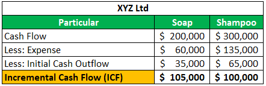

Cash flow analysis and incremental cash flow are fundamental concepts in the field of finance, crucial for making well-informed financial decisions. Cash flow analysis involves examining how cash enters and exits a business over a specified period, providing insights into a company's liquidity and overall financial health. This analytical process is indispensable for managers, investors, and stakeholders who wish to evaluate a company's operational efficiency and ability to generate cash.

Incremental cash flow, on the other hand, refers to the additional cash that a company expects to generate from undertaking a specific project or investment. It is a key factor in determining the potential profitability and financial viability of new ventures. A positive incremental cash flow signals that the project is likely to enhance shareholder value, whereas a negative flow may indicate potential financial risks.



These concepts are increasingly relevant in various financial contexts, such as capital budgeting and investment analysis. As companies expand and diversify their operations, understanding the implications of new investments on cash flows enables informed decision-making and strategic planning. Moreover, the integration of cash flow insights into algorithmic trading systems has emerged as a sophisticated approach to assessing market dynamics and forecasting financial outcomes.

Algorithmic trading, which employs computer algorithms to execute trades at optimal speeds and accuracy, can significantly benefit from the analysis of cash flows. By incorporating financial metrics derived from cash flow analysis, trading algorithms can enhance decision-making processes, offering a robust framework for evaluating a company's future performance and market behavior.

This article aims to provide a comprehensive understanding of cash flow analysis and incremental cash flow, emphasizing their significance and application in financial decision-making and algorithmic trading. Through this exploration, readers will gain valuable insights into these critical financial tools and their role in shaping investment strategies and predicting market movements.

## Table of Contents

## What is Cash Flow Analysis?

Cash flow analysis involves scrutinizing the flow of cash within a business over a specified period. This analysis is pivotal for evaluating a company's liquidity and overall financial health. It helps stakeholders, including management, investors, and creditors, to understand how cash is generated and utilized, which in turn influences decision-making and strategic planning.

A company's cash flow is categorized into three main types: operating activities, investing activities, and financing activities. 

1. **Operating Cash Flow**: This is the cash generated from the core business operations. It includes revenue from sales, payments to suppliers and employees, and other expenditures necessary for the day-to-day functioning of the business. Operating cash flow is a key indicator of whether a company can generate sufficient positive cash flow to maintain or expand operations without needing external financing. The formula for calculating operating cash flow is:
$$
   \text{Operating Cash Flow} = \text{Net Income} + \text{Non-Cash Expenses} - \text{Changes in Working Capital}

$$

   Python code to calculate operating cash flow might look like:

   ```python
   def operating_cash_flow(net_income, non_cash_expenses, changes_in_working_capital):
       return net_income + non_cash_expenses - changes_in_working_capital
   ```

2. **Investing Cash Flow**: This pertains to cash used for or generated from investment activities such as the purchase or sale of assets, investments in securities, or acquisition of other businesses. It provides insights into a company’s growth strategy. Negative investing cash flows often indicate active investment in the firm's future, while positive flows might arise from asset divestitures.

3. **Financing Cash Flow**: This section reflects the cash moving between the business and its owners, investors, or creditors. It includes dividends paid, proceeds from issuing or repurchasing stocks or bonds, and repayment of borrowings. Financing activities are crucial for understanding changes in the capital structure of a company.

By analyzing these three cash flow types, stakeholders can gauge a company's financial stability and operational efficiency. Unlike net income, cash flow analysis provides a clearer picture of a company's financial health by focusing solely on cash transactions, thereby excluding non-cash accounting entries that might distort profit figures. This analysis is crucial for identifying potential [liquidity](/wiki/liquidity-risk-premium) issues before they become critical.

## Incremental Cash Flow: Definition and Importance

Incremental cash flow represents the net additional cash flow generated by embarking on a new project or investment. This concept is pivotal in financial analysis as it provides a clear picture of the potential gains from the new endeavor. Essentially, it is calculated by comparing the cash flows of two scenarios: one with the project and one without it. The formula to calculate incremental cash flow is:

$$
\text{Incremental Cash Flow} = \text{Cash Flow with Project} - \text{Cash Flow without Project}
$$

A positive incremental cash flow indicates that the project or investment is likely to be financially beneficial, emphasizing its importance in evaluating the potential returns relative to the costs. This is significant in capital budgeting, where businesses assess potential projects to determine which ones will likely yield the highest return on investment.

In investment decision-making, incremental cash flow analysis aids in forecasting future cash flows that the investment will bring, helping experts distinguish between profitable and unprofitable investments. It provides a more accurate basis for estimating a project's financial contribution compared to mere revenue projections. Therefore, understanding incremental cash flow is vital for financial analysts and business managers aiming to optimize the allocation of capital resources effectively.

## Components of Incremental Cash Flow Calculation

Incremental cash flow calculation is pivotal in assessing the potential profitability of an investment project. This process involves evaluating several key components:

1. **Initial Outlay**: The initial outlay refers to the upfront cost required to start a project. This includes expenditures for assets, equipment, and installation, as well as any additional working capital needed at the project's inception. Calculating the initial outlay involves summing these costs, which provides the baseline for analyzing future cash flows.
$$
   \text{Initial Outlay} = \text{Capital Expenditures} + \text{Net Working Capital}

$$

2. **Projected Revenue**: Projected revenue represents the expected income generated from the project over a specific period. Estimating projected revenue requires market analysis, demand forecasts, and pricing strategies to predict sales volumes and revenues accurately. It's essential to use realistic assumptions to ensure that the forecasts are reliable.

3. **Operating Expenses**: These are the recurring costs necessary to maintain the project's operations, such as labor, materials, utilities, and maintenance. Operating expenses must be deducted from projected revenue to determine the operating cash flow. Effectively managing these expenses is crucial for maximizing net cash flow.
$$
   \text{Operating Cash Flow} = \text{Projected Revenue} - \text{Operating Expenses} - \text{Taxes}

$$

4. **Terminal Cash Flow**: Terminal cash flow represents the cash flow expected from the disposal of project assets at the end of its life, including salvage value and the recovery of working capital. This component is crucial for projects with significant assets that have remaining value. Including terminal cash flow in the analysis provides a more comprehensive view of the project's overall value.
$$
   \text{Terminal Cash Flow} = \text{Salvage Value} + \text{Recovery of Working Capital}

$$

These components collectively contribute to the estimation of net cash flow, which is crucial for determining the viability and potential success of a new project. Accurate calculation and thorough understanding of each component enable financial analysts and decision-makers to make informed assessments.

## Financial Examples of Incremental Cash Flow

Analyzing financial examples of incremental cash flow can offer valuable practical insights into how companies utilize these calculations for decision-making processes. Consider a scenario where a company is evaluating whether to launch a new product line. The pivotal aspect of such a decision hinges on understanding the project's incremental cash flow, which involves assessing the additional revenues and costs relative to the status quo.

### Case Study: Product Expansion in a Tech Company

Suppose a tech company, TechInnovate Inc., plans to introduce a new wearable device. The decision to proceed will be informed by the incremental cash flow generated from this project. 

#### Initial Outlay and Investment

The initial investment, or the initial outlay, for TechInnovate Inc. involves expenses such as research and development, manufacturing setup costs, and marketing. Let’s assume these expenses total $5 million. This forms the project's initial cash outflow.

#### Projected Revenue

The incremental revenue is projected based on market research which forecasts sales of 100,000 units annually at a price of $200 per unit. Therefore, the projected annual revenue from the new product line is:

$$

\text{Projected Revenue} = \text{Units Sold} \times \text{Price per Unit} = 100,000 \times 200 = \$20,000,000 
$$

#### Operating Expenses

Operating expenses cover costs related to production, marketing, and distribution. Assume these costs are $12 million per year. Thus, the yearly incremental operating cash inflow is:

$$

\text{Annual Cash Flow} = \text{Projected Revenue} - \text{Operating Expenses} = \$20,000,000 - \$12,000,000 = \$8,000,000 
$$

#### Terminal Cash Flow

At the project's end, there might be additional cash flows from salvage values of equipment or reduced working capital needs. Let us assume an additional $1 million is realized as terminal cash flow at the end of the project lifespan.

### Calculating Incremental Cash Flow

Finally, we incorporate all elements to determine the net incremental cash flow over the project's expected life of five years:

$$

\text{Net Incremental Cash Flow} = -\$5,000,000 + (\$8,000,000 \times 5) + \$1,000,000 = \$36,000,000 
$$

### Decision-Making Process

TechInnovate will compare this net incremental cash flow against their required rate of return or use metrics such as Net Present Value (NPV) or Internal Rate of Return (IRR) to decide whether the product launch is financially feasible. A positive NPV or IRR exceeding the company's benchmark rate would justify proceeding with the project.

### Conclusion

Real-world examples like TechInnovate's illustrate how incremental cash flow analysis aids companies in evaluating financial viability. Such detailed insights enable informed decision-making regarding new investments, ultimately contributing to sustainable financial growth and strategic planning.

## Algorithmic Trading and Cash Flow Analysis

Incorporating cash flow analysis into [algorithmic trading](/wiki/algorithmic-trading) can significantly enhance the decision-making processes by providing a deeper understanding of a company's financial health. This integration involves utilizing algorithms that analyze cash flow data to make more informed predictions about a company’s future performance.

### Integration Methodologies

Algorithmic trading involves creating algorithms that automatically execute trades based on predefined criteria. By integrating cash flow data, traders can incorporate strong financial metrics into their strategies. The process begins by collecting relevant cash flow metrics, which are then fed into algorithms that assess a company’s financial statements.

#### Data Collection:

The primary step is to collect cash flow data, which includes:

- **Operating Cash Flow (OCF):** Represents cash generated from regular business operations.
- **Investing Cash Flow (ICF):** Involves cash related to investments and long-term assets.
- **Financing Cash Flow (FCF):** Encompasses cash transactions related to equity, debt, and dividends.

This data is often extracted from financial statements released by companies.

#### Algorithm Development:

Once data is aggregated, algorithms can be designed to analyze these metrics. An example in Python might look like this:

```python
import pandas as pd

# Read cash flow data
data = pd.read_csv('cash_flow_data.csv')

# Example function to evaluate financial health based on cash flow
def evaluate_health(row):
    if row['Operating Cash Flow'] > 0 and row['Financing Cash Flow'] < 0:
        return 'Healthy'
    elif row['Investing Cash Flow'] < 0:
        return 'Growth Potential'
    else:
        return 'Risk'

# Apply function to dataset
data['Health'] = data.apply(evaluate_health, axis=1)

# Example usage
print(data.head())
```

This simple example shows how cash flow data can be processed to provide insights into the company's financial health. More sophisticated algorithms could incorporate [machine learning](/wiki/machine-learning) techniques to predict future cash flows based on historical data patterns.

### Examples of Integration

#### Quantitative Tools:

Several trading strategies directly incorporate cash flow analysis. For example, quantitative value investing strategies select stocks based on historical cash flow metrics relative to company value. They often focus on companies with strong historical OCF, suggesting robust operational profit generation.

#### Forecasting Models:

Utilizing cash flow data in forecasting models allows traders to anticipate market movements better. These models analyze trends in OCF, ICF, and FCF to predict future valuations and earnings. Greater accuracy in these forecasts can lead to improved timing of trades and allocation of investment capital.

### Conclusion

The integration of cash flow analysis into algorithmic trading provides a powerful approach to assessing and forecasting company performance. By utilizing comprehensive cash flow data, traders can develop more robust algorithms, enhance trading strategies, and potentially improve investment outcomes.

## Limitations of Cash Flow and Incremental Cash Flow

Cash flow analysis, despite being a critical tool for assessing a company's financial health, has certain limitations that need careful consideration, particularly when it comes to forecasting. One significant challenge is the unpredictability of external market factors. Economic conditions, regulatory changes, and shifts in consumer behavior can drastically impact cash flow projections. For instance, a sudden economic downturn might reduce demand for a company’s products, affecting the projected operating cash flows negatively. Such macroeconomic variables are often beyond the control of company management and can introduce significant [volatility](/wiki/volatility-trading-strategies) into cash flow forecasts.

Operational changes within a company can also alter projected cash flows unexpectedly. Factors such as changes in management, operational restructuring, or unexpected capital expenditures can lead to deviations from anticipated cash flows. A change in management strategy might lead to increased operational costs, reducing the net cash flows forecasted. Similarly, unforeseen capital expenditures required to maintain competitiveness or comply with new regulations can significantly affect financing and investing cash flows, causing deviations from initial projections.

To ensure a balanced and comprehensive financial analysis approach, it is essential to account for these potential variations. Sensitivity analysis can be a practical tool to assess how different scenarios might affect cash flow outcomes. This involves tweaking key assumptions such as sales growth rates, cost estimates, and investment returns, allowing analysts to understand how sensitive projected cash flows are to changes in these assumptions.

Probability distributions and stochastic modeling can enhance the robustness of cash flow forecasts by incorporating uncertainty into the analysis. For those familiar with programming, Python can be used to model such uncertainties. Here's a simple example of how you might simulate cash flow scenarios using Python with a focus on sensitivity analysis:

```python
import numpy as np

# Define assumptions for cash inflow and outflow
cash_inflows = np.random.normal(loc=1000, scale=200, size=1000)
cash_outflows = np.random.normal(loc=800, scale=150, size=1000)

# Calculate net cash flow scenarios
net_cash_flows = cash_inflows - cash_outflows

# Analyze the results
mean_cash_flow = np.mean(net_cash_flows)
probability_positive_cash_flow = np.mean(net_cash_flows > 0)

print(f"Expected Mean Cash Flow: {mean_cash_flow}")
print(f"Probability of Positive Cash Flow: {probability_positive_cash_flow}")
```

Such methods can highlight potential risks and prepare businesses to react effectively to changes, thereby aiding in more stable and reliable financial planning. Ultimately, awareness of these limitations in cash flow and incremental cash flow analyses helps in making well-rounded investment and financial decisions.

## Conclusion

Cash flow and incremental cash flow analysis play a pivotal role in the assessment of investments and broader financial decision-making. These analytical tools provide critical insights into a company's liquidity and ability to generate cash, which are essential metrics for determining financial health. By evaluating how much cash is available for reinvestment, payment of debts, or distributions to shareholders, stakeholders can make informed choices that align with their financial goals.

When combined with algorithmic trading, cash flow and incremental cash flow analyses offer robust tools for interpreting and predicting market behaviors. Algorithms can integrate cash flow metrics to allow traders to assess a company's potential performance more precisely. This integration provides a quantitative foundation for trading strategies, leveraging real-time data to optimize trading execution while reducing risk.

A comprehensive understanding of cash flow and incremental cash flow concepts is invaluable for making well-informed financial and investment decisions. By accurately calculating and interpreting these flows, individuals and organizations can better project profitability, evaluate new projects, and ensure effective capital management. Ultimately, leveraging these financial insights enhances decision-making capabilities and supports the achievement of long-term economic objectives.

## References & Further Reading

[1]: ["Financial Modeling of the Equity Market: From CAPM to Cointegration"](https://www.amazon.com/Financial-Modeling-Equity-Market-Cointegration/dp/0471699004) by Frank J. Fabozzi

[2]: Graham, J. R., & Harvey, C. R. (2001). ["The Theory and Practice of Corporate Finance: Evidence from the Field."](https://www.sciencedirect.com/science/article/pii/S0304405X01000447) Journal of Financial Economics.

[3]: ["Principles of Corporate Finance"](https://www.fincart.com/blog/corporate-finance-importance-types-principles/) by Richard A. Brealey, Stewart C. Myers, and Franklin Allen

[4]: Bodie, Z., Kane, A., & Marcus, A. J. (2014). ["Investments and Portfolio Management"](https://books.google.com/books/about/EBOOK_Investments_Global_edition.html?id=BMsvEAAAQBAJ) 

[5]: ["Advances in Financial Machine Learning"](https://www.amazon.com/Advances-Financial-Machine-Learning-Marcos/dp/1119482089) by Marcos Lopez de Prado

[6]: Chance, D. M., & Brooks, R. (2015). ["Introduction to Derivatives and Risk Management"](https://books.google.com/books/about/Introduction_to_Derivatives_and_Risk_Man.html?id=b8PgBQAAQBAJ)
