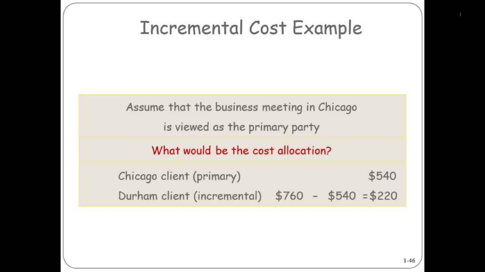

## Table of Contents

## What is incremental cost?

Incremental cost is the extra cost a business has to pay when it makes more products or offers more services. Imagine a bakery that usually makes 100 cakes a day. If they decide to make 10 more cakes, the cost of the extra ingredients, more electricity for the ovens, and maybe more work hours for the bakers are all part of the incremental cost.

Understanding incremental cost is important for businesses because it helps them decide if making more products will be worth it. If the extra money they make from selling those 10 more cakes is more than the incremental cost, then it makes sense to bake more. But if the incremental cost is higher than the extra money they get, it might be better to stick with making just 100 cakes a day.

## How is incremental cost different from marginal cost?

Incremental cost and marginal cost are similar because they both look at the extra costs of making more stuff. But they are a bit different in how they are used. Incremental cost looks at the total extra cost when you make a bunch more products or services. For example, if a factory decides to make 1000 more toys, the incremental cost would include all the extra materials, labor, and other costs for those 1000 toys.

Marginal cost, on the other hand, focuses on the cost of making just one more item. So if that same factory wants to know the cost of making one more toy, they would look at the marginal cost. This can be useful for making quick decisions about whether it's worth it to make one more thing. Both concepts help businesses make smart choices, but they look at costs in slightly different ways.

## Why is incremental cost important for businesses?

Incremental cost is important for businesses because it helps them figure out if making more products or offering more services will make them more money. When a business knows the extra cost of making more stuff, they can compare it to the extra money they will get from selling those things. If the extra money is more than the incremental cost, it makes sense to make more. But if the incremental cost is higher, it might be better to not make more.

Understanding incremental cost also helps businesses plan better. They can see how changes in how much they make will affect their costs. This can help them decide if they should buy more machines, hire more workers, or use different materials. By keeping an eye on incremental costs, businesses can make smarter choices about growing and staying profitable.

## What are the basic steps to calculate incremental cost?

To calculate incremental cost, you first need to figure out what extra costs you will have if you make more products or offer more services. This means looking at things like the cost of extra materials, more labor, and any other costs that go up when you make more. For example, if a bakery wants to make 10 more cakes, they would need to add up the cost of the extra flour, sugar, eggs, and the extra time the bakers will spend.

Once you have all these extra costs added up, you have your incremental cost. This number tells you how much more it will cost to make those extra products or offer those extra services. Businesses use this information to decide if making more is a good idea. If the extra money they will make from selling those extra products is more than the incremental cost, then it makes sense to make more. But if the incremental cost is higher, it might be better to not make more.

## Can you provide a simple example of incremental cost calculation?

Imagine a small lemonade stand that usually makes 50 cups of lemonade each day. The owner wants to know the incremental cost of making 10 more cups. To find this out, they need to add up the extra costs of making those 10 cups. The stand uses lemons, sugar, and water to make lemonade. The cost for the extra lemons and sugar needed for 10 more cups is $2, and there's no extra cost for the water because it's free from the tap. The owner also needs to pay their helper an extra $1 for the time it takes to make those 10 cups. So, the total incremental cost for making 10 more cups of lemonade is $3.

Now, the owner can compare this incremental cost to the extra money they will make from selling those 10 cups. If they can sell each cup for $0.50, then they will make $5 from selling 10 cups. Since $5 is more than the $3 incremental cost, it makes sense for the lemonade stand to make those extra 10 cups. This simple calculation helps the owner decide if it's worth making more lemonade to increase their profits.

## How does incremental cost affect pricing strategies?

Incremental cost plays a big role in how businesses set their prices. When a business knows how much it costs to make more products or offer more services, they can use that information to decide what price to charge. If the incremental cost of making more is low, a business might decide to lower their prices a bit to sell more and still make a profit. But if the incremental cost is high, they might need to keep their prices higher to cover those extra costs and still make money.

Understanding incremental cost also helps businesses with special offers and discounts. For example, if a store knows that the incremental cost of selling one more item is small, they might offer a discount to encourage more sales without losing money. This way, they can attract more customers and increase their overall profit. By keeping an eye on incremental costs, businesses can make smart pricing decisions that help them stay competitive and profitable.

## What are the common challenges in calculating incremental cost?

Calculating incremental cost can be tricky because businesses need to keep track of all the little extra costs that come with making more stuff. For example, they have to think about the cost of extra materials, more electricity, and maybe even more workers. Sometimes, these costs are not easy to see or measure. If a factory makes more toys, the cost of the extra plastic might be clear, but figuring out how much more it costs to run the machines longer can be harder.

Another challenge is that some costs might not change in a simple way when you make more. For instance, if a business needs to buy a new machine to make more products, that's a big cost that doesn't go up slowly as you make more. It's more like a big jump. Also, businesses have to guess how much they will sell if they make more. If they make more but can't sell it all, they might end up losing money instead of making more. So, calculating incremental cost needs careful thinking and good guesses about the future.

## How can incremental cost analysis be used in decision making?

Incremental cost analysis helps businesses make smart choices about making more products or offering more services. When a business knows the extra cost of making more, they can compare it to the extra money they will make from selling those things. If the extra money is more than the incremental cost, it makes sense to make more. But if the incremental cost is higher, it might be better to not make more. This helps businesses decide if growing is a good idea or if they should stick with what they are doing now.

This kind of analysis is also useful for other decisions, like whether to start a new project or change how they make things. For example, if a company is thinking about making a new product, they can use incremental cost analysis to see if the extra costs of making it will be worth the extra money they might make. It can also help them decide if they should buy new machines or hire more workers. By looking at the incremental costs, businesses can plan better and make choices that help them make more money and grow in a smart way.

## What role does incremental cost play in budgeting and forecasting?

Incremental cost is really important for businesses when they are making budgets and trying to guess what will happen in the future. When a business knows how much it costs to make more stuff, they can plan better. They can put the right amount of money into their budget for making more products or offering more services. This helps them make sure they have enough money to cover all the extra costs without spending too much.

Incremental cost also helps businesses make better guesses about the future. If they know how much it costs to make more, they can figure out if making more will make them more money. This helps them plan for how much they will sell and how much money they will make. By thinking about incremental costs, businesses can make smarter plans and budgets that help them grow and stay profitable.

## How do you account for fixed and variable costs in incremental cost calculations?

When calculating incremental cost, it's important to understand the difference between fixed costs and variable costs. Fixed costs are expenses that don't change no matter how much you make, like rent for a factory or salaries for managers. These costs stay the same even if you make more or less stuff. Variable costs, on the other hand, go up when you make more. These include things like the cost of materials or the wages for workers who get paid by the hour. When figuring out incremental cost, you only need to think about the variable costs because those are the ones that change when you make more.

To find the incremental cost, you add up all the extra variable costs that come from making more products or offering more services. For example, if a bakery wants to make 10 more cakes, they would add up the cost of the extra flour, sugar, and eggs, and the extra time the bakers will spend. Fixed costs like rent or the salary of the bakery manager don't change, so they aren't part of the incremental cost calculation. By focusing only on the variable costs, businesses can see clearly how much more it will cost to make more and decide if it's worth it.

## Can you explain a complex scenario where incremental cost calculation is crucial?

Imagine a car manufacturing company that is thinking about adding a new model to their lineup. They already make 10,000 cars a year, but they want to know if making an extra 2,000 of this new model will be worth it. To figure this out, they need to calculate the incremental cost of making those 2,000 more cars. This includes the cost of extra steel, glass, and other materials, as well as more electricity to run the machines longer and extra labor for the workers who will build these cars. They also need to think about any new machines or tools they might need to make this new model, which could be a big jump in cost.

Once they have added up all these extra costs, they can compare the incremental cost to the extra money they will make from selling those 2,000 cars. If the extra money is more than the incremental cost, it makes sense to start making the new model. But if the incremental cost is higher, they might decide it's not worth it. This decision is really important because it affects not just their profits but also their plans for the future. By carefully calculating the incremental cost, the company can make a smart choice about whether to grow and add the new model or stick with what they are doing now.

## What advanced techniques or tools can be used to enhance incremental cost analysis?

One advanced technique to enhance incremental cost analysis is using activity-based costing (ABC). This method helps businesses figure out the true cost of making more stuff by looking at all the little things they do to make it happen. Instead of just adding up the cost of materials and labor, ABC breaks down every step of the process. For example, it can show how much it costs to set up machines, inspect products, or even the time spent on paperwork. By using ABC, businesses can get a clearer picture of what it really costs to make more and make better decisions about whether it's worth it.

Another tool that can help is cost-[volume](/wiki/volume-trading-strategy)-profit (CVP) analysis. This tool helps businesses see how making more affects their profits by looking at how costs and sales change together. CVP analysis can show businesses the point where making more will start making them more money, called the break-even point. It can also help them figure out how changes in price or costs will affect their profits. By using CVP analysis, businesses can plan better and make smarter choices about how much to make and what price to charge.

## References & Further Reading

[1]: ["Algorithms for Hyper-Parameter Optimization."](https://dl.acm.org/doi/10.5555/2986459.2986743) Advances in Neural Information Processing Systems 24, by Bergstra, J., Bardenet, R., Bengio, Y., & Kégl, B. (2011).

[2]: ["Advances in Financial Machine Learning"](https://www.amazon.com/Advances-Financial-Machine-Learning-Marcos/dp/1119482089) by Marcos Lopez de Prado.

[3]: ["Evidence-Based Technical Analysis: Applying the Scientific Method and Statistical Inference to Trading Signals"](https://www.amazon.com/Evidence-Based-Technical-Analysis-Scientific-Statistical/dp/0470008741) by David Aronson.

[4]: ["Machine Learning for Algorithmic Trading"](https://github.com/stefan-jansen/machine-learning-for-trading) by Stefan Jansen.

[5]: ["Quantitative Trading: How to Build Your Own Algorithmic Trading Business"](https://www.amazon.com/Quantitative-Trading-Build-Algorithmic-Business/dp/1119800064) by Ernest P. Chan.