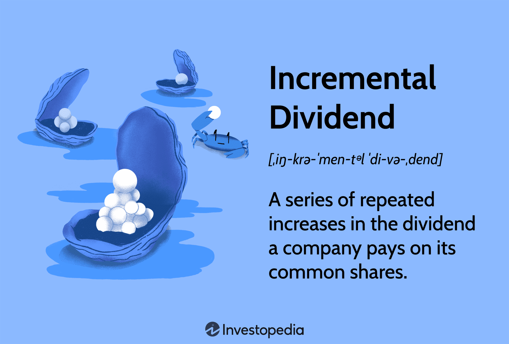

Understanding the various types of dividends is essential in finance and investing. Among these, incremental dividends represent a strategic financial mechanism employed by certain companies to distribute profits to shareholders. Incremental dividends refer to a structured increase in dividend payouts over time, often signaling a company's robust financial health and effective management. These dividends are typically associated with mature companies generating substantial cash flows and maintaining low payout ratios, allowing for gradual increases in shareholder returns.

By examining specific examples of incremental dividends, investors can glean insights into how these mechanisms enhance income streams and reinforce investor confidence. For income-seeking investors, incremental dividends provide a pathway to a reliable and increasing income, aligning with their investment goals. Moreover, companies adopting such strategies often enjoy heightened stock appeal, potentially leading to stronger market valuations.



In addition to understanding incremental dividends themselves, modern financial strategies also involve leveraging technology to maximize investment returns. Algorithmic trading, for instance, has emerged as a powerful tool to optimize portfolios containing dividend-yielding stocks. By analyzing trends and patterns, algorithms can help investors make informed decisions, capitalizing on dividend forecasts and future increments.

This article aims to equip readers with a comprehensive understanding of incremental dividends and their role in financial planning and trading strategies. By integrating insights into incremental dividends with advanced technologies like algorithmic trading, investors can refine their approaches to achieving diversified and profitable portfolios. Through a detailed exploration of these concepts, readers will gain the knowledge necessary to enhance their investment strategies effectively.

## Table of Contents

## What Are Incremental Dividends?

An incremental dividend refers to a series of planned increases in the dividend payment amount that a company pays its shareholders over time. These ongoing increments in dividends are generally planned and communicated by the company's management, signifying a strategy to reward shareholders progressively and indicate strong financial performance and growth prospects. Typically, such dividends are offered by mature companies, which have substantial and stable cash flows, enabling them to allocate a portion of their earnings back to investors consistently.

These mature entities often possess a low dividend payout ratio, which is defined as the ratio of total dividends paid to shareholders relative to the company's net income. A lower payout ratio suggests that a significant portion of earnings is being retained in the company, allowing for flexibility in either reinvestment in operations or strategic reward increases like incremental dividends.

Incremental dividends are regarded as positive indicators of a company's financial health and robustness, as they reflect management's confidence in the business's future earnings potential. For investors, these dividends can serve as a signal that a company is performing well and is likely to continue generating and increasing profits. This confidence often translates into stock price appreciation, providing dual benefits of income through dividends and capital gains.

The mechanism of incremental dividends generally involves a percentage increase in dividend per share over a specified period, such as quarterly or annually. For example, if a company currently pays a dividend of $2 per share annually and plans a 5% increase each year, the dividend would increase to $2.10 in the next year.

Financial models and analysis often incorporate these projected dividend increments into stock valuation methods. The Gordon Growth Model (a version of the dividend discount model) can, for instance, be adjusted to accommodate incremental dividend growth, expressed mathematically as:

$$
P = \frac{D_0 \times (1 + g)}{r - g}
$$

Where:
- $P$ is the price of the stock today
- $D_0$ is the current dividend per share
- $g$ is the growth rate in dividends (incremental rate)
- $r$ is the required rate of return

Through a comprehensive understanding of how incremental dividends work, investors and analysts can ascertain the underlying financial stability of a company, appreciating the role these dividends play in signaling and sustaining investor confidence. Incremental dividends not only reflect a firm's past performance but also its proactive approach in capital allocation and commitment to enhancing shareholder value over time.

## Benefits of Incremental Dividends

Incremental dividends are increasingly attractive to investors for several reasons. A key benefit is that they offer a steady increase in income over time, which is vital for income-seeking investors who prioritize consistent cash flow from their investments. This incremental growth is usually indicative of a company's robust profit growth and demonstrates management's commitment to returning value to its shareholders. It suggests that the company has strong financial health and anticipates continued earnings stability.

Because incremental dividends reflect a company's assurance in its future cash flows, they can make a company more attractive to investors, particularly those focused on income generation. This attractiveness potentially leads to an increase in the company's stock value as demand for the stock rises. Investors tend to favor stocks that not only provide regular income but also exhibit potential for appreciation. Therefore, companies with habits of incrementally increasing dividends might experience enhanced market valuation.

However, it is important to recognize potential risks associated with incremental dividends. A firm may face situations where maintaining higher dividend payouts becomes unsustainable, especially if earnings growth does not keep pace with the incremental dividend policy. This scenario can lead to financial strain or necessitate a reduction in dividends, which could negatively impact the company’s reputation and stock price. Investors need to be cautious and consider whether the firm’s incremental dividend policies align with its long-term financial strategies and earnings potential. 

Overall, while incremental dividends are often seen as a positive indicator of a firm's financial health and strategic outlook, investors should analyze the sustainability of such policies within the broader context of the company’s financial situation and market environment.

## Real-World Example: Target Corporation

Target Corporation is renowned for its consistent payment of incremental dividends, tracing back to 1972. This strategy has positioned Target as a stable investment choice, particularly attractive to income-seeking investors due to the perceived reliability associated with this growth pattern in dividends.

### Incremental Dividend History of Target Corporation

Since its inception of dividend payments, Target has demonstrated a commitment to increasing these payments annually. Such a strategy indicates robust financial health and discipline in capital allocation. For instance, Target's approach to dividends saw the company transitioning from an annual payment in its early dividend-paying years to quarterly distributions, a practice it implemented to better manage cash flow and investor expectations. 

Target's dividend increases typically range from 10% to 20% annually, although this percentage can vary depending on the broader economic context and company-specific performance. The consistent increase in dividends is often benchmarked against earnings growth, which ensures that the company maintains a sustainable payout ratio. 

**Sustainable Dividend Growth Rate:**

One metric used to gauge the sustainability of Target’s dividend policy is the Dividend Growth Rate. This rate can be calculated as follows:

$$
\text{Dividend Growth Rate} = \left(\frac{\text{Dividend in year n}}{\text{Dividend in year n-1}}\right)^{\frac{1}{n}} - 1
$$

For Target, maintaining a sustainable growth rate in dividends requires alignment with earnings and free cash flow growth, underscoring the company's commitment to financial health and maintaining investor trust.

### Impact on Investor Confidence and Stock Performance

Target’s unwavering strategy to incrementally increase its dividends has positively impacted investor confidence. A historical analysis reveals a correlation between regular dividend increases and enhanced stock performance. The consistent dividend growth reflects the company's underlying strong economic performance and effective management strategies, thereby assuring investors of the company’s dedication to returning value.

Increased dividends often lead to heightened investor confidence, attracting a more extensive base of income-focused investors and contributing to a more stable shareholder composition. This confidence is reflected in Target’s stock price, as steady dividends tend to provide a cushion against market [volatility](/wiki/volatility-trading-strategies). 

### Effects on Stock Performance

A study of Target’s stock performance indicates that incremental dividends can act to stabilize stock prices, especially during economic downturns. This stability is primarily due to the perceived safety and continuity of income streams. Furthermore, stocks of companies with a history of increasing dividends, like Target's, are often favored in bull markets, contributing to superior total returns compared to the market average.

In conclusion, Target's practice of paying incremental dividends since 1972 underscores the company's strategic financial planning and market positioning. By understanding and analyzing this approach, investors can gain insights into how dividend policies can impact company valuation and market confidence.

## Algorithmic Trading and Dividend Investing

Algorithmic trading represents a sophisticated methodology to enhance dividend-yielding portfolios by employing automated, rule-based systems to make investment decisions. This strategy can identify and exploit trends and patterns in dividend payments, thereby potentially increasing a portfolio's returns.

Finance professionals utilize algorithms to systematically analyze historical dividend data and project future dividend payments. This involves evaluating numerous factors such as dividend payout ratios, company earnings, and macroeconomic indicators. By incorporating these variables into trading algorithms, investors can anticipate changes in dividend distributions and adjust their portfolio accordingly.

For example, an algorithm might be programmed to purchase stocks of companies that consistently increase their dividend payouts, signaling financial robustness and reliability. Such a strategy can be implemented through code. Consider a simple Python script using libraries like `pandas` and `numpy` to analyze historical dividend data:

```python
import pandas as pd
import numpy as np

# Load historical data
data = pd.read_csv('dividend_data.csv')

# Calculate percentage increase in dividend
data['Dividend Growth'] = data['Dividend'].pct_change() * 100

# Identify stocks with consistent dividend growth
consistent_growth = data[data['Dividend Growth'] > 5]  # example threshold

print(consistent_growth)
```

This script loads historical dividend data and calculates the percentage growth in dividends over time. By setting a threshold for growth, the algorithm can identify stocks with steady dividend increases.

In addition to analyzing historical data, algorithms can incorporate dividend forecasts to refine trading strategies. Analysts may use [machine learning](/wiki/machine-learning) techniques to predict future dividends based on factors like earnings projections and industry trends. For instance, a regression model could be constructed to forecast future dividends and inform trading decisions:

```python
from sklearn.linear_model import LinearRegression

# Features and target variable
X = data[['Earnings', 'Payout Ratio']]
y = data['Future Dividend']

# Model training
model = LinearRegression()
model.fit(X, y)

# Dividend prediction
data['Predicted Dividend'] = model.predict(X)

# Trading strategy adjustment based on predictions
strategic_stocks = data[data['Predicted Dividend'] > data['Dividend']]
print(strategic_stocks)
```

This example uses a linear regression model to predict future dividends, allowing investors to make informed decisions about buying or holding stocks based on projected dividends.

Incorporating algorithms in dividend investing not only helps in identifying promising stocks but also aids in mitigating risks associated with sudden dividend cuts. By continuously adjusting investment strategies through algorithmic insights, investors can enhance the overall stability and profitability of their portfolios. Algorithmic trading, when effectively applied, can thus serve as a powerful tool in optimizing dividend investments, aligning them more closely with investor goals and market dynamics.

## Conclusion

The concept of incremental dividends provides valuable insights into a company's financial strategies and its perception in the market. By regularly increasing dividends, companies signal financial robustness and commitment to returning value to shareholders. This practice often aligns with mature, financially stable firms that prioritize shareholder returns through a disciplined payout approach. For investors, understanding these dividends is crucial for enhancing portfolio diversification and income-generation strategies. Incremental dividends offer a predictable and growing income stream, making them attractive to income-seeking investors and those valuing stability and growth in their investments.

Furthermore, integrating the knowledge of incremental dividends with [algorithmic trading](/wiki/algorithmic-trading) can significantly enhance investment profitability. Algorithmic trading allows investors to explore patterns and trends in dividend-yielding stocks quickly and efficiently. By utilizing advanced trading algorithms, investors can adjust their portfolios to capture optimal dividend returns while mitigating associated risks. 

For interested investors, the next step involves thorough research into companies with a history of strong and consistent dividend increments. Understanding the metrics that drive dividend growth, such as cash flow, earnings growth, and management policies, can provide a solid foundation for informed investment decisions. Additionally, leveraging algorithmic tools to forecast dividend changes and market reactions can offer a competitive edge in crafting a robust, dividend-focused portfolio. 

Overall, the strategic use of incremental dividends combined with algorithmic trading remains a potent approach for maximizing investment returns and achieving financial objectives.

## References & Further Reading

[1]: ["The Intelligent Investor: The Definitive Book on Value Investing."](https://www.amazon.com/Intelligent-Investor-Definitive-Investing-Essentials/dp/0060555661) by Benjamin Graham

[2]: ["Advances in Financial Machine Learning"](https://www.amazon.com/Advances-Financial-Machine-Learning-Marcos/dp/1119482089) by Marcos Lopez de Prado

[3]: ["Evidence-Based Technical Analysis: Applying the Scientific Method and Statistical Inference to Trading Signals"](https://www.amazon.com/Evidence-Based-Technical-Analysis-Scientific-Statistical/dp/0470008741) by David Aronson

[4]: ["Quantitative Financial Analytics: The Path to Investment Profits"](https://www.amazon.com/Quantitative-Financial-Analytics-Investment-Profits/dp/9813224258) by Edina Berlinger

[5]: ["Dividends Still Don't Lie: The Truth About Investing in Blue Chip Stocks and Winning in the Stock Market"](https://www.amazon.com/Dividends-Still-Dont-Lie-Investing/dp/0470581565) by Kelley Wright

[6]: ["Machine Learning for Algorithmic Trading"](https://github.com/stefan-jansen/machine-learning-for-trading) by Stefan Jansen