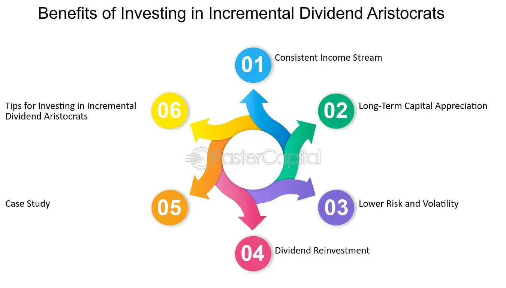

## Table of Contents

## What is an incremental dividend?

An incremental dividend is when a company increases the amount of money it pays out to its shareholders over time. Instead of keeping the dividend the same, the company decides to give a little more each time. This can happen every few months or once a year, depending on the company's policy. It shows that the company is doing well and wants to share its success with the people who own its stock.

Shareholders like incremental dividends because it means they get more money without having to do anything extra. It can also make the stock more attractive to new investors, who see the growing dividend as a sign of a healthy and stable company. However, the company needs to be careful because increasing dividends too much might not be sustainable if their profits don't keep up.

## How does an incremental dividend differ from a regular dividend?

A regular dividend is when a company pays out the same amount of money to its shareholders at set times, like every three months or once a year. It's like getting a steady paycheck from the company just for owning its stock. Shareholders know exactly how much they will get each time, which can help them plan their finances.

An incremental dividend, on the other hand, is when the company decides to slowly increase the amount of money it pays out over time. So, each time the company pays a dividend, shareholders might get a little bit more than they did before. This can be exciting for shareholders because it means their income from the stock is growing, but it also shows that the company is doing well and expects to keep doing well in the future.

## Why would a company choose to implement an incremental dividend policy?

A company might choose to implement an incremental dividend policy to show its shareholders that it is doing well and expects to keep growing. By slowly increasing the dividend, the company sends a message that it is confident in its future earnings. This can make shareholders happy because they see their income from the stock going up over time. It also makes the stock more attractive to new investors who are looking for companies that are stable and growing.

Another reason a company might choose an incremental dividend policy is to keep up with or beat its competitors. If other companies in the same industry are increasing their dividends, this company might feel the need to do the same to stay competitive. By doing this, the company can attract more investors and keep its current shareholders from looking elsewhere for better returns. However, the company needs to make sure it can afford to keep increasing the dividend without hurting its financial health.

## Can you explain the benefits of incremental dividends for investors?

Incremental dividends are good for investors because they mean more money over time. If a company keeps increasing its dividend, investors get a little more each time they receive a payment. This can help their income from the stock grow, which is great for people who rely on dividends to help pay their bills or save for the future. It also makes the stock more valuable because other people might want to buy it to get those growing payments.

Another benefit is that incremental dividends show that the company is doing well and expects to keep doing well. When a company can afford to pay more to its shareholders, it usually means the business is making more money. This can make investors feel more confident about the company's future, so they might want to keep their shares or even buy more. It's like a vote of confidence from the company to its investors, showing that things are going in the right direction.

## What are the potential risks associated with relying on incremental dividends?

Relying on incremental dividends can be risky because the company might not always be able to keep increasing the payments. If the company runs into financial trouble or if the economy takes a downturn, it might have to cut the dividend or stop it altogether. This can be a big problem for investors who were counting on that growing income to help pay their bills or save for the future. Suddenly, they might have less money coming in than they expected, which can make it hard to plan their finances.

Another risk is that investors might get too focused on the growing dividends and not pay enough attention to other important things about the company. They might not notice if the company is taking on too much debt or if its main business is starting to struggle. If investors are only looking at the dividends and not the whole picture, they could end up holding onto a stock that's not as healthy as it seems. This can lead to big losses if the stock price falls or if the company runs into serious trouble.

## How is the amount of an incremental dividend determined?

The amount of an incremental dividend is decided by the company's board of directors. They look at how much money the company is making and how much it can afford to pay out to shareholders. They might also think about what other companies in the same industry are doing with their dividends. If the company is doing well and making more money than before, the board might decide to give shareholders a little more than they got last time. This way, the company can show it's growing and doing well.

Sometimes, the board might set a specific plan for how much the dividend will go up each year. For example, they might say the dividend will increase by 5% every year. This helps shareholders know what to expect and can make the stock more attractive to investors. But the board always has to make sure the company can afford to keep increasing the dividend. If the company's profits don't keep up, they might have to change their plan or even cut the dividend.

## What is an example of a company that has used an incremental dividend strategy?

One example of a company that has used an incremental dividend strategy is Johnson & Johnson. This company has been increasing its dividend every year for more than 50 years. They do this because they are a big and stable company that makes a lot of money from things like medicines and health products. By slowly increasing the dividend, Johnson & Johnson shows its shareholders that it is doing well and expects to keep doing well in the future. This makes shareholders happy because they get a little more money each year without having to do anything extra.

Johnson & Johnson's board of directors decides how much to increase the dividend each year. They look at how much money the company is making and how much it can afford to pay out. If the company is doing well, they might decide to give shareholders a little more than they got last time. This helps keep shareholders happy and can make the stock more attractive to new investors who are looking for a company that is growing and stable. But the board always has to be careful to make sure the company can keep increasing the dividend without running into financial trouble.

## How can an investor identify a company that is likely to offer incremental dividends?

An investor can identify a company likely to offer incremental dividends by looking at its history of dividend payments. If a company has been increasing its dividends every year for a long time, like Johnson & Johnson has, it's a good sign they might keep doing it. Another thing to check is how stable and profitable the company is. Companies that make a lot of money and don't have big ups and downs are more likely to keep increasing their dividends because they can afford to pay more to their shareholders.

It's also helpful to look at what the company says about its future plans. If the company talks about growing and expects to make more money in the future, they might be more likely to increase their dividends. Investors should also pay attention to what the company's leaders say about dividends. If they mention wanting to keep increasing dividends, that's a good sign. But remember, no company can promise to keep increasing dividends forever, so it's important to keep an eye on the company's overall health and not just focus on the dividends.

## What financial metrics should investors monitor to predict future incremental dividend increases?

Investors should keep an eye on a company's earnings per share (EPS) because it shows how much money the company is making for each share of stock. If the EPS is going up over time, it's a good sign the company might be able to increase its dividends. Another important thing to watch is the payout ratio, which is the percentage of the company's earnings that it pays out as dividends. If the payout ratio is low and stable, it means the company has room to increase dividends without hurting its financial health.

It's also a good idea to look at the company's free cash flow. Free cash flow is the money left over after the company pays for everything it needs to run its business. If the free cash flow is growing, the company might have more money to give to shareholders through higher dividends. Finally, investors should check the company's debt levels. If the company has a lot of debt, it might have to use its money to pay off loans instead of increasing dividends. Keeping an eye on these financial metrics can help investors guess if a company will keep increasing its dividends in the future.

## How do incremental dividends impact a company's financial health and stock valuation?

Incremental dividends can be good for a company's financial health if they are done carefully. When a company increases its dividends slowly over time, it shows that the company is making more money and feels good about the future. This can make shareholders happy and keep them from selling their shares. But the company needs to make sure it can keep paying more money to shareholders without getting into financial trouble. If the company increases dividends too much and doesn't have enough money left over, it might have to borrow money or cut back on other important things, which can hurt its financial health.

Incremental dividends can also affect a company's stock valuation. When a company keeps increasing its dividends, it can make the stock more attractive to investors. People might want to buy the stock because they know they will get a little more money each time the company pays a dividend. This increased demand can push the stock price up, making the company's overall value go up too. But if investors think the company is increasing dividends too fast and might not be able to keep it up, they might start to worry. This can make the stock price go down, which can lower the company's valuation. So, it's important for the company to balance increasing dividends with keeping its financial health strong.

## What are the tax implications for investors receiving incremental dividends?

When investors get incremental dividends, they have to pay taxes on that money. The tax rate depends on where the investor lives and how long they have owned the stock. In the United States, for example, dividends can be taxed as regular income or at a lower rate called the qualified dividend rate. If the investor holds the stock for more than 60 days during the 121-day period that begins 60 days before the ex-dividend date, the dividends might be considered qualified and taxed at a lower rate. But if the investor hasn't held the stock long enough, the dividends will be taxed as regular income, which can be a higher rate.

It's important for investors to keep track of their dividends and know the tax rules in their country. If they don't pay the right amount of taxes on their dividends, they could get in trouble with the tax office. Also, because incremental dividends grow over time, the amount of taxes investors have to pay can go up too. So, it's a good idea for investors to talk to a tax advisor to make sure they understand how much they need to pay and how to report their dividends correctly on their tax returns.

## How should an investor adjust their portfolio strategy to maximize returns from incremental dividends?

To maximize returns from incremental dividends, an investor should focus on buying stocks from companies that have a long history of increasing their dividends. Look for companies that have been raising their dividends every year for a long time, like Johnson & Johnson. These companies are usually stable and profitable, which means they can keep increasing their dividends. By choosing stocks from these companies, an investor can enjoy a growing income from their investments over time.

It's also important for the investor to keep an eye on the company's financial health. Check things like earnings per share, payout ratio, free cash flow, and debt levels to make sure the company can keep paying and increasing dividends. If the company's finances start to look shaky, it might be a good idea to sell the stock and find a different company with a stronger financial position. By doing this, the investor can make sure they keep getting those growing dividends without taking too much risk.

## What are incremental dividends?

An incremental dividend refers to a series of planned increases in the dividend payment amount that a company pays its shareholders over time. These ongoing increments in dividends are generally planned and communicated by the company's management, signifying a strategy to reward shareholders progressively and indicate strong financial performance and growth prospects. Typically, such dividends are offered by mature companies, which have substantial and stable cash flows, enabling them to allocate a portion of their earnings back to investors consistently.

These mature entities often possess a low dividend payout ratio, which is defined as the ratio of total dividends paid to shareholders relative to the company's net income. A lower payout ratio suggests that a significant portion of earnings is being retained in the company, allowing for flexibility in either reinvestment in operations or strategic reward increases like incremental dividends.

Incremental dividends are regarded as positive indicators of a company's financial health and robustness, as they reflect management's confidence in the business's future earnings potential. For investors, these dividends can serve as a signal that a company is performing well and is likely to continue generating and increasing profits. This confidence often translates into stock price appreciation, providing dual benefits of income through dividends and capital gains.

The mechanism of incremental dividends generally involves a percentage increase in dividend per share over a specified period, such as quarterly or annually. For example, if a company currently pays a dividend of $2 per share annually and plans a 5% increase each year, the dividend would increase to $2.10 in the next year.

Financial models and analysis often incorporate these projected dividend increments into stock valuation methods. The Gordon Growth Model (a version of the dividend discount model) can, for instance, be adjusted to accommodate incremental dividend growth, expressed mathematically as:

$$
P = \frac{D_0 \times (1 + g)}{r - g}
$$

Where:
- $P$ is the price of the stock today
- $D_0$ is the current dividend per share
- $g$ is the growth rate in dividends (incremental rate)
- $r$ is the required rate of return

Through a comprehensive understanding of how incremental dividends work, investors and analysts can ascertain the underlying financial stability of a company, appreciating the role these dividends play in signaling and sustaining investor confidence. Incremental dividends not only reflect a firm's past performance but also its proactive approach in capital allocation and commitment to enhancing shareholder value over time.

## What is a real-world example of Target Corporation?

Target Corporation is renowned for its consistent payment of incremental dividends, tracing back to 1972. This strategy has positioned Target as a stable investment choice, particularly attractive to income-seeking investors due to the perceived reliability associated with this growth pattern in dividends.

### Incremental Dividend History of Target Corporation

Since its inception of dividend payments, Target has demonstrated a commitment to increasing these payments annually. Such a strategy indicates robust financial health and discipline in capital allocation. For instance, Target's approach to dividends saw the company transitioning from an annual payment in its early dividend-paying years to quarterly distributions, a practice it implemented to better manage cash flow and investor expectations. 

Target's dividend increases typically range from 10% to 20% annually, although this percentage can vary depending on the broader economic context and company-specific performance. The consistent increase in dividends is often benchmarked against earnings growth, which ensures that the company maintains a sustainable payout ratio. 

**Sustainable Dividend Growth Rate:**

One metric used to gauge the sustainability of Target’s dividend policy is the Dividend Growth Rate. This rate can be calculated as follows:

$$
\text{Dividend Growth Rate} = \left(\frac{\text{Dividend in year n}}{\text{Dividend in year n-1}}\right)^{\frac{1}{n}} - 1
$$

For Target, maintaining a sustainable growth rate in dividends requires alignment with earnings and free cash flow growth, underscoring the company's commitment to financial health and maintaining investor trust.

### Impact on Investor Confidence and Stock Performance

Target’s unwavering strategy to incrementally increase its dividends has positively impacted investor confidence. A historical analysis reveals a correlation between regular dividend increases and enhanced stock performance. The consistent dividend growth reflects the company's underlying strong economic performance and effective management strategies, thereby assuring investors of the company’s dedication to returning value.

Increased dividends often lead to heightened investor confidence, attracting a more extensive base of income-focused investors and contributing to a more stable shareholder composition. This confidence is reflected in Target’s stock price, as steady dividends tend to provide a cushion against market [volatility](/wiki/volatility-trading-strategies). 

### Effects on Stock Performance

A study of Target’s stock performance indicates that incremental dividends can act to stabilize stock prices, especially during economic downturns. This stability is primarily due to the perceived safety and continuity of income streams. Furthermore, stocks of companies with a history of increasing dividends, like Target's, are often favored in bull markets, contributing to superior total returns compared to the market average.

In conclusion, Target's practice of paying incremental dividends since 1972 underscores the company's strategic financial planning and market positioning. By understanding and analyzing this approach, investors can gain insights into how dividend policies can impact company valuation and market confidence.

## References & Further Reading

[1]: ["The Intelligent Investor: The Definitive Book on Value Investing."](https://www.amazon.com/Intelligent-Investor-Definitive-Investing-Essentials/dp/0060555661) by Benjamin Graham

[2]: ["Advances in Financial Machine Learning"](https://www.amazon.com/Advances-Financial-Machine-Learning-Marcos/dp/1119482089) by Marcos Lopez de Prado

[3]: ["Evidence-Based Technical Analysis: Applying the Scientific Method and Statistical Inference to Trading Signals"](https://www.amazon.com/Evidence-Based-Technical-Analysis-Scientific-Statistical/dp/0470008741) by David Aronson

[4]: ["Quantitative Financial Analytics: The Path to Investment Profits"](https://www.amazon.com/Quantitative-Financial-Analytics-Investment-Profits/dp/9813224258) by Edina Berlinger

[5]: ["Dividends Still Don't Lie: The Truth About Investing in Blue Chip Stocks and Winning in the Stock Market"](https://www.amazon.com/Dividends-Still-Dont-Lie-Investing/dp/0470581565) by Kelley Wright

[6]: ["Machine Learning for Algorithmic Trading"](https://github.com/stefan-jansen/machine-learning-for-trading) by Stefan Jansen