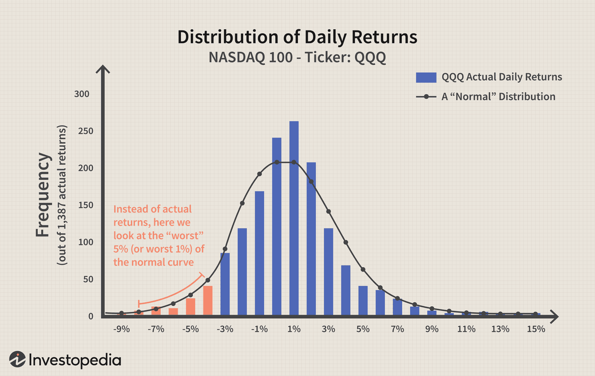

## Table of Contents

## What is Value at Risk (VaR) and how does it relate to Incremental Value at Risk (IVaR)?

Value at Risk (VaR) is a measure used in finance to estimate how much a set of investments might lose, given normal market conditions, in a set time period such as a day or a year. It's like a prediction of the worst-case loss that won't be exceeded with a certain confidence level, usually 95% or 99%. For example, if a portfolio has a one-day 95% VaR of $1 million, it means that there is a 5% chance that the portfolio will lose more than $1 million in a day.

Incremental Value at Risk (IVaR) is a related concept that helps to understand how adding or removing a specific asset from a portfolio would change the overall VaR. It measures the additional risk that a single asset contributes to the portfolio's total risk. For instance, if you want to add a new stock to your portfolio, IVaR can tell you how much the VaR of your portfolio would increase or decrease because of this new stock. This helps investors make better decisions about which assets to include or exclude to manage their risk more effectively.

## How is Incremental Value at Risk calculated?

Calculating Incremental Value at Risk (IVaR) involves figuring out how much the overall risk of a portfolio changes when you add or remove a specific asset. To do this, you first calculate the Value at Risk (VaR) of the portfolio as it is now. Then, you create a new version of the portfolio by either adding or removing the asset in question and calculate its VaR. The difference between these two VaR numbers is the IVaR. It tells you how much the risk of the portfolio would go up or down because of the change.

There are different ways to calculate VaR, like using historical data, simulations, or mathematical models, and the method you choose can affect how you calculate IVaR. For example, if you use a historical method, you would look at past returns of the portfolio with and without the asset to see how the risk changes. If you use a simulation method, you might run many different scenarios to see how the portfolio's value could change with and without the asset. No matter the method, the key is to compare the risk of the portfolio before and after the change to find the IVaR.

## What is the purpose of using Incremental Value at Risk in risk management?

Incremental Value at Risk (IVaR) helps people who manage money to make smart choices about their investments. It shows them how adding or taking away a single investment can change the overall risk of their portfolio. This is important because it lets them see if adding a new investment will make their portfolio riskier or safer. By knowing this, they can decide if the extra risk is worth it or if they should look for other investments.

Using IVaR also helps in keeping the risk of a portfolio at a level that the investor is comfortable with. If someone wants to lower the risk of their investments, they can use IVaR to figure out which investments to get rid of. On the other hand, if they want to take on more risk to possibly earn more money, IVaR can show them which new investments will help them do that without making their portfolio too risky. This way, IVaR is a useful tool for managing risk in a way that matches the investor's goals.

## Can you explain the difference between VaR and IVaR with an example?

Imagine you have a piggy bank with different coins and bills inside. Value at Risk (VaR) is like figuring out the most money you could lose from your piggy bank in a bad day. If you think there's a 5% chance you could lose more than $10 in a day, then your one-day 95% VaR is $10. It's a way to guess the worst-case loss for your piggy bank, helping you understand how much risk you're taking with all the money inside.

Now, let's say you want to add a new shiny coin to your piggy bank. Incremental Value at Risk (IVaR) helps you see how adding this new coin changes the risk of losing money. If you add the coin and the worst-case loss goes up to $12, then the IVaR of adding that coin is $2. It shows you the extra risk the new coin brings to your piggy bank. This way, you can decide if the new coin is worth the extra risk or if you should keep your piggy bank as it is.

## How does IVaR help in portfolio management and decision-making?

IVaR helps in portfolio management by showing how adding or removing an investment changes the risk of the whole portfolio. It's like a tool that lets you see the effect of each change you make. For example, if you're thinking about buying a new stock, IVaR can tell you if that stock will make your portfolio riskier or not. This helps you decide if the new investment fits with how much risk you want to take.

Using IVaR also helps you make better decisions about your money. If you want to lower the risk of your investments, IVaR can show you which ones to sell. If you're okay with taking more risk to possibly earn more money, IVaR can help you pick new investments that won't make your portfolio too risky. By understanding how each change affects your risk, you can manage your investments to match your goals and comfort level with risk.

## What are the key assumptions made when using IVaR?

When using Incremental Value at Risk (IVaR), we make some guesses about how things work. One guess is that the way investments behave in the past will be the same in the future. This means we use old data to predict what might happen next. Another guess is that the risk of each investment stays the same, no matter how big or small it is in your portfolio. This helps us figure out how adding or taking away an investment changes the overall risk.

We also assume that the different investments in your portfolio don't affect each other too much. This means we think the risk of one investment doesn't change the risk of another one a lot. These guesses help us use IVaR to make decisions, but they might not always be right. That's why it's good to keep checking and updating your guesses as things change.

## How can IVaR be used to assess the risk contribution of a new asset to an existing portfolio?

IVaR helps you see how adding a new asset changes the risk of your whole portfolio. Imagine you have a bunch of toys, and you want to add a new toy. IVaR is like figuring out if adding that new toy will make your toy collection more likely to get broken or lost. You look at how risky your toys are now, then you add the new toy and see how the risk changes. If the risk goes up a lot, the new toy might not be worth it. If it doesn't change much, then it might be okay to add.

To use IVaR, you first calculate the risk of your current portfolio, which is like figuring out how likely it is for your toys to get broken or lost. Then, you add the new asset and calculate the risk again. The difference between these two risks is the IVaR. It tells you how much more or less risky your portfolio becomes because of the new asset. This way, you can decide if the new asset is a good fit for your portfolio, helping you keep your investments safe and balanced.

## What are the limitations and potential pitfalls of using IVaR?

Using IVaR can be tricky because it relies on some guesses that might not always be true. One big guess is that how investments acted in the past will be the same in the future. But markets can change a lot, and what happened before might not happen again. Another guess is that the risk of each investment stays the same no matter how much of it you have. This might not be right because having more of one investment can change its risk. Also, IVaR assumes that the different investments in your portfolio don't affect each other too much. But in real life, the risk of one investment can change the risk of another one.

Another problem with IVaR is that it can be hard to use correctly. You need to know a lot about how to calculate it, and even small mistakes can make your results wrong. It also might not show you the full picture of your risk. IVaR looks at how adding or taking away one investment changes the risk, but it might not tell you about other risks like big surprises in the market that can affect all your investments at once. So, while IVaR is a helpful tool, it's important to use it carefully and not rely on it too much without checking other ways to understand your risk.

## How does the choice of confidence level and time horizon affect IVaR calculations?

The confidence level and time horizon you pick can change your IVaR results a lot. The confidence level is like how sure you want to be about your risk guess. If you pick a 95% confidence level, you're saying you want to be 95% sure about the worst loss your portfolio might face. If you choose a higher confidence level, like 99%, your IVaR will be bigger because you're trying to cover a worse-case scenario. It's like saying you want to be even more sure about the biggest loss, so you prepare for a bigger one.

The time horizon is how long you're looking at, like a day or a year. A longer time horizon usually means a bigger IVaR because there's more time for things to go wrong. If you're looking at a one-day time horizon, your IVaR might be smaller than if you're looking at a one-year time horizon. That's because over a year, there's more chance for big changes in the market that could affect your investments. So, when you're figuring out IVaR, choosing the right confidence level and time horizon is important because they can make your risk guess bigger or smaller.

## Can IVaR be applied to non-linear portfolios, and if so, how?

IVaR can be used with non-linear portfolios, but it's a bit trickier. A non-linear portfolio is like a puzzle where the pieces don't fit together in a straight line. The value of these portfolios can change in unexpected ways because of things like options or other fancy investments. To use IVaR with these portfolios, you need to use special math tools that can handle these twists and turns. These tools, like simulations or complex models, help you see how adding or taking away an investment changes the risk of the whole puzzle.

Even though it's harder, using IVaR with non-linear portfolios can still help you make better choices. You might need to run a lot of different scenarios to see how the risk changes when you add or remove an investment. This can show you if the new piece fits well with the rest of your puzzle or if it makes things too risky. By understanding how each change affects your risk, you can keep your non-linear portfolio balanced and safe, even if it's more complicated than a straight-line portfolio.

## How do regulatory requirements influence the use of IVaR in financial institutions?

Regulatory requirements can make financial institutions use IVaR to keep their investments safe. Rules from groups like the Basel Committee on Banking Supervision tell banks how much risk they can take. IVaR helps banks follow these rules by showing how adding or removing an investment changes their risk. This way, banks can make sure they don't take on too much risk and stay within the limits set by the regulators. Using IVaR helps banks prove to regulators that they are managing their risk carefully.

Sometimes, these rules can make using IVaR more complicated. For example, regulators might ask for a certain confidence level or time horizon when calculating risk. This means banks have to adjust their IVaR calculations to match these requirements. It can be hard work, but it helps make sure that the risk numbers are fair and consistent across different banks. By following these rules, financial institutions can keep their investments safe and avoid big surprises that could hurt their customers or the economy.

## What advanced techniques can be used to improve the accuracy of IVaR estimates?

To make IVaR estimates more accurate, you can use fancy math tools like Monte Carlo simulations. This method runs lots of different scenarios to see how your portfolio might change. It's like playing out many different futures to see what could happen. By doing this, you get a better idea of how adding or taking away an investment changes your risk. It's more work, but it helps you see the whole picture and make better guesses about your risk.

Another way to improve IVaR is by using more detailed models that look at how investments affect each other. These models consider that the risk of one investment can change the risk of another. It's like understanding that the pieces of a puzzle fit together in special ways. By using these models, you can get a more exact IVaR that takes into account the twists and turns of your portfolio. This helps you make smarter choices about your investments and manage your risk better.

## What is Understanding Incremental Value at Risk?

Incremental Value at Risk (IVaR) represents a critical extension of the traditional Value at Risk (VaR) framework, focusing on the impact of individual investments on the overall risk of a portfolio. Unlike traditional VaR, which evaluates the total potential loss of a portfolio, IVaR provides a granular view by quantifying the risk contribution of specific assets. This makes IVaR a valuable tool for investors aiming to make informed decisions about portfolio adjustments.

IVaR is particularly useful when assessing potential changes to a portfolio, such as adding or removing an investment. By understanding how a single asset affects the portfolio's risk profile, investors can make more informed decisions. IVaR is computed by recalculating the VaR after a change is introduced and measuring the variance in VaR pre- and post-modification. The mathematical representation of IVaR can be expressed as:

$$
\text{IVaR}(X) = \text{VaR}(\text{Portfolio} + X) - \text{VaR}(\text{Portfolio})
$$

Here, $X$ denotes the additional investment. The calculation highlights how much extra risk $X$ brings to the portfolio or, conversely, how much risk is mitigated if $X$ is removed.

IVaR shares a close relationship with Marginal Value at Risk (MVaR), another measure aimed at understanding the sensitivity of portfolio VaR to small changes in position sizes. While both metrics are concerned with the incremental effect, MVaR traditionally assumes infinitesimally small changes, often represented through derivatives in continuous models. IVaR, however, is more practical for discrete analysis, assessing the impact of real-world investment changes.

For effective portfolio management, it's essential to understand how IVaR, MVaR, and traditional VaR interrelate. Traditional VaR offers a broad measure of risk exposure, whereas IVaR fine-tunes the understanding by signifying the specific contribution of individual assets. MVaR provides insight into risk dynamics, especially helpful in large portfolios with frequent trades.

Integrating IVaR into risk management processes allows investors to optimize portfolios, aligning their investment strategies with their risk tolerance levels. By precisely identifying risk contributors, IVaR aids in making strategic decisions that could safeguard against potential financial downturns while capitalizing on prospective opportunities.

## What are the methods of VaR calculation?

Several methods exist for calculating Value at Risk (VaR), each characterized by distinct assumptions and limitations. The most commonly employed methods are the Variance-Covariance method, Historical Simulation, and Monte Carlo Simulation. Understanding these methods is crucial for effectively estimating potential portfolio losses.

### Variance-Covariance Method
The Variance-Covariance method, also known as the parametric method, is grounded on the assumption that asset returns are normally distributed. This method utilizes the statistical properties of the portfolio's historical returns, specifically the mean (average return) and the standard deviation ([volatility](/wiki/volatility-trading-strategies)), along with the correlations between the assets.

The formula for VaR using the Variance-Covariance method is:

$$

\text{VaR} = Z \times \sigma \times \sqrt{t}
$$

where:
- $Z$ is the z-score corresponding to the desired confidence level (e.g., 1.65 for 95% confidence).
- $\sigma$ is the portfolio's standard deviation.
- $t$ is the time period (e.g., the number of days).

This method is computationally efficient and straightforward but is limited by its assumption of normal distribution, which may not adequately capture tail risks in the returns distribution.

### Historical Simulation
Historical Simulation is a non-parametric method that estimates VaR by analyzing actual historical returns. Unlike the Variance-Covariance method, it does not assume any specific distribution for asset returns. Instead, it uses the empirical distribution of past returns to estimate potential future losses.

To calculate VaR through Historical Simulation:
1. Compile historical return data for the portfolio.
2. Sort the returns from worst to best.
3. Determine the return at the specified percentile based on your desired confidence level.

For example, in a set of 100 daily returns, the 5th worst return would represent the 95% confidence VaR. This method directly incorporates historical market behavior, making it straightforward and intuitive, but assumes the past is a reliable predictor of the future, which may not always be true.

### Monte Carlo Simulation
Monte Carlo Simulation offers a flexible approach by using stochastic processes to model potential future price paths and calculate VaR. This method involves generating a large number of random scenarios for asset returns based on statistical properties, such as means, variances, and correlations.

Python example for Monte Carlo VaR:

```python
import numpy as np

def monte_carlo_var(initial_portfolio_value, mean, std_dev, confidence_level, num_simulations=10000, time_horizon=1):
    simulated_returns = np.random.normal(mean, std_dev, (num_simulations, time_horizon))
    simulated_portfolio_values = initial_portfolio_value * (1 + simulated_returns)

    # Calculate the gains (or losses)
    gains_or_losses = initial_portfolio_value - simulated_portfolio_values
    var_value = np.percentile(gains_or_losses, (1 - confidence_level) * 100)
    return var_value

# Example usage
initial_portfolio_value = 1000000  # $1,000,000 portfolio
mean = 0.0001  # Expected daily return
std_dev = 0.01  # Daily volatility
confidence_level = 0.95  # For 95% confidence

var = monte_carlo_var(initial_portfolio_value, mean, std_dev, confidence_level)
print(f"The simulated VaR is: ${var:.2f}")
```

Monte Carlo Simulation is powerful due to its ability to model complex distributions and scenarios. However, it demands significant computational resources and can be time-intensive.

Each VaR calculation method offers unique advantages and challenges, with the choice often dependent on the specific requirements and constraints of the investment strategy or regulatory framework. Aligning the method with the underlying characteristics of the financial instruments and the market environment is essential for accurate risk assessment.

## How do you calculate VaR in Excel?

Value at Risk (VaR) is a widely used metric in financial risk management to estimate the potential loss in value of a portfolio over a defined period for a given confidence interval. Calculating VaR in Excel is a practical approach for many traders and financial analysts, given its accessibility and robust computational capabilities. 

To compute VaR in Excel, one can utilize functions such as AVERAGE, STDEV, and NORM.INV, which are instrumental in statistical analyses. The calculation process typically involves the following steps:

1. **Gather Historical Price Data:** Obtain historical price data for the financial assets in the portfolio. This data serves as the foundation for evaluating the potential risk and computing returns.

2. **Calculate Returns:** Compute daily or periodic returns using the formula:
$$
   \text{Return} = \frac{\text{Price}_{t} - \text{Price}_{t-1}}{\text{Price}_{t-1}}

$$
   These returns are essential for understanding the volatility and potential downside risk of the assets.

3. **Compute Statistical Measures:**
   - Use the `AVERAGE` function to calculate the mean of the returns. 
   - Employ the `STDEV` function to determine the standard deviation of returns, which measures the dispersion or volatility.

4. **Determine the VaR Threshold:**
   - Decide on a confidence level, commonly 95% or 99%. This represents the probability that the potential loss will not exceed the calculated VaR.
   - Utilize the `NORM.INV` function to find the z-score corresponding to the chosen confidence level. For instance, for a 95% confidence level, the z-score is approximately 1.645.

5. **Calculate VaR:**
   - Multiply the z-score by the standard deviation of returns to estimate VaR:
$$
     \text{VaR} = \text{Z-score} \times \text{Standard Deviation}

$$
   - Adjust the result by the mean (if necessary) to find the total loss at the specified confidence level:
$$
     \text{VaR} = (\text{Mean} \times \text{Time Period}) + (\text{Z-score} \times \text{Standard Deviation} \times \sqrt{\text{Time Period}})

$$

Given its functionality and wide availability, Excel is a preferred tool for smaller trading operations and individual traders to calculate VaR. Through the application of these formulas, traders can better understand potential risks and make informed decisions about their portfolios. As with any financial modeling, it is crucial to ensure data accuracy and remain cognizant of the assumptions underpinning the VaR model being used.

## What are the advanced techniques and considerations?

Advanced Value at Risk (VaR) techniques offer enhanced risk assessment by incorporating different statistical assumptions and computational approaches. Parametric VaR, for instance, assumes that asset returns follow a specific statistical distribution, typically normal, and estimates risk based on this assumption. In contrast, Semi-Parametric VaR relaxes the rigid normal distribution assumption by employing a combination of parametric and non-parametric methods, allowing for more flexibility in modeling asset return distributions.

### Parametric VaR

Parametric VaR is calculated by specifying a confidence level, typically 95% or 99%, and determining the VaR threshold using statistical measures like mean and standard deviation. For normally distributed returns, Parametric VaR can be calculated using the formula:

$$
\text{VaR}_{\alpha} = \mu + z_{\alpha} \cdot \sigma
$$

where $\mu$ is the mean return, $\sigma$ is the standard deviation of returns, and $z_{\alpha}$ is the z-score associated with confidence level $\alpha$.

### Semi-Parametric VaR

Semi-Parametric VaR involves techniques such as Extreme Value Theory (EVT) and the use of historical simulation for the tails of the distribution while using parametric methods for the bulk. This approach enhances the accuracy of risk measures by capturing the skewness and kurtosis often observed in real market data, which the normal distribution may fail to account for.

### Asset Correlation and Backtesting

Accurate VaR estimates require a thorough understanding of asset correlations, as these relationships significantly influence the portfolio's risk profile. Asset correlation reflects how assets move in relation to one another, impacting the portfolio’s exposure to market movements. Calculation of VaR should incorporate these correlations to provide a robust risk measure.

Backtesting is a critical step in validating VaR models. It involves comparing predicted VaR figures with actual losses to assess the model’s accuracy over time. Effective [backtesting](/wiki/backtesting) ensures the VaR model reliably estimates risk and can be trusted for decision-making in variable market conditions.

### Computational Enhancements with Python

The use of Python and similar computational tools facilitates sophisticated VaR calculations through advanced modeling techniques. Python's robust libraries such as NumPy, SciPy, and pandas allow for efficient data manipulation and complex statistical analyses. The flexibility of Python makes it ideal for implementing techniques like Monte Carlo simulations for VaR estimation.

An example code snippet for calculating Parametric VaR using Python is as follows:

```python
import numpy as np
import scipy.stats as stats

# Historical returns data
returns = np.array([...])

# Specify confidence level
confidence_level = 0.95

# Calculate mean and standard deviation
mean_return = np.mean(returns)
std_dev = np.std(returns)

# Calculate z-score
z_score = stats.norm.ppf(1 - confidence_level)

# Calculate Parametric VaR
VaR_parametric = mean_return + z_score * std_dev

print(f"Parametric VaR at {confidence_level*100}% confidence level: {VaR_parametric}")
```

This script illustrates the simplicity and power of Python in financial calculations, allowing quick adaptation to various risk parameters and market data inputs.

## References & Further Reading

[1]: Jorion, P. (2007). ["Value at Risk: The New Benchmark for Managing Financial Risk"](https://link.springer.com/article/10.1007/s11408-007-0057-3). McGraw-Hill Education.

[2]: Dowd, K. (2002). ["Measuring Market Risk"](https://download.e-bookshelf.de/download/0007/6469/39/L-G-0007646939-0013551969.pdf). Wiley.

[3]: Alexander, C. (2008). ["Market Risk Analysis Volume II: Practical Financial Econometrics"](https://pdfs.semanticscholar.org/159a/c49d31ebb0e594e993935a463c42c97874e6.pdf). Wiley.

[4]: Hull, J. (2006). ["Options, Futures, and Other Derivatives"](https://archive.org/details/optionsfuturesot0000hull_i8a4). Prentice Hall.

[5]: Pykhtin, M. (2005). ["Counterparty Credit Risk Modeling: Risk Management, Pricing and Regulation"](https://www.amazon.com/Counterparty-Credit-Risk-Modelling-Management/dp/190433976X). Risk Books.

[6]: Glasserman, P. (2003). ["Monte Carlo Methods in Financial Engineering"](https://link.springer.com/book/10.1007/978-0-387-21617-1). Springer. 

[7]: Taleb, N. N. (2007). ["The Black Swan: The Impact of the Highly Improbable"](https://archive.org/details/10.1.1.695.4305). Random House.