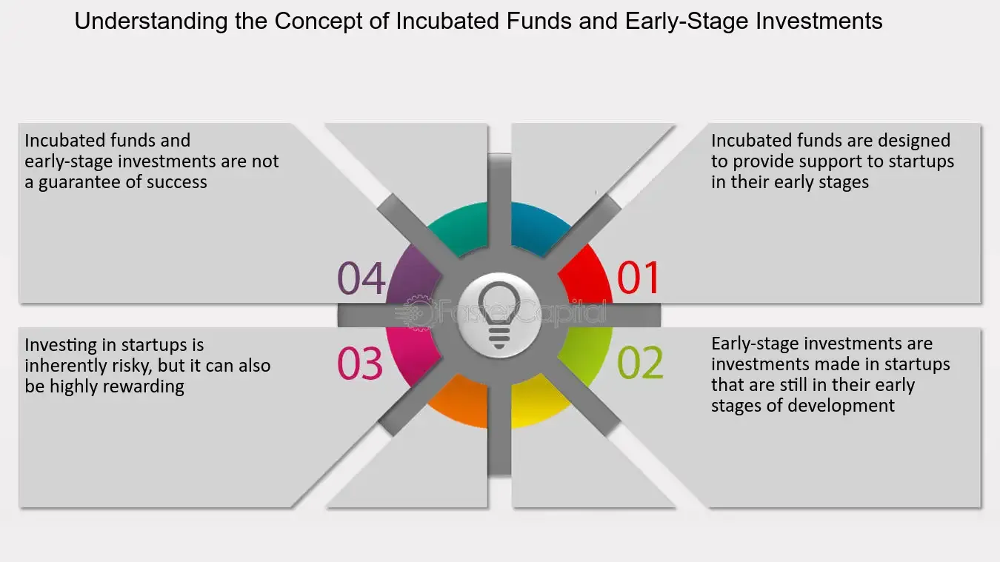

## Table of Contents

## What is an incubated fund?

An incubated fund is a type of investment fund that is started and supported by a larger financial institution or company. This support can include providing initial capital, management resources, and other help to get the fund going. The idea behind an incubated fund is to help new investment strategies or fund managers get off the ground without the immediate pressure of attracting outside investors.

These funds are often used as a way for the supporting institution to test new ideas or strategies in the market. If the incubated fund does well, it can attract more investors and grow on its own. If it doesn't do well, the supporting institution can close it down without much risk to itself. This setup allows for innovation and experimentation in the investment world, but it also means that incubated funds can be riskier for early investors.

## How does an incubated fund differ from a traditional mutual fund?

An incubated fund and a traditional mutual fund both aim to grow investors' money, but they start out differently. An incubated fund is like a new plant that a big company helps grow. The big company gives it money and help to start. This means the fund can try new ways to invest without needing lots of people to give money right away. A traditional mutual fund, on the other hand, needs to get money from many people from the start. It's like a shop that needs customers to open its doors.

Because of this, incubated funds can be riskier but also more exciting. They can test new ideas that might make a lot of money or might not work out. If the fund does well, it can grow and invite more people to invest. If it doesn't do well, the big company might close it without losing much. A traditional mutual fund, though, has to be more careful because it has money from many people right from the start. It usually sticks to tried-and-true ways to invest to keep everyone's money safe.

## Who typically manages an incubated fund?

An incubated fund is usually managed by a new fund manager or a team that the big company supports. This manager might be someone with fresh ideas or someone who wants to try a new way to invest money. The big company helps by giving money and advice to get the fund started.

Sometimes, the big company might also help with things like finding people to invest in the fund or giving the manager more tools to do their job well. This way, the manager can focus on making good choices with the money and trying to make it grow, without worrying too much about the day-to-day running of the fund.

## What are the primary goals of setting up an incubated fund?

The main goal of setting up an incubated fund is to try out new ways of investing money without the big pressure of needing lots of people to invest right away. A big company helps by giving the fund some money and support to get started. This lets the fund manager try out new ideas that might be too risky for a regular fund. If the new ideas work well, the fund can grow and attract more people to invest in it.

Another goal is to help new fund managers or teams get a chance to show what they can do. The big company gives them the tools and help they need to manage the fund. This way, the managers can focus on making smart choices with the money and trying to make it grow. If the fund does well, everyone wins - the new managers get to prove themselves, and the big company can make more money too.

## What are the typical investment strategies used in incubated funds?

Incubated funds often try out new and different ways to invest money. These can be ideas that haven't been tried much before, like investing in new kinds of businesses or using special computer programs to pick investments. Because the big company gives them money to start, they can take bigger risks than regular funds. This means they might invest in things that could make a lot of money, but also might not work out.

Another common strategy is to focus on a specific area or type of investment that the fund manager knows a lot about. For example, they might only invest in green energy companies or tech startups. This lets them use their special knowledge to find good investments that others might miss. By sticking to what they know best, they hope to do better than regular funds that invest in lots of different things.

Sometimes, incubated funds also use a mix of different strategies to see what works best. They might try a little bit of everything, from buying stocks and bonds to investing in real estate or even art. This lets them test out lots of ideas at once and see which ones make the most money. If one strategy does really well, they can focus more on that and grow the fund even bigger.

## How is performance measured in incubated funds?

Performance in incubated funds is measured by looking at how much money the fund makes over time. This is usually done by comparing the fund's returns to a benchmark, like a stock market index. If the fund makes more money than the benchmark, it's doing well. If it makes less, it might need to change its strategy. The big company that started the fund keeps a close eye on these numbers to see if the new ideas are working.

Another way to measure performance is by looking at how much risk the fund is taking. Incubated funds often try new and risky strategies, so it's important to see if the extra risk is worth it. They might look at something called the Sharpe ratio, which shows how much extra return the fund gets for each bit of risk it takes. If the Sharpe ratio is high, it means the fund is doing a good job of making money without taking too much risk. If it's low, the fund might be too risky for the returns it's getting.

## What are the risks associated with investing in incubated funds?

Investing in incubated funds can be riskier than putting money into regular funds. Because incubated funds are new and often try out new ideas, they might not do well. If the new ideas don't work out, the fund could lose money. This is different from regular funds, which usually stick to safer, tried-and-true ways of investing. So, if you put your money into an incubated fund, you might lose more than if you had chosen a regular fund.

Another risk is that incubated funds often start with money from a big company, not from lots of people. If the big company decides to stop supporting the fund, it might have to close down. This can be a problem for people who invested in the fund, because they might not get their money back. Also, because incubated funds are new, they might not have a long track record to show how they've done in the past. This makes it harder to know if they will do well in the future.

## How do regulatory requirements impact incubated funds?

Regulatory requirements can make things harder for incubated funds. These funds have to follow the same rules as regular funds, but they are new and trying out different ways to invest. This means they have to spend a lot of time and money making sure they follow all the rules. For example, they need to make sure they tell people everything they need to know about the fund, like how much risk it takes and what it invests in. If they don't follow the rules, they could get in trouble and have to pay fines.

The rules can also affect how much the fund can grow. Some rules say how many people can invest in the fund or how much money it can take in. This can be tough for incubated funds because they are trying to grow and attract more investors. If the rules are too strict, it might be hard for the fund to get big enough to keep going. But, following the rules is important to keep investors safe and make sure the fund is run the right way.

## What role do incubated funds play in the broader financial market?

Incubated funds help the financial market by trying out new ways to invest money. These funds are like test kitchens where big companies can see if new ideas will work without risking a lot of money right away. If an incubated fund does well, it can show other investors that the new idea is a good one. This can lead to more people trying out the new way of investing, which can make the whole market more exciting and innovative.

But incubated funds can also be risky for the market. Because they try new things, they might fail and lose money. If a lot of incubated funds fail at the same time, it could make people nervous about investing in new ideas. This can slow down the growth of the market and make it harder for new fund managers to get started. So, while incubated funds can bring fresh ideas to the market, they also need to be watched carefully to make sure they don't cause too much trouble.

## How can an investor gain access to an incubated fund?

An investor can gain access to an incubated fund by first finding out if the big company that started the fund is letting people invest in it. Sometimes, these funds are only open to certain people, like the employees of the big company or special investors. If the fund is open to the public, the investor can usually find information about it on the big company's website or through a financial advisor. They might need to fill out some forms and meet certain rules to be able to invest.

Once the investor has found an incubated fund they like, they need to put some money into it. This can be done by sending money to the fund or through a special account set up by the big company. It's important for the investor to read all the information about the fund carefully, because incubated funds can be riskier than regular funds. They should think about how much risk they are okay with and if the new ideas the fund is trying out fit with their goals for their money.

## What are the historical performance trends of incubated funds?

Incubated funds have had a mixed bag when it comes to how well they do over time. Because they try new ideas, some of these funds do really well and make a lot of money. For example, if an incubated fund finds a new way to invest in tech companies that turns out to be a great idea, it can grow a lot and make its investors happy. But, not all incubated funds are so lucky. Some of them try ideas that don't work out, and they can lose money. This is why they are seen as riskier than regular funds.

Looking at the past, we can see that incubated funds often start out strong because they get help from the big company that started them. This help can make the fund look good at first. But, over time, if the new ideas don't keep working, the fund's performance can go down. It's hard to say for sure how incubated funds will do in the future because they are always trying new things. So, while some incubated funds have done really well in the past, others have not, and it's important for investors to know this before they put their money in.

## What advanced strategies can be employed to optimize the performance of an incubated fund?

One way to make an incubated fund do better is by using smart computer programs to pick investments. These programs can look at a lot of information very quickly and find patterns that people might miss. They can help the fund manager decide which stocks or other things to buy and when to buy them. This can make the fund more likely to make money, especially if the new ideas the fund is trying are working well. But, it's important to keep checking these programs to make sure they are still [picking](/wiki/asset-class-picking) good investments and not taking too much risk.

Another way to help an incubated fund do better is by focusing on a special area that the fund manager knows a lot about. If the manager really understands something like green energy or tech startups, they can find good investments that other people might not see. This can make the fund grow faster and do better than other funds. But, it's also important to keep an eye on this special area to make sure it's still a good place to invest money. If the area changes or starts to do badly, the fund manager might need to try a different strategy.

## What is a broad overview of investment funds?

Investment funds represent a critical component of the financial ecosystem by pooling capital from multiple investors to invest collectively in a diversified portfolio. This approach not only aids in risk mitigation but also facilitates the advantage of professional asset management.

At the core, investment funds are designed to achieve specific financial objectives by allocating resources across various asset classes, such as equities, bonds, and money market instruments. The diversified nature of these portfolios inherently reduces the risk associated with investing in individual securities, thereby offering investors a balanced approach to capital appreciation.

Mutual funds, exchange-traded funds (ETFs), and hedge funds constitute the primary types of investment funds, each employing distinct strategies to meet investor goals. Mutual funds allow investors to access professionally managed portfolios, featuring strategies such as growth, where the emphasis is on capital appreciation, and value, which focuses on undervalued assets with potential for price increases. Balanced investing strategies typically involve a mix of equities and fixed income to manage risk and return targets effectively.

ETFs, like mutual funds, provide investors access to diversified portfolios but trade on major stock exchanges like individual equities, offering [liquidity](/wiki/liquidity-risk-premium) and real-time pricing. Hedge funds, on the other hand, often target higher returns through sophisticated strategies, including leverage, derivatives, and alternative assets, catering largely to institutional and high-net-worth investors.

A key feature of investment funds is diversification, a strategic allocation of assets to reduce [volatility](/wiki/volatility-trading-strategies) and unsystematic risk. By investing in a broad array of securities, funds minimize the impact of a single asset's poor performance on the overall portfolio. The formula for portfolio variance $\sigma^2_p$, a measure of risk, underscores diversification's benefit:

$$
\sigma^2_p = \sum_{i} w_i^2 \sigma_i^2 + \sum_{i \neq j} w_i w_j \sigma_i \sigma_j \rho_{ij}
$$

where $w_i$ represents the weight of the $i$-th asset in the portfolio, $\sigma_i^2$ its variance, and $\rho_{ij}$ the correlation coefficient between asset $i$ and $j$.

Active management is central to the operation of these funds, involving the dynamic selection of securities based on ongoing research, economic forecasts, and market conditions. Fund managers aim to outperform benchmarks or achieve specific mandate goals by adjusting portfolio holdings to exploit market inefficiencies and trends.

Through offering diversified exposures and leveraging professional expertise, investment funds serve as a potent vehicle for investors to achieve financial objectives while effectively managing potential risks inherent in market participation.

## References & Further Reading

- Bergstra, J., Bardenet, R., Bengio, Y., & Kégl, B. (2011). 'Algorithms for Hyper-Parameter Optimization.' This paper discusses advanced algorithms focused on optimizing hyper-parameters in machine learning models. These techniques are crucial for refining algorithmic trading models to achieve superior performance. Available at [Journal of Machine Learning Research](http://www.jmlr.org/papers/volume13/bergstra12a/bergstra12a.pdf).

- López de Prado, M. 'Advances in Financial Machine Learning.' This book provides comprehensive insights into the application of machine learning methods in finance, covering important aspects like overfitting, strategy evaluation, and backtesting. It is an essential resource for developing robust and competitive algorithmic trading strategies.

- Aronson, D. 'Evidence-Based Technical Analysis: Applying the Scientific Method and Statistical Inference to Trading Signals.' Aronson's work highlights the importance of using scientific methods in technical analysis for trading, emphasizing proper statistical testing to validate trading signals.

- Chan, E. P. 'Quantitative Trading: How to Build Your Own Algorithmic Trading Business.' Chan's book is a guide to starting an algorithmic trading venture, offering practical advice on system design, data sourcing, and risk management techniques. It serves as a foundational text for traders seeking to implement algorithmic solutions within their investment strategies.

