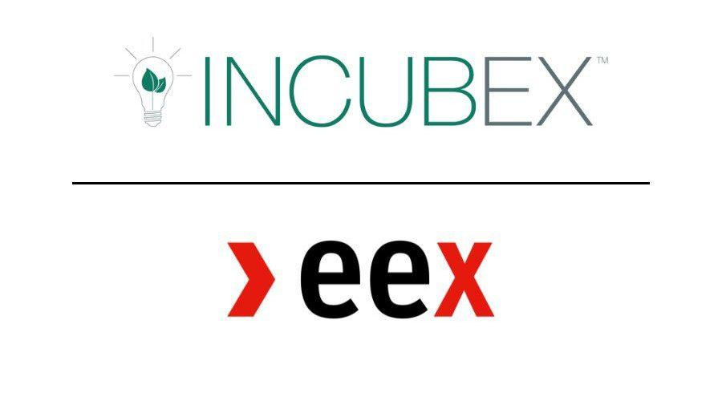

Environmental markets play a crucial role in addressing climate change by providing structured platforms for trading environmental assets, such as carbon credits. These markets allow countries, corporations, and individuals to achieve their environmental goals by creating incentives for reducing carbon emissions. One key method within these markets is carbon trading, a mechanism that enables the buying and selling of carbon emission allowances or credits, aimed at reducing overall greenhouse gas emissions. Carbon trading has grown substantially as societies recognize the need to balance economic growth with environmental sustainability, offering a market-driven solution to curb global emissions while rewarding sustainable practices.

IncubEx is an integral player in environmental markets, focusing on developing and expanding trading products that facilitate environmental sustainability. Established in 2016, IncubEx collaborates with leading exchanges such as the European Energy Exchange (EEX) and Nodal Exchange to create and expand platforms for trading environmental products. IncubEx's commitment to enhancing market structures aims to foster a more sustainable future through economically viable solutions.

In recent years, the rise of algorithmic trading has significantly influenced carbon markets. This form of trading utilizes complex algorithms to execute trades at high speed and efficiency, often outpacing human traders. Algorithmic trading enhances market liquidity and accessibility, thereby improving the functioning and attractiveness of carbon markets. With companies increasingly adopting digital platforms, the carbon trading landscape is evolving faster, allowing for seamless transactions and broader market participation.

The subsequent sections will focus on various aspects of the environmental markets, detailing IncubEx's contributions to the sector, the dynamics of carbon trading, and the transformative potential of algorithmic trading in advancing these objectives.

## Table of Contents

## Understanding Environmental Markets

Environmental markets are systems designed to regulate and facilitate the trading of ecosystem services and environmental assets. These markets have emerged as a pragmatic response to addressing ecological challenges, particularly climate change. Through these markets, economic mechanisms are employed to incentivize sustainable practices by placing a monetary value on environmental assets such as carbon emissions, water rights, biodiversity credits, and other ecological resources.

The significance of environmental markets lies in their ability to provide financial incentives for reducing environmental harm and promoting sustainable resource use. For instance, by assigning a cost to carbon emissions, carbon trading markets enable the internalization of environmental externalities. This economic approach encourages businesses and industries to invest in cleaner technologies and more sustainable practices, ultimately aiming to reduce global greenhouse gas emissions and mitigate climate change effects.

Environmental markets are crucial in combating climate change for several reasons:

1. **Cap-and-Trade Systems**: These systems set a cap on the total level of emissions allowed and enable entities to buy and sell permits to emit CO2. By limiting the overall emissions while allowing market mechanisms to dictate the price of carbon, these systems can effectively reduce greenhouse gases.

2. **Market-Driven Conservation**: By creating financial opportunities for conserving natural resources, environmental markets can lead to the preservation of forests, water bodies, and wildlife habitats, all of which play critical roles in absorbing carbon and maintaining ecological balance.

3. **Innovation and Investment**: These markets encourage innovation as companies seek cost-effective ways to reduce their environmental footprint. They can also drive investment in green technologies, including renewable energy, energy efficiency, and carbon capture and storage.

Various stakeholders are integral to the functioning and success of environmental markets. Key stakeholders include:

- **Businesses**: Corporations are often the primary participants in environmental markets, striving to meet regulatory requirements while managing costs. Through trading, businesses can achieve compliance more cost-effectively by buying or selling allowances based on their operational needs.

- **Governments**: Regulatory bodies and governments play a critical role in establishing and overseeing environmental markets. They set the rules, caps, and enforcement mechanisms that ensure market integrity and effectiveness.

- **Non-Governmental Organizations (NGOs)**: NGOs contribute by advocating for robust environmental policies and helping to ensure transparency and credibility in the markets. They often work alongside businesses and governments to develop standards and certifications that validate environmental market instruments.

Overall, environmental markets present a compelling framework for aligning economic interests with ecological sustainability. By incentivizing reductions in pollution and promoting conservation through financial mechanisms, these markets harness the power of the private sector to drive substantive progress in combating climate challenges.

## The Role of Carbon Trading

Carbon trading is a market-based mechanism aimed at reducing greenhouse gas (GHG) emissions. It allows entities to buy or sell carbon emission allowances, thereby promoting cost-effective ways to achieve emission reduction targets. The essence of carbon trading is its capacity to create a financial incentive for reducing carbon footprints, essentially putting a price on carbon emissions.

In a carbon trading system, the governing authority sets a cap on the total level of emissions allowed. Tradable permits, corresponding to this cap, are distributed or auctioned to the participants. Each permit, often referred to as an allowance, permits the holder to emit a specified amount, typically one ton, of carbon dioxide equivalent. This framework gives rise to the term “cap-and-trade,” where the 'cap' limits emissions, and 'trade' provides flexibility for businesses to meet emission targets by buying or selling allowances.

**Impact on Reducing Global Emissions**

Carbon trading has made a measurable impact on reducing global emissions. By encouraging industries to innovate and adopt cleaner technologies, cap-and-trade systems have played a critical role in achieving emission reductions where traditional regulatory approaches might have fallen short. For instance, the European Union Emissions Trading System (EU ETS), one of the largest carbon markets, has been instrumental in reducing emissions from the power and industrial sectors significantly since its inception in 2005.

**Types of Carbon Markets: Compliance vs. Voluntary**

Carbon markets are broadly classified into compliance and voluntary markets. Compliance markets are regulated by mandatory national, regional, or international carbon reduction regimes. Examples include the EU ETS and the California Cap-and-Trade Program. Participants in these markets are legally obligated to comply with emission limits.

Voluntary markets, in contrast, enable private entities, individuals, and organizations not bound by compliance obligations to mitigate their carbon footprints voluntarily. These markets provide flexibility in terms of practices and standards, allowing participants to purchase carbon offsets that represent emission reductions generated from projects such as reforestation or renewable energy generation.

**Economic and Environmental Benefits of Carbon Trading**

Carbon trading offers multifaceted benefits. Economically, by incentivizing emission reductions through financial means, companies are encouraged to find the most cost-effective methods to lower emissions, thus fostering innovation and efficiency. Carbon markets can mobilize investment in clean technologies and renewable energy, which can lead to economic growth and job creation in green industries.

Environmentally, carbon trading contributes to substantial reductions in GHG emissions, aligning with global efforts to combat climate change. By progressively lowering emissions caps, carbon markets drive societal shifts towards cleaner alternatives, aiding in maintaining ecosystem balance and reducing climate-related risks.

In conclusion, carbon trading emerges as a pivotal mechanism for enabling cost-effective emissions reductions while stimulating technological advancements and sustainable economic growth. Through both compliance and voluntary markets, this system exemplifies how environmental sustainability can be harmonized with economic objectives.

## IncubEx: Facilitating Growth in Environmental Markets

IncubEx was founded in the year 2016 with a mission to foster growth and innovation within environmental markets. Recognizing the burgeoning need for structured carbon trading systems, IncubEx was established to provide a platform where environmental commodities could be traded efficiently and transparently. It focuses on developing products and services that facilitate the trading of environmental instruments, thereby contributing to global efforts in reducing carbon emissions and combating climate change.

A significant milestone in IncubEx's journey was its partnership with the European Energy Exchange (EEX) and Nodal Exchange. These collaborations have allowed IncubEx to expand its reach and enhance its offerings within the carbon trading sector. The EEX, a leading European energy exchange, provides a robust framework for trading a range of energy and related products, including carbon allowances. This partnership gives IncubEx a competitive advantage in enabling higher [liquidity](/wiki/liquidity-risk-premium) and market participation.

IncubEx has been instrumental in the development of listed contracts for environmental markets. These contracts are standardized financial instruments that create opportunities for traders and investors to engage with carbon credits more effectively. By standardizing contracts, IncubEx enhances market accessibility and operational efficiency, making it easier for stakeholders to execute trades and manage portfolios related to carbon credits and other environmental commodities.

Key achievements and milestones mark IncubEx's growth trajectory. Since its inception, it has introduced several new products and trading mechanisms that have broadened its impact on environmental markets. These innovations have been pivotal in driving participation from various stakeholders, including businesses, governments, and non-governmental organizations, all of which play a crucial role in bolstering environmental markets.

An important development in IncubEx’s history is the launch of the Voluntary Climate Marketplace in partnership with Trayport. This marketplace is designed to cater to the voluntary carbon market, a sector where businesses and individuals voluntarily purchase carbon credits to offset their carbon footprint. The partnership with Trayport, a leading provider of energy trading solutions, allows IncubEx to leverage advanced trading technology and platforms, thereby improving market accessibility and the trading experience for its users.

Through strategic partnerships, innovative product offerings, and ongoing efforts to improve market structures, IncubEx continues to facilitate significant growth in environmental markets. Its efforts are critical in the broader context of global carbon trading, providing essential market infrastructure and services to drive sustainable environmental practices.

## Algorithmic Trading in Carbon Markets

Algorithmic trading, a prominent feature in modern financial markets, involves the use of computer algorithms to execute trades based on pre-defined criteria. This sophisticated form of trading increases the speed and efficiency of market transactions, allowing for rapid decision-making and minimizing human intervention. Algorithmic trading systems process vast amounts of market data to identify trading opportunities, leveraging statistical models and quantitative analysis to execute orders at optimal prices.

In the context of carbon markets, [algorithmic trading](/wiki/algorithmic-trading) can enhance market efficiency through improved price discovery and liquidity. Carbon markets, which facilitate the buying and selling of carbon credits to incentivize emission reductions, benefit from faster and more precise trading. Algorithms can analyze market trends, trading volumes, and historical data to forecast price movements, thereby aiding traders in making better-informed decisions.

The implementation of digital platforms and automated processes brings significant advantages to trading in carbon markets. These systems reduce transaction costs, mitigate risks related to human error, and ensure trades are executed at the most favorable prices. Automation allows for the handling of large trading volumes, which is crucial in markets characterized by complex and dynamic pricing mechanisms. The reduction in latency, or the delay before a transfer of data begins following an instruction for its transfer, is vital in executing trades at current market conditions, thus preserving the intended profitability of a trading strategy.

Trayport's Joule platform serves as a case study illustrating the impact of algorithmic trading in the carbon offset market. Joule offers a comprehensive interface for trading energy and environmental markets, integrating algorithmic trading capabilities. This platform provides traders with tools to automate trading strategies, access real-time market data, and perform advanced analytics. Joule supports various order types, optimizing trade execution and offering users the ability to tailor algorithms to specific market conditions. The platform's capacity to automate the trading process diminishes potential human errors and increases trading efficiency by executing strategies at high speed and precision.

Overall, the integration of algorithmic trading in carbon markets holds promise for enhancing transaction efficiencies, promoting better pricing mechanisms, and supporting the overall growth and stability of these markets. As trading platforms continue to evolve and incorporate sophisticated technologies, they can further facilitate the transition towards more sustainable environmental practices by ensuring efficient and transparent carbon markets.

## The Future of Carbon Trading with IncubEx and Algo Trading

Predictions for the growth of carbon trading markets indicate a significant expansion driven by increasing regulatory pressures and rising corporate commitments to sustainability. The market is expected to achieve growth projections, highlighted by the global shift towards decarbonization to meet international climate targets such as the Paris Agreement. According to a report by the International Carbon Action Partnership (ICAP), carbon markets are expanding rapidly with new trading systems being implemented in various regions, particularly in Asia and North America. The World Bank Group's "State and Trends of Carbon Pricing 2022" underscores that the global carbon pricing revenue reached approximately USD 84 billion in 2021, a clear indicator of the sector's potential profitability and expansion.

The role of technology in advancing environmental markets cannot be overstated. With the proliferation of digital platforms, blockchain technology, and [artificial intelligence](/wiki/ai-artificial-intelligence) (AI), the efficiency, transparency, and accessibility of carbon trading are enhanced significantly. Technologies such as blockchain offer secure and transparent mechanisms for tracking carbon credits, while AI and [machine learning](/wiki/machine-learning) algorithms are applied to optimize trading strategies and price forecasts. These advancements reduce transaction costs and increase the liquidity of carbon markets, making it more attractive for a diverse range of stakeholders.

IncubEx’s plans and potential future projects are crucial in steering the carbon trading sector towards greater efficacy and inclusivity. Since its founding in 2016, IncubEx has been instrumental in developing market-driven solutions through its collaborations with key exchanges such as the European Energy Exchange (EEX) and Nodal Exchange. Future projects may focus on expanding their existing partnerships and exploring new geographic markets. Furthermore, IncubEx could leverage advanced technologies to innovate within voluntary carbon markets, providing more precise data analysis tools and customizable contract options.

The synergy between IncubEx’s expertise and algorithmic trading technology represents a transformative potential for carbon trading. IncubEx’s domain knowledge in environmental markets, combined with cutting-edge algorithmic trading systems, can create enhanced trading platforms that facilitate faster execution, optimized pricing strategies, and increased market accessibility. Algorithmic trading, defined as the execution of trades using automated and pre-programmed instructions accounting for variables like time, price, and [volume](/wiki/volume-trading-strategy), can lead to more efficient market operations by minimizing latency and human errors. As an example, Trayport’s Joule platform, renowned for its robust trading infrastructure, can be integrated with IncubEx's initiatives to improve market operations.

In conclusion, the growth trajectory for carbon trading markets appears robust, fueled by technological innovations and strategic collaborations by market leaders such as IncubEx. The confluence of these elements is expected to bolster the global shift towards sustainable and economically-viable carbon-neutral solutions.

## Conclusion

Carbon trading serves as a critical mechanism in environmental markets, providing a structured approach to reducing global greenhouse gas emissions. By assigning a cost to carbon emissions, these markets incentivize businesses and organizations to implement cleaner practices and invest in sustainable technologies. Carbon trading not only facilitates compliance with environmental regulations but also supports voluntary climate actions, reinforcing the global effort against climate change. 

IncubEx has played a crucial role in advancing these markets. Since its inception in 2016, the company has emerged as a key facilitator, working to expand and develop the range of environmental products available for trading. Its strategic partnerships with platforms such as the European Energy Exchange (EEX) and Nodal Exchange underscore its commitment to enhancing market liquidity and accessibility. IncubEx’s initiatives, including the launch of the Voluntary Climate Marketplace, have significantly contributed to the maturation of carbon trading ecosystems, making them more robust and adaptable to global needs.

The integration of algorithmic trading into carbon markets presents transformative potential. By automating the trading process, algorithmic systems enhance market efficiency and transparency, facilitating faster transactions and better price discovery. This technological innovation can optimize trading strategies and reduce transaction costs, making it easier for more participants to engage in carbon trading. Platforms like Trayport's Joule are at the forefront of this revolution, exemplifying how digital solutions can augment traditional trading structures.

In summary, carbon trading is indispensable in combating climate change by economically motivating emission reductions. IncubEx’s pivotal role in shaping these markets, combined with the transformative power of algorithmic trading, signals a promising future. Together, they form a synergy that not only enhances current market structures but also paves the way for more comprehensive and efficient environmental strategies globally.

## References

Links to resources on environmental markets and carbon trading are essential for those seeking to broaden their knowledge in these areas. Below is a curated list of references and further reading materials:

1. **Environmental Markets and Carbon Trading Overview:**
   - World Bank's "State and Trends of Carbon Pricing" report provides an extensive analysis of carbon markets globally. Available at: https://openknowledge.worldbank.org/handle/10986/31755
   - Ecosystem Marketplace offers reports and insights on environmental markets, focusing on carbon outcomes and market dynamics. Access their resources at: https://www.ecosystemmarketplace.com/

2. **Algorithmic Trading and Technology in Carbon Markets:**
   - "Finance and the Greening of Markets" is a concise article detailing how algorithmic trading intersects with green finance. Available on JSTOR: (URL may require access via institutional login).
   - For insights into algorithmic trading platforms, Trayport's official page on their Joule trading platform highlights their contribution to digitization in carbon markets. Visit: https://www.trayport.com

3. **IncubEx and Its Role in Environmental Markets:**
   - IncubEx's website provides comprehensive information on their projects, partnerships, and market impact: https://www.theincubex.com/
   - Press releases and partnership details with EEX and Nodal Exchange can be accessed through IncubEx's media page: (URL to specific page)

4. **Books and Further Reading:**
   - "Carbon Markets: An International Business Guide" by Arnaud Brohé, Nick Eyre, and Nicholas Howarth presents a foundational understanding of carbon markets with practical insights for businesses.
   - Explore the role of environmental finance with "The Economics of Climate Change" by Nicholas Stern, which discusses market-based approaches to mitigating climate impacts.

These resources offer foundational and advanced knowledge, ensuring readers can comprehensively understand environmental markets, the mechanisms of carbon trading, and the evolution driven by technology and key players like IncubEx.

## References & Further Reading

[1]: ["State and Trends of Carbon Pricing 2022"](https://documents.worldbank.org/en/publication/documents-reports/documentdetail/099045006072224607/p1780300092e910590acb201757ecd54322) by the World Bank

[2]: Ecosystem Marketplace, ["State of Voluntary Carbon Markets 2021"](https://www.ecosystemmarketplace.com/publications/state-of-the-voluntary-carbon-markets-2021/)

[3]: Arnaud Brohé, Nick Eyre, and Nicholas Howarth, ["Carbon Markets: An International Business Guide"](https://www.taylorfrancis.com/books/mono/10.4324/9781849770699/carbon-markets-arnaud-broh%C3%A9-nicholas-howarth-nick-eyre-nicholas-stern)

[4]: Nicholas Stern, ["The Economics of Climate Change: The Stern Review"](https://www.cambridge.org/core/books/economics-of-climate-change/A1E0BBF2F0ED8E2E4142A9C878052204)

[5]: Trayport, ["Joule Trading Platform"](https://www.trayport.com/traders/joule/) 

[6]: IncubEx, ["Our Partnerships & Projects"](https://theincubex.com/)