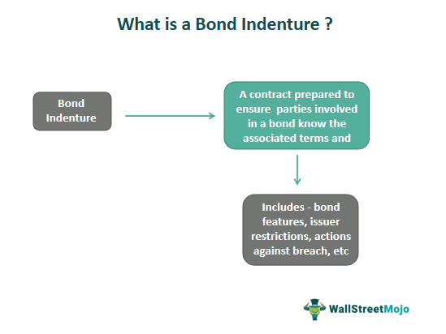

## Table of Contents

## What is an indenture in finance?

An indenture in finance is a legal document, or contract, between a bond issuer and bondholders. It outlines the terms and conditions of the bond, including the interest rate, repayment schedule, and any special features like convertibility or callability. This document is important because it protects the rights of bondholders by specifying what the issuer can and cannot do.

Think of an indenture as a set of rules that the bond issuer must follow. For example, it might limit how much debt the issuer can take on or require them to maintain certain financial ratios. If the issuer breaks these rules, bondholders can take legal action. This helps keep the bond investment safe and ensures that the issuer sticks to the agreed terms.

## What are the key components of a financial indenture?

A financial indenture has several important parts that help keep things clear between the bond issuer and the bondholders. One key part is the interest rate and payment schedule. This tells everyone how much interest the bond will pay and when those payments will happen. Another important part is the maturity date, which is when the bond issuer has to pay back the money they borrowed. The indenture also includes any special features, like if the bond can be turned into stock or if the issuer can buy it back early.

Another big part of the indenture is the covenants. These are rules that the bond issuer has to follow. For example, they might have to keep their debt levels below a certain amount or maintain a certain level of cash. If they break these rules, bondholders can take action. The indenture also has details on what happens if the issuer can't pay back the bond, which is called default. This part explains the steps bondholders can take to get their money back.

Lastly, the indenture includes information on how the bond can be transferred or sold. It also lists any collateral that backs the bond, which is something the issuer promises to give to bondholders if they can't pay. All these parts together make sure that everyone knows what to expect and helps protect the bondholders' investment.

## How does an indenture protect bondholders?

An indenture protects bondholders by setting clear rules that the bond issuer must follow. These rules, called covenants, can limit how much debt the issuer can take on or require them to keep certain financial ratios. If the issuer breaks these rules, bondholders can take legal action. This helps make sure the issuer stays financially healthy and doesn't do things that could hurt the bondholders' investment.

The indenture also spells out what happens if the issuer can't pay back the bond, which is called default. It gives bondholders a clear path to get their money back, maybe by taking the issuer to court or by getting any collateral that was promised. This makes bondholders feel safer because they know there's a plan in place if things go wrong.

Lastly, the indenture lists all the important details about the bond, like the [interest rate](/wiki/interest-rate-trading-strategies), when payments are due, and when the bond will be paid back. This helps bondholders understand exactly what they're getting and what to expect. By having everything written down, the indenture helps keep the bond issuer honest and protects the bondholders' rights.

## What is the difference between a trust indenture and a bond indenture?

A trust indenture and a bond indenture are both legal documents that outline the terms of a bond, but they have a key difference. A bond indenture is a contract between the bond issuer and the bondholders. It spells out all the details like the interest rate, when payments are due, and any special features of the bond. This document helps make sure that the bond issuer follows the rules and that bondholders know what to expect.

A trust indenture, on the other hand, involves a third party called a trustee. This trustee acts as a go-between for the bond issuer and the bondholders. The trust indenture not only includes all the details found in a bond indenture but also gives the trustee the power to enforce the terms of the bond. If the issuer doesn't follow the rules, the trustee can step in and take action to protect the bondholders' interests. So, while both types of indentures protect bondholders, a trust indenture adds an extra layer of security by involving a trustee.

## Can you explain the role of a trustee in an indenture?

A trustee in an indenture is like a middle person between the bond issuer and the bondholders. The trustee's main job is to make sure the bond issuer follows all the rules written in the indenture. These rules are called covenants, and they might say things like how much debt the issuer can have or what financial ratios they need to keep. If the issuer doesn't follow these rules, the trustee can step in and do something about it. This helps protect the bondholders because it means someone is watching out to make sure the issuer does what they promised.

The trustee also has a big role if the bond issuer can't pay back the bond, which is called default. In this case, the trustee works to get the bondholders their money back. They might do this by taking the issuer to court or by selling any collateral that was promised to back the bond. Having a trustee makes bondholders feel safer because they know there's someone looking out for them and making sure the bond issuer sticks to the deal.

## What are covenants in an indenture and why are they important?

Covenants in an indenture are like rules that the bond issuer has to follow. They can be about things like how much debt the issuer can take on, or what financial ratios they need to keep. For example, a covenant might say the issuer can't borrow more money than a certain amount, or they have to keep a certain amount of cash on hand. These rules help make sure the issuer stays financially healthy and doesn't do anything that could hurt the bondholders' investment.

Covenants are important because they protect bondholders. If the issuer breaks these rules, bondholders can take action, like taking the issuer to court. This gives bondholders a way to make sure the issuer sticks to the deal. By having these rules in place, covenants help keep the bond investment safe and give bondholders peace of mind knowing that the issuer is being watched to make sure they follow the rules.

## How do indentures affect the terms of a bond?

Indentures are like rule [books](/wiki/algo-trading-books) for bonds. They tell everyone what the bond issuer has to do and what bondholders can expect. For example, the indenture says how much interest the bond will pay and when those payments will happen. It also tells when the bond will be paid back, which is called the maturity date. If the bond has any special features, like being able to turn it into stock or being bought back early, those are in the indenture too. All these details help bondholders know exactly what they're getting into.

The indenture also has rules called covenants that the bond issuer must follow. These rules might say the issuer can't take on too much debt or they have to keep certain financial numbers in check. If the issuer breaks these rules, bondholders can take action to protect their investment. The indenture also explains what happens if the issuer can't pay back the bond, which is called default. It gives bondholders a clear plan to get their money back, maybe by taking the issuer to court or getting any promised collateral. By setting all these terms, the indenture helps keep the bond safe and makes sure everyone knows what to expect.

## What happens if there is a breach of an indenture?

If there is a breach of an indenture, it means the bond issuer did not follow the rules set in the indenture. This can happen if they take on too much debt, don't keep the right financial ratios, or miss a payment. When this happens, bondholders can take action. They might go to court to make the issuer follow the rules or to get their money back.

The indenture usually has a section that says what happens if there's a breach. This can include steps like the bondholders getting any collateral that was promised or the issuer having to fix the problem quickly. If the issuer can't fix the breach, it might lead to default, where the bondholders can take even stronger action to get their money back. This helps protect the bondholders and makes sure the issuer follows the rules.

## How have indentures evolved historically in finance?

Indentures have been around for a long time in finance. They started way back in the Middle Ages, when they were used for all sorts of contracts, not just bonds. Back then, indentures were actual pieces of paper cut in a special way so that both parties had matching edges. This made it hard to fake the document. Over time, as finance got more complicated, indentures became more focused on bonds. By the 19th century, they were used a lot in the U.S. to help build railroads and other big projects. These early indentures were simpler than today's, but they still had the basic idea of setting rules for the bond issuer.

As finance kept growing, indentures got more detailed. In the 20th century, especially after the Great Depression, laws were made to protect investors better. This led to even more rules in indentures, like covenants that made sure the bond issuer stayed financially healthy. The role of the trustee also became more important, acting as a watchdog for bondholders. Today, indentures are very detailed legal documents that cover everything from interest rates to what happens if the issuer can't pay back the bond. They've evolved a lot to keep up with the changing world of finance and to make sure bondholders are protected.

## What are some common types of indentures used in modern finance?

In modern finance, one common type of indenture is the corporate bond indenture. This is used when a company wants to borrow money by issuing bonds. The indenture will have all the details about the bond, like how much interest it pays, when payments are due, and any special features. It also has rules, called covenants, that the company must follow to keep the bond safe for investors. These rules might say the company can't take on too much debt or they have to keep certain financial numbers in check. If the company doesn't follow these rules, bondholders can take action to protect their investment.

Another type is the mortgage bond indenture, which is used when a company borrows money and uses real estate as collateral. This means if the company can't pay back the bond, bondholders can take the real estate to get their money back. The indenture will explain all the details about the bond and the collateral, and it will also have covenants to make sure the company stays financially healthy. This type of indenture gives bondholders extra protection because they know they can get something valuable if the company can't pay.

Lastly, there are convertible bond indentures. These are special because they let bondholders turn their bonds into stock of the company. The indenture will explain how this works, including the price at which the bond can be converted and any rules the company has to follow. Convertible bonds can be good for bondholders because they offer the chance to make more money if the company does well. But they still have all the usual details and protections that you find in other types of indentures.

## How do indentures impact the risk assessment of bonds?

Indentures help people figure out how risky a bond is by setting clear rules for the bond issuer. These rules, called covenants, tell the issuer what they can and can't do. For example, a covenant might say the issuer can't borrow too much money or they have to keep a certain amount of cash on hand. If the issuer follows these rules, it makes the bond less risky because it means they're being careful with their money. But if the issuer breaks these rules, it can make the bond riskier because it might mean they're not managing their money well.

The indenture also tells bondholders what happens if the issuer can't pay back the bond, which is called default. This part of the indenture explains the steps bondholders can take to get their money back, like taking the issuer to court or getting any collateral that was promised. Knowing these details helps bondholders understand how safe their investment is. If the indenture has strong protections and clear rules, it can make the bond seem less risky. But if the indenture doesn't have good protections, it can make the bond seem more risky because bondholders might not be able to get their money back easily if something goes wrong.

## What are the legal implications of indentures in different jurisdictions?

Indentures are legal documents that can have different rules in different places around the world. In the United States, indentures are often governed by state laws, like those in New York, which is a popular place for bond issuers to use because of its clear rules. The U.S. also has federal laws, like the Trust Indenture Act of 1939, which adds extra protections for bondholders. These laws make sure that indentures are clear and fair, and they help bondholders know what to expect if something goes wrong with their investment.

In other countries, the rules can be different. For example, in the European Union, there are laws like the Prospectus Regulation that set rules for how bonds are sold to the public. These laws can affect what has to be in an indenture and how it's enforced. In some places, like the UK, there might be different rules about what happens if a bond issuer can't pay back the bond. Knowing these differences is important for bondholders because it helps them understand how safe their investment is and what they can do if the issuer doesn't follow the rules.

## References & Further Reading

[1]: Lahart, J. (2011). ["Indenture Agreements: Why Bondholders Should Care."](https://www.finbri.co.uk/glossary/loans/indenture) The Wall Street Journal.

[2]: Barkley, R. H. (2018). ["Bond Indentures and Investor Protection"](https://digitalcommons.law.yale.edu/cgi/viewcontent.cgi?article=3996&context=ylj), Journal of Financial Economics.

[3]: Fabozzi, F. J. (2007). ["Fixed Income Analysis"](https://books.google.com/books/about/Fixed_Income_Analysis.html?id=lujLawVLS3YC) by CFA Institute Investment Series.

[4]: Choudhry, M. (2010). ["Corporate Bond Markets: Instruments and Applications"](https://www.amazon.com/Corporate-Bond-Markets-Instruments-Applications/dp/0470821779).

[5]: Smith, C. W., & Warner, J. B. (1979). ["On Financial Contracting: An Analysis of Bond Covenants."](https://www.sciencedirect.com/science/article/pii/0304405X79900114) Journal of Financial Economics.

[6]: Jurek, J., & Stafford, E. (2015). ["Credit Risk and the Pricing of Corporate Debt Securities"](https://www.jstor.org/stable/27648292), National Bureau of Economic Research.

[7]: Lopez de Prado, M. (2018). ["Advances in Financial Machine Learning"](https://www.amazon.com/Advances-Financial-Machine-Learning-Marcos/dp/1119482089) by Wiley.

[8]: Aronson, D. R. (2007). ["Evidence-Based Technical Analysis: Applying the Scientific Method and Statistical Inference to Trading Signals"](https://onlinelibrary.wiley.com/doi/book/10.1002/9781118268315) by Wiley.

[9]: Jansen, S. (2020). ["Machine Learning for Algorithmic Trading"](https://github.com/stefan-jansen/machine-learning-for-trading).

[10]: Chan, E. P. (2008). ["Quantitative Trading: How to Build Your Own Algorithmic Trading Business"](https://github.com/ftvision/quant_trading_echan_book).