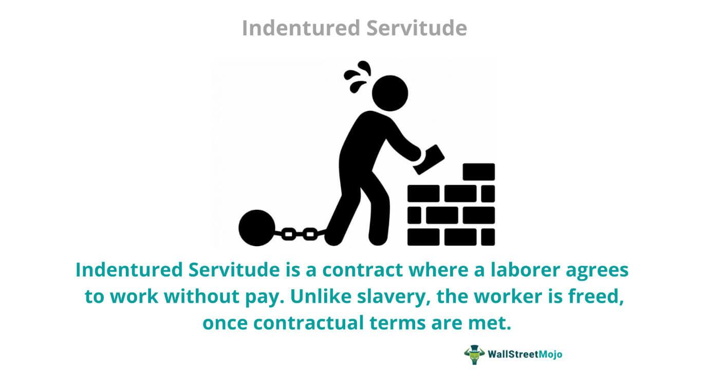

The intersection of labor history, specifically indentured servitude, and modern controversies, such as algorithmic trading, presents an intricate web of economic and societal issues that have evolved over centuries. Understanding the historical context of labor systems like indentured servitude and their transformation provides a lens through which we can view the complexities of contemporary labor dynamics, particularly within the sphere of algorithmic trading.

Indentured servitude emerged in the 17th century as a critical labor system, primarily in the American colonies, facilitating transatlantic migration. Individuals, often from Europe, traded several years of labor in exchange for passage to the New World, creating a foundational labor structure that influenced economic growth and settlement patterns. However, the system had profound implications, evolving over time and eventually declining due to the rise of African slavery and changing legislative landscapes. Despite its decline, the legacy of indentured servitude continues to inform discussions on labor practices and ethics today.

In contrast, the advent of algorithmic trading marks a significant shift in the labor market's landscape, automating what was once the domain of human traders. This shift embodies a historical echo of labor power dynamics and accessibility challenges, which are reminiscent of those seen during earlier times of economic transition. The progression from human-centric systems to automated processes not only transforms job roles but also poses ethical considerations comparable to those debated during the era of indentured servitude.

By examining how past labor systems parallel with contemporary forms like algorithmic trading, we can explore the ongoing debates in economic structures and their societal repercussions. This understanding provides critical insights into current and future labor controversies, where access to technology and equitable employment practices remain at the forefront. The historical foundations of labor serve as a valuable lens to critique and anticipate innovations in modern economic practices, highlighting an enduring dialogue on the balance between human capital and economic efficiency.

## Table of Contents

## The History of Indentured Servitude

Indentured servitude was an instrumental mechanism in facilitating transatlantic migration, predominantly during the 17th century. This labor system allowed individuals, primarily from Europe, to work in exchange for passage to the American colonies, notably in regions such as Chesapeake. Upon arrival, these individuals, known as indentured servants, were bound by contracts that stipulated a fixed term of service, often ranging from four to seven years, to pay off their transportation fees and other debts.

Indentured servitude emerged as a vital component of the colonial economy. It addressed the acute labor shortages in the burgeoning colonies, which demanded intensive labor for the cultivation of tobacco, one of the era's most lucrative cash crops. Historical records suggest that a significant proportion of European immigrants during the 1600s arrived in America under indenture agreements, illustrating the systemic reliance on this labor model (Galenson, 1984).

However, several factors contributed to the eventual decline of indentured servitude. One of the primary catalysts was the introduction and rise of African slave labor, which offered a more permanent and hereditary solution to labor demands. Unlike indentured servants, slaves were bound for life, thereby providing landowners with a more enduring workforce. Moreover, legislative changes both in Europe and America also facilitated this transition. The diminishing pool of willing European laborers, coupled with improved economic conditions in Europe, reduced the appeal of indentured contracts.

Despite being formally abolished, the consequences and economic impacts of indentured servitude resonate today. The system laid foundational aspects for labor dynamics and migration patterns that have persisted and evolved. Its legacy can be observed in modern labor practices and policies, reflecting continuity in the exploitation and regulation of labor across centuries. Understanding this historical framework provides valuable context for analyzing contemporary labor issues, echoing both the challenges and strategies of the past in today's economic landscape (Menard, 1973).

**References:**

- Galenson, D. W. (1984). "The Rise and Fall of Indentured Servitude in the Americas: An Economic Analysis". *The Journal of Economic History*, 44(1), 1-26.
- Menard, R. R. (1973). "From Servants to Slaves: The Transformation of the Chesapeake Labor System". *Southern Studies*, 80-84.

## Controversies Surrounding Indentured Servitude

Indentured servitude, while distinct from chattel slavery, often subjected individuals to conditions comparable to slavery, leading to significant moral and legal debates. Despite the contracts willingly signed by indentured servants, the harsh realities they faced, including severe restrictions on freedom, harsh punishments, and extension of service, occasionally mirrored the conditions experienced by slaves. This led many to question the actual voluntariness of the system and the validity of the contracts under which the servants labored.

A key controversy surrounded the differential treatment and rights of indentured servants compared to slaves. Although indentured servants technically retained certain legal rights, the degree of enforcement varied widely. Prominent legal scholars and historians continue to debate whether the nominal freedoms afforded to indentured servants genuinely distinguished their experiences from slaves'. Some argue that the legal rights were often not enough to compensate for the harsh working conditions and limited personal freedom.

Moreover, the exploitative nature of indentured servitude manifests in modern labor practices such as bonded labor and human trafficking. These contemporary forms of labor exploitation echo the power imbalances and manipulative contractual obligations seen in indentured servitude, suggesting an enduring legacy. The persistence of such practices points to systemic issues in labor dynamics where economic pressures and lack of options compel individuals into coercive labor agreements.

The legacy of indentured servitude raises profound questions about labor rights and the ethics of contract-based work. The moral implications of contracts that impose severe restrictions on individuals' freedom challenge modern legal frameworks in addressing labor exploitation. As society grapples with new forms of labor contracts and employment, the historical context of indentured servitude provides critical insights into ensuring equitable treatment and safeguarding labor rights. This historical reflection encourages ongoing scrutiny of labor systems and their alignment with ethical standards.

## Algorithmic Trading: Modern Implications of Historical Labor Systems

Algorithmic trading represents a noteworthy transformation in the landscape of financial markets, automating functions that were once the preserve of human traders. This advancement involves the use of complex algorithms capable of making high-speed trading decisions, processing information far faster than human capabilities allow. Algorithmic trading relies on pre-defined criteria and mathematical models to execute timely trades with precision.

This transition parallels historical labor divisions, particularly the disparities observed during the era of indentured servitude. Those who were unable to access education or resources were often left in vulnerable positions, paralleling how individuals today may be disadvantaged in financial markets if they lack technological means or understanding. Algorithmic trading can exacerbate existing economic inequities by favoring those with the capital to invest in sophisticated technology and expertise, potentially sidelining smaller traders and investors.

Further, the automation inherent in [algorithmic trading](/wiki/algorithmic-trading) presents challenges related to job displacement, akin to the historical shifts from indentured servitude to slavery and eventually to free labor markets. As algorithms handle tasks traditionally managed by human traders, concerns rise about the erosion of traditional trading roles. This mirrors the broad labor shifts of the past, where advancements in technology or systemic changes prompted significant reorganization of labor markets.

The implications of these changes extend beyond individual market participants, influencing the broader economic landscape. Jobs in trading and related fields may decline as automation increases, echoing the economic impact seen in historical labor transformations. The challenge lies in navigating these shifts ethically and sustainably, balancing technological progress with the need to preserve employment and economic stability.

These dynamics signify a broader trend in labor evolution, emphasizing the need to understand and manage technological advancements akin to how society once grappled with the transition from labor systems like indentured servitude. Addressing the technological divide and ensuring equitable access to trading technology remain crucial as the market continues its shift towards ever-increasing automation and efficiency.

## Connecting the Past with the Present

The connection between historical labor systems such as indentured servitude and modern algorithmic trading highlights a unique continuity in economic evolution. Indentured servitude, a form of labor exchange wherein individuals worked for a set period in return for passage to a new land, reflects how labor has often been a negotiation between freedom and economic necessity. This system's dynamics provide valuable insights into today's complexities surrounding labor automation.

In examining algorithmic trading, a contemporary shift from human-operated to machine-operated processes, echoes of historical labor divides are evident. The nature of indentured servitude involved limited control over one's labor conditions and outcomes, similar to how individuals in areas without access to advanced technologies may find themselves at a disadvantage in automated trading environments. The gap between those with and without access to cutting-edge technology exemplifies a modern parallel to past labor inequities. Those who lack access to or understanding of algorithmic tools can find themselves marginalized in the modern economic landscape, much like those who were bound by indenture.

Further, labor automation today raises significant ethical issues, akin to historical labor practices, by challenging existing employment frameworks and creating concerns over job displacement. As algorithms replace human traders, the consequences for employment and skills relevance are profound. This shift to automation mirrors past transitions, such as that from indentured labor to more exploitative systems, highlighting the ongoing negotiation between economic efficiency and human capital. Moreover, the ethics surrounding labor contracts, which were central to indentured servitude, remain relevant in discussions about the integrity and fairness of using algorithms in trading.

Reflecting on historical labor systems like indentured servitude allows for a critical assessment of present-day economic structures. It encourages exploration of how ethical considerations and social justice concerns have evolved alongside technological advancements. By understanding these historical precedents, we are better equipped to critique our current systems and anticipate future labor challenges. With automation accelerating change, ensuring equitable tech access and developing fair employment policies become increasingly crucial. This historical perspective emphasizes the need for balance and foresight in crafting labor policies that navigate the tensions between technological progress and socio-economic fairness.

## Conclusion

By examining the history of indentured servitude and its modern parallels in algorithmic trading, we gain insights into persistent labor issues. Indentured servitude, a historical labor system, provided a structured yet exploitative solution to labor demands by formalizing work through contracts. Its legacy has left an indelible mark on how labor dynamics are viewed today, particularly in the context of power imbalances and worker rights.

Algorithmic trading, as a modern evolution of labor processes, transforms traditional trading through automation. This transformation highlights the shift from manual human effort to machine-led operations, echoing past transitions from labor-intensive systems to mechanized or technologically driven processes. Algorithmic trading presents its own set of labor challenges, such as job displacement and unequal access to technology, which are vivid manifestations of historical labor debates about equity and fairness.

Addressing ongoing controversies requires historical awareness and a forward-thinking approach to labor policy and technology integration. We must draw parallels between past labor structures, such as indentured servitude, and modern technological advancements, ensuring policies evolve to protect today's workforce from exploitation and inequality. An understanding of these historical frameworks provides clarity in navigating current economic debates regarding the balance between human capital and the drive for economic efficiency.

The journey from indentured servitude to automated trading underscores a vital aspect of labor: the ongoing balance between human capital and economic efficiency. While technology can enhance productivity and market participation, it can also exacerbate divides and eliminate jobs traditionally held by individuals. Thus, the lessons learned from historical labor practices should guide current and future strategies in crafting a sustainable labor market that values both human workers and technological advancements. This balance is crucial for developing equitable policies that recognize the historical context of labor while addressing the imperatives of a technologically advanced economy.

## References & Further Reading

[1]: Galenson, D. W. (1984). ["The Rise and Fall of Indentured Servitude in the Americas: An Economic Analysis."](https://www.jstor.org/stable/2120553) The Journal of Economic History, 44(1), 1-26.

[2]: Menard, R. R. (1973). ["From Servants to Slaves: The Transformation of the Chesapeake Labor System."](https://www.taylorfrancis.com/chapters/edit/10.4324/9781003362449-17/servants-slaves-transformation-chesapeake-labor-system-russell-menard) Southern Studies.

[3]: ["Advances in Financial Machine Learning"](https://www.amazon.com/Advances-Financial-Machine-Learning-Marcos/dp/1119482089) by Marcos Lopez de Prado.

[4]: ["Quantitative Trading: How to Build Your Own Algorithmic Trading Business"](https://www.amazon.com/Quantitative-Trading-Build-Algorithmic-Business/dp/1119800064) by Ernest P. Chan.

[5]: ["Machine Learning for Algorithmic Trading"](https://github.com/stefan-jansen/machine-learning-for-trading) by Stefan Jansen.