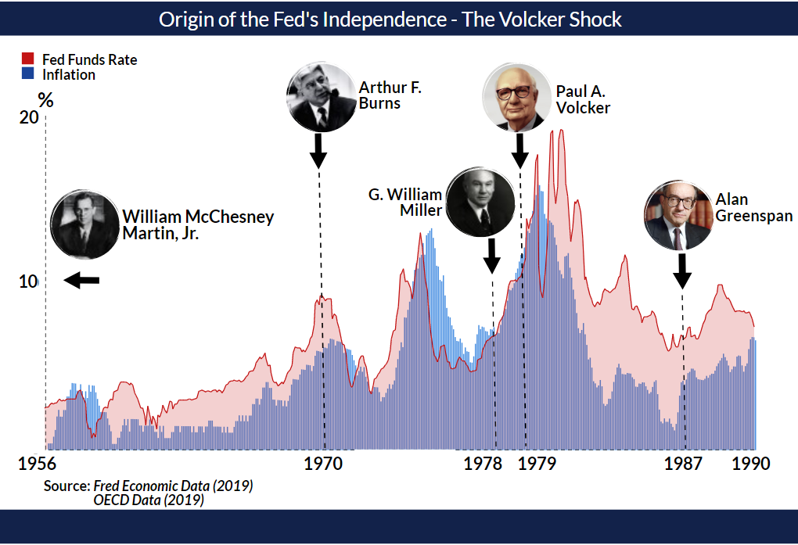

In the contemporary world of finance, the interplay between central banking, monetary policy, and algorithmic trading is crucial. Central banks, such as the Federal Reserve in the United States, play a pivotal role in managing economic stability. They achieve this by formulating and implementing monetary policy, which involves controlling interest rates and regulating the money supply to influence economic growth and inflation rates. This responsibility is vital in promoting a stable financial environment that supports sustainable economic expansion.

Algorithmic trading, which utilizes advanced computer algorithms to execute trades with remarkable speed and precision, has rapidly become a significant force in financial markets. Enabled by technological advancements, such as improved computational power and data analytics, algorithmic trading enhances market liquidity and efficiency. Its rise has transformed traditional trading practices and introduced new complexities that affect how monetary policy impacts financial markets.



This article examines the necessity of central bank independence, highlighting its importance in ensuring that monetary policies are enacted without undue political influence. Independent central banks are better positioned to pursue long-term economic objectives, such as price stability and full employment, free from short-term political pressures. Simultaneously, the article assesses how algorithmic trading influences monetary policy by rapidly processing and reacting to policy changes and economic data. This dynamic interaction is essential for understanding current and future economic trends.

Historical contexts provide insights into the evolution of central bank independence and monetary policy. Analyzing past challenges and achievements allows us to understand the current landscape and anticipate future developments. The implications of algorithmic trading on policy formulation and market behavior are also discussed, highlighting the need for robust regulatory frameworks to maintain financial stability.

The future prospects of central banking and algorithmic trading are contingent upon recognizing and adapting to ongoing technological changes and economic challenges. By integrating advanced trading technologies into policy frameworks and maintaining central bank independence, economies can strive for stability and growth amidst an ever-evolving financial landscape.

## Table of Contents

## The Role and Independence of Central Banks

Central banks play a vital role in managing national economies by controlling inflation and fostering economic growth, primarily through the manipulation of interest rates. By adjusting interest rates, central banks influence borrowing costs, consumer spending, and investment levels, thereby steering economic activities towards desired outcomes. Central bank independence is considered essential to prevent political interference that may lead to unsound financial decisions.

The independence of central banks has been historically tested, often with notable consequences. For instance, in several instances globally, the lack of independence has resulted in hyperinflation, where excessive money supply growth, often driven by political motives, leads to spiraling inflation. This financial instability highlights the importance of shielding central banks from direct political control.

A significant milestone in central bank independence was the Monetary Accord of 1951, an agreement between the United States Treasury and the Federal Reserve. This accord marked a turning point where the Federal Reserve gained autonomy in setting its monetary policy, free from direct Treasury influence. The accord's primary aim was to ensure that monetary policy focused on maintaining price stability and promoting healthy economic growth, rather than serving immediate fiscal financing needs.

In recent years, there have been continued efforts to enhance the transparency and independence of central banking institutions. Transparent operations involve clear communication of policy intents and rationales to the public and markets, thereby managing expectations and improving policy efficacy. Reforms are being implemented to strengthen legal and operational frameworks that safeguard central banks from political encroachments. This independence is crucial to maintain economic stability by allowing central banks to make decisions grounded in economic data and analysis rather than fluctuating political agendas.

The ongoing pursuit of independent and transparent central banking underpins the resilience and stability of global financial systems amidst evolving economic challenges. As economies become more interconnected and complex, the role and autonomy of central banks remain fundamental in achieving sustainable growth and maintaining confidence in monetary systems.

## Monetary Policy: Past and Present Challenges

Historically, central banks have faced numerous challenges in executing sound monetary policies, often due to the constraints imposed by government fiscal needs. Before the 1950s, monetary policies were closely tied to fiscal policies, limiting central banks' ability to independently manage economic parameters such as inflation and growth. This changed significantly with the Monetary Accord of 1951, also known as the Treasury-Federal Reserve Accord. This pivotal agreement formally established the Federal Reserve's independence from the U.S. Treasury, allowing it to pursue monetary policy objectives aimed at price stability and economic growth without direct fiscal interference. The Accord effectively separated monetary policy from government fiscal policy, marking a critical shift towards central bank autonomy.

In the contemporary context, central banks continue to encounter challenges, primarily due to the dynamic and interconnected nature of the global economy. A pressing issue is managing inflation, which is affected by a range of factors from local economic conditions to international market fluctuations. Central banks must navigate these complexities while also considering the impact of emerging financial technologies that redefine traditional monetary policy tools.

These modern challenges necessitate a thorough understanding of historical lessons. Past experiences underscore the importance of striking a balance between fostering economic growth and maintaining price stability. This balance is crucial for ensuring that economies remain resilient in the face of potential financial crises. For instance, the lessons from the global financial crisis of 2008 highlighted the risks of inadequate regulatory oversight and the need for central banks to adapt their strategies proactively.

Current monetary policy frameworks increasingly incorporate insights gained from past experiences, emphasizing a proactive stance in policy formulation. This involves adopting data-driven approaches and advanced analytical tools to anticipate economic shifts and mitigate adverse effects. Central banks are also progressively integrating new strategies that consider the implications of financial innovations, such as digital currencies and algorithm-based trading systems.

In summary, the trajectory of monetary policy reflects an evolution from fiscal dominance to independent and flexible policy frameworks that aim to safeguard economic stability. By leveraging historical insights and adapting to new challenges, central banks strive to maintain stability within an ever-evolving financial landscape.

## Algorithmic Trading: TransformING Financial Markets

Algorithmic trading employs computer algorithms to execute trades at high speed and efficiency, fundamentally altering the landscape of modern financial markets. These algorithms are designed to identify and leverage opportunities more quickly than human traders, executing numerous transactions within fractions of a second. With sophisticated mathematical models at their core, algorithms can process vast datasets to uncover profitable trading signals.

The primary advantage of [algorithmic trading](/wiki/algorithmic-trading) lies in its capacity to enhance market [liquidity](/wiki/liquidity-risk-premium) and efficiency. By facilitating the rapid buying and selling of financial instruments, algorithms ensure that market prices more accurately reflect their intrinsic values, thus narrowing bid-ask spreads and reducing transaction costs.

However, this evolution has introduced significant challenges. One of the most prominent issues associated with algorithmic trading is increased market [volatility](/wiki/volatility-trading-strategies). For example, algorithms are typically programmed to respond to specific market conditions, a mechanism that can lead to phenomena such as "flash crashes." In these instances, cascading sell-offs triggered by automated systems can cause significant short-term price fluctuations, undermining market stability.

To illustrate, consider the relationship between trading [volume](/wiki/volume-trading-strategy) and volatility. High-frequency trading ([HFT](/wiki/high-frequency-trading-strategies)) algorithms execute numerous trades, often leading to heightened trading volume. While increased trading volume typically results in greater liquidity, it can also exacerbate price swings if a large volume of trades moves in the same direction simultaneously.

Regulators face the critical task of balancing market integrity with the need to foster innovation. Regulatory frameworks must address the potential for algorithm-driven market disruptions while encouraging the benefits algorithms bring to market dynamism. This calls for measures such as circuit breakers that temporarily halt trading under extreme volatility conditions, as well as monitoring systems to ensure transparency and accountability in automated trading strategies.

Moreover, algorithmic trading responds dynamically to monetary policy changes by rapidly processing vast amounts of market data. Consider the scenario where a central bank alters interest rates. In such cases, algorithmic systems can swiftly adjust trading strategies based on changes in bond yields or currency valuations, effectively incorporating policy impacts into pricing almost instantaneously. This rapid response mechanism plays a crucial role in ensuring that markets remain aligned with economic fundamentals.

As financial markets continue to integrate advanced technologies, the role of algorithmic trading is set to expand further. The challenge lies in managing the dual goals of maintaining market efficiency and protecting against systemic risks, a balance that will shape the future of algorithmic trading and its regulatory environment.

## Interplay Between Central Bank Policy and Algo Trading

The intersection of central bank policy and algorithmic trading represents a pivotal [factor](/wiki/factor-investing) in the contemporary financial landscape. Historical monetary policies have laid the groundwork for the existing architecture of financial markets, with the integration and advancement of algorithmic trading playing an increasingly influential role.

Algorithmic trading utilizes sophisticated computer algorithms to execute trades at rapid speeds and enhanced efficiency. This evolution affects how monetary policies, particularly changes in interest rates, are assimilated by the market. For instance, when the Federal Reserve adjusts interest rates, algorithmic trading systems can quickly interpret these changes and execute trades faster than human traders. This has significant implications for market liquidity and volatility, as algorithms can cause rapid fluctuations in asset prices soon after policy announcements. This dynamic can be modeled in part by studying how algorithms respond to monetary signals, using concepts from statistical analysis or [machine learning](/wiki/machine-learning) to predict behavior patterns in the market.

Advanced trading strategies can lead to either stabilization or destabilization of markets in reaction to shifts in monetary policy. For example, certain algorithms are designed to exploit minute pricing inefficiencies, potentially leading to liquidity provision and market stability. Conversely, high-frequency trading (HFT) strategies might amplify volatility, particularly during periods of economic uncertainty or major policy announcements, wherein multiple algorithms might simultaneously react in similar directions, causing abrupt market movements. Algorithms, by employing a mixture of technical analysis and economic indicators, could either dampen or magnify market reactions to policy hints from central banks.

Central banks, including the Federal Reserve, are in a continual process of adjusting their policy frameworks to address the dual challenges and opportunities presented by algorithmic trading. This includes refining communication strategies to ensure clear transmission of monetary policy intentions, thereby reducing the likelihood of misinterpretation by automated systems. Furthermore, regulatory measures are developed to oversee trading activities and mitigate systemic risks associated with high-frequency trades.

In alignment with these considerations, central banks also recognize the potential benefits of algorithmic trading, such as increased market efficiency and the facilitation of smoother market functioning. As such, they are tasked with crafting policies that not only harness these advantages but also safeguard against resultant instabilities. This necessitates a blend of traditional economic policy tools and modern technological insights, ensuring that the evolution of financial markets continues to support economic stability and growth.

## Future Prospects and Solutions

Central banks will need to retain their independence to effectively manage monetary policy in a swiftly changing economic landscape. This autonomy is crucial for ensuring policies are designed and implemented based on economic needs rather than political pressures. As the financial markets evolve, primarily driven by technological advancements, it becomes imperative for these institutions to develop adaptive regulatory frameworks. These measures aim to balance reaping the benefits of innovations like algorithmic trading while controlling the risks associated with them, such as heightened market volatility and systemic risks.

The integration of sophisticated data analytics and high-frequency trading models into central bank policy toolkits opens new avenues for enhancing decision-making processes. By employing advanced data analytics, central banks can better understand market dynamics and predict economic trends with higher accuracy. For instance, machine learning algorithms can identify patterns in vast datasets, providing insights into consumer behavior, inflation trends, and other economic indicators. Here is a basic example of how a central bank might use Python to analyze key economic indicators:

```python
import pandas as pd
import matplotlib.pyplot as plt

# Load a dataset
data = pd.read_csv('economic_indicators.csv')

# Analyze inflation trend
inflation_data = data['Inflation']
inflation_data.plot(title='Inflation Trend Over Time')
plt.xlabel('Year')
plt.ylabel('Inflation Rate')
plt.show()
```

The above code could be part of a broader strategy using machine learning to forecast future inflation based on historical data, aiding in setting appropriate interest rates.

High-frequency trading models can also be adopted by central banks to simulate market responses to policy changes, assessing potential impacts with greater precision. These models provide a real-time analysis of the market reactions to policy adjustments, offering crucial feedback for policy refinement.

Continuous research and a deep understanding of historical policies remain vital for shaping future economic strategies. Learning from past successes and failures enables central banks to design resilient and forward-thinking policies. This understanding is essential, especially as financial markets face ongoing disruptions due to technological innovations, geopolitical factors, and global economic fluctuations. By maintaining an adaptive stance and embracing technological advancements, central banks can navigate these challenges to foster economic stability and growth in an ever-evolving financial landscape.

## Conclusion

The intricate dynamics among central banks, monetary policy, and algorithmic trading present a challenging yet essential area of study in modern finance. Central bank independence remains a cornerstone for economic stability. This independence allows monetary authorities to set and adjust policies without external pressures, thereby enabling them to respond effectively to economic indicators and shifts. Maintaining this independence is critical, especially when considering the adaptive regulations necessary to manage the fast-paced evolution of algorithmic trading.

As financial markets evolve, so does the sophistication of the tools and models needed to navigate them. The rapid integration of technology into these markets demands that both central banks and regulatory bodies remain agile, continually updating policies and leveraging advancements in data analytics. This ensures that while innovation is encouraged, market integrity is preserved.

Historical economic lessons combined with current technological advancements provide a rich guide for future strategies. Past experiences underscore the importance of resilient and adaptable policies. Technologies, such as advanced data analytics and algorithmic models, have the potential to enhance the effectiveness of monetary policy, provided they are harnessed judiciously.

Ultimately, the future of monetary policy and financial market regulation will rely on a balance—a synergy between maintaining robust regulatory frameworks and embracing technological innovations. This balance will ensure that central banks can continue to navigate the complexities of modern economies with precision and foresight, safeguarding against potential crises while fostering growth and stability in financial markets.

## References & Further Reading

[1]: Bernanke, B. (2020). ["21st Century Monetary Policy: The Federal Reserve from the Great Inflation to COVID-19"](https://www.amazon.com/21st-Century-Monetary-Policy-Inflation/dp/1324020466). W. W. Norton & Company.

[2]: Mishkin, F. S. (2018). ["The Economics of Money, Banking, and Financial Markets"](https://www.pearsonhighered.com/assets/preface/0/1/3/4/0134855388.pdf) (12th Edition). Pearson.

[3]: Lopez de Prado, M. (2018). ["Advances in Financial Machine Learning"](https://www.amazon.com/Advances-Financial-Machine-Learning-Marcos/dp/1119482089). Wiley.

[4]: Aronson, D. (2006). ["Evidence-Based Technical Analysis: Applying the Scientific Method and Statistical Inference to Trading Signals"](https://www.amazon.com/Evidence-Based-Technical-Analysis-Scientific-Statistical/dp/0470008741). Wiley.

[5]: Jansen, S. (2020). ["Machine Learning for Algorithmic Trading - Second Edition"](https://www.amazon.com/Machine-Learning-Algorithmic-Trading-alternative/dp/1839217715). Packt Publishing.

[6]: Chan, E. P. (2009). ["Quantitative Trading: How to Build Your Own Algorithmic Trading Business"](https://github.com/ftvision/quant_trading_echan_book). Wiley Trading.