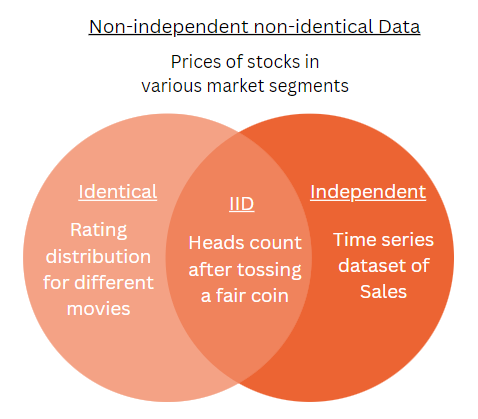

## Table of Contents

## What does 'Independently and Identically Distributed' (I.I.D) mean in the context of machine learning?

In machine learning, 'Independently and Identically Distributed' (I.I.D) is a very important concept. It means that the data points in your dataset are independent of each other, and each data point comes from the same probability distribution. Imagine you are rolling a fair die many times. Each roll is independent because the outcome of one roll does not affect the next roll, and each roll is identically distributed because every roll has the same chance of landing on any number from 1 to 6.

This concept is crucial because many machine learning algorithms assume that the training data and the test data are I.I.D. This assumption helps the model to generalize well from the training data to new, unseen data. If the data is not I.I.D, the model might perform well on the training data but poorly on new data, a problem known as overfitting. So, when working with machine learning, it's important to check if your data meets the I.I.D assumption to ensure your model's predictions are reliable.

## Why is the I.I.D assumption important in machine learning?

The I.I.D assumption is important in machine learning because it helps the model learn from the data in a way that can be applied to new, unseen data. When data points are independent and identically distributed, it means that each data point is like a fresh start, not influenced by other data points, and they all come from the same kind of data set. This makes it easier for the model to understand patterns and make predictions. If the data follows the I.I.D assumption, the model can be confident that what it learns from the training data will also work on new data.

If the I.I.D assumption is not met, the model might not work well on new data. For example, if data points are not independent, like if one data point can affect another, the model might learn patterns that only work for the training data and not for new data. This can lead to overfitting, where the model is too focused on the training data and does not generalize well. So, checking if your data is I.I.D helps make sure your machine learning model will be useful and reliable when used in the real world.

## How does the I.I.D assumption affect the training and testing of machine learning models?

The I.I.D assumption is really important when you're training a machine learning model. When you train a model, you're showing it a bunch of examples, and you want it to learn from these examples in a way that works for new examples too. If your data is I.I.D, it means each example is like a new chance for the model to learn, and all the examples are from the same kind of data. This helps the model learn the right patterns and not just memorize the training data. If the data isn't I.I.D, the model might learn patterns that only work for the training data and not for new data, which can lead to overfitting.

When you test your model, the I.I.D assumption is just as important. You want the test data to be like the training data so that you can trust the model's performance on the test data. If both the training and test data are I.I.D, then the model's performance on the test data will be a good sign of how it will do on new, unseen data. But if the test data isn't like the training data, the model might do well on the test data but not on new data, or it might do poorly on the test data even if it would do well on new data. So, making sure your data is I.I.D helps make sure your model will work well in the real world.

## Can you explain the difference between independent and identically distributed data?

When we say data is independent, it means that knowing something about one piece of data doesn't tell you anything about any other piece of data. Imagine you're flipping a coin. If you flip it and it lands on heads, that doesn't change the chances of the next flip being heads or tails. Each flip is its own event, not affected by the others. In machine learning, if your data points are independent, it means each example you show your model is a fresh start, and the model can learn from each one without being influenced by the others.

On the other hand, when we say data is identically distributed, it means that all the data comes from the same kind of situation or follows the same rules. Using the coin flip example again, if you're using the same coin each time, every flip has the same chance of being heads or tails. In machine learning, if your data is identically distributed, it means all your examples are drawn from the same kind of data set. This helps your model learn patterns that work for all the data, not just some of it.

Together, the ideas of independent and identically distributed data help make sure your machine learning model learns in a way that works well on new data. If your data is both independent and identically distributed, it's easier for the model to learn the right patterns and not just memorize the training data. This makes your model more reliable when you use it in the real world.

## What are some common examples of I.I.D data in machine learning?

One common example of I.I.D data in machine learning is the dataset of images used for training a model to recognize handwritten digits, like the MNIST dataset. Each image in the dataset is a separate digit, and knowing what one image shows doesn't help you guess what the next image will show. They are independent. Also, all the images come from the same kind of data - handwritten digits - so they are identically distributed. This makes MNIST a good example of I.I.D data.

Another example is a dataset of house prices where each entry is a different house. The price of one house doesn't affect the price of another house, so the data points are independent. And since all the entries are houses with similar features like size, location, and number of rooms, they come from the same kind of data, making them identically distributed. This helps models trained on this data to predict house prices well for new houses too.

## How can we check if a dataset satisfies the I.I.D assumption?

To check if a dataset satisfies the I.I.D assumption, you can start by looking at the data and thinking about where it comes from. If the data comes from different sources or if one piece of data can affect another, it might not be independent. For example, if you're looking at stock prices, the price of one stock can affect the price of another stock, so they wouldn't be independent. If the data comes from different kinds of situations, like mixing data from different countries or different time periods, it might not be identically distributed. You can also use statistical tests to help you check if the data is I.I.D, like the Kolmogorov-Smirnov test to see if the data comes from the same distribution.

Another way to check if your data is I.I.D is to split your dataset into a training set and a test set and see how your model performs. If your model does well on the training set but not on the test set, it might mean the data isn't I.I.D. You can also look at the data visually. For example, you can make a scatter plot of your data points and see if they seem to be randomly spread out or if there are patterns that suggest the data points are related. If you see patterns, it might mean the data isn't independent. By using a mix of these methods, you can get a better idea if your data satisfies the I.I.D assumption.

## What are the consequences of violating the I.I.D assumption in machine learning?

When you violate the I.I.D assumption in machine learning, it can cause big problems for your model. If your data isn't independent, like if one piece of data can affect another, your model might learn patterns that only work for the training data and not for new data. This is called overfitting. For example, if you're predicting stock prices and the price of one stock affects another, your model might do well on the training data but fail when you use it on new data because the relationships between the stocks have changed.

If your data isn't identically distributed, it means the data comes from different kinds of situations. This can also make your model less reliable. For example, if you're training a model on data from one country and then use it on data from another country, the model might not work well because the data is different. This can lead to your model making bad predictions on new data, even if it did well on the training data. So, making sure your data is I.I.D helps your model learn in a way that works well on new data too.

## How do real-world data challenges the I.I.D assumption, and what are some strategies to handle non-I.I.D data?

Real-world data often challenges the I.I.D assumption because it can come from different sources or change over time. For example, if you're using data from social media, the posts can be affected by trends or events, so they're not independent. Also, data from different countries or time periods might not be identically distributed because the situations are different. This can make it hard for a machine learning model to learn the right patterns and predict well on new data.

To handle non-I.I.D data, you can use different strategies. One way is to use techniques like cross-validation to make sure your model works well on different parts of your data. Another way is to use models that can learn from data that changes over time, like online learning or time series models. You can also try to make your data more I.I.D by removing or adjusting parts of the data that are causing problems. By using these strategies, you can help your model work better even when the data isn't perfectly I.I.D.

## In what types of machine learning algorithms is the I.I.D assumption most critical?

The I.I.D assumption is most critical in supervised learning algorithms, especially in classification and regression tasks. These algorithms rely heavily on the idea that the training data and the test data come from the same distribution and are independent of each other. For example, in a simple linear regression model, the model assumes that each data point is an independent observation from the same underlying process. If the data violates the I.I.D assumption, the model might fit the training data well but fail to generalize to new, unseen data, leading to poor predictions.

In addition to supervised learning, the I.I.D assumption is also crucial in some unsupervised learning algorithms, like clustering. Clustering algorithms, such as k-means, assume that the data points are independent and come from the same distribution to group them effectively. If the data is not I.I.D, the clusters formed might not represent the true underlying structure of the data. For instance, if time series data is used without considering its temporal dependencies, the clustering results could be misleading. Ensuring the I.I.D assumption helps these algorithms work correctly and provide reliable results.

## How does the concept of I.I.D relate to statistical learning theory?

In statistical learning theory, the I.I.D assumption is really important because it helps us understand how well a model can learn from data. When data is I.I.D, it means each piece of data is like a new start, not affected by other pieces, and they all come from the same kind of data set. This makes it easier for the model to learn the right patterns and not just memorize the training data. In statistical learning, this assumption helps us use math to figure out how much data we need and how well a model can predict new data. If the data is I.I.D, we can use formulas to estimate how much error our model might have on new data, which helps us trust our model more.

For example, in statistical learning theory, we often use the concept of the expected risk, which is the average error a model might make on new data. If the data is I.I.D, we can use the law of large numbers to say that the average error on the training data will be close to the expected risk on new data. This is shown in the formula for the expected risk, $$ R(h) = \mathbb{E}[L(h(X), Y)] $$, where $$ h $$ is the model, $$ X $$ and $$ Y $$ are the input and output data, and $$ L $$ is the loss function. If the data isn't I.I.D, these formulas don't work as well, and it's harder to trust that our model will do well on new data. So, making sure the data is I.I.D helps us use statistical learning theory to make better models.

## What advanced techniques can be used to model data that does not meet the I.I.D criteria?

When data does not meet the I.I.D criteria, advanced techniques like time series analysis can be used. Time series data, like stock prices or weather data, often has patterns over time, so each piece of data depends on the ones before it. To model this kind of data, you can use models like ARIMA (AutoRegressive Integrated Moving Average). ARIMA looks at how past values affect future values and can help predict what might happen next. Another technique is online learning, where the model keeps learning from new data as it comes in. This helps the model adapt to changes over time, which is useful when the data is not identically distributed.

Another approach is to use techniques that can handle data from different sources or distributions, like transfer learning. Transfer learning lets a model trained on one kind of data help with another kind of data. For example, if you have a model trained on data from one country, you can use transfer learning to help it work on data from another country. This can be useful when the data isn't identically distributed. You can also use ensemble methods, where you combine different models to make better predictions. By using these advanced techniques, you can handle data that doesn't meet the I.I.D criteria and still make good predictions.

## Can you discuss any recent research or developments regarding I.I.D assumptions in machine learning?

Recent research in machine learning has focused a lot on how to deal with data that doesn't follow the I.I.D assumption. One big area of interest is in the field of federated learning, where data is spread across different places and might not be I.I.D. Researchers are working on ways to make models learn from this kind of data without moving it all to one place. For example, they're using techniques like personalized federated learning, where each device or location can have its own model that learns from local data but also shares some information with other models. This helps handle the problem of non-I.I.D data by letting models adapt to different kinds of data.

Another area of recent development is in the study of domain adaptation and transfer learning. These methods help models learn from one kind of data and then use that knowledge on a different kind of data. For example, if you have a model trained on images from one city, you can use domain adaptation to help it work on images from another city. Researchers are working on new ways to measure how different the data is and how to adjust the model to work well on new data. This is important because real-world data often changes over time or comes from different sources, so models need to be able to handle that.