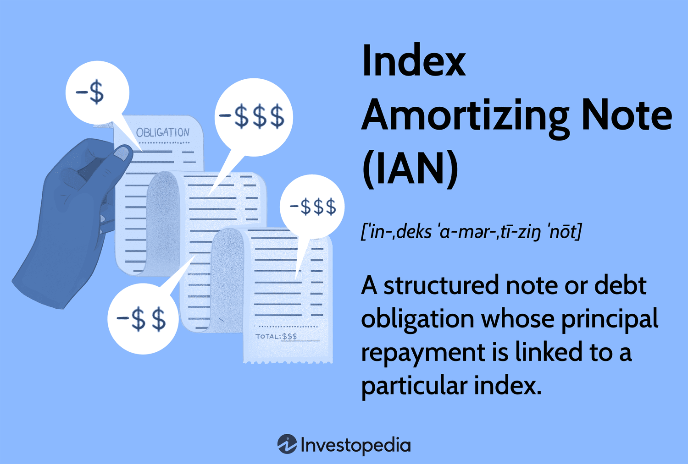

## Table of Contents

## What is an Index Amortizing Note (IAN)?

An Index Amortizing Note (IAN) is a type of bond where the amount you pay back gets smaller over time. It's linked to an interest rate index, like the LIBOR. As the interest rate changes, the payments you make change too. If interest rates go up, the payments go down faster. If interest rates go down, the payments go down slower.

IANs are useful for people who want to manage their risk from changes in interest rates. They are often used by banks and other financial institutions. Because the payments change based on interest rates, IANs can help these institutions match their income with their expenses better. This makes their financial planning easier and more predictable.

## How does an Index Amortizing Note work?

An Index Amortizing Note (IAN) is a special kind of bond where the money you pay back gets smaller over time. It's tied to an interest rate index, like the LIBOR. This means that if the interest rate goes up, the payments you make will start to decrease faster. If the interest rate goes down, the payments will decrease more slowly. It's like a seesaw: when one side goes up, the other side goes down.

IANs are helpful for people who want to manage the risk that comes from changes in interest rates. Banks and other financial institutions often use them. Because the payments change based on the interest rate, IANs can help these institutions match their income with their expenses better. This makes their financial planning easier and more predictable. It's like having a tool that helps keep your money balanced no matter what happens with interest rates.

## What are the key features of an Index Amortizing Note?

An Index Amortizing Note (IAN) is a special kind of bond where the money you pay back gets smaller over time. It's connected to an interest rate index, like the LIBOR. This means that if the interest rate goes up, the payments you make will start to decrease faster. If the interest rate goes down, the payments will decrease more slowly. It's like a seesaw: when one side goes up, the other side goes down.

IANs are useful for people who want to manage the risk that comes from changes in interest rates. Banks and other financial institutions often use them. Because the payments change based on the interest rate, IANs can help these institutions match their income with their expenses better. This makes their financial planning easier and more predictable. It's like having a tool that helps keep your money balanced no matter what happens with interest rates.

## Who typically invests in Index Amortizing Notes?

Index Amortizing Notes (IANs) are mainly used by big financial institutions like banks and insurance companies. These organizations like IANs because they help them manage the risk of interest rates changing. When interest rates go up or down, IANs adjust the payments, which helps these institutions keep their money balanced.

Sometimes, big investors who know a lot about finance also buy IANs. They use them to make their investment portfolios more stable. By using IANs, they can protect their money from sudden changes in the market and keep their investments safer.

## What are the benefits of investing in Index Amortizing Notes?

Investing in Index Amortizing Notes (IANs) can help you manage the risk that comes from changes in interest rates. If you're a bank or an insurance company, IANs can be really useful. They help you keep your money balanced because the payments change based on the interest rate. When interest rates go up, the payments you get from IANs start to go down faster. When interest rates go down, the payments decrease more slowly. This means you can match your income with your expenses better, making your financial planning easier and more predictable.

Big investors who know a lot about finance also like IANs. They use them to make their investment portfolios more stable. By investing in IANs, they can protect their money from sudden changes in the market. This helps them keep their investments safer and more secure. So, if you're looking for a way to manage interest rate risk and keep your finances steady, IANs might be a good choice for you.

## What are the risks associated with Index Amortizing Notes?

Investing in Index Amortizing Notes (IANs) comes with some risks. One big risk is that if interest rates change a lot, it can affect the payments you get. If interest rates go up quickly, the payments from IANs can drop faster than you expected. This can make it hard to plan your finances because you might not get as much money as you thought you would.

Another risk is that IANs can be hard to understand and predict. They are complex financial products, and if you don't know a lot about them, you might make mistakes. This can lead to unexpected losses if the interest rates move in a way you didn't expect. So, it's important to really understand IANs before you invest in them.

## How does the amortization schedule of an IAN affect its value?

The amortization schedule of an Index Amortizing Note (IAN) is really important because it decides how much money you get back over time. This schedule changes based on the interest rate. When interest rates go up, the payments you get start to go down faster. When interest rates go down, the payments decrease more slowly. This means that if you expect interest rates to go up, you might get less money back than you thought, which can make the IAN less valuable.

On the other hand, if you think interest rates will stay the same or go down, the IAN might be worth more to you. That's because the payments won't decrease as quickly, so you'll get more money over time. It's like a seesaw: when one side goes up, the other side goes down. So, understanding how the interest rates might change is key to knowing how much your IAN is worth.

## What types of indices are commonly used in Index Amortizing Notes?

Index Amortizing Notes (IANs) often use different types of interest rate indices to decide how the payments change. One common index is the London Interbank Offered Rate (LIBOR). This is a rate that banks use to lend money to each other. Another popular index is the Secured Overnight Financing Rate (SOFR), which is based on the cost of borrowing cash overnight, backed by U.S. Treasury securities. These indices help IANs adjust the payments based on what's happening in the market.

Sometimes, IANs might also use other indices like the Constant Maturity Treasury (CMT) rate, which is based on the U.S. Treasury securities. The CMT rate reflects the average yield of a range of Treasury securities. By using these different indices, IANs can be tailored to match the needs of the investors and help them manage the risk of interest rate changes better.

## How do interest rate changes impact Index Amortizing Notes?

Interest rate changes have a big effect on Index Amortizing Notes (IANs). When interest rates go up, the payments you get from IANs start to go down faster. This is because IANs are tied to an interest rate index, like LIBOR or SOFR. So, if the interest rate index goes up, the amount of money you get back each time gets smaller quicker. This can be a problem if you were counting on getting a certain amount of money over time because you might end up with less than you expected.

On the other hand, when interest rates go down, the payments from IANs decrease more slowly. This means you'll keep getting money for a longer time, which can be good if you need a steady income. But, it's important to understand that IANs are complex and can be hard to predict. If interest rates move in ways you didn't expect, it can make planning your finances tricky. So, knowing how interest rates might change is key to figuring out how much money you'll get from your IAN.

## Can you explain the pricing model for Index Amortizing Notes?

The pricing model for Index Amortizing Notes (IANs) can be a bit tricky because it depends a lot on how interest rates are expected to change. When you buy an IAN, you need to guess what will happen to the interest rate index it's tied to, like LIBOR or SOFR. If you think interest rates will go up, the payments from the IAN will start to go down faster, which might make the IAN less valuable to you. On the other hand, if you think interest rates will stay the same or go down, the payments won't decrease as quickly, so the IAN might be worth more to you.

To figure out the price of an IAN, you use a model that looks at the current interest rate, how much it might change in the future, and how quickly the payments will go down. This model helps you see how much money you'll get back over time and what the IAN is worth right now. It's like trying to predict the weather: you use all the information you have to make the best guess possible, but there's always a chance you might be wrong. So, understanding the pricing model is important if you want to invest in IANs and know what you might get back.

## What are some real-world examples of Index Amortizing Notes?

One real-world example of an Index Amortizing Note (IAN) is when a bank issues an IAN tied to the LIBOR index. Let's say a bank wants to manage its risk from changing interest rates. They issue an IAN where the payments they receive start to decrease based on how LIBOR changes. If LIBOR goes up, the payments decrease faster, helping the bank keep its money balanced. This way, the bank can better match its income with its expenses and make its financial planning more predictable.

Another example is when an insurance company invests in an IAN linked to the SOFR index. The insurance company wants to protect its money from sudden changes in interest rates. By investing in an IAN, the payments it gets back will adjust based on SOFR. If SOFR goes down, the payments decrease more slowly, which means the insurance company will keep getting money for a longer time. This helps the insurance company keep its investments stable and secure, even if interest rates change unexpectedly.

## How do Index Amortizing Notes compare to other structured financial products?

Index Amortizing Notes (IANs) are a special kind of bond that change their payments based on interest rates. They are different from other structured financial products like Collateralized Debt Obligations (CDOs) or Mortgage-Backed Securities (MBS) because IANs focus on managing interest rate risk. While CDOs and MBS bundle different kinds of debt or mortgages to spread risk, IANs adjust the amount of money you get back over time. This makes them useful for banks and insurance companies that need to keep their money balanced when interest rates change.

Compared to simpler bonds, IANs are more complex because their payments aren't fixed. A regular bond pays the same amount each time, but an IAN's payments go down faster if interest rates go up, and slower if rates go down. This can be good for investors who want to protect their money from interest rate changes, but it can also be tricky because it's harder to predict how much money you'll get back. So, while IANs offer a way to manage interest rate risk, they require a good understanding of how interest rates might change in the future.

## What is an Index Amortizing Note (IAN)?

An Index Amortizing Note (IAN) is a structured financial instrument designed to offer flexibility in the repayment of principal by tying the amortization schedule to a specified financial index. Typically, the indices employed include the London Interbank Offered Rate (LIBOR) or the Constant Maturity Treasury (CMT) rate. The fundamental objective of IANs is to adjust the maturity schedule of the note in accordance with changes in these indices, which reflect fluctuations in market interest rates.

The mechanics of an IAN revolve around its ability to modify the principal repayment plan based on movements in the chosen financial index. This feature distinguishes IANs from traditional bonds with fixed repayment schedules. In periods where interest rates rise, the repayment period of an IAN may be extended to avoid detrimental effects on investment cash flows. Conversely, in a declining interest rate environment, the repayment period can be shortened, allowing investors to reduce their interest obligation more rapidly.

The formula for the periodic payment of an IAN can be expressed similarly to that of an amortizing loan, but with adjustments for changes in the index:

$$
P = \frac{r \cdot (1 + r)^n}{(1 + r)^n - 1} \times B
$$

Where:
- $P$ is the periodic payment amount,
- $r$ is the current interest rate from the index (e.g., LIBOR or CMT),
- $n$ is the number of periods remaining,
- $B$ is the outstanding balance of the note.

This dynamic repayment capability allows IANs to manage [interest rate](/wiki/interest-rate-trading-strategies) exposures effectively. By modifying repayment schedules, these instruments aim to provide a balance between risk management and return optimization for investors.

IANs are particularly beneficial in scenarios where interest rate [volatility](/wiki/volatility-trading-strategies) is anticipated, as they enable investors to react appropriately to shifting conditions. However, this same flexibility necessitates careful consideration of prevailing financial environments when employing IANs as part of a comprehensive investment strategy.

## References & Further Reading

[1]: ["The Handbook of Fixed Income Securities"](https://www.amazon.com/Handbook-Fixed-Income-Securities-Ninth/dp/1260473899) by Frank J. Fabozzi

[2]: ["Structured Finance: The Object Oriented Approach"](https://www.amazon.com/Structured-Finance-Object-Oriented-Approach/dp/0470026383) by Markus Krebsz

[3]: ["Investing in Mortgage-Backed and Asset-Backed Securities: Financial Modeling with R and Open Source Analytics"](https://onlinelibrary.wiley.com/doi/pdf/10.1002/9781118949108.fmatter) by Glenn M. Schultz and Frank J. Fabozzi

[4]: ["Algorithmic Trading: Winning Strategies and Their Rationale"](https://www.wiley.com/en-us/Algorithmic+Trading%3A+Winning+Strategies+and+Their+Rationale-p-9781118746912) by Ernest P. Chan

[5]: ["Interest Rate Risk Modeling"](https://www.communitybankingconnections.org/Articles/2024/R1/interest-rate-risk-modeling) by Sanjay K. Nawalkha, Gloria M. Soto, and Natalia A. Beliaeva