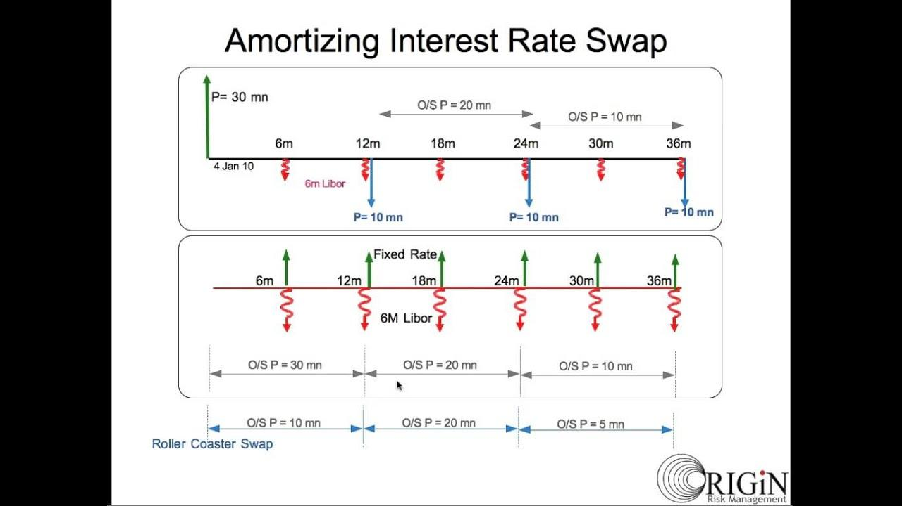

## Table of Contents

## What is an Index Amortizing Swap (IAS)?

An Index Amortizing Swap (IAS) is a type of financial agreement where two parties agree to exchange cash flows over time. Unlike regular swaps, the principal amount in an IAS decreases over time based on a specific index or schedule. This means that as the swap continues, the amount of money being swapped gets smaller. This type of swap is often used to manage interest rate risk, especially when someone expects interest rates to change in the future.

The way the principal decreases in an IAS is usually tied to an index, like a housing price index or an interest rate index. For example, if the index goes down, the principal amount might decrease faster. This makes IASs more complex than regular swaps because the payments can change a lot depending on what happens to the index. Because of this, IASs are often used by more experienced investors or financial institutions that want to protect themselves from certain risks or take advantage of market changes.

## How does an Index Amortizing Swap differ from a regular swap?

An Index Amortizing Swap (IAS) and a regular swap are both financial agreements where two parties exchange cash flows, but they work differently. In a regular swap, the principal amount stays the same throughout the life of the swap. For example, if you start with a $1 million swap, you'll keep swapping payments based on that $1 million until the swap ends. This makes regular swaps simpler because the payments are predictable as long as the interest rates don't change too much.

On the other hand, an Index Amortizing Swap has a principal amount that goes down over time based on an index, like a housing price index or an [interest rate](/wiki/interest-rate-trading-strategies). So, if you start with a $1 million IAS, the amount you swap might decrease to $900,000, then $800,000, and so on, depending on the index. This makes IASs more complicated because the payments can change a lot, and it's harder to predict what will happen. People use IASs when they want to manage risks related to changes in the index, which can be useful but requires more knowledge and attention.

## What are the key components of an Index Amortizing Swap?

An Index Amortizing Swap has several key parts that make it work. First, there's the principal amount, which is the starting amount of money that the swap is based on. Unlike regular swaps, this amount goes down over time in an IAS. This decrease is tied to an index, which could be something like housing prices or interest rates. The index is really important because it decides how fast the principal amount shrinks.

The other main parts are the cash flows that the two parties swap. One party might pay based on a fixed interest rate, while the other pays based on a floating rate that can change. These payments are calculated using the principal amount, which is getting smaller because of the index. So, the payments also get smaller over time. This makes IASs useful for managing risks related to the index, but it also makes them more complicated to handle.

## How is the notional amount determined in an IAS?

In an Index Amortizing Swap, the notional amount starts out as a fixed amount of money agreed upon by both parties when they make the swap. This is like the starting point for all the payments that will happen during the swap. But, what makes an IAS special is that this notional amount doesn't stay the same. It gets smaller over time based on an index, like housing prices or interest rates.

The index is really important because it decides how fast the notional amount shrinks. If the index goes down a lot, the notional amount might decrease faster. This means the payments that the two parties swap will also get smaller. So, when people set up an IAS, they need to keep a close eye on the index to know how the notional amount will change and how it will affect their payments.

## What types of indices are commonly used in Index Amortizing Swaps?

In Index Amortizing Swaps, the indices used to determine how the principal amount decreases are usually related to things like interest rates or housing prices. One common type of index is based on interest rates, like the London Interbank Offered Rate (LIBOR) or the Secured Overnight Financing Rate (SOFR). These indices help make the notional amount of the swap go down as interest rates change. This can be helpful for people who want to manage risks related to interest rates.

Another type of index often used in IASs is tied to housing prices, like the Case-Shiller Home Price Index. This index tracks changes in home prices in different areas. If housing prices go down, the notional amount of the swap will decrease faster. This can be useful for people who are involved in the housing market and want to protect themselves from changes in home prices. Both types of indices help make the swap more flexible and able to respond to changes in the market.

## What are the typical applications of Index Amortizing Swaps?

Index Amortizing Swaps are often used by people who want to protect themselves from changes in interest rates or housing prices. For example, if someone thinks interest rates might go down, they can use an IAS to make sure their payments get smaller over time. This can help them save money or avoid big losses if rates do drop. It's like a safety net that adjusts to what's happening in the market.

Another common use for IASs is in the housing market. If someone is involved in real estate and wants to manage the risk of falling home prices, they can use an IAS linked to a housing price index. As home prices go down, the swap's payments get smaller too. This can help real estate investors or banks that lend money for homes to stay safe if the market takes a turn for the worse.

## How do Index Amortizing Swaps help in managing interest rate risk?

Index Amortizing Swaps help manage interest rate risk by making the payments smaller over time as interest rates change. If someone thinks interest rates might go down, they can use an IAS to protect themselves. For example, if you're paying a fixed interest rate and the market rates drop, your payments in an IAS will get smaller. This helps you save money because you're not stuck paying a high rate when everyone else is paying less.

This type of swap is really useful for people who want to avoid big losses if interest rates change unexpectedly. It's like having a safety net that adjusts to what's happening in the market. By linking the payments to an interest rate index, like LIBOR or SOFR, the swap can automatically respond to changes, making it easier for people to manage their finances and reduce the risk of losing money when rates go down.

## What are the potential benefits of using an Index Amortizing Swap for a borrower?

Using an Index Amortizing Swap can help a borrower save money if interest rates go down. Imagine you have a loan with a fixed interest rate, but you think the rates might drop. With an IAS, your payments can get smaller as the rates fall. This means you won't be stuck paying a high rate when everyone else is paying less. It's like having a safety net that adjusts to what's happening in the market, helping you manage your money better.

Another benefit is that an IAS can help a borrower manage the risk of changing interest rates. If rates go down, the swap's payments decrease, which can protect you from big losses. This is especially useful if you're worried about what might happen in the future. By using an IAS, you can feel more secure knowing that your payments will change with the market, making it easier to plan your finances and avoid surprises.

## What are the risks associated with Index Amortizing Swaps?

One big risk with Index Amortizing Swaps is that they can be hard to understand and predict. Because the payments change based on an index, like interest rates or housing prices, it's tough to know exactly what will happen. If the index moves in a way you didn't expect, your payments could change a lot more than you thought. This can be a problem if you're not ready for it, and it might even cost you more money instead of saving you money.

Another risk is that IASs are more complicated than regular swaps. This means you need to know a lot about how they work and keep a close eye on the index. If you don't, you might make a mistake or miss something important. Also, because they're complex, it can be harder to find someone to trade with or to get out of the swap if you need to. This can make it tricky to manage your money and could lead to bigger problems if things go wrong.

## How is the valuation of an Index Amortizing Swap calculated?

The valuation of an Index Amortizing Swap is calculated by figuring out the present value of the future cash flows that the two parties will exchange. This means you need to look at the payments that will happen over time and adjust them to today's money. The tricky part is that the payments change based on an index, like interest rates or housing prices. So, you have to guess what the index will do in the future and use that to work out how the payments will change. This makes the valuation more complicated than a regular swap because you're not just dealing with fixed payments.

To do this, you use a model that takes into account the current value of the index, how it might change, and the terms of the swap. You also need to think about the interest rates that are used to discount the future payments back to today. If the index goes down a lot, the payments will get smaller faster, which can change the swap's value a lot. Because of all these moving parts, the valuation of an IAS can be hard to pin down and might need to be updated often as the index changes.

## What are the advanced structuring options available in Index Amortizing Swaps?

Index Amortizing Swaps can be set up in many different ways to meet specific needs. One option is to use different types of indices to make the principal amount go down. For example, instead of using just one index like interest rates, you could use a mix of indices, like both interest rates and housing prices. This can help you manage more than one kind of risk at the same time. Another option is to change how fast the principal amount decreases. You could make it go down faster or slower based on what you think will happen in the market.

Another advanced structuring option is to add features that let you change the swap if things don't go as planned. For example, you might be able to stop the swap early or change the terms if the index moves a lot. This can give you more control and help you avoid big losses. Also, you could set up the swap so that the payments are not just based on the index but also on other things, like how much money you're making or how your business is doing. This makes the swap more flexible and can help you manage your money better.

## How do regulatory requirements affect the use of Index Amortizing Swaps?

Regulatory requirements can make it harder to use Index Amortizing Swaps because they need to follow strict rules. For example, after the 2008 financial crisis, rules like the Dodd-Frank Act in the U.S. made banks and other financial companies report more about their swaps. This means they have to keep track of every detail and make sure they're doing everything right. It can be a lot of work and might make some companies think twice about using IASs, especially if they're small and don't have a lot of people to handle the paperwork.

Also, regulators want to make sure that using IASs doesn't cause big problems for the whole financial system. So, they might set limits on how much risk a company can take with these swaps. This can affect how companies use IASs and might make them use them less or in different ways. But, if a company follows all the rules and keeps everything in check, they can still use IASs to manage their risks and save money.

## References & Further Reading

[1]: Black, F., & Scholes, M. (1973). ["The Pricing of Options and Corporate Liabilities."](https://www.cs.princeton.edu/courses/archive/fall09/cos323/papers/black_scholes73.pdf) Journal of Political Economy, 81(3), 637-654.

[2]: Hull, J. C. (2017). ["Options, Futures, and Other Derivatives"](https://www.amazon.com/Options-Futures-Other-Derivatives-10th/dp/013447208X). Pearson Education.

[3]: Fabozzi, F. J., & Mann, S. V. (2011). ["Handbook of Fixed Income Securities"](https://www.amazon.com/Handbook-Fixed-Income-Securities-Ninth/dp/1260473899). McGraw-Hill Education.

[4]: Chincarini, L. B., & Kim, D. (2006). ["Quantitative Equity Portfolio Management: An Active Approach to Portfolio Construction and Management"](https://archive.org/details/quantitativeequi0000chin_c9d6). McGraw-Hill.

[5]: Lopez de Prado, M. (2018). ["Advances in Financial Machine Learning"](https://www.amazon.com/Advances-Financial-Machine-Learning-Marcos/dp/1119482089). Wiley.