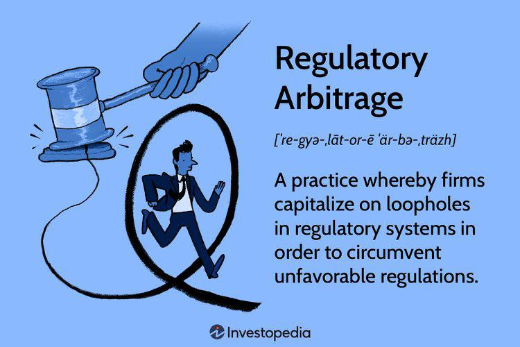

## Table of Contents

## What is index arbitrage?

Index arbitrage is a trading strategy that takes advantage of price differences between a stock index and the futures contracts based on that index. For example, if the S&P 500 index is trading at a lower price than its futures contract, a trader might buy the stocks in the S&P 500 and sell the futures contract at the same time. The goal is to profit from the price difference when the two prices converge.

This strategy is often used by large institutional investors and requires sophisticated technology to execute quickly and efficiently. It can be risky because the price difference between the index and the futures might not always narrow in the expected way. However, when done correctly, index arbitrage can provide a way to make profits with relatively low risk, as long as the trader has the right tools and knowledge.

## How does index arbitrage work?

Index arbitrage works by taking advantage of small price differences between a stock index, like the S&P 500, and its futures contracts. Imagine the S&P 500 index is like a basket of stocks. If this basket is cheaper than the price of a futures contract that promises to deliver the same basket in the future, a trader can buy the basket (the stocks in the index) and sell the futures contract at the same time. The idea is to make money when the prices of the basket and the futures contract become the same.

This strategy needs fast computers and good technology because the price differences are usually small and don't last long. Big investors often use index arbitrage because they can handle the quick trades and the costs involved. While it can be risky if the prices don't move as expected, it can also be a way to make steady profits if done right.

## What are the key components involved in index arbitrage?

Index arbitrage involves a few key components that work together to make the strategy successful. The first component is the stock index itself, like the S&P 500. This is a basket of stocks that traders can buy or sell. The second component is the futures contract, which is a promise to buy or sell the same basket of stocks at a future date. The goal of index arbitrage is to spot and take advantage of small price differences between the stock index and its futures contract.

Another important component is the technology used to execute trades quickly. Since the price differences between the index and the futures contract are usually small and don't last long, traders need fast computers and sophisticated software to make trades before the prices change. The last component is the trader's knowledge and experience. Understanding how the stock market and futures markets work, and being able to predict when prices will move, is crucial for successful index arbitrage.

## Can you explain the difference between index arbitrage and other types of arbitrage?

Index arbitrage is a specific type of arbitrage that focuses on the price differences between a stock index, like the S&P 500, and its futures contracts. Traders buy the stocks in the index and sell the futures contract, or vice versa, to profit when the prices of the two converge. This strategy requires quick trades and sophisticated technology because the price differences are usually small and don't last long. It's often used by big investors who can handle the costs and have the right tools.

Other types of arbitrage work in different ways. For example, merger arbitrage involves buying and selling stocks of companies involved in a merger, betting on the merger's outcome. Another type is currency arbitrage, where traders take advantage of exchange rate differences between different currencies. Each type of arbitrage has its own risks and requires different strategies and knowledge. While index arbitrage focuses on stock indexes and futures, these other types look at different markets and opportunities.

## What are the common strategies used in index arbitrage?

Index arbitrage traders often use a strategy called "cash-and-carry arbitrage." This means they buy the stocks in an index, like the S&P 500, and at the same time, they sell a futures contract for that index. They do this when the futures contract is more expensive than the stocks. The idea is to make money when the prices of the stocks and the futures contract get closer together. This strategy needs fast computers because the price difference might not last long.

Another common strategy is "reverse cash-and-carry arbitrage." Here, traders do the opposite: they sell the stocks in the index and buy the futures contract. They do this when the stocks are more expensive than the futures contract. Again, the goal is to profit when the prices of the stocks and the futures contract become the same. Both strategies need a lot of knowledge about the market and quick technology to work well.

## What role do futures and options play in index arbitrage?

Futures and options are very important in index arbitrage. Futures are like promises to buy or sell a basket of stocks, like the S&P 500, at a certain price in the future. In index arbitrage, traders look at the price of this basket of stocks and compare it to the price of the futures contract. If the futures contract is more expensive than the stocks, traders will buy the stocks and sell the futures. This is called cash-and-carry arbitrage. They do this to make money when the prices of the stocks and the futures get closer together.

Options can also be used in index arbitrage, but they are a bit more complicated. An option gives you the right, but not the obligation, to buy or sell stocks at a certain price. Traders can use options to protect themselves from big losses if the prices don't move the way they expect. For example, if a trader is doing cash-and-carry arbitrage, they might buy an option to sell the stocks at a certain price. This way, if the stock prices fall a lot, the trader can still sell the stocks at the price they chose with the option. Futures and options together help traders make the most of small price differences in index arbitrage.

## How is technology used in executing index arbitrage?

Technology is really important for index arbitrage because the price differences between a stock index and its futures contract are usually small and don't last long. Traders use fast computers and special software to spot these price differences quickly. The computers can make trades in just a few seconds, which is much faster than a person could do it. This quick trading is needed because if the prices change before the trader can buy or sell, they might not make any money.

The technology also helps traders keep track of lots of different stocks and futures contracts at the same time. It can automatically buy and sell the right amounts of stocks and futures to make sure the trader's strategy works well. This means traders can do index arbitrage without having to watch the market all the time. Good technology makes index arbitrage easier and helps traders make more money by taking advantage of small price differences.

## What are the risks associated with index arbitrage?

Index arbitrage can be risky because the price difference between the stock index and the futures contract might not always go away like the trader expects. If the prices move the wrong way, the trader could lose money. For example, if a trader buys stocks and sells futures, hoping the stocks will go up and the futures will go down, but instead the stocks go down and the futures go up, the trader will lose money on both trades.

Another risk is the cost of doing index arbitrage. Traders need fast computers and special software, which can be expensive. They also have to pay fees for buying and selling stocks and futures. If these costs are too high, the trader might not make any money, even if the price difference goes away like they hoped. So, traders need to be careful and make sure the potential profit is bigger than the costs and risks.

## Can you provide examples of successful index arbitrage trades?

Imagine a trader sees that the S&P 500 index is trading at 4,000 points, but the futures contract for the S&P 500 is at 4,020 points. The trader thinks this difference is too big and will go away soon. So, they buy the stocks in the S&P 500 and at the same time, they sell the futures contract. A few days later, the S&P 500 goes up to 4,010 points, and the futures contract goes down to 4,010 points too. The trader makes money because they bought the stocks for less than they sold the futures.

Another example is when a trader notices the Dow Jones Industrial Average is at 34,000 points, but the futures for the Dow Jones are at 33,980 points. The trader thinks the futures are too cheap compared to the stocks. So, they sell the stocks in the Dow Jones and buy the futures contract. Soon after, the Dow Jones drops to 33,990 points, and the futures go up to 33,990 points as well. The trader profits because they sold the stocks for more than they bought the futures.

## How do market conditions affect the feasibility of index arbitrage?

Market conditions can make index arbitrage more or less possible. When the market is very busy and prices are moving a lot, it can be easier to find big price differences between a stock index and its futures contract. This makes index arbitrage more likely to work because traders can make more money from these bigger differences. Also, if the market is calm and prices are not changing much, it can be harder to find these price differences, making index arbitrage less feasible.

Another thing that affects index arbitrage is how much it costs to trade. If the fees for buying and selling stocks and futures are low, traders can make money even if the price differences are small. But if the costs are high, the price differences need to be bigger for traders to make a profit. So, market conditions like how busy the market is and how much it costs to trade can make a big difference in whether index arbitrage will work well or not.

## What regulatory considerations should be taken into account when engaging in index arbitrage?

When doing index arbitrage, traders need to think about the rules that govern trading. Different countries have different rules about how you can trade stocks and futures. For example, some places might have rules about how much you can trade at one time or how you have to report your trades. Traders need to make sure they follow these rules, or they could get in trouble. It's also important to know about any taxes you might have to pay on your profits from index arbitrage.

Another thing to think about is how the rules might change. Governments and financial groups can change the rules about trading, and these changes can affect how you do index arbitrage. For example, if a new rule makes it more expensive to trade futures, it might not be worth doing index arbitrage anymore. Traders need to keep up with these changes and adjust their strategies to stay within the rules and keep making money.

## How can one measure the effectiveness of an index arbitrage strategy?

To measure how well an index arbitrage strategy is working, you need to look at how much money you're making compared to how much you're spending. This means keeping track of the profits you make from the price differences between the stock index and the futures contract. You also need to think about the costs of trading, like fees for buying and selling stocks and futures, and the cost of the technology you use. If your profits are bigger than your costs, your strategy is working well.

Another way to measure effectiveness is to see how often your trades are successful. If you're making money most of the time when you do index arbitrage, it's a good sign that your strategy is effective. You can also compare your results to other traders or to the overall market to see if you're doing better than average. By looking at these things, you can tell if your index arbitrage strategy is working and if you need to make any changes to do better.

## What are some case examples and what is the historical context surrounding them?

Historical examples of index arbitrage exemplify the application of these strategies in financial markets, showcasing both their success and the challenges faced by traders. One notable example involves the S&P 500 futures, where traders have utilized index arbitrage to capitalize on price discrepancies between the futures and the underlying index. This practice gained prominence in the late 20th century and highlighted the impact of technology and trading speed.

The essence of index arbitrage within the S&P 500 futures arises when there are differences in the pricing of the futures contract and the actual index value. Traders execute arbitrage by concurrently buying or selling the index and its futures. Mathematically, this concept can be expressed as:

$$
\text{Arbitrage Profit} = (F - I) - C
$$

where $F$ represents the futures price, $I$ is the index price, and $C$ is the cost of carrying, including transaction fees and interest costs. Successful arbitrage occurs when the absolute value of (F - I) exceeds C, enabling profit after transactions.

Historical analysis indicates that the efficiency of index arbitrage is influenced by technological advancements, particularly in computational speed and data processing. In the 1980s and 1990s, the rise of program trading allowed traders to execute trades faster than manual operations, significantly increasing the profitability and volume of arbitrage opportunities. Algorithmic trading, a subset of program trading, further refined these operations, allowing traders to execute thousands of transactions per second, thus exploiting inefficiencies more effectively.

Learning from past arbitrage successes and failures is critical for adapting to modern market conditions. For instance, the 1987 market crash, known as Black Monday, underscored the risks of program trading when market liquidations amplified volatility. In this context, understanding past events provides valuable insights into risk management and strategy modification.

Technological advancements continue to shape the landscape of index arbitrage. The evolution from basic program trading in the 1980s to sophisticated high-frequency trading ([HFT](/wiki/high-frequency-trading-strategies)) systems today illustrates how technology drives strategy efficiency. Modern algorithms equipped with [machine learning](/wiki/machine-learning) capabilities are designed to adapt to real-time data, optimizing decision-making processes.

In summary, the historical context of index arbitrage reveals both the profitability and peril of these trading strategies. While past examples like S&P 500 futures highlight the success potential, they also caution against the risks involved. The continual evolution of technology remains a central [factor](/wiki/factor-investing) in shaping the future landscape of index arbitrage, making historical context a vital consideration for current and future market participants.

## What tools and technology are being referred to?

High-frequency trading (HFT) platforms and sophisticated algorithms are central to the operations of modern index arbitrageurs. These tools enable the rapid execution of trades, taking advantage of fleeting price discrepancies between indices and their underlying assets. The backbone of HFT is its ability to process massive volumes of market data in real time and execute orders at speeds that vastly outstrip human capability.

A core component of these platforms is the use of advanced algorithms that follow pre-defined rules to make trading decisions. These algorithms are designed to detect mispricings and inefficiencies with minimal latency, ensuring that traders can quickly act on profitable opportunities. The precision and speed offered by these algorithms also reduce the risks associated with manual trading, such as human error or delayed transaction times.

Quantitative finance tools also play an essential role in index arbitrage. These tools encompass various methods of statistical analysis, financial modeling, and machine learning. Data analysis often employs time-series models to predict price movements or identify patterns. For example, the Arbitrage Pricing Theory (APT) model is frequently used to determine the expected return of an asset, considering various macroeconomic factors. Formally, the APT model can be expressed as:

$$
E(r_i) = r_f + \beta_1F_1 + \beta_2F_2 + ... + \beta_nF_n
$$

where $E(r_i)$ is the expected return on asset $i$, $r_f$ is the risk-free rate, $\beta_i$ represents the sensitivity of the asset to factor $F_i$, and $n$ is the number of factors.

Python, a widely-used programming language in finance, is often employed to implement these strategies. The flexibility of Python, combined with libraries like NumPy and pandas for data manipulation, allows traders to construct and backtest their strategies efficiently. An example of a simple arbitrage opportunity detection using Python might look like this:

```python
import pandas as pd
import numpy as np

# Sample data
data = {'Current Price': [100, 102], 'Future Price': [101, 103]}
df = pd.DataFrame(data)

# Calculate arbitrage opportunity
df['Arbitrage'] = df['Future Price'] - df['Current Price']

arbitrage_opportunities = df[df['Arbitrage'] > 0]
print(arbitrage_opportunities)
```

Continuous improvements in technology enhance the ability to monitor markets and execute trades with greater accuracy. Innovations such as cloud computing have increased processing power and data storage capabilities, allowing for the handling of large datasets required for complex arbitrage calculations. Moreover, machine learning models have been integrated into trading strategies, providing adaptive mechanisms that can refine trading algorithms based on historical performance and market conditions.

These advancements are not only crucial for executing index arbitrage with precision but also for maintaining competitiveness in an environment where technology and speed are paramount. As markets evolve and become more interconnected, the role of these tools and technologies will remain integral to the success of index arbitrage strategies.

## References & Further Reading

[1]: Hasbrouck, J., & Sofianos, G. (1993). ["The trades of market makers: An empirical analysis of NYSE specialists."](https://www.jstor.org/stable/2329060) The Review of Financial Studies, 6(5), 972-1000.

[2]: Gatev, E., Goetzmann, W. N., & Rouwenhorst, K. G. (2006). ["Pairs trading: Performance of a relative value arbitrage rule."](https://www.nber.org/papers/w7032) The Journal of Finance, 61(5), 2223-2257.

[3]: Aldridge, I. (2009). ["High-Frequency Trading: A Practical Guide to Algorithmic Strategies and Trading Systems."](https://www.ahmetbeyefendi.com/wp-content/uploads/2020/07/High-Frequency-Trading-Irene-Aldridge.pdf) Wiley.

[4]: Treynor, J. L., & Ferguson, R. (1985). ["In Defense of Active Management."](https://onlinelibrary.wiley.com/doi/abs/10.1111/j.1540-6261.1985.tb05000.x) The Journal of Portfolio Management, 11(3), 4-12.

[5]: Lopez de Prado, M. (2018). ["Advances in Financial Machine Learning."](https://www.amazon.com/Advances-Financial-Machine-Learning-Marcos/dp/1119482089) Wiley.

[6]: Chan, E. (2009). ["Quantitative Trading: How to Build Your Own Algorithmic Trading Business."](https://github.com/ftvision/quant_trading_echan_book) Wiley.