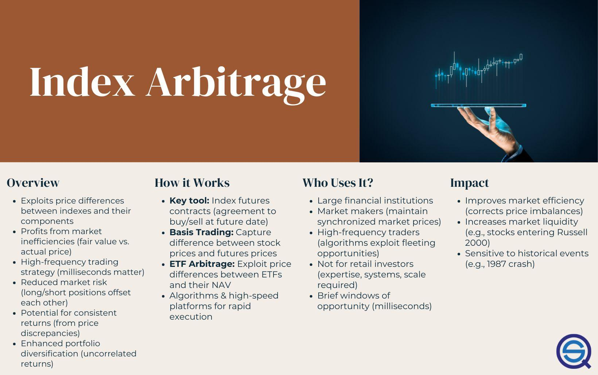

## Table of Contents

## What is index arbitrage?

Index arbitrage is a trading strategy that takes advantage of price differences between a stock index and the futures contracts based on that index. Traders look for times when the futures price is either higher or lower than what they think it should be, compared to the actual stocks in the index. If the futures price is too high, they might sell the futures and buy the stocks. If the futures price is too low, they might buy the futures and sell the stocks. The goal is to make a profit from the difference in prices as they come back together.

This strategy is often used by big investors and trading firms because it needs a lot of quick trading and careful watching of the market. They use computers and special software to spot these price differences fast and make trades before the prices change. Index arbitrage helps keep the prices of the index and its futures close to each other, which is good for the overall market because it makes sure prices are fair and markets work smoothly.

## How does index arbitrage work?

Index arbitrage is a way for traders to make money by spotting differences in price between a stock index and its futures contracts. Imagine a stock index like the S&P 500, which is made up of many stocks. Futures are agreements to buy or sell the index at a set price on a future date. If the price of the futures is higher than what the stocks in the index are worth right now, traders might sell the futures and buy the stocks. If the futures price is lower, they might buy the futures and sell the stocks. The goal is to profit when the prices of the index and futures get back in line.

To do index arbitrage, traders need fast computers and special software to quickly see these price differences and make trades before the prices change. This kind of trading is usually done by big investors and firms because it requires a lot of money and quick action. By doing index arbitrage, these traders help keep the prices of the index and its futures close to each other, which makes the market more fair and helps it run smoothly.

## What are the key components of an index?

An index is like a big list of stocks that shows how a part of the stock market is doing. The key parts of an index are the stocks it includes. These stocks are picked based on certain rules, like how big the company is or what industry it's in. For example, the S&P 500 includes 500 of the biggest companies in the U.S. The index also has a way to measure how much each stock affects the total value of the index. This is called the weighting. Some indexes give more importance to bigger companies, while others treat all companies the same.

Another important part of an index is how often it gets updated. Companies can grow or shrink, so the index needs to change to stay accurate. This might mean adding new companies or taking out old ones. The index also needs a clear way to calculate its value, usually by adding up the value of all the stocks and dividing by a number to get an average. This average is what people watch to see if the market is going up or down. By understanding these parts, you can see how an index works and why it's useful for investors.

## What are the common strategies used in index arbitrage?

Index arbitrage involves taking advantage of price differences between a stock index and its futures contracts. One common strategy is called "cash-and-carry arbitrage." In this approach, if the futures price is higher than the index's current value, traders will buy the stocks in the index and sell the futures. They hold onto the stocks until the futures contract expires, then they deliver the stocks to fulfill the futures contract. The profit comes from the difference between the futures price and the cost of holding the stocks.

Another strategy is "reverse cash-and-carry arbitrage," which is used when the futures price is lower than the index's current value. In this case, traders will sell the stocks in the index and buy the futures. They then buy back the stocks when the futures contract expires to cover their short position. The profit is made from the difference between the cost of buying back the stocks and the price at which they sold the futures. Both strategies rely on quick action and precise calculations to make money from small price differences.

## What is the difference between index arbitrage and other types of arbitrage?

Index arbitrage is a specific type of arbitrage that focuses on the price differences between a stock index and its futures contracts. Traders look for times when the futures price is either higher or lower than what it should be compared to the actual stocks in the index. If the futures price is too high, they might sell the futures and buy the stocks. If the futures price is too low, they might buy the futures and sell the stocks. The goal is to make a profit from the difference in prices as they come back together. This strategy requires fast computers and special software to spot these price differences quickly and make trades before the prices change.

Other types of arbitrage can involve different kinds of assets and strategies. For example, merger arbitrage involves buying and selling stocks of companies involved in a merger, betting on the outcome of the merger. Another type is currency arbitrage, where traders take advantage of different exchange rates for the same currency in different markets. Unlike index arbitrage, these other forms of arbitrage might not need the same level of speed and technology, but they still rely on finding and exploiting price differences. Each type of arbitrage has its own risks and rewards, and traders choose the one that fits their skills and resources.

## What are the risks associated with index arbitrage?

Index arbitrage can be risky because it depends a lot on quick trades and small price differences. If the prices of the index and its futures don't come back together as expected, traders might lose money. This can happen if there's a big change in the market, like a surprise news event, that makes the prices move in unexpected ways. Also, because index arbitrage needs fast computers and special software, there's a risk that the technology might fail. If the computers slow down or stop working, traders might miss their chance to make a profit or even make bad trades.

Another risk is the cost of doing index arbitrage. Traders have to pay for the stocks they buy and the futures they sell, and there are also fees for using the computers and software. If these costs are too high, they might eat up any profits from the trades. Plus, index arbitrage usually needs a lot of money to start with, so it's not something everyone can do. Even big investors and firms can face losses if they don't manage these costs well or if the market moves against them.

## How can one identify opportunities for index arbitrage?

To spot opportunities for index arbitrage, you need to keep a close eye on the prices of a stock index and its futures contracts. The key is to look for times when the futures price is different from what you think it should be, compared to the actual stocks in the index. If the futures price is too high, you might want to sell the futures and buy the stocks. If it's too low, you might want to buy the futures and sell the stocks. This difference in price is what you're trying to profit from.

Finding these opportunities quickly is important, so many traders use computers and special software to help them. These tools can check the prices very fast and let traders know when there's a chance to make a trade. But it's not just about having the right technology. You also need to understand how the market works and be ready to act fast when you see a good opportunity. Index arbitrage can be tricky, but with the right tools and knowledge, you can spot the chances to make a profit.

## What tools and technologies are essential for effective index arbitrage?

To do index arbitrage well, you need fast computers and special software. These tools help you see the small differences in price between a stock index and its futures contracts quickly. Without them, it's hard to spot the chances to make a profit because the prices can change very fast. The software needs to be able to check lots of prices at the same time and tell you when it's time to make a trade.

Besides computers and software, you also need a good way to connect to the market. This means having a fast internet connection and being able to send trade orders quickly. Sometimes, traders use special services that let them get closer to the market's computers, which can make their trades even faster. All these tools and technologies are important for making index arbitrage work well and making sure you can take advantage of the price differences before they go away.

## How do market conditions affect index arbitrage?

Market conditions can really change how well index arbitrage works. If the market is calm and prices move slowly, it's easier for traders to spot the small differences between the index and its futures. They can make their trades and wait for the prices to come back together without too much worry. But if the market is wild and prices jump around a lot, it's harder to do index arbitrage. Big news or events can make the prices change quickly, and the differences that traders were counting on might not last long enough to make a profit.

Also, the cost of trading can go up or down with market conditions. When lots of people are trading, the fees for buying and selling can be higher, which means traders have to make more money from their arbitrage to cover these costs. If the market is quiet, the fees might be lower, making it easier to make a profit. So, traders need to keep an eye on the market and be ready to change their plans if things get too crazy or too calm.

## What are the regulatory considerations for index arbitrage?

When doing index arbitrage, traders need to think about the rules set by the government and other groups that watch over the markets. These rules are there to make sure trading is fair and that no one is cheating. For example, there might be limits on how much a trader can buy or sell at one time, or rules about how quickly they have to report their trades. If traders don't follow these rules, they could get in trouble and might have to pay fines or even stop trading.

Also, different countries can have different rules for index arbitrage. Traders need to know the rules in the places where they are trading. Sometimes, the rules can change, so it's important to stay updated. Keeping track of all these rules can be hard, but it's important for making sure index arbitrage is done the right way and doesn't cause problems in the market.

## How has index arbitrage evolved with the advancement of technology?

Index arbitrage has changed a lot because of new technology. In the past, traders had to look at prices by hand and make trades slowly. Now, they use fast computers and special software to see price differences quickly. These tools can check lots of prices at the same time and tell traders when it's time to make a trade. This makes index arbitrage much faster and more accurate than before. Traders can spot small price differences and make trades before the prices change, which helps them make more money.

Technology has also made it easier for traders to connect to the market. They use fast internet and special services to send trade orders quickly. Some traders even pay to get closer to the market's computers, which can make their trades even faster. All these changes have made index arbitrage a lot more common and important in the market. But it's also made it more competitive, so traders need to keep updating their tools and skills to stay ahead.

## What are some case studies or examples of successful index arbitrage?

One famous example of successful index arbitrage happened during the 1987 stock market crash, also known as Black Monday. On that day, the stock market dropped a lot, and there were big differences between the prices of stocks and their futures. Some traders, like those at Salomon Brothers, used index arbitrage to make money. They saw that the futures were much cheaper than the stocks, so they bought the futures and sold the stocks. When the prices came back together, they made a big profit. This shows how index arbitrage can work well even when the market is going crazy.

Another example is from the early 2000s when high-frequency trading (HFT) started to become popular. HFT firms used very fast computers and special software to do index arbitrage. They could see small price differences between the S&P 500 index and its futures almost instantly. One well-known HFT firm, Renaissance Technologies, used these tools to make a lot of money from index arbitrage. Their quick trades helped them take advantage of these small price differences before they went away. This shows how new technology can make index arbitrage even more successful.

## What is Understanding Index Arbitrage?

Index [arbitrage](/wiki/arbitrage) is a powerful trading strategy that capitalizes on discrepancies between the market prices of index-tracking products, such as Exchange-Traded Funds ([ETF](/wiki/etf-trading-strategies)s) and futures, and the actual current value of the component stocks that comprise the index. To understand its workings, it is essential to grasp the fundamentals of an index itself.

An index, such as the S&P 500, is a composite measure that tracks the performance of a select group of stocks, usually from large, well-established companies across diverse sectors. These indices follow specific methodologies designed to provide a standardized benchmark for financial markets. The index value is typically generated using the market capitalizations of the included companies.

The core idea behind index arbitrage involves exploiting the temporary price differences between index funds and their underlying stocks. This strategy encompasses constructing a notional index, or synthetic index value, from the market price of all individual component stocks. Traders often employ index futures and ETFs to replicate this synthetic index value.

For example, suppose the synthetic index value calculated from the component stocks deviates from the price of an index-tracking ETF. Traders can execute arbitrage by simultaneously buying the undervalued asset and short selling the overvalued one, capturing the spread once the prices converge.

The following formula can illustrate the index value calculation:

$$
\text{Index Value} = \sum_{i=1}^{n} (P_i \times W_i)
$$

where $P_i$ represents the price of the $i^{th}$ stock in the index and $W_i$ represents the weight of the $i^{th}$ stock in the index calculation.

Modern technology and [algorithmic trading](/wiki/algorithmic-trading) enhance this process, allowing for rapid computation and detection of arbitrage opportunities. With prices updated in real-time, algorithms can automatically execute trades to exploit price differentials efficiently, often in fractions of a second. By ensuring that the synthetic index closely matches the traded index futures or ETF, traders can readily assess arbitrage potentials. 

In essence, understanding index arbitrage hinges on recognizing and acting upon these fleeting price anomalies between index funds and their components, offering robust profit opportunities for experienced and well-equipped market participants.

## What are the mechanisms of index arbitrage?

Arbitrageurs engaged in index arbitrage focus on determining the 'fair value' for stock market index futures. This fair value calculation is pivotal and involves accounting for parameters such as the current [interest rate](/wiki/interest-rate-trading-strategies)s and expected dividends. Mathematically, the fair value of an index future is often expressed as:

$$

\text{Fair Value} = \text{Index Level} \times e^{(r-d) \times T}
$$

where:
- $\text{Index Level}$ is the current level of the underlying index.
- $r$ is the risk-free interest rate.
- $d$ is the dividend yield of the index.
- $T$ is the time to expiration of the future.
- $e$ represents the base of the natural logarithm.

This formula provides a theoretical price for the future, integrating expected benefits from holding the index components (dividends) and the [carry](/wiki/carry-trading)ing cost (interest rate) over the term of the contract. 

Profit opportunities emerge when there is a discrepancy between the calculated fair value and the market price of the futures. If the market price exceeds the fair value, it suggests an overvaluation where traders sell futures and purchase the index's component stocks. Conversely, if the market price is below the fair value, it indicates an undervaluation prompting traders to buy futures and short sell the components.

Two principal methods for executing index arbitrage include:

1. **Trading Index Futures Against Component Stocks**: In this method, traders take opposing positions in the futures contract and the individual stocks comprising the index. By simultaneously buying the undervalued side and selling the overvalued side, arbitrageurs capitalize on the price convergence to the fair value.

2. **ETF Creation/Redemption Mechanisms**: Exchange-Traded Funds (ETFs), which track index values, provide an alternative medium for arbitrage. Traders exploit inefficiencies between an ETF and its underlying securities through the creation and redemption process. When an ETF's price falls below the value of its constituents, arbitrageurs can buy the ETF and sell the component stocks, redeeming the ETF shares for the index shares at the end of the day, thereby pocketing the difference. Conversely, when the ETF trades at a premium, arbitrageurs sell the ETF and purchase the stocks to create new ETF shares, which they then sell at the inflated market price.

Both methods rely heavily on speed and precision, often facilitated by algorithmic trading systems that can execute trades faster than any human trader, ensuring even the smallest windows of opportunity are seized. The marriage of predictive models and automated systems thus stands central to the efficacy of index arbitrage practices.

## References & Further Reading

[1]: Mackinlay, A. Craig, & Ramaswamy, K. (1988). ["Index Futures Arbitrage and the Behavior of Stock Index Futures Prices."](https://www.jstor.org/stable/2962006) The Review of Financial Studies, 1(2), 137-158.

[2]: Harris, L. (1989). ["The October 1987 S&P 500 stock-futures basis."](https://www.jstor.org/stable/2328276) The Journal of Finance, 44(1), 77-99.

[3]: Korn, R., & Kasper, M. (2009). ["Algorithmic Trading: Strategy, Timing, and High-frequency Execution."](https://assets.cambridge.org/97811070/91146/frontmatter/9781107091146_frontmatter.pdf) Wiley Finance Series.

[4]: Bakshi, G., Madan, D., & Panayotov, G. (2012). ["Derivative Trades and the Cross-section of Expected Returns."](https://papers.ssrn.com/sol3/papers.cfm?abstract_id=1462543) The Journal of Financial Economics, 105(3), 505-522.

[5]: Hasbrouck, J. (2003). ["Intraday Price Formation in U.S. Equity Index Markets."](https://onlinelibrary.wiley.com/doi/10.1046/j.1540-6261.2003.00609.x) The Review of Financial Studies, 16(1), 1-25.