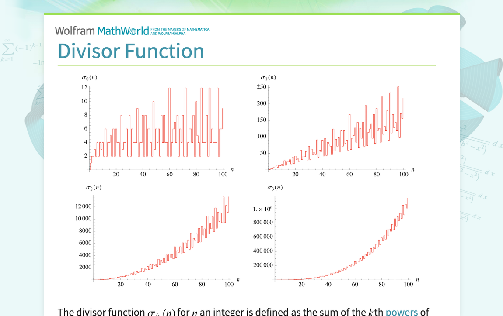

The stock market is a multifaceted ecosystem comprised of numerous moving parts, all of which require intricate understanding for effective navigation. One fundamental component of this system is the stock market index. Stock market indices serve as benchmarks representing the performance of specific market sectors or the market as a whole. These indices offer a snapshot of market trends, providing investors with essential insights into economic performance.

This article investigates into the core concepts of stock market indices, focusing on financial index calculations and the role of index divisors, with particular emphasis on their significance in algorithmic trading. An index divisor plays a crucial role in maintaining the integrity and consistency of an index's value over time, particularly during corporate actions such as stock splits or dividend distributions. By understanding these elements, traders and investors can extract valuable insights, aiding in the optimization of their strategies.



Algorithmic trading is another key area where understanding index calculations proves advantageous. This form of trading has gained prominence in financial markets due to its ability to process vast quantities of data swiftly and execute trades based on complex algorithms. A thorough comprehension of index calculations and divisors contributes to the development of effective trading algorithms that can enhance market responsiveness.

## Table of Contents

## Understanding Stock Market Indices

Stock market indices are financial instruments used to aggregate and measure the performance of a specific group of stocks, providing investors with a comprehensive view of market trends. By analyzing these indices, investors can gauge the economic performance of particular sectors or the overall market. 

There are two primary types of stock market indices: price-weighted and capitalization-weighted. Price-weighted indices, such as the Dow Jones Industrial Average (DJIA), give more influence to stocks with higher prices. The index value is obtained by summing the stock prices and dividing by the number of stocks in the index. In contrast, capitalization-weighted indices, like the Standard & Poor's 500 (S&P 500), are based on the market capitalization of the constituent companies, taking into account both stock prices and outstanding shares. The value of a capitalization-weighted index, $I$, can be calculated using the formula:

$$
I = \frac{\sum (P_i \times S_i)}{D}
$$

where $P_i$ represents the price of stock $i$, $S_i$ is the number of shares outstanding for stock $i$, and $D$ is the index divisor.

The composition of stock indices is diverse, encompassing various sectors, geographies, or industries. Some indices focus on broad market coverage, like the S&P 500, which includes large-cap companies from different sectors of the U.S. economy. Others are more specialized, targeting specific industries or regions, such as the NASDAQ-100, which is heavily weighted toward technology companies, or the FTSE 100, which covers the largest companies on the London Stock Exchange.

Indices serve multiple purposes, including benchmarking investment performance and assisting in economic analysis. They are integral tools for portfolio managers, economists, and individual investors who need to understand market movements and trends to make informed investment decisions. By tracking an index, investors can gain insights into market direction and potential investment opportunities while assessing the relative performance of their portfolios against broader market benchmarks.

## Calculation of Index Values

Calculating the value of a stock market index requires aggregating the prices or market capitalizations of its constituent stocks to reflect overall market performance. There are two primary methods for index construction: price-weighted and capitalization-weighted.

In a price-weighted index, the index value is determined by the arithmetic average of the prices of the stocks included in the index. This means that each stock influences the index value proportionally to its price per share, regardless of the company's overall size or market capitalization. An iconic example of a price-weighted index is the Dow Jones Industrial Average (DJIA). The formula for calculating a price-weighted index can be expressed as:

$$
\text{Index Value} = \frac{\sum P_i}{D}
$$

where $P_i$ represents the price of each stock in the index, and $D$ is the index divisor. The divisor is an adjustment factor used to ensure the index remains comparable over time, accommodating for stock splits, dividends, or other corporate actions that affect stock prices but not market sentiment.

A capitalization-weighted index, also known as a market-value-weighted index, evaluates both the price and the total number of outstanding shares for each constituent stock. This method aims to represent the market capitalization of included companies, giving more prominence to larger companies. The Standard & Poor's 500 (S&P 500) is a well-known example of this type. The formula for a capitalization-weighted index is:

$$
\text{Index Value} = \frac{\sum (P_i \times S_i)}{D}
$$

Here, $P_i$ is the price of stock $i$, $S_i$ is the number of shares outstanding for stock $i$, and $D$ is again the divisor. The divisor's role is crucial in maintaining historical continuity of the index's value, compensating for changes that could lead to discrepancies in the index figure without reflecting genuine shifts in the market.

Adjustments using the index divisor are essential in both index types to ensure consistency and comparability over time. The divisor is recalibrated whenever corporate actions such as mergers, stock splits, or issuance of additional shares occur. Such adjustments ensure that the index reflects real market movement rather than artificial price changes resulting from these actions.

## The Role of the Index Divisor

The index divisor is a fundamental component that plays a pivotal role in the calculation and interpretation of stock market indices. It serves to translate the aggregate values of stock prices or market capitalizations into figures that are both manageable and familiar to investors, thereby allowing for more straightforward comparisons over time.

To calculate a stock market index, an index divisor is used to adjust the sum of the component stocks' prices or market capitalizations to a standard base value. The formula for calculating a price-weighted index can be expressed as:

$$
\text{Index Value} = \frac{\sum \text{Stock Prices}}{\text{Index Divisor}}
$$

For a capitalization-weighted index, the formula is:

$$
\text{Index Value} = \frac{\sum (\text{Price} \times \text{Shares Outstanding})}{\text{Index Divisor}}
$$

The index divisor becomes particularly crucial when corporate actions, such as stock splits, dividends, or mergers, occur. These actions can drastically alter stock prices or the number of shares outstanding without affecting the company's market value. If such events were left unadjusted, they would distort the index, rendering it misleading.

Consider a stock split, which increases the number of shares while proportionally decreasing the stock price. To neutralize the impact of such a split, the index divisor is recalculated to maintain the continuity of the index. This adjustment ensures the index accurately reflects overall market performance rather than being swayed by individual stock maneuvers.

The Dow Jones Industrial Average (DJIA) exemplifies the frequent recalibration of the index divisor. Changes in the DJIA’s constituents, caused by stock splits or other corporate actions, require updates to the divisor to preserve the index's historical continuity. This adjustment allows the DJIA to represent a consistent measure of the stock market's performance over time, even as the components evolve.

In summary, the index divisor transforms complex sets of stock data into coherent indices that faithfully represent market conditions. This mechanism ensures that changes in stock values due to corporate actions do not misrepresent the market's true movements, thereby preserving the integrity and trust users place in these indices.

## Index Divisor in Algorithmic Trading

In [algorithmic trading](/wiki/algorithmic-trading), the precision and reliability of data inputs are paramount, as they directly influence trading decisions that are often executed in fractions of a second. Stock market indices serve as a vital component of these inputs, offering a synthetic overview of market trends and sentiment. To optimize trading algorithms, a comprehensive understanding of how indices are computed, and the crucial role of the index divisor, is essential.

Algorithmic trading systems can utilize these indices to identify patterns, anomalies, or predict trends by analyzing historical and real-time data. The index divisor plays an integral part in ensuring the consistency and comparability of these indices over time, especially after corporate actions such as stock splits or dividend payouts. It adjusts the summed prices or market capitalizations of the index constituents to avoid distortion, maintaining the index as a true reflection of the underlying securities’ performance.

A practically applied example involves using the divisor to compute a price-weighted index value:

$$
\text{Index Value} = \frac{\sum \text{Price of constituents}}{\text{Index Divisor}}
$$

For algorithms designed to respond to price changes, understanding the dynamic nature of the divisor ensures that strategies remain valid across index recalibrations. This meticulous attention to the divisor ensures algorithms function based on accurate and adjusted data, allowing them to respond adeptly to market fluctuations.

For example, a simple Python script to adjust an index value in response to a stock split within the index might look like this:

```python
def adjust_index_divisor(current_divisor, split_factor, index_value, stock_price):
    """
    Adjusts the index divisor for a stock split.

    :param current_divisor: The current index divisor.
    :param split_factor: The factor of the stock split (e.g., 2 for a 2-for-1 split).
    :param index_value: The current index value before the split.
    :param stock_price: The price of the stock undergoing split.
    :return: New index divisor.
    """
    pre_split_value = stock_price * split_factor
    index_adjustment = (pre_split_value - stock_price) / current_divisor
    new_divisor = current_divisor - index_adjustment
    return new_divisor

# Example usage
current_divisor = 1000
stock_split_factor = 2  # 2-for-1 split
index_value = 30000
stock_price = 150

new_divisor = adjust_index_divisor(current_divisor, stock_split_factor, index_value, stock_price)
print("Adjusted Divisor:", new_divisor)
```

A robust algorithmic trading strategy often relies not only on assessing real-time movements but also anticipating the recalibration effects resulting from actions reflected by the divisor. By attaining advanced knowledge of index calculations, traders can enhance their systems' predictive accuracy and operational effectiveness, ultimately leading to more informed trading decisions and optimized performance.

## Conclusion

Stock market indices and their associated index divisors are pivotal components within the financial market landscape. Their ability to distill vast arrays of stock data into manageable and interpretable figures makes them indispensable for traders and investors seeking to capture a comprehensive view of market performance. By serving as benchmarks, these indices provide essential insights into economic trends and sector health, facilitating more precise analysis and evaluation.

A thorough understanding of the calculation methods employed by stock indices, whether price-weighted or capitalization-weighted, coupled with the role of the index divisor, can significantly enhance trading strategies. For algorithmic trading, in particular, this knowledge is critical. Algorithms depend on consistent and reliable data to function effectively, and the integrity of this data is often maintained through the careful adjustment of index divisors. These adjustments account for corporate actions like stock splits and dividends, which, if left unaddressed, could lead to distorted index values and misleading insights.

For investors and traders, mastering the intricacies of how indices function opens the door to more informed decision-making and potentially improved financial outcomes. Real-time data analysis and the ability to predict or react to market movements more swiftly can lead to competitive advantages in the fast-paced trading environment.

As the financial markets continue to evolve with technological advancements and the globalization of economies, the significance of understanding these foundational elements remains critical. Staying informed about how indices and divisors operate, as well as their implications for broader market dynamics, ensures that traders and investors are well-equipped to navigate the ever-changing landscape of financial markets.

## References & Further Reading

[1]: Chan, E. P. (2009). ["Quantitative Trading: How to Build Your Own Algorithmic Trading Business"](https://github.com/ftvision/quant_trading_echan_book). Wiley.

[2]: Jansen, S. (2020). ["Machine Learning for Algorithmic Trading"](https://github.com/stefan-jansen/machine-learning-for-trading). Packt Publishing.

[3]: Lopez de Prado, M. (2018). ["Advances in Financial Machine Learning"](https://www.amazon.com/Advances-Financial-Machine-Learning-Marcos/dp/1119482089). Wiley.

[4]: Aronson, D. R. (2007). ["Evidence-Based Technical Analysis: Applying the Scientific Method and Statistical Inference to Trading Signals"](https://onlinelibrary.wiley.com/doi/book/10.1002/9781118268315). Wiley.

[5]: Bergstra, J., Bardenet, R., Bengio, Y., & Kégl, B. (2011). ["Algorithms for Hyper-Parameter Optimization."](https://dl.acm.org/doi/10.5555/2986459.2986743) Advances in Neural Information Processing Systems 24.