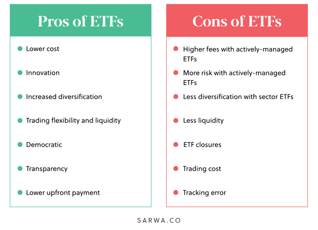

## Table of Contents

## What is an Index ETF?

An Index ETF, or Exchange Traded Fund, is a type of investment fund that tracks a specific stock market index, like the S&P 500 or the Dow Jones. It's designed to give investors a way to invest in a broad market or a specific sector without having to buy all the individual stocks in that index. When you buy shares of an Index ETF, you're essentially buying a small piece of each company in the index it tracks.

Index ETFs are popular because they offer diversification, which means spreading out your investment risk. Instead of putting all your money into one or two stocks, you can own a little bit of many different stocks. They also tend to have lower fees than actively managed funds, where a professional makes decisions about which stocks to buy and sell. This makes Index ETFs a cost-effective way for people to invest in the stock market.

## How does an Index ETF work?

An Index ETF works by trying to match the performance of a specific stock market index. Imagine the index is like a basket of different stocks. The ETF will hold the same stocks in the same proportions as the index. For example, if the S&P 500 goes up by 10%, the ETF that tracks the S&P 500 should also go up by around 10%. The goal is to give investors a way to invest in the whole market or a big part of it, without having to buy each stock separately.

To keep the [ETF](/wiki/etf-trading-strategies) in line with the index, the people who manage the ETF will buy and sell stocks as the index changes. If a company gets added to the index, the ETF will buy shares of that company. If a company is removed from the index, the ETF will sell those shares. This process helps the ETF stay as close as possible to the performance of the index. Because of this, Index ETFs are usually cheaper to own than funds where someone picks the stocks, since the ETF just follows the index automatically.

## What are the different types of Index ETFs?

There are different kinds of Index ETFs that let you invest in various parts of the market. Some Index ETFs follow broad market indexes, like the S&P 500 or the Dow Jones, which give you a piece of many big companies in the U.S. Others track smaller or more focused indexes, like those made up of small companies, companies from other countries, or specific industries like technology or healthcare. These are called sector ETFs.

There are also bond Index ETFs, which track indexes made up of different kinds of bonds, like government or corporate bonds. These can be a good way to invest in fixed income without having to buy individual bonds. Another type is commodity Index ETFs, which track the prices of things like gold, oil, or agricultural products. These can be a way to invest in physical goods without actually owning them.

Lastly, there are style Index ETFs, which focus on certain ways of investing, like value investing (buying stocks that seem cheap) or growth investing (buying stocks that are expected to grow quickly). These ETFs help you invest based on your own strategy or belief about what will do well in the market.

## What are the benefits of investing in Index ETFs?

Investing in Index ETFs can be a smart choice because they offer a lot of benefits. One big advantage is diversification. When you buy an Index ETF, you're not putting all your money into one company. Instead, you're getting a piece of many different companies all at once. This helps spread out your risk. If one company does poorly, it won't hurt your whole investment as much. Also, Index ETFs are usually cheaper than other types of funds. They don't need a person to pick stocks, so the fees are lower. This means more of your money stays in your pocket.

Another benefit is that Index ETFs are easy to buy and sell. They trade on stock exchanges, just like regular stocks, so you can buy or sell them whenever the market is open. This makes them very flexible. Plus, they are very transparent. You can always see what stocks are in the ETF and how it's doing compared to the index it's tracking. This makes it easier to keep an eye on your investment and make sure it's doing what you expect it to do.

## What are the risks associated with Index ETFs?

Even though Index ETFs have many good things about them, they also come with some risks. One big risk is that they follow the market up and down. If the market goes down a lot, your Index ETF will probably go down too. This means you could lose money if you need to sell your ETF when the market is low. Another risk is that not all Index ETFs are the same. Some might focus on riskier parts of the market, like small companies or certain countries, which can go up and down a lot more than the big, well-known companies.

Also, even though Index ETFs usually have low fees, you still have to pay something. These costs can add up over time and eat into your returns. And sometimes, the ETF might not track the index perfectly. This can happen because of things like the costs of buying and selling stocks or because the ETF can't buy exactly the same stocks as the index. This is called tracking error, and it can make your returns a bit different from what you expect.

## How do Index ETFs compare to actively managed funds?

Index ETFs and actively managed funds are two different ways to invest your money. Index ETFs try to match the performance of a specific index, like the S&P 500. They do this by holding the same stocks in the same amounts as the index. This means they don't need someone to pick which stocks to buy and sell, so they usually have lower fees. Actively managed funds, on the other hand, have a person or team who decide which stocks to buy and sell. They try to beat the market by [picking](/wiki/asset-class-picking) stocks they think will do better than others. Because of this, actively managed funds usually have higher fees.

Another big difference is how they perform. Over time, many studies have shown that most actively managed funds don't beat the market. This means they often don't do better than Index ETFs, which just follow the market. Because of the lower fees and the fact that they usually do about as well as the market, Index ETFs can be a good choice for people who want a simple, low-cost way to invest. Actively managed funds might be a better choice for someone who believes a good manager can pick stocks that will do better than the market, but they need to be okay with paying more for that chance.

## What is the expense ratio of an Index ETF and why does it matter?

The expense ratio of an Index ETF is a small percentage of your investment that you pay each year to own the ETF. It covers the costs of running the fund, like paying the people who manage it and other expenses. For example, if an ETF has an expense ratio of 0.10%, you'll pay $10 every year for every $10,000 you have invested in that ETF. The expense ratio is important because it directly affects how much money you keep from your investment. Lower expense ratios mean more of your money stays in your pocket, which can make a big difference over time.

Expense ratios matter a lot because even small differences can add up over the years. If you're investing for a long time, like for retirement, a lower expense ratio can help your investment grow more. For example, if you invest $10,000 in an ETF with a 0.10% expense ratio and another $10,000 in an ETF with a 0.50% expense ratio, the one with the lower expense ratio will cost you less each year. Over 30 years, that difference can mean thousands of dollars more in your pocket. So, when choosing an Index ETF, it's a good idea to look at the expense ratio and pick one that's as low as possible.

## How can one start investing in Index ETFs?

To start investing in Index ETFs, you first need to open a brokerage account. A brokerage account is like a bank account, but it's used for buying and selling investments like ETFs. You can open one online with companies like Vanguard, Fidelity, or Charles Schwab. Once your account is set up, you'll need to add money to it. This is called funding your account. You can usually do this by transferring money from your bank account.

After your account is funded, you can start buying Index ETFs. To do this, you'll need to search for the ETF you want to buy on your brokerage's website or app. Each ETF has a special name and a symbol, like "VOO" for the Vanguard S&P 500 ETF. Once you find the ETF you want, you can place an order to buy it. You'll need to decide how many shares you want to buy and what type of order you want to use. A "market order" buys the ETF at the current price, while a "limit order" lets you set a specific price you're willing to pay. After you place your order, the ETF will be added to your account, and you'll be an investor in the stock market.

## What is the tracking error in Index ETFs and how is it calculated?

Tracking error is a way to measure how well an Index ETF follows the performance of the index it's supposed to track. It shows the difference between the returns of the ETF and the returns of the index. If an ETF has a low tracking error, it means it's doing a good job of matching the index. But if the tracking error is high, the ETF isn't following the index as closely, which could mean it's not giving you the returns you expect.

Tracking error is calculated by looking at the difference between the ETF's returns and the index's returns over time. You take the difference between these returns each day, square those differences to make them all positive, and then find the average of those squared differences. After that, you take the square root of that average to get the tracking error. This number is usually shown as a percentage, and a smaller percentage means the ETF is doing a better job of tracking the index.

## How do market conditions affect the performance of Index ETFs?

Market conditions can have a big effect on how Index ETFs do. If the stock market is doing well, the Index ETFs that follow it will usually go up too. This is because they hold the same stocks as the market index they track. For example, if the economy is growing and companies are making more money, their stock prices might go up, and so will the ETFs that follow those stocks. But if the market goes down, like during a recession, the ETFs will likely go down too. They can't avoid the ups and downs of the market because they are designed to follow it closely.

Different types of Index ETFs can be affected differently by market conditions. For example, ETFs that track technology stocks might do really well when people are buying a lot of tech products, but they might do worse if there's a tech slump. On the other hand, ETFs that focus on more stable parts of the market, like big companies or bonds, might not go up as much during good times, but they might not fall as much during bad times. So, the kind of Index ETF you choose can make a difference in how it performs based on what's happening in the market.

## What are the tax implications of investing in Index ETFs?

When you invest in Index ETFs, you need to think about taxes. One big thing to know is that Index ETFs can be very tax-efficient. This means you might not have to pay as much in taxes as you would with other investments. That's because Index ETFs don't trade stocks as much as other funds. When funds buy and sell stocks a lot, they can create what's called capital gains, which you have to pay taxes on. But since Index ETFs mostly just hold onto the stocks in the index, they don't create as many capital gains, so you might owe less in taxes.

Another thing to consider is the type of account you use to invest in Index ETFs. If you put your ETFs in a tax-advantaged account like an IRA or a 401(k), you can delay paying taxes on any money you make until you take the money out. This can help your investment grow more over time. But if you hold your ETFs in a regular brokerage account, you'll have to pay taxes on any dividends you get and on any profits you make when you sell your ETFs. So, thinking about where to keep your Index ETFs can make a big difference in how much you pay in taxes.

## How can Index ETFs be used in a diversified investment portfolio?

Index ETFs can be a great way to make your investment portfolio more diverse. When you buy an Index ETF, you're getting a piece of many different companies all at once. This helps spread out your risk because you're not putting all your money into one or two stocks. Instead, you're investing in a whole bunch of stocks that make up the index. For example, if you buy an ETF that follows the S&P 500, you're investing in 500 big companies, so if one company does badly, it won't hurt your whole investment as much. This can help protect your money if the market goes down.

You can also use different kinds of Index ETFs to cover different parts of the market. For example, you might buy an ETF that follows the stock market in another country, or one that focuses on small companies, or even one that invests in bonds. By mixing these different types of ETFs, you can create a balanced portfolio that's less likely to be hurt by problems in one specific area. This way, if one part of your portfolio isn't doing well, another part might be doing better, helping to keep your overall investment stable.

## References & Further Reading

[1]: Malkiel, B. G. (2019). ["A Random Walk Down Wall Street: The Time-Tested Strategy for Successful Investing"](https://yourknowledgedigest.org/wp-content/uploads/2020/04/a-random-walk-down-wall-street.pdf). W. W. Norton & Company.

[2]: Ferri, R. A. (2010). ["The ETF Book: All You Need to Know About Exchange-Traded Funds"](https://archive.org/details/etfbookallyounee0000ferr_v6f2). Wiley.

[3]: ["Algorithmic and High-Frequency Trading"](https://www.cambridge.org/us/universitypress/subjects/mathematics/mathematical-finance/algorithmic-and-high-frequency-trading) by Álvaro Cartea, Sebastian Jaimungal, and José Penalva.

[4]: John C. Bogle, (2007). ["The Little Book of Common Sense Investing: The Only Way to Guarantee Your Fair Share of Stock Market Returns"](https://www.amazon.com/Little-Book-Common-Sense-Investing/dp/1119404509). Wiley.

[5]: ["The Intelligent Investor: The Definitive Book on Value Investing"](https://www.amazon.com/Intelligent-Investor-Third-Definitive-Investing/dp/0063423537) by Benjamin Graham.