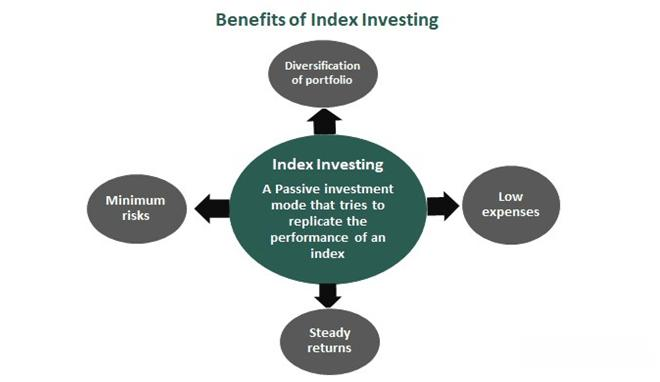

Indexes hold significant importance in the financial world, serving as crucial benchmarks that capture the performance of various market segments. Investors rely on these indexes to gain insights into market trends and make informed decisions. Indexes such as the Dow Jones Industrial Average and the S&P 500 track the general health of the stock market, offering a snapshot of overall market performance. By representing a basket of securities, indexes provide a transparent view of a given market or sector's performance over time.

This article aims to explore the multifaceted role of indexes, examining diverse examples, understanding index investing, and highlighting their applications in algorithmic trading. Index investing, a passive investment strategy seeking to mimic the performance of an index, is gaining traction due to its potential for diversification and cost-effectiveness. Furthermore, algorithmic trading, which utilizes advanced computer programs to automate trading decisions, increasingly incorporates index data to enhance strategy and accuracy.



Understanding how algorithmic trading intersects with index investment strategies is essential for modern investors. In a financial landscape shaped by rapid technological advancements, adapting to these evolving tools can significantly impact investment outcomes. The article will address these aspects, encouraging readers to leverage the power of indexes and technology in their investment approaches.

## Table of Contents

## What is a Financial Index?

A financial index is a metric that captures the performance of a specific collection of securities, offering a snapshot of market behavior and trends. Fundamentally, these indexes serve as benchmarks that investors and financial professionals employ to measure and compare the financial performance of different market segments or asset classes.

One of the most well-known financial indexes is the S&P 500, which includes 500 of the largest companies listed on stock exchanges in the United States. It is widely regarded as a barometer for the overall health of the U.S. stock market. Another iconic index is the Dow Jones Industrial Average (DJIA), which tracks 30 significant publicly traded companies and provides a more selective insight into the economic status by focusing on these prominent entities.

While indexes like the S&P 500 and DJIA primarily focus on stocks, financial indexes are not limited to equities alone. They extend to a variety of asset classes, including bonds and commodities, reflecting a broader panorama of the financial market. For instance, the Barclays U.S. Aggregate Bond Index is a key benchmark for fixed-income investments, encompassing investment-grade bonds from the U.S. Treasury, corporate sectors, and mortgage-backed securities. Commodities indexes, such as the Bloomberg Commodity Index, track the performance of a diversified basket of commodity futures, providing essential insights into the commodities market.

The composition and methodology of these indexes vary, typically based on market capitalization, price, or other criteria, and play a vital role in aiding investors in making informed decisions. Whether for tracking economic health, managing investment portfolios, or comparing the performance of a specific sector against the broader market, financial indexes offer invaluable data and benchmark standards in the continuously evolving financial landscape.

## Examples of Popular Indexes

The S&P 500, the Russell 2000, and the Nasdaq 100 are three pivotal financial indexes that profoundly impact market analyses and investment strategies. Each of these indexes offers unique insights into distinct segments of the financial markets.

The S&P 500 Index is one of the most referenced equity indices globally, composed of 500 of the largest U.S. companies listed on stock exchanges. It is capitalization-weighted, meaning that companies with higher market capitalizations have a larger influence on the index's performance. The S&P 500 is widely recognized as a barometer of the U.S. economy, reflecting the health and growth prospects of its corporate sector. By encompassing a broad spectrum of industries, it serves as a benchmark for assessing the overall market performance. 

The Russell 2000 Index, on the other hand, measures the performance of approximately 2,000 small-cap companies in the United States. Part of the broader Russell 3000 Index, the Russell 2000 provides a more nuanced view into the dynamics of smaller firms that often drive innovation and economic expansion. Investors and policymakers look at the Russell 2000 to gauge the performance of the small-cap segment and to understand how these companies are faring compared to their larger counterparts.

The Nasdaq 100 Index focuses on 100 of the largest non-financial companies listed on the Nasdaq Stock Market. It is heavily weighted towards technology and consumer sectors, reflecting their significant presence in the Nasdaq. Due to this concentration, the Nasdaq 100 often highlights the trends and shifts within the technology industry, serving as a crucial indicator for investors interested in tech-driven growth and innovation. 

Each of these indexes plays a vital role in shaping investment decisions by offering comprehensive snapshots of specific market areas. Their compositions and focus areas allow investors to diversify their portfolios according to their risk preferences and sector interests. Understanding these indexes is essential for evaluating market conditions and making informed investment choices.

## Understanding Index Investing

Index investing is a strategy characterized by its passive approach, aiming to replicate the performance of a financial index. This is achieved by constructing a portfolio that mirrors the components of the index itself. The most common vehicles for index investing are index funds and Exchange-Traded Funds (ETFs), which hold securities in the same proportions as the target index. For instance, an S&P 500 index fund would contain shares in all companies listed in the S&P 500, weighted according to their market capitalization.

One of the primary advantages of index investing is diversification. By investing in an index fund or [ETF](/wiki/etf-trading-strategies), investors gain exposure to a broad array of companies and sectors. This diversification minimizes the risk associated with investing in single stocks. For example, if one company within the index performs poorly, its effect on the overall portfolio is diluted by the performance of the other index constituents. The diversification formula can be mathematically expressed as reducing unsystematic risk, which is specific to individual investments, thus lowering the overall portfolio [volatility](/wiki/volatility-trading-strategies). 

Additionally, index investing is known for its lower costs compared to active investment strategies. Active management typically involves higher fees due to the expenses associated with research, analysis, and frequent trading. In contrast, passive index funds usually have lower management fees since they need minimal active intervention once the asset allocation is set to mimic the chosen index. The expense ratios for index funds and ETFs are often a fraction of those found in actively managed mutual funds, enhancing investors' net returns over time.

Python can be a useful tool for investors wishing to assess the cost efficiency of index funds versus active funds. A simple function to compare expense ratios and calculate potential cost savings might look like this:

```python
def calculate_savings(active_fee, passive_fee, investment, years):
    """
    Calculate the cost advantage of investing in a passive index fund over an active fund.

    :param active_fee: Annual expense ratio of the active fund (in decimal form, e.g., 0.02 for 2%)
    :param passive_fee: Annual expense ratio of the passive fund (in decimal form)
    :param investment: Initial amount invested
    :param years: Investment time horizon in years
    :return: Potential cost savings from choosing passive investing
    """
    active_cost = investment * ((1 + active_fee) ** years - 1)
    passive_cost = investment * ((1 + passive_fee) ** years - 1)
    return active_cost - passive_cost

# Example usage:
investment = 100000  # Initial investment of $100,000
years = 10  # Investment period of 10 years
active_fee = 0.02  # Active fund fee of 2%
passive_fee = 0.005  # Passive fund fee of 0.5%

savings = calculate_savings(active_fee, passive_fee, investment, years)
print(f"Cost savings with passive investing over {years} years: ${savings:,.2f}")
```

The code example demonstrates how passive investing can lead to substantial savings over time, reinforcing its appeal to long-term investors. In summary, index investing offers significant advantages in terms of diversification, cost efficiency, and simplicity, making it a compelling strategy for many investors seeking to align their portfolio performance with broader market trends.

## Ways to Invest in Indexes

Investors can engage in index investing primarily through mutual funds and exchange-traded funds (ETFs). Both of these vehicles offer diversified exposure to a broad range of securities included in a given index, providing investors with an efficient way to implement a passive investment strategy.

Mutual funds that track indexes are operated by investment companies that manage a portfolio mirroring an index's composition. These funds offer the advantage of professional management and are typically easier for individual investors to access within retirement accounts. However, they often come with management fees that, while generally lower than actively managed funds, can still impact long-term returns.

ETFs have gained popularity due to their flexibility and lower cost structure. Like mutual funds, ETFs aim to replicate the performance of an index. Unlike mutual funds, ETFs trade on stock exchanges, allowing for intraday buying and selling similar to individual stocks. This [liquidity](/wiki/liquidity-risk-premium) feature provides added flexibility for investors to respond quickly to market changes.

Investing in the entire index versus focusing on top-weighted stocks within an index presents distinct strategies. A comprehensive index approach captures the full breadth of the market's performance, providing broad diversification, which can reduce specific risks related to individual stocks or sectors. Meanwhile, focusing on top-weighted stocks might appeal to investors seeking to leverage the performance of large-cap, often more stable, companies within an index. This concentrated strategy could potentially result in higher returns but also increases exposure to the volatility of those particular stocks.

Technological advancements have significantly enhanced the accessibility of index investing. The rise of online brokerage platforms and robo-advisors has made it easier than ever for individual investors to participate in index investing with minimal capital and reduced fees. Furthermore, technological tools have enabled investors to implement automatic rebalancing strategies to maintain a targeted asset allocation relative to an index. The integration of algorithms and [machine learning](/wiki/machine-learning) further allows for the development of sophisticated trading strategies that respond to market conditions in real-time.

Given these options, investors must weigh their investment goals, risk tolerance, and fee considerations when deciding on their approach to index investing.

 to Algorithmic Trading

Algorithmic trading, often referred to as algo-trading, involves the use of computer algorithms to execute trading decisions and transactions in financial markets. These algorithms are formulated based on pre-defined criteria, which may include timing, price, quantity, or complex mathematical models. This method aims to minimize human emotion and error by executing trades with precision, leveraging speed and efficiency that human traders cannot achieve.

In traditional trading, decision-making can often be influenced by psychological biases, leading to suboptimal outcomes. Algorithmic trading addresses this issue by adhering strictly to the calculated rules without deviation. For example, an algorithm may be programmed to buy a stock when its moving average moves past a certain threshold, ensuring the decision is made based on data rather than gut feeling.

Efficiency is another critical advantage of [algorithmic trading](/wiki/algorithmic-trading). With the ability to analyze vast datasets swiftly, algorithms can identify trading opportunities and execute orders at speeds unachievable by human traders. This rapid execution helps in capturing momentary changes in the market, often resulting in better pricing for trades.

Understanding how algorithmic trading integrates into the broader financial markets is essential. It plays a significant role in providing liquidity and enhancing market efficiency. By executing orders rapidly and accurately, algo-trading helps reduce spreads and improve the price discovery process.

Furthermore, algorithmic trading facilitates a variety of trading strategies. These can range from simple strategies, like moving average crossovers, to more sophisticated ones, such as statistical [arbitrage](/wiki/arbitrage) or high-frequency trading ([HFT](/wiki/high-frequency-trading-strategies)). Each strategy relies on rigorous quantitative analysis and [backtesting](/wiki/backtesting) to optimize performance and manage risk.

As financial markets continue evolving, the role of algorithmic trading is expected to expand. It's vital for traders and investors to comprehend its implications, including how it may impact market volatility and the ethical considerations arising from its use. Whether embraced by institutional investors or implemented for retail trading, algorithmic trading remains a pivotal component in the modern trading ecosystem.

## Index Uses in Algorithmic Trading

Algorithmic trading has revolutionized how market participants approach index data to execute strategic trading decisions. By automating the trading process through algorithms, traders can efficiently utilize index data to generate superior insights and executions. Central to this approach are strategies such as trend-following and index arbitrage that heavily rely on index movements.

Trend-following is a common strategy where algorithmic systems use historical price data of indexes to identify patterns or trends. These algorithms make buying or selling decisions based on the premise that these trends will continue for a period. For example, if the moving average of an index like the S&P 500 begins trending upwards, a trend-following algorithm might signal a buy order with the anticipation that the upward [momentum](/wiki/momentum) will persist.

Python code implementing a simple moving average crossover strategy could look like this:

```python
import pandas as pd
import numpy as np

def moving_average_crossover(index_prices, short_window=40, long_window=100):
    signals = pd.DataFrame(index=index_prices.index)
    signals['price'] = index_prices['price']
    signals['short_mavg'] = index_prices['price'].rolling(window=short_window, min_periods=1, center=False).mean()
    signals['long_mavg'] = index_prices['price'].rolling(window=long_window, min_periods=1, center=False).mean()
    signals['signal'] = 0.0
    signals['signal'][short_window:] = np.where(signals['short_mavg'][short_window:] > signals['long_mavg'][short_window:], 1.0, 0.0)
    signals['positions'] = signals['signal'].diff()

    return signals
```

This code calculates the short and long moving averages for a given index and generates trade signals based on which moving average is greater. 

Another prevalent strategy is index arbitrage, which exploits price discrepancies between index derivatives and their underlying securities. Algorithms rapidly buy the undervalued asset and sell the overvalued one, profiting from the price differential. For instance, an arbitrage opportunity arises when the price of a futures contract on an index diverges from its theoretical price, calculated using the index value and cost-of-[carry](/wiki/carry-trading) models.

Algorithmic trading's reliance on index data is grounded in the perceived stability and predictability of index movements, which can provide a robust framework for modeling trading strategies. Since indexes are composed of multiple securities, they offer a diversified reflection of the market, reducing risks associated with individual stock volatility. This stability makes them attractive anchors for algorithmic models.

Ultimately, algorithmic trading with indexes can enhance decision-making processes by delivering speed, precision, and the ability to process vast amounts of data. However, while indexes provide a relatively stable foundation, market dynamics and unforeseen volatility can pose challenges, necessitating careful strategy calibration and implementation.

## Advantages and Disadvantages of Algo-Trading with Indexes

Algorithmic trading, especially when applied to index investing, offers a notable combination of speed and accuracy that human traders can seldom match. By utilizing sophisticated algorithms to execute trades, investors can capitalize on minute market inefficiencies and trends that evolve in fractions of a second. The rapid execution facilitated by computers ensures that trades are conducted at optimal prices, thereby potentially increasing the profitability of index strategies.

One of the most significant benefits of algorithmic trading in the context of indexes is accuracy. Algorithms can process vast data sets to identify patterns and predict index movements with precision. This capability reduces human error and emotional bias that typically affect manual trading strategies. Moreover, algorithms can continuously backtest trading strategies against historical data, refining them to improve future performance.

However, algorithmic trading is not without its drawbacks. A major concern is the over-reliance on technology, which can lead to vulnerabilities. Technical glitches, system failures, or coding errors can result in significant financial losses. Additionally, algorithms depend on historical data to forecast future movements, which can be problematic in highly volatile markets. Abrupt changes due to unforeseen events can render models ineffective, leading to poorly timed trades.

Market volatility introduces another layer of complexity. During periods of extreme volatility, algorithms might react to short-term fluctuations rather than ensuring long-term value alignment, potentially leading to erratic trading patterns. Furthermore, the sophisticated nature of algorithmic systems requires continuous monitoring and periodic recalibration to remain effective and relevant in shifting market landscapes.

To mitigate these disadvantages, a balanced approach that integrates algorithmic efficiency with organic insights is crucial. Human oversight remains essential to interpret broader market trends and make strategic decisions that algorithms might not be able to handle. Combining quantitative algorithms with qualitative judgments can lead to more robust investment strategies. For example, traders might use algorithms to handle trade executions while relying on human expertise to adjust their overall strategies based on non-quantitative market factors.

In summary, while algorithmic trading with indexes provides considerable advantages through speed and accuracy, it requires careful management to avoid pitfalls associated with over-reliance on technology and reactive trading during volatile periods. A symbiotic approach that merges the capabilities of algorithms with human strategic insight can enhance the overall efficiency and effectiveness of index-based trading strategies.

## Future Directions: Index Investment and Algorithmic Trading

As the financial markets continue to evolve, trends in automated investing are significantly influencing index trading strategies. Automation in investing leverages advancements in computational power, machine learning, and data analytics to enhance precision and efficiency. These technologies enable investors to execute complex strategies with minimal human intervention, which is particularly beneficial in index investment and algorithmic trading.

One prominent trend is the increasing use of [artificial intelligence](/wiki/ai-artificial-intelligence) (AI) and machine learning. These technologies analyze vast datasets to identify patterns and predict market movements. For instance, machine learning algorithms can optimize portfolio allocations by analyzing historical index performance and economic indicators. Python, a popular programming language in finance, offers libraries like `pandas` and `scikit-learn` that facilitate such analyses:

```python
import pandas as pd
from sklearn.ensemble import RandomForestRegressor

# Load historical index data
data = pd.read_csv('index_data.csv')
features = data[['economic_indicator1', 'economic_indicator2']]
target = data['index_performance']

# Train a model to predict index performance
model = RandomForestRegressor()
model.fit(features, target)

# Predict future performance
predictions = model.predict(features)
```

Moreover, the rise of decentralized finance (DeFi) introduces new asset types and trading platforms that could integrate with traditional index investing and algorithmic strategies. Blockchain technologies provide transparency and security, enabling automated and trustless trading systems.

Innovations in data acquisition are also reshaping this landscape. The proliferation of [alternative data](/wiki/best-alternative-data) sources, such as social media sentiment and geospatial information, enhances the context for trading decisions. Investors now incorporate these data types into their algorithms to anticipate market movements more accurately.

The future of index investment and algorithmic trading will likely be characterized by further integration of such advanced technologies. As processing power and data availability increase, so too will the sophistication of automated strategies. This evolution promises enhanced accuracy, reduced costs, and broader market accessibility for individual and institutional investors alike.

Technological advancements will continue to refine algorithmic trading approaches, potentially through developments like quantum computing, which could dramatically increase computational capabilities. These innovations promise to redefine efficiency and performance metrics in financial markets.

In conclusion, the intersection of index investment and algorithmic trading is poised for transformative change driven by technology. Investors must adapt to these advancements to maintain a competitive edge and capitalize on emerging opportunities in the financial sector.

## Conclusion

The integration of financial indexes within investment strategies and algorithmic trading represents a pivotal development in modern finance. Indexes such as the S&P 500, Nasdaq 100, and Russell 2000 provide standardized metrics that serve as essential benchmarks for gauging market performance. Investment strategies structured around these indexes, particularly through passive management tactics like index investing, enable investors to achieve broad market exposure with reduced effort and lower fees. The practice of index investing, primarily through the purchase of index funds or exchange-traded funds (ETFs), capitalizes on the inherent diversification offered by these indexes, thus mitigating risk while capturing average market returns.

Algorithmic trading further exemplifies the marriage between technology and financial strategies. By leveraging pre-set rules and computer programs, this method enhances the efficiency and accuracy of trading activities. Algorithms can systematically analyze index data to execute trades at optimal times, often employing strategies such as trend-following or index arbitrage. The reliance on indexes for algorithmic trading stems from their perceived stability and predictability, which are crucial for crafting robust trading algorithms.

As technology evolves, the landscape of trading and investing continues to transform. High-frequency trading systems and artificial intelligence not only increase the pace at which transactions occur but also expand the analytical capabilities available to traders and investors. These advancements necessitate that market participants remain informed and adaptable, harnessing technological tools to enhance their financial strategies effectively. Engaging with continuous learning and maintaining flexibility in approach can empower investors and traders to capitalize on emerging opportunities and navigate uncertainties in the market. 

In conclusion, the symbiotic relationship between indexes and algorithmic trading underscores a new frontier in financial strategies. As both areas advance, the potential for optimized investing and trading grows, prompting practitioners to stay vigilant and proactive in this dynamic environment.

## References & Further Reading

[1]: ["The Visual Investor: How to Spot Market Trends"](https://www.amazon.com/Visual-Investor-Spot-Market-Trends/dp/0470382058) by John J. Murphy

[2]: ["A Random Walk Down Wall Street: The Time-Tested Strategy for Successful Investing"](https://yourknowledgedigest.org/wp-content/uploads/2020/04/a-random-walk-down-wall-street.pdf) by Burton G. Malkiel

[3]: ["The Little Book of Common Sense Investing: The Only Way to Guarantee Your Fair Share of Stock Market Returns"](https://www.amazon.com/Little-Book-Common-Sense-Investing/dp/1119404509) by John C. Bogle

[4]: ["Algorithmic Trading and DMA: An Introduction to Direct Access Trading Strategies"](https://archive.org/details/algorithmictradi0000john) by Barry Johnson

[5]: ["Python for Finance: Mastering Data-Driven Finance"](https://www.amazon.com/Python-Finance-Mastering-Data-Driven/dp/1492024333) by Yves Hilpisch

[6]: Fama, E. F. (1970). ["Efficient Capital Markets: A Review of Theory and Empirical Work."](https://onlinelibrary.wiley.com/doi/abs/10.1111/j.1540-6261.1970.tb00518.x) The Journal of Finance, 25(2), 383-417.

[7]: Sharpe, W. F. (1966). ["Mutual Fund Performance."](https://www.jstor.org/stable/2351741) The Journal of Business, 39(1), 119-138.