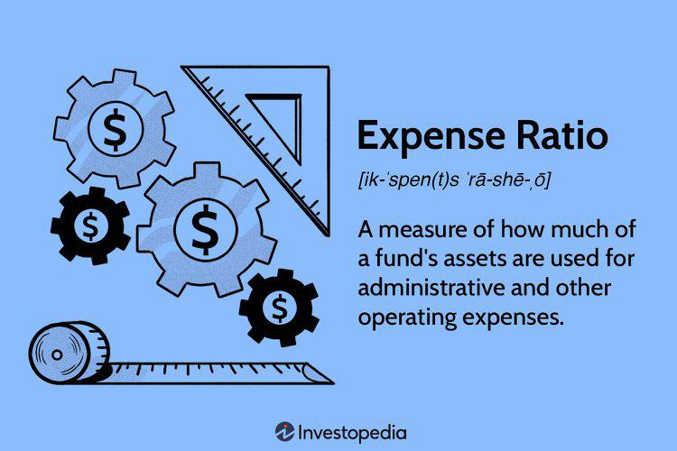

Index funds and algorithmic trading, commonly referred to as algo trading, represent significant aspects of modern investing strategies. An index fund is a type of mutual or exchange-traded fund designed to track the performance of a specific market index, such as the S&P 500. By mirroring an index, these funds offer investors a diversified exposure to a segment of the financial market, providing a straightforward, yet powerful investment vehicle. 

On the other hand, algorithmic trading involves the use of computer algorithms to execute financial transactions at optimal speeds and prices. It leverages complex mathematical models and vast datasets to make decisions, resulting in efficient trading practices that were once the domain of large financial institutions but are increasingly available to individual investors. 



A critical component of any investment strategy is the expense ratio, which represents the annual fees expressed as a percentage of total assets under management. Low expense ratios are particularly important because they have a direct impact on the investor's net returns. Minimizing these costs can significantly improve one's portfolio performance over the long term. As such, combining index funds with low expense ratios can offer a compelling foundation for investors seeking to maximize their investment returns.

Furthermore, the integration of algorithmic trading with index funds has the potential to enhance this strategy by optimizing portfolio management. Algorithms can execute trading decisions faster than humans and analyze market conditions in real-time, potentially identifying better buying or selling opportunities. This combination can thus lead to improved fund performance and an increase in wealth accumulation over time.

There is an increasing interest among investors in how algorithmic trading methodologies can be applied to index fund strategies. This growing fascination stems from the possibilities these automated processes offer in monitoring, rebalancing, and optimizing portfolios without incurring high costs. Such innovations not only promise enhanced returns and reduced expenses but also ensure that investment strategies remain aligned with market movements and investor goals.

In summary, the intersection of index funds, with their inherent low cost and broad market exposure, and algorithmic trading, characterized by its efficiency and speed, provides a promising avenue for investors looking to enhance their portfolio's performance. Understanding the factors that make low expense ratio index funds attractive, along with the benefits of algorithmic trading, can empower investors to make more informed decisions in the constantly evolving financial landscape.

## Table of Contents

## Understanding Index Funds

Index funds are a type of mutual fund or exchange-traded fund ([ETF](/wiki/etf-trading-strategies)) designed to replicate the performance of a specific market index. These funds achieve this by holding a portfolio of assets that mimic the components of a chosen index, such as the S&P 500, the Nasdaq, or the Dow Jones Industrial Average. The primary goal of an index fund is to match the returns of the market index it tracks, rather than trying to outperform it through active management.

One of the key benefits of index funds is diversification. By holding a wide range of securities inherent in the index it follows, an index fund spreads out risk across various assets. This diversification reduces exposure to any single asset's poor performance, thereby providing more stable returns over time. Moreover, diversification makes index funds an ideal choice for investors seeking broad market exposure with a single, straightforward investment.

In addition to diversification, simplicity is another significant advantage of index funds. Investors do not need to worry about selecting individual stocks or predicting market movements. Instead, they invest in a fund that automatically replicates the index. This simplified approach also contributes to lower expense ratios, as the fund's management requires fewer resources than actively managing a fund.

When compared to actively managed funds, index funds frequently demonstrate superior performance, especially over the long term. Active fund managers seek to generate higher returns by selectively buying and selling securities. However, numerous studies have shown that most active managers fail to outperform their benchmarks after accounting for fees. The consistent underperformance of actively managed funds relative to their indices is largely due to higher costs, which eat into returns.

Expense ratios play a crucial role in the overall returns of index funds. An expense ratio represents the annual fee that investors pay to fund managers for managing the fund. It is expressed as a percentage of the fund's average net assets. Index funds typically have low expense ratios, often below 0.20%, due to their passive management style. In contrast, actively managed funds can have expense ratios exceeding 1%. Over time, these lower fees contribute to better net returns for investors, as less money is deducted from the fund's performance.

In summary, index funds offer a low-cost, diversified, and simple way for investors to gain exposure to market indices. Their passive management strategy leads to lower expenses, making them an attractive option for investors looking for steady returns without the high costs associated with active management. As a result, they often outperform their actively managed counterparts, especially over extended investment horizons.

## The Importance of Low Expense Ratios

Expense ratios are a critical [factor](/wiki/factor-investing) in evaluating investment funds, particularly index funds, as they directly impact an investor's net returns. An expense ratio is defined as the annual fee that all mutual funds or exchange-traded funds charge their shareholders. This fee is expressed as a percentage of the fund's average assets under management (AUM). For example, if a fund has a 0.5% expense ratio, it means that for every $1,000 invested, $5 will be used to cover operating expenses annually.

The significance of expense ratios cannot be overstated, as they can substantially affect the growth of an investment portfolio over time. High expense ratios can erode investor gains by reducing the amount of capital that remains invested, thereby diminishing the power of compound interest. The eroding effect of high expense ratios can be illustrated with a hypothetical comparison: consider two index funds, Fund A with an expense ratio of 0.1% and Fund B with an expense ratio of 1.0%. Over a 30-year period, assuming an average annual return of 7%, $10,000 invested in Fund A would grow to approximately $74,872, while the same amount in Fund B would grow to about $57,434. This significant difference underscores the impact that even seemingly small differences in expense ratios can make over the long term.

Data from numerous studies consistently show that funds with low expense ratios tend to outperform their high-cost counterparts. Low expense ratio funds dedicate more of an investor's money to actual investments rather than the operational costs of the fund, allowing for better compounding of returns. This is particularly important for index funds which, by design, aim to passively track the performance of a specific index rather than outperform it. Thus, minimizing expenses is one of the few ways an index fund manager can effectively enhance returns.

Investors should prioritize funds with low expense ratios for multiple reasons. Firstly, expense ratios are one of the few costs in investing that are predictable and within the investor's control. Unlike market returns, which are uncertain and variable, managing expense ratios is a tangible way for investors to improve potential returns. Furthermore, in the context of index funds, where the primary goal is to mirror the benchmark index as closely as possible, maintaining a low-cost structure aligns perfectly with the investment objective.

In summary, the importance of low expense ratios extends beyond mere cost-saving. It plays a pivotal role in maximizing net returns, enhancing the power of compound interest, and ensuring that a larger portion of an investor's contributions are working towards growing wealth. For these reasons, investors are advised to diligently consider expense ratios when selecting funds, thereby optimizing their long-term financial outcomes.

 to Algorithmic Trading

Algorithmic trading, often referred to as algo trading, is the process of executing orders using automated pre-programmed trading instructions accounting for variables such as time, price, and [volume](/wiki/volume-trading-strategy). This practice leverages the speed and precision of computer systems to perform trades far more efficiently than human traders. Within modern financial markets, [algorithmic trading](/wiki/algorithmic-trading) plays a crucial role in enhancing [liquidity](/wiki/liquidity-risk-premium), narrowing bid-ask spreads, and reducing transaction costs.

One of the primary advantages of algorithmic trading is its ability to execute trades at a speed and frequency that is impossible for humans. Algorithms can scan various markets and exchanges for trading opportunities and place trades instantaneously. This speed is pivotal, as financial markets are often very volatile and a delay in execution can be costly. Moreover, the precision with which algorithms can identify pricing discrepancies ensures that they capitalize on opportunities more effectively, thereby enhancing overall trading performance.

In addition to speed, algorithmic trading offers efficiency through the elimination of human error. Trading decisions based on algorithms are executed under a predefined set of rules devoid of emotional influence, which is often a significant drawback in manual trading. This leads to more consistent and unbiased decision-making grounded in data-driven insights. Algorithms can be designed to analyze vast amounts of historical and real-time data to predict future price movements using statistical models and [machine learning](/wiki/machine-learning) techniques.

The accessibility of algorithmic trading is expanding, allowing individual investors to harness its benefits once exclusive to institutional investors. Open-source programming languages like Python, with libraries such as Pandas, NumPy, and Zipline, provide individual investors with the tools to develop, backtest, and deploy their own trading algorithms. Here's a simple example of a trading algorithm using Python which calculates moving averages to make buy/sell decisions:

```python
import pandas as pd

# Assume `data` is a DataFrame with columns 'Date' and 'Close'
data['Short_MA'] = data['Close'].rolling(window=50).mean()
data['Long_MA'] = data['Close'].rolling(window=200).mean()

data['Signal'] = 0
data['Signal'][50:] = np.where(data['Short_MA'][50:] > data['Long_MA'][50:], 1, 0)
data['Position'] = data['Signal'].diff()

# Positions: 1 is buy, -1 is sell, 0 is hold
print(data[['Date', 'Position']].dropna())
```

In the context of managing and optimizing index fund portfolios, algorithms offer substantial value. They can be used to rebalance portfolios to maintain alignment with a target asset allocation, manage tax efficiency through harvest strategies, and implement dynamic hedging strategies to protect against adverse movements. For instance, an optimized rebalancing strategy might use algorithms to execute trades only when deviations from target allocations exceed specific thresholds, minimizing trading costs and potential tax burdens. 

In summary, the role of algorithmic trading in modern financial markets marks a significant shift towards technology-driven trading frameworks. Its accessibility to individual investors democratizes access to sophisticated trading strategies. Furthermore, its use in index fund portfolios offers enhanced precision and efficiency in managing investment strategies, maximizing returns while minimizing risks.

## Combining Index Funds with Algo Trading

Algorithmic trading, when applied to the management of index funds, involves using automated, rule-based strategies to optimize portfolio returns and manage risk more effectively. These strategies can enhance index fund performance by enabling more precise and timely decision-making compared to manual processes.

One common strategy that leverages algorithms in the context of index funds is rebalancing. Index funds replicate a specific market index, such as the S&P 500, by maintaining a portfolio of securities that mirror the index’s composition. However, due to market fluctuations, the proportions of the securities in the portfolio can drift away from the target index. Algo trading systems can be designed to continuously monitor the portfolio and automatically execute trades to rebalance the holdings according to predefined rules. The Python code snippet below illustrates a simple rebalancing strategy:

```python
def rebalance_portfolio(target_weights, current_portfolio):
    trades = {}
    for asset, target_weight in target_weights.items():
        current_weight = current_portfolio.get(asset, 0)
        if current_weight < target_weight:
            trades[asset] = 'buy'
        elif current_weight > target_weight:
            trades[asset] = 'sell'
    return trades

# Example of usage
target_weights = {'AAPL': 0.3, 'GOOGL': 0.3, 'MSFT': 0.4}
current_portfolio = {'AAPL': 0.25, 'GOOGL': 0.35, 'MSFT': 0.4}
rebalance_decisions = rebalance_portfolio(target_weights, current_portfolio)
print(rebalance_decisions)
```

Another application of algo trading involves the optimization of portfolio returns by leveraging data-driven insights. Algorithms can be used to identify patterns and trends in market data, adjusting the fund's exposure to different sectors or regions to maximize returns or minimize risks. This might involve more sophisticated techniques such as machine learning models to predict market movements or [volatility](/wiki/volatility-trading-strategies), leading to proactive adjustments in portfolio holdings.

Nevertheless, integrating algorithmic trading with index funds comes with certain risks and considerations. For one, there's the potential for overfitting the algorithm to historical data, which can result in poor performance in changing market conditions. Furthermore, implementing these systems requires significant technical expertise and resources, which may not be feasible for all investors. Additionally, the reliance on technical infrastructure introduces risks related to system failures or cyber threats.

It's essential for investors to thoroughly evaluate the algorithms' design and [backtesting](/wiki/backtesting) results, along with considering the costs associated with algorithmic trading, such as transaction fees and technological investments. Successful integration of algorithmic trading with index funds should balance these aspects, ensuring that the potential enhancements to performance are not overshadowed by added risks and costs.

## Benefits for Investors

Low expense ratio index funds, when augmented with algorithmic trading, offer investors a significant edge by optimizing returns and minimizing costs. Index funds, by design, have inherently low expense ratios, a crucial factor as these costs can greatly influence overall returns over time. When these funds are further enhanced with algorithmic trading, the potential for improved returns and reduced costs becomes more pronounced. Algo trading can optimize the timing and selection of trades, ensuring investors achieve the best possible execution prices while minimizing transaction costs.

The long-term benefits of this combined approach include increased wealth accumulation and enhanced financial stability. Low expense ratios directly translate into higher net returns, as investors retain more of their earnings. Over extended periods, even small reductions in fees can compound, leading to substantial growth in an investor's portfolio. For instance, an annual saving of 0.5% in fees on an investment yielding a 7% return can grow to a significant sum over decades, thanks to the power of compounding. This is expressed in the formula for compound interest: 

$$
A = P \left(1 + \frac{r}{n}\right)^{nt}
$$

where $A$ is the amount of money accumulated after n years, including interest, $P$ is the principal investment amount, $r$ is the annual interest rate (in decimal), $n$ is the number of times that interest is compounded per year, and $t$ is the time the money is invested for in years.

Algorithmic trading further supports this growth by allowing for automated, data-driven investment strategies that can adapt to market conditions. This adaptability can be particularly beneficial during volatile market periods, where swift decisions can lead to better outcomes than those achieved by manual trading strategies.

Moreover, this investment strategy is suitable for investors of various experience levels. Novice investors benefit from the simplicity and low cost of index funds without needing to master the intricacies of the stock market, while experienced investors can harness the precision and scalability of algorithmic trading to refine their strategies. This inclusive nature empowers a broader range of individuals to access sophisticated investment techniques, previously reserved for institutional investors.

The combination of low expense ratio index funds and algorithmic trading thus emerges as a compelling avenue for investors seeking to enhance their portfolios. By leveraging the low-cost structure and diversified nature of index funds with the technological advancements of algo trading, investors are poised to enjoy greater returns, reduced risk, and sustained financial growth over the long term.

## Conclusion

In conclusion, the integration of low expense ratio index funds with algorithmic trading stands as a promising strategy for investors seeking to optimize their portfolios. The combined approach leverages the inherent benefits of index funds—such as diversification and simplicity—while exploiting the advanced capabilities of algorithmic trading, including its speed and efficiency in handling complex decisions. This dual strategy is particularly attractive due to the compelling cost advantages. Low expense ratios play a critical role in maximizing net returns, as they minimize the costs that can erode investment gains over time. By reducing these expenses, investors can enhance their overall wealth accumulation and improve financial stability in the long term.

As investors ponder their strategies, incorporating low expense ratio index funds bolstered by algorithmic trading should be seriously considered. This approach is not reserved solely for seasoned investors; it is increasingly accessible to individuals at various experience levels, promising enhanced returns and reduced costs. For those intrigued by this potential, resources such as financial advisors, online platforms offering algorithmic trading access, and educational content can serve as invaluable guides.

Looking forward, the future of investing is likely to see greater synergy between traditional investment vehicles and cutting-edge technology. As algorithms become more sophisticated and accessible, the integration with index funds could redefine investment strategies, allowing for more dynamic and responsive portfolio management. Embracing these innovations will equip investors to better navigate the ever-evolving financial landscape, positioning them advantageously in the pursuit of financial success.

## References & Further Reading

[1]: ["Advances in Financial Machine Learning"](https://www.amazon.com/Advances-Financial-Machine-Learning-Marcos/dp/1119482089) by Marcos Lopez de Prado

[2]: ["A Random Walk Down Wall Street: The Time-Tested Strategy for Successful Investing"](https://www.amazon.com/Random-Walk-Down-Wall-Street/dp/0393358380) by Burton G. Malkiel

[3]: ["The Little Book of Common Sense Investing: The Only Way to Guarantee Your Fair Share of Stock Market Returns"](https://www.amazon.com/Little-Book-Common-Sense-Investing/dp/1119404509) by John C. Bogle

[4]: ["Machine Learning for Algorithmic Trading"](https://github.com/stefan-jansen/machine-learning-for-trading) by Stefan Jansen

[5]: ["Quantitative Trading: How to Build Your Own Algorithmic Trading Business"](https://www.amazon.com/Quantitative-Trading-Build-Algorithmic-Business/dp/1119800064) by Ernest P. Chan

[6]: ["Common Sense on Mutual Funds"](https://www.amazon.com/Common-Sense-Mutual-Funds-Anniversary/dp/0470138130) by John C. Bogle