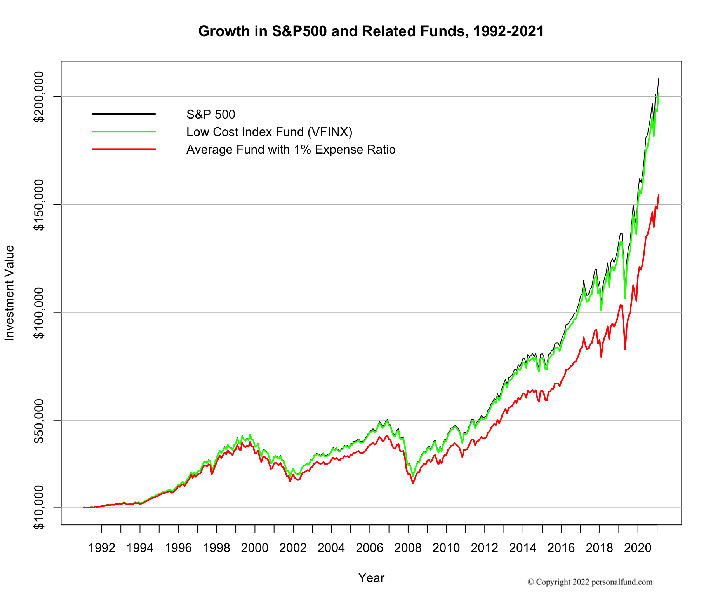

## Table of Contents

## What is an index fund?

An index fund is a type of investment that tries to match the performance of a specific market index, like the S&P 500. Instead of picking individual stocks, an index fund buys all the stocks in the index it follows. This makes it easier for people to invest in the overall market without having to choose which stocks to buy.

Index funds are popular because they usually have lower fees than other types of funds. Since they don't need a lot of people to manage them, the costs are lower. This means more of your money stays invested and can grow over time. Many people like index funds because they are a simple and cost-effective way to invest in the stock market.

## Why are low expense ratios important for index funds?

Low expense ratios are important for index funds because they help you keep more of your money. When you invest in a fund, you have to pay fees to the company that manages it. These fees are called expense ratios. If the expense ratio is low, you pay less in fees, which means more of your money stays in the fund and can grow over time.

Over many years, even a small difference in fees can make a big difference in how much money you end up with. For example, if you invest $10,000 in a fund with a 1% expense ratio, you'll pay $100 in fees each year. But if you choose a fund with a 0.1% expense ratio, you'll only pay $10 in fees each year. Over 30 years, that difference can add up to thousands of dollars. So, choosing an index fund with a low expense ratio can help you save money and earn more in the long run.

## How do expense ratios affect the overall returns of an index fund?

Expense ratios directly impact the overall returns of an index fund by reducing the amount of money that can grow over time. When you invest in an index fund, you pay a small percentage of your investment each year as a fee to the fund manager. This fee is the expense ratio. If the expense ratio is high, you'll pay more in fees, which means less of your money is left to earn returns from the market.

Over many years, the effect of these fees can be big. Even a small difference in expense ratios can lead to a large difference in your final investment amount. For example, if you invest $10,000 in a fund with a 1% expense ratio, you'll lose $100 each year to fees. But if you choose a fund with a 0.1% expense ratio, you'll only lose $10 each year. Over 30 years, that difference can add up to thousands of dollars. So, choosing a fund with a low expense ratio can help you keep more of your money and earn more in the long run.

## Can you list some examples of index funds with low expense ratios?

Some index funds with low expense ratios are the Vanguard S&P 500 [ETF](/wiki/etf-trading-strategies) (VOO) and the Schwab U.S. Broad Market ETF (SCHB). The Vanguard S&P 500 ETF tracks the S&P 500 index and has an expense ratio of just 0.03%. This means if you invest $10,000, you only pay $3 in fees each year. The Schwab U.S. Broad Market ETF tracks a broader market index and also has a very low expense ratio of 0.03%. Both of these funds are popular choices because they offer a way to invest in the stock market with very low costs.

Another good option is the iShares Core S&P Total U.S. Stock Market ETF (ITOT), which has an expense ratio of 0.03%. This fund tracks a broad range of U.S. stocks and is a good choice for someone looking to invest in the overall U.S. market at a low cost. All of these funds are examples of how you can invest in index funds without paying high fees, helping you keep more of your money working for you over time.

## What is considered a 'low' expense ratio for an index fund?

A 'low' expense ratio for an index fund is usually around 0.05% or less. This means if you invest $10,000, you would pay $5 or less in fees each year. Many top index funds have expense ratios even lower than this, like 0.03%. These low fees help you keep more of your money in the fund, which can grow over time.

Expense ratios can vary a lot, but anything below 0.10% is generally considered low for an index fund. Higher expense ratios, like 0.50% or more, can eat into your returns over time. So, when choosing an index fund, it's a good idea to look for one with a very low expense ratio to help your investment grow as much as possible.

## How can beginners start investing in index funds with low expense ratios?

Starting to invest in index funds with low expense ratios is easier than you might think. First, you need to open an account with a brokerage firm that offers index funds. Many popular brokerages, like Vanguard, Schwab, and Fidelity, have low-cost index funds. Once you have your account set up, you can search for funds with low expense ratios, like the Vanguard S&P 500 ETF (VOO) or the Schwab U.S. Broad Market ETF (SCHB). These funds track broad market indexes and have very low fees, usually around 0.03%.

After choosing your index fund, you can start investing by putting money into your account and buying shares of the fund. You can do this with a lump sum or set up regular investments, like monthly contributions. This way, you can slowly build your investment over time. Remember, the key is to keep your costs low, so always check the expense ratio before you invest. By choosing funds with low expense ratios, you'll keep more of your money working for you in the long run.

## What are the differences between actively managed funds and index funds in terms of expense ratios?

Actively managed funds and index funds are different in how they work and how much they cost. Actively managed funds have people who pick and choose which stocks to buy and sell. They try to do better than the market. Because they need people to manage them, these funds usually have higher expense ratios. An expense ratio of 1% or even higher is common for actively managed funds. This means if you invest $10,000, you might pay $100 or more in fees each year.

On the other hand, index funds just try to match the performance of a market index, like the S&P 500. They don't need a lot of people to manage them because they automatically buy all the stocks in the index. This makes them much cheaper to run. Index funds often have expense ratios as low as 0.03%. So, if you invest $10,000 in an index fund, you might only pay $3 in fees each year. Over time, these lower fees can make a big difference in how much money you keep.

## How do expense ratios of index funds compare across different asset classes?

Expense ratios for index funds can vary a bit depending on the asset class they focus on. For example, index funds that track big U.S. stock markets, like the S&P 500, often have really low expense ratios. These funds might have fees as low as 0.03%. This is because there are a lot of investors interested in these funds, so companies can keep costs down.

On the other hand, index funds that focus on smaller or less common markets, like international stocks or bonds, might have higher expense ratios. These funds could have fees around 0.10% to 0.20% or even more. This is because it can be harder and more expensive to manage these types of funds. Still, compared to actively managed funds, index funds across all asset classes usually have lower fees.

## What role do expense ratios play in long-term investment strategies?

Expense ratios are really important when you're thinking about long-term investments. They are the fees you pay each year to the company that manages your fund. Even though these fees might seem small, over many years they can add up a lot. If you pick a fund with a high expense ratio, you'll be paying more in fees, which means less of your money is left to grow. Over time, this can make a big difference in how much money you end up with.

Choosing funds with low expense ratios can help you save a lot of money in the long run. For example, if you invest in an index fund with a really low expense ratio, like 0.03%, you'll pay very little in fees. This means more of your money stays in the fund and can grow over time. Over 20 or 30 years, this can add up to thousands of dollars more in your pocket. So, when you're planning for the long term, it's a good idea to look for funds with low expense ratios to help your investments grow as much as possible.

## How do tax implications vary with different expense ratios in index funds?

When you invest in index funds, you need to think about taxes too. The expense ratio of an index fund can affect how much you pay in taxes. Funds with higher expense ratios usually have more buying and selling of stocks, which can lead to more capital gains. When the fund sells stocks at a profit, it has to pay taxes on those gains, and those taxes can be passed on to you, the investor. So, if a fund has a high expense ratio, you might end up paying more in taxes because of all the trading that's happening.

On the other hand, index funds with lower expense ratios tend to do less trading. They just hold onto the stocks in the index and don't buy and sell as much. This means there are fewer capital gains, which can lead to lower taxes for you. So, choosing a fund with a low expense ratio can help you keep more of your money, not just because of lower fees but also because you might pay less in taxes. Over time, this can make a big difference in how much your investment grows.

## What advanced strategies can be used to minimize the impact of expense ratios on index fund investments?

One advanced strategy to minimize the impact of expense ratios on index fund investments is to use tax-efficient accounts like a Roth IRA or a 401(k). These accounts allow your investments to grow without being taxed each year. This means the small fees from expense ratios don't get bigger because of taxes. By putting your index funds in these accounts, you can keep more of your money working for you over time.

Another strategy is to focus on funds with very low turnover rates. Turnover rate is how often the fund buys and sells stocks. Funds with low turnover rates trade less, which means they have fewer capital gains. Fewer capital gains can lead to lower taxes, which helps you keep more of your money. Look for index funds that track broad market indexes and have low turnover rates to minimize both expense ratios and tax impacts.

## How do global economic conditions influence the choice of index funds with low expense ratios?

Global economic conditions can affect which index funds with low expense ratios you might want to choose. When the economy is doing well, you might feel more comfortable investing in funds that track broad market indexes, like the S&P 500. These funds often have very low expense ratios, which means you pay less in fees. During good economic times, you might want to take advantage of the growth in the market by choosing these low-cost funds, so more of your money can grow.

On the other hand, if the economy is not doing so well, you might want to look at index funds that focus on different asset classes, like bonds or international stocks. These funds might have slightly higher expense ratios than U.S. stock market funds, but they can still be pretty low. Choosing these funds can help spread out your risk during tough economic times. No matter what the global economic conditions are, always look for funds with the lowest expense ratios you can find to help your investments grow as much as possible.

## What are the benefits for investors?

Low expense ratio index funds, when augmented with [algorithmic trading](/wiki/algorithmic-trading), offer investors a significant edge by optimizing returns and minimizing costs. Index funds, by design, have inherently low expense ratios, a crucial [factor](/wiki/factor-investing) as these costs can greatly influence overall returns over time. When these funds are further enhanced with algorithmic trading, the potential for improved returns and reduced costs becomes more pronounced. Algo trading can optimize the timing and selection of trades, ensuring investors achieve the best possible execution prices while minimizing transaction costs.

The long-term benefits of this combined approach include increased wealth accumulation and enhanced financial stability. Low expense ratios directly translate into higher net returns, as investors retain more of their earnings. Over extended periods, even small reductions in fees can compound, leading to substantial growth in an investor's portfolio. For instance, an annual saving of 0.5% in fees on an investment yielding a 7% return can grow to a significant sum over decades, thanks to the power of compounding. This is expressed in the formula for compound interest: 

$$
A = P \left(1 + \frac{r}{n}\right)^{nt}
$$

where $A$ is the amount of money accumulated after n years, including interest, $P$ is the principal investment amount, $r$ is the annual interest rate (in decimal), $n$ is the number of times that interest is compounded per year, and $t$ is the time the money is invested for in years.

Algorithmic trading further supports this growth by allowing for automated, data-driven investment strategies that can adapt to market conditions. This adaptability can be particularly beneficial during volatile market periods, where swift decisions can lead to better outcomes than those achieved by manual trading strategies.

Moreover, this investment strategy is suitable for investors of various experience levels. Novice investors benefit from the simplicity and low cost of index funds without needing to master the intricacies of the stock market, while experienced investors can harness the precision and scalability of algorithmic trading to refine their strategies. This inclusive nature empowers a broader range of individuals to access sophisticated investment techniques, previously reserved for institutional investors.

The combination of low expense ratio index funds and algorithmic trading thus emerges as a compelling avenue for investors seeking to enhance their portfolios. By leveraging the low-cost structure and diversified nature of index funds with the technological advancements of algo trading, investors are poised to enjoy greater returns, reduced risk, and sustained financial growth over the long term.

## References & Further Reading

[1]: ["Advances in Financial Machine Learning"](https://www.amazon.com/Advances-Financial-Machine-Learning-Marcos/dp/1119482089) by Marcos Lopez de Prado

[2]: ["A Random Walk Down Wall Street: The Time-Tested Strategy for Successful Investing"](https://www.amazon.com/Random-Walk-Down-Wall-Street/dp/0393358380) by Burton G. Malkiel

[3]: ["The Little Book of Common Sense Investing: The Only Way to Guarantee Your Fair Share of Stock Market Returns"](https://www.amazon.com/Little-Book-Common-Sense-Investing/dp/1119404509) by John C. Bogle

[4]: ["Machine Learning for Algorithmic Trading"](https://github.com/stefan-jansen/machine-learning-for-trading) by Stefan Jansen

[5]: ["Quantitative Trading: How to Build Your Own Algorithmic Trading Business"](https://www.amazon.com/Quantitative-Trading-Build-Algorithmic-Business/dp/1119800064) by Ernest P. Chan

[6]: ["Common Sense on Mutual Funds"](https://www.amazon.com/Common-Sense-Mutual-Funds-Anniversary/dp/0470138130) by John C. Bogle