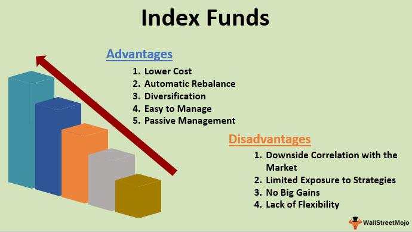

In the ever-evolving financial landscape, smart investing and advanced trading strategies are crucial to maximizing returns. Investment options like index funds and innovative trading techniques such as algorithmic trading are gaining popularity as more investors seek efficient ways to enhance their portfolios. This growing interest is driven by the promise of diversification, cost-effectiveness, and potentially superior returns offered by these modern financial tools.

Index funds, known for their simplicity and passive investment strategies, allow investors to achieve market returns without the need for active stock picking. This approach helps in minimizing management fees while offering broad market exposure. On the other hand, algorithmic trading is transforming financial markets by utilizing computer algorithms to execute trades with precision and speed, aiming to reduce human errors and capitalize on market opportunities.



This article explores the benefits and strategies of investing in index funds and the role of algorithmic trading in modern investing. Understanding these concepts could be pivotal for investors looking to optimize their portfolio management strategy. By leveraging these tools, investors can navigate the complexities of financial markets more effectively, aiming for improved financial resilience and returns. Read on to learn how these strategies can potentially enhance your investment outcomes.

## Table of Contents

## Understanding Index Funds

Index funds are a type of investment fund designed to replicate the performance of a specific financial market index. By holding a collection of assets that mirror the composition of an index, such as the S&P 500, these funds achieve broad market exposure. This alignment with an index allows investors to gain diversification across many asset classes, sectors, or regions with a single investment vehicle, reducing unsystematic risk associated with individual stocks.

One of the most notable advantages of index funds is their cost-effectiveness. Unlike actively managed funds, which require a team of portfolio managers and analysts to select securities and attempt to outperform the market, index funds follow a passive investment strategy. This passive approach involves purchasing all or a selection of the components of an index, minimizing trading activities and, as a result, leading to lower management fees. Typically, the expense ratio of index funds is significantly lower than that of actively managed funds, which can positively impact net returns over time.

Investors are attracted to index funds due to their simplicity and transparency. The methodologies and holdings of these funds are generally well-documented, providing investors with clear insight into what securities they own. This transparency aids in decision-making and aligns with the goal of many investors to achieve market returns without the need to actively pick stocks, which can be time-consuming and require substantial expertise.

Furthermore, the diversification offered by index funds is advantageous as it spreads investment risk across a wide array of stocks that comprise an index. Diversification reduces the impact of a poor-performing stock on the overall portfolio and is a fundamental principle in risk management. Whether an investor is a novice seeking a simple entry into stock market investing or a seasoned investor aiming to include a stable component in their portfolio, index funds present a viable option for nearly all investment strategies due to their diversified nature.

In summary, the passive approach, low management costs, and diversification of index funds make them a compelling choice for a wide range of investors. By enabling exposure to market-wide gains while mitigating individual company risk, index funds serve as a solid foundation for achieving long-term investment objectives.

## Benefits of Investing in Index Funds

Index funds are a favored choice for numerous investors due to their benefits, which arise primarily from their passive management nature. One of the most notable advantages of index funds is their lower expense ratios. Since these funds are designed to track a specific index, they require less active management than their actively managed counterparts. This lower requirement translates to reduced operational costs, making index funds an attractive, cost-effective investment option.

Additionally, index funds offer investors broad market exposure. By mirroring specific indices, such as the S&P 500, these funds include a wide array of securities, which inherently leads to diversification. Diversification reduces portfolio [volatility](/wiki/volatility-trading-strategies) because the performance of individual stocks tends to be offset by others within the index, minimizing risks associated with single-stock volatility.

Transparency is another key benefit of investing in index funds. Given their structure, index funds are typically publicly traded, and their holdings are explicitly documented and publicly accessible. This level of documentation allows investors to understand exactly what they are investing in, a [factor](/wiki/factor-investing) that can greatly enhance trust and confidence in their investment choices.

Historically, index funds have demonstrated strong performance, frequently surpassing actively managed funds over long periods when accounting for fees. Several studies have shown that the majority of actively managed funds do not outperform their benchmark indices over extended periods, which positions index funds as a reliable long-term investment strategy [1].

Furthermore, index funds are known for their tax efficiency. Due to their lower portfolio turnover—the frequency with which assets are bought and sold—index funds tend to realize fewer capital gains during the holding period. This aspect results in fewer taxable events compared to actively managed funds, where higher turnover may lead to more frequent and potentially higher tax liabilities for investors.

[1]: Burton G. Malkiel, "A Random Walk Down Wall Street," W.W. Norton & Company. This book provides insights into the advantages of index funds compared to actively managed strategies.

## Drawbacks of Index Funds

Index funds, while offering several advantages, also present certain drawbacks that investors need to consider. A key limitation is their lack of flexibility compared to actively managed funds when navigating market downturns. This rigidity arises because index funds strictly adhere to the composition of the respective index they aim to replicate, leaving little room to adjust holdings in response to market changes or economic forecasts.

One significant issue with index funds is their automatic inclusion of all securities within an index, which can lead to investment in overvalued stocks. Since index funds invest in all constituents of an index without discretion, they may hold stocks that are currently overvalued, as market prices do not always accurately reflect a company's intrinsic value. This can erode the returns of the fund, particularly if a significant portion of the index's market capitalization is comprised of such stocks.

Market capitalization weighting is another factor that can become a drawback for index funds. In a market-cap-weighted index, companies with larger market capitals have a greater influence on the index's performance. Consequently, if a few large companies dominate the index, the overall performance of the index fund can become closely tied to the financial health and stock performance of these companies. This concentration risk could amplify losses or cause underperformance if these firms experience downturns.

Moreover, index funds might not outperform the broader market when specific sectors or asset classes outperform the index. Since index funds are designed to track market indexes rather than actively seek out high-performing investments, they may trail behind active funds in markets where certain sectors have significantly higher returns than the index average.

These aspects underscore the importance of investors thoroughly evaluating whether index funds align with their financial objectives and risk profiles. While index funds provide diversification and cost benefits, understanding these potential limitations is crucial for effective portfolio management.

 to Algorithmic Trading

Algorithmic trading, often known as algo-trading, employs computer algorithms to automatically execute trading orders based on specified criteria, such as timing, price, and quantity. These algorithms are designed to perform trades at optimal prices while minimizing the influence of human emotions and psychological bias, which can lead to inefficient trading decisions. By removing these human elements, algo-trading can achieve more consistent and transparent trading practices.

Algo-trading enhances market [liquidity](/wiki/liquidity-risk-premium), which helps in narrowing bid-ask spreads and improving the overall market efficiency. The increased liquidity results from the ability of algorithmic systems to engage in high-frequency trades that market participants—particularly human traders—might find difficult to achieve due to speed constraints and cognitive limitations.

The strategies utilized in [algorithmic trading](/wiki/algorithmic-trading) can vary significantly in complexity. Simple rules-based systems might execute trades when an asset's price crosses moving averages, a technique known as trend-following. Conversely, more advanced algorithms may employ [machine learning](/wiki/machine-learning) techniques and [artificial intelligence](/wiki/ai-artificial-intelligence) to analyze large sets of data, identify patterns, and adapt to changing market conditions. For example, a Python-based algorithm could implement a basic moving average crossover strategy:

```python
def moving_average(data, window_size):
    return data.rolling(window=window_size).mean()

def buy_sell_signals(data, short_window, long_window):
    signals = pd.DataFrame(index=data.index)
    signals['price'] = data['close']
    signals['short_mavg'] = moving_average(data['close'], short_window)
    signals['long_mavg'] = moving_average(data['close'], long_window)
    signals['signal'] = 0.0  
    signals['signal'][short_window:] = np.where(signals['short_mavg'][short_window:] > signals['long_mavg'][short_window:], 1.0, 0.0)  
    signals['positions'] = signals['signal'].diff()
    return signals
```

In addition, algo-trading systems can implement more sophisticated strategies like [arbitrage](/wiki/arbitrage), which involves simultaneously buying and selling an asset in different markets to exploit price differentials. Other complexities introduced through machine learning and AI involve predictive modeling where algorithms assess historical data to anticipate future market movements.

Despite its advantages, algorithmic trading demands a robust technological infrastructure and comprehensive understanding of financial markets to mitigate potential risks associated with technology reliance and potential system failures. Therefore, continuous refinement and supervision are crucial for successful algo-trading strategies.

## How Algorithmic Trading Works

Algorithmic trading, also known as algo-trading, involves using sophisticated computer algorithms to execute trades based on specific criteria. These predefined criteria can include factors such as timing, price, or the number of shares, which are programmed into the algorithm to automate the trading process.

One of the primary advantages of algorithmic trading is its ability to place trade orders at the most opportune moments with a level of speed and precision that surpasses human capabilities. For instance, algorithms can react to market changes virtually instantaneously, executing trades in milliseconds. This rapid execution can be crucial in capturing short-lived opportunities in the market.

A critical aspect of developing robust algorithmic trading systems is [backtesting](/wiki/backtesting). Backtesting involves applying an algorithm to historical market data to evaluate how it would have performed in the past. By simulating the algorithm's trading strategy on historical data, traders can refine and optimize their strategies to better predict future market movements. This process is vital to minimizing risk and enhancing the algorithm's effectiveness.

Among the common strategies employed in algorithmic trading are trend-following tactics, arbitrage opportunities, and index fund rebalancing. Trend-following strategies involve algorithms that identify and follow market trends, while arbitrage strategies exploit price differences of the same asset across different markets. Index fund rebalancing aims to maintain the composition of a portfolio to match its target index through automated buys and sells.

Despite its advantages, algorithmic trading necessitates a significant technological infrastructure and comprehensive financial market knowledge. The infrastructure includes high-speed internet connections, powerful computing units, and access to accurate and real-time market data. Furthermore, successful implementation requires expertise in financial markets to design effective algorithms and interpret the results of backtesting.

In summary, algorithmic trading combines technology, mathematical models, and financial insight to enhance trade execution. Its integration into a trading strategy can significantly impact efficiency and profitability, provided the substantial technological and knowledge-based prerequisites are met.

## Advantages and Disadvantages of Algorithmic Trading

Algorithmic trading, or algo-trading, presents several advantages that have contributed to its growing popularity among traders and financial institutions. One of the most significant benefits is the speed at which trades can be executed. Algorithms have the capability to process vast amounts of market data and execute trades within milliseconds, a speed unattainable by human traders. This rapid execution ensures that traders can capitalize on fleeting market opportunities and achieve optimal trade prices.

Moreover, algorithmic trading significantly reduces errors stemming from human intervention. By eliminating emotions and psychological biases from trading decisions, algo-trading promotes a more systematic and disciplined approach. This leads to consistency in executing strategies, which is particularly beneficial in volatile markets. Additionally, algo-trading can lower transaction costs because it can execute trades more efficiently, potentially reducing the need for manual processes and intermediaries.

Algo-trading also facilitates the simultaneous monitoring of multiple market conditions. Algorithms can be programmed to track a variety of indicators and market movements, allowing for informed decision-making and swift reactions to market changes. This comprehensive market analysis contributes to more informed trading strategies.

However, algorithmic trading is not without its risks. A primary concern is the dependence on technology, which makes traders vulnerable to technical glitches and system failures. Such failures can lead to significant financial losses, especially in fast-moving markets. Furthermore, while algorithms are powerful tools, they lack the nuanced judgment that experienced traders can bring to decisions. This absence of human intuition can be a disadvantage in unpredictable situations that require adaptive thinking.

Another potential drawback is the risk of exacerbating market instability during periods of high volatility. The rapid execution and high trading volumes typical of algo-trading can amplify market fluctuations, potentially leading to increased turbulence and liquidity issues. As seen in events like the 2010 "Flash Crash," algorithmic strategies can sometimes lead to unintended market disruptions.

In light of these advantages and disadvantages, traders considering algo-trading must weigh these factors carefully. Ensuring robust technological infrastructure and incorporating safeguards can mitigate some risks. Nonetheless, understanding the limitations of algorithmic trading is crucial to effectively integrating it into a broader investment strategy. Traders should continuously monitor and refine their algorithms to adapt to changing market conditions and maintain a balance between automated processes and human oversight.

## Combining Index Funds and Algorithmic Trading

Combining index funds and algorithmic trading can significantly enhance an investor's portfolio management strategy by integrating the benefits of stability and diversification with the precision of automated trading. Index funds are known for their ability to provide broad market exposure with low management fees, making them an ideal foundation for long-term investment portfolios. Their passive management style allows investors to enjoy market returns without the need for extensive research and active stock selection, thus providing a stable and cost-effective base.

On the other hand, algorithmic trading offers a sophisticated approach to executing trades, leveraging computer algorithms to follow predetermined instructions. This technology can strategically buy and sell securities, optimizing trades at favorable prices and reducing the emotional biases that often impact human traders. Algorithms can be fine-tuned through backtesting against historical data, ensuring that trading strategies are robust and efficient.

By combining these two approaches, investors can create a balanced investment strategy that maximizes both the cost-effectiveness of diversification and the precision of algorithmic execution. Index funds act as the core of the portfolio, providing consistency and reducing volatility, while algorithmic trading adds an active layer that seeks to capitalize on short-term market opportunities and inefficiencies. This combination can be particularly beneficial in a dynamic market environment, where timely execution and diversification are crucial for managing risk and enhancing returns.

Investors should carefully assess their risk tolerance and financial objectives when integrating index funds with algorithmic trading. Consideration should be given to the desired balance between passive and active investment strategies, ensuring that the combination aligns with their overall investment goals. Additionally, staying informed about advancements in algorithmic trading technologies and market trends can help investors refine their strategies and maintain a resilient portfolio.

## Conclusion

Both index funds and algorithmic trading provide distinct yet complementary opportunities in modern financial markets. Index funds, known for their simplicity and diversification, enable investors to passively track market indices such as the S&P 500. They offer broad market exposure, low management fees, and tax efficiency, making them a favorable option for many investors seeking stable, long-term growth. In contrast, algorithmic trading brings a layer of sophistication to investment strategies by utilizing computer algorithms to execute trades based on predefined criteria. This approach can enhance efficiency, reduce transaction times, and minimize the emotional biases often associated with manual trading.

Investors should weigh the merits and drawbacks of each strategy. Index funds offer the security of broad diversification but may lack the flexibility needed to outmaneuver specific market conditions. Algorithmic trading provides precision and speed but requires significant technological expertise and infrastructure, and its reliance on automated systems can introduce new risks, such as those associated with technical failures or unexpected market events.

It is crucial for investors to remain informed about these approaches and to consult with financial advisors when necessary. Doing so can help tailor a portfolio that aligns with individual risk tolerances and financial goals. Consulting professionals ensures that investors are leveraging the best strategies for their circumstances, balancing the stability of index funds with the advanced capabilities of algorithmic trading.

Ultimately, combining index funds and algorithmic trading could lead to an optimized investment strategy, poised to harness both the stability of diversified market exposure and the efficiency of automated executions. This integrated approach has the potential to improve financial resilience and maximize returns, offering a strategic advantage in navigating the complexities of today's financial environment.

## References & Further Reading

[1]: Malkiel, B. G. (2015). ["A Random Walk Down Wall Street: The Time-tested Strategy for Successful Investing"](https://www.amazon.com/Random-Walk-Down-Wall-Street/dp/0393330338). W.W. Norton & Company.

[2]: Bogle, J. C. (2017). ["The Little Book of Common Sense Investing: The Only Way to Guarantee Your Fair Share of Stock Market Returns"](https://www.amazon.com/Little-Book-Common-Sense-Investing/dp/1119404509). Wiley.

[3]: Géczy, C., & Samonov, M. (2016). ["212 Years of Price Momentum: A Historical Analysis"](https://papers.ssrn.com/sol3/papers.cfm?abstract_id=2292544). Available at SSRN.

[4]: Lopez de Prado, M. (2018). ["Advances in Financial Machine Learning"](https://www.amazon.com/Advances-Financial-Machine-Learning-Marcos/dp/1119482089). Wiley.

[5]: Jansen, S. (2020). ["Machine Learning for Algorithmic Trading: Predictive Models to Extract Signals from Market and Alternative Data for Systematic Trading Strategies with Python"](https://www.amazon.com/Machine-Learning-Algorithmic-Trading-alternative/dp/1839217715). Packt Publishing.