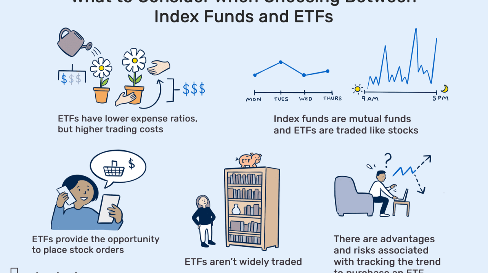

## Table of Contents

## What is an index fund?

An index fund is a type of investment that tries to match the performance of a specific market index, like the S&P 500. Instead of picking individual stocks, the fund buys all the stocks in the index. This makes it easier for people to invest in the whole market without having to choose which stocks to buy.

Index funds are popular because they usually have lower fees than other types of funds. Since they are not actively managed, there's less work and cost involved. This means more of your money stays invested and can grow over time. Many people use index funds as a simple way to build their savings for the future.

## How does an index fund work?

An index fund works by copying a specific market index, like the S&P 500. It does this by buying all the stocks that are in that index. For example, if the S&P 500 has 500 companies, the index fund will buy shares in all 500 of those companies. The goal is to have the fund's performance match the performance of the index as closely as possible. This way, if the index goes up, the fund goes up, and if the index goes down, the fund goes down too.

The fund is managed passively, which means it doesn't try to beat the market by [picking](/wiki/asset-class-picking) certain stocks. Instead, it just follows the index. This makes it easier and cheaper to run, so the fees for index funds are usually lower than other types of funds. When you invest in an index fund, you're buying a small piece of all the companies in the index. This helps spread out your risk because you're not betting on just one or a few companies. Over time, this can help your money grow steadily.

## What are the benefits of investing in index funds?

Investing in index funds has several benefits. One big benefit is that they are easy to understand and manage. You don't need to be an expert in picking stocks because the fund automatically follows the performance of a whole market index. This takes away the stress of trying to guess which stocks will do well. Also, index funds usually have lower fees than other types of funds. Since they are not actively managed, the costs are lower, and more of your money stays invested and can grow over time.

Another benefit is that index funds help spread out your risk. When you invest in an index fund, you're buying a little bit of many different companies, not just one or two. This diversification means that if one company doesn't do well, it won't hurt your whole investment as much. Over the long term, this can help your money grow more steadily. Plus, index funds give you a good way to match the overall growth of the market, which has historically gone up over time.

## What are the common indices that index funds track?

Index funds usually track well-known market indices. One of the most common ones is the S&P 500. This index includes the 500 biggest companies in the United States. When you invest in an S&P 500 index fund, you're buying a small piece of all those big companies. Another popular index is the Dow Jones Industrial Average, which tracks 30 large companies in the U.S. It's been around for a long time and is often used to see how the stock market is doing.

There are also indices that cover different parts of the world. For example, the MSCI EAFE Index tracks stocks in Europe, Australasia, and the Far East. This can be a good way to invest in companies outside of the U.S. In the U.S., the Nasdaq Composite is another common index, which includes many technology and internet companies. Each of these indices gives you a different way to invest in the market, depending on what you're interested in.

## How do index funds differ from actively managed funds?

Index funds and actively managed funds are two different ways to invest your money. An index fund tries to match the performance of a specific market index, like the S&P 500. It does this by buying all the stocks in that index. This means the fund is managed passively, which means it doesn't try to pick the best stocks or beat the market. It just follows the index. Because of this, index funds usually have lower fees since they don't need a lot of people to manage them.

On the other hand, actively managed funds are run by people who try to pick the best stocks to beat the market. These fund managers do a lot of research and make decisions about which stocks to buy and sell. They think they can do better than the overall market. Because of all this work, actively managed funds usually have higher fees. The idea is that you might get better returns, but it's not guaranteed, and the higher fees can eat into your profits.

In simple terms, index funds are easier and cheaper to invest in because they just follow the market. Actively managed funds try to do better than the market but cost more and don't always succeed. Both types of funds have their place, and it depends on what you're looking for in your investments.

## What are the costs associated with index funds?

Index funds usually have lower costs than other types of funds. The main cost you'll see with index funds is the expense ratio. This is a small percentage of your investment that the fund charges each year to cover its costs. For index funds, this is often around 0.05% to 0.20%. That means for every $1,000 you invest, you might pay between $0.50 and $2 a year. These low fees are because index funds are managed passively and don't need a lot of people to run them.

There might be other costs too, but they're not as common. Some index funds might charge a fee when you buy or sell shares, called a transaction fee or sales load. But many index funds, especially those from big companies like Vanguard or Fidelity, don't have these fees. So, when you're looking at index funds, it's a good idea to check the expense ratio and see if there are any other fees. Keeping costs low helps more of your money stay invested and grow over time.

## How can one start investing in index funds?

To start investing in index funds, you first need to open an investment account. This can be a brokerage account or a retirement account like an IRA. Many big companies like Vanguard, Fidelity, and Schwab offer these accounts and have lots of index funds to choose from. Once you have an account, you can pick an index fund that matches your goals. For example, if you want to invest in the biggest companies in the U.S., you might choose an S&P 500 index fund. After picking your fund, you can decide how much money you want to invest and then buy shares of the fund.

After you've invested, it's a good idea to keep adding money to your index fund over time. This is called dollar-cost averaging, and it helps you buy more shares when prices are low and fewer when prices are high. Many people set up automatic investments so a certain amount of money goes into their index fund each month. This way, you don't have to think about it too much, and your investment can grow steadily. Remember to check on your investment from time to time, but index funds are meant to be a long-term investment, so you don't need to worry about them every day.

## What is the role of a fund manager in an index fund?

The role of a fund manager in an index fund is different from what you might think. In an index fund, the fund manager doesn't pick stocks or try to beat the market. Instead, their job is to make sure the fund matches the performance of a specific market index, like the S&P 500. They do this by buying all the stocks in that index. This means the fund manager's main task is to keep the fund's holdings in line with the index, making sure it stays balanced and accurate.

Because index funds are managed passively, the fund manager doesn't need to do a lot of research or make many decisions about buying and selling stocks. This makes their job simpler and less costly compared to managing an actively managed fund. The fund manager might also handle things like reinvesting dividends and making sure the fund's expenses stay low. Overall, their role is to keep the index fund running smoothly and efficiently, so it can track the index as closely as possible.

## How do index funds handle dividends from the stocks they hold?

Index funds handle dividends in a simple way. When the stocks in the index pay dividends, the index fund collects those dividends. The fund can then do one of two things with the money: it can either pay the dividends out to the people who own shares in the fund, or it can use the money to buy more stocks in the index. This is called reinvesting the dividends.

Most people who invest in index funds choose to reinvest the dividends. This means the money from the dividends is used to buy more shares of the index fund. Over time, this can help your investment grow bigger because you're buying more shares without having to put in extra money. It's like your investment is working for you, making more money by itself.

## What are the tax implications of investing in index funds?

When you invest in index funds, you need to think about taxes. One thing to know is that index funds can create capital gains. This happens when the fund sells stocks for more than it paid for them. If the fund makes a profit, it has to pay taxes on those gains. These taxes are passed on to you, the investor. You'll get a form at the end of the year that tells you how much you owe in taxes on these gains. Also, if you sell your shares in the index fund for more than you paid, you'll have to pay capital gains tax on that profit too.

Another tax thing to think about is dividends. When the stocks in the index fund pay dividends, the fund collects them and either pays them out to you or reinvests them to buy more shares. Either way, you have to pay taxes on those dividends. The tax rate on dividends can be different depending on how much money you make and what kind of dividends they are. It's a good idea to talk to a tax advisor to understand how much you'll need to pay in taxes and how to plan for it.

## How do index funds rebalance their portfolios?

Index funds rebalance their portfolios to make sure they keep matching the index they are supposed to follow. When the companies in the index change, like if a new company is added or an old one is taken out, the fund has to buy or sell stocks to match these changes. Also, if the value of different stocks in the index goes up or down a lot, the fund might need to buy or sell some stocks to keep the right balance. This is called rebalancing, and it helps the fund stay true to the index.

Rebalancing usually happens on a set schedule, like once every three or six months. Sometimes, it can happen more often if there are big changes in the index. The fund manager's job is to make these changes without causing too much fuss in the market. By doing this, the index fund keeps working the way it's supposed to, giving investors a good way to follow the market without having to pick stocks themselves.

## What are the potential risks and limitations of index funds?

Index funds are a good way to invest, but they do have some risks and limits. One risk is that they follow the market, so if the market goes down, your index fund will go down too. This means you can lose money if the market has a bad time. Also, index funds don't try to beat the market, so you won't get higher returns than the market average. If you want to make more money than the market, index funds might not be the best choice for you.

Another limit is that index funds can't avoid bad companies. If a company in the index does something wrong or goes bankrupt, the index fund still has to keep that company's stock. This can hurt your investment. Also, index funds might not be as good for people who want to invest in specific things, like green energy or tech companies. They just follow the whole market, so you can't pick and choose what you want to invest in.

## References & Further Reading

[1]: Malkiel, B. G. (2015). ["A Random Walk Down Wall Street: The Time-tested Strategy for Successful Investing"](https://www.amazon.com/Random-Walk-Down-Wall-Street/dp/0393330338). W.W. Norton & Company.

[2]: Bogle, J. C. (2017). ["The Little Book of Common Sense Investing: The Only Way to Guarantee Your Fair Share of Stock Market Returns"](https://www.amazon.com/Little-Book-Common-Sense-Investing/dp/1119404509). Wiley.

[3]: Géczy, C., & Samonov, M. (2016). ["212 Years of Price Momentum: A Historical Analysis"](https://papers.ssrn.com/sol3/papers.cfm?abstract_id=2292544). Available at SSRN.

[4]: Lopez de Prado, M. (2018). ["Advances in Financial Machine Learning"](https://www.amazon.com/Advances-Financial-Machine-Learning-Marcos/dp/1119482089). Wiley.

[5]: Jansen, S. (2020). ["Machine Learning for Algorithmic Trading: Predictive Models to Extract Signals from Market and Alternative Data for Systematic Trading Strategies with Python"](https://www.amazon.com/Machine-Learning-Algorithmic-Trading-alternative/dp/1839217715). Packt Publishing.