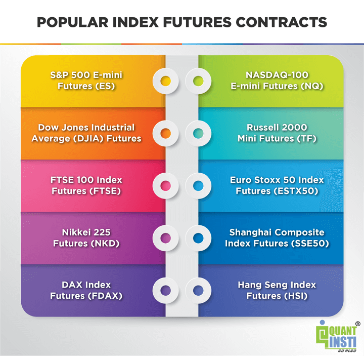

## Table of Contents

## What are index futures?

Index futures are financial contracts that allow investors to buy or sell a stock market index at a future date for a set price. They are based on the value of an underlying index, like the S&P 500 or the Dow Jones Industrial Average. This means that instead of trading individual stocks, you're trading a contract that represents the overall performance of a group of stocks.

These futures are used by investors for various reasons. Some use them to hedge against potential losses in their stock portfolios. For example, if an investor thinks the market might go down, they can sell index futures to offset potential losses in their stocks. Others use index futures to speculate on the market's direction, hoping to profit from movements in the index without having to buy all the individual stocks in the index. This makes index futures a versatile tool in the world of finance.

## How do index futures work?

Index futures work by letting people agree to buy or sell a stock market index at a certain price on a future date. When you buy an index future, you're not buying the actual stocks in the index. Instead, you're buying a contract that says you'll pay a set price for the value of the index at a later time. If the index goes up, the value of your future goes up too, and you can sell it for a profit. If the index goes down, the value of your future goes down, and you might lose money.

People use index futures in different ways. Some use them to protect their investments. For example, if someone thinks the stock market will go down, they can sell index futures. If the market does go down, the money they lose on their stocks might be made up by the profit they make on the futures. Others use index futures to guess which way the market will go. If they think the market will go up, they can buy futures and hope to sell them later for more money. This way, they can try to make money without having to buy all the stocks in the index.

## What are the main types of index futures?

The main types of index futures are based on different stock market indexes. The most popular ones are the S&P 500 futures, which are based on the S&P 500 index, and the Dow Jones Industrial Average futures, which follow the Dow Jones index. There are also futures based on other indexes like the Nasdaq 100 and the Russell 2000. Each of these futures contracts represents a different part of the stock market, so investors can choose the one that fits their strategy best.

These index futures can be used in different ways depending on what an investor wants to do. For example, someone might use S&P 500 futures to bet on the overall direction of the U.S. stock market. If they think the market will go up, they can buy these futures and hope to sell them later at a higher price. On the other hand, someone might use Russell 2000 futures to focus on smaller companies, since that index represents small-cap stocks. This way, investors have a lot of choices to match their investment goals.

## What are the benefits of trading index futures?

Trading index futures can help investors in many ways. One big benefit is that they let you bet on the whole market without having to buy all the stocks in an index. This can save a lot of money and time. For example, if you think the S&P 500 will go up, you can buy an S&P 500 future instead of buying all 500 stocks in the index. This makes it easier to take part in the market's ups and downs.

Another benefit is that index futures can be used to protect your investments. If you own a lot of stocks and you're worried the market might go down, you can sell index futures. If the market does go down, the money you lose on your stocks might be made up by the profit you make on the futures. This way, you can lower your risk and feel more secure about your investments.

## What are the risks associated with index futures?

Trading index futures can be risky because they use something called leverage. This means you only need to put down a small amount of money to control a much larger contract. While this can lead to big profits if the market goes your way, it can also lead to big losses if the market goes against you. If the market moves a lot, you might have to put in more money to keep your position open, and if you can't, you could lose your whole investment.

Another risk is that index futures are very sensitive to market changes. They can go up and down a lot in a short time, which can be hard to predict. If you're not ready for these quick changes, you could end up losing money. Also, if you're using index futures to protect your other investments, there's a chance that the futures might not move the same way as your stocks, which means your protection might not work as well as you hoped.

## How can beginners start trading index futures?

If you're a beginner and want to start trading index futures, the first step is to learn about them. Index futures are contracts that let you buy or sell a stock market index at a future date. You should understand how they work, what the different types are like the S&P 500 or Nasdaq 100 futures, and what the risks are. Reading [books](/wiki/algo-trading-books), taking online courses, or finding a mentor can help you get the knowledge you need.

Once you feel ready, you'll need to open an account with a futures broker. This is different from a regular stock broker, so make sure you pick one that offers futures trading. After you've set up your account, you can start trading. It's a good idea to start small and use practice accounts to get used to how the market moves. Remember, trading index futures can be risky because of leverage, so always be careful and only invest money you can afford to lose.

## What are some basic profit strategies for index futures?

One basic profit strategy for index futures is called going long. This means you buy a futures contract because you think the index will go up. If the index does go up before the contract expires, you can sell the contract for more than you paid for it and make a profit. For example, if you buy an S&P 500 future and the S&P 500 goes up, you can sell your future for a higher price and make money.

Another strategy is going short. This means you sell a futures contract because you think the index will go down. If the index does go down before the contract expires, you can buy back the contract at a lower price and make a profit. For example, if you sell a Dow Jones future and the Dow Jones goes down, you can buy it back cheaper and keep the difference as profit.

Both of these strategies can be risky because futures use leverage. This means you can lose more money than you put in if the market moves against you. It's important to always be careful and only trade with money you can afford to lose.

## How do leverage and margin affect index futures trading?

Leverage and margin are important parts of trading index futures. Leverage means you can control a big contract with just a small amount of money. For example, if you want to trade an S&P 500 future, you might only need to put down a small part of the contract's total value. This can make your profits bigger if the market goes your way, but it can also make your losses bigger if the market goes against you. It's like using a lever to lift something heavy; it makes the job easier, but if you're not careful, you can lose control.

Margin is the money you need to put down to open a futures position. It's like a deposit that shows you're serious about the trade. If the market moves a lot and your position loses value, you might get a margin call. This means you need to add more money to your account to keep your position open. If you can't add more money, your broker might close your position to limit their risk. So, while leverage and margin can help you make more money, they also make trading riskier because you could lose more than you put in.

## What advanced techniques can be used to maximize profits in index futures?

One advanced technique to maximize profits in index futures is called spread trading. This involves buying one futures contract and selling another at the same time. For example, you might buy a futures contract for the S&P 500 that expires in three months and sell a contract for the same index that expires in six months. The idea is to make money from the difference in price between the two contracts. This can be less risky than just buying or selling one contract because you're betting on the difference between two prices instead of the direction of the whole market.

Another technique is using technical analysis to find the best times to buy and sell. This means looking at charts and using tools like moving averages or the Relative Strength Index (RSI) to see patterns in how the index moves. If you see a pattern that usually leads to a price going up, you can buy a futures contract and hope to sell it later for more money. If you see a pattern that usually leads to a price going down, you can sell a futures contract and hope to buy it back later for less money. This can help you make better decisions and increase your chances of making a profit.

A third technique is using options on futures. Options give you the right, but not the obligation, to buy or sell a futures contract at a set price. For example, you might buy a call option on an S&P 500 future, which lets you buy the future at a certain price if you want to. If the S&P 500 goes up a lot, you can use your option to buy the future at the lower price and then sell it at the higher market price. This can help you make more money with less risk because you only lose the money you paid for the option if the market doesn't go your way.

## How do market conditions influence index futures strategies?

Market conditions can really change how you should trade index futures. When the market is going up, or what we call a bull market, you might want to buy futures because you think the index will keep going up. This is called going long. If you see that the economy is doing well and companies are making more money, it might be a good time to buy futures. But you have to be careful because even in a bull market, there can be times when the market goes down a little bit.

On the other hand, when the market is going down, or what we call a bear market, you might want to sell futures because you think the index will keep going down. This is called going short. If you see that the economy is not doing well and companies are losing money, selling futures could help you make money as the market goes down. But again, you have to be careful because the market can have times when it goes up a little bit even in a bear market.

Another thing to think about is how much the market is moving around, which we call [volatility](/wiki/volatility-trading-strategies). If the market is moving a lot, you might use strategies like spread trading or options to make money from these big moves. But if the market is not moving much, you might want to be more careful and maybe not trade as much. Knowing the market conditions can help you pick the best strategy and make smarter trades.

## What are the tax implications of trading index futures?

When you trade index futures, you need to know about the taxes you might have to pay. In the United States, profits from trading index futures are usually taxed at a special rate called the 60/40 rule. This means that 60% of your profits are taxed as long-term capital gains, and 40% are taxed as short-term capital gains. Long-term capital gains are usually taxed at a lower rate than short-term gains, which can be good for you. But, you also have to report any losses on your taxes, and you can use these losses to lower your tax bill.

It's important to keep good records of all your trades because you'll need to report them on your tax return. You'll use a form called a Schedule D to report your capital gains and losses. If you trade a lot, you might need to file a special form called a Form 6781 for Section 1256 contracts, which includes index futures. It's a good idea to talk to a tax professional to make sure you're doing everything right and taking advantage of all the tax rules that can help you.

## How can one use index futures for hedging purposes?

Index futures can be a good way to protect your investments from going down in value. If you own a lot of stocks and you're worried that the stock market might go down, you can sell index futures. This is called hedging. For example, if you have a lot of money in the S&P 500, you can sell S&P 500 futures. If the S&P 500 does go down, the money you lose on your stocks might be made up by the profit you make on the futures. This way, you can lower your risk and feel more secure about your investments.

Using index futures for hedging is like buying insurance for your portfolio. You're not hoping to make a lot of money from the futures, but you're using them to protect what you already have. If the market goes up, you might lose a little money on the futures, but your stocks will go up in value. If the market goes down, the futures can help you not lose as much money on your stocks. It's all about balancing the risk so you can sleep better at night knowing your investments are safer.

## References & Further Reading

[1]: Bergstra, J., Bardenet, R., Bengio, Y., & Kégl, B. (2011). ["Algorithms for Hyper-Parameter Optimization."](https://papers.nips.cc/paper/4443-algorithms-for-hyper-parameter-optimization) Advances in Neural Information Processing Systems 24.

[2]: ["Advances in Financial Machine Learning"](https://www.amazon.com/Advances-Financial-Machine-Learning-Marcos/dp/1119482089) by Marcos Lopez de Prado

[3]: ["Evidence-Based Technical Analysis: Applying the Scientific Method and Statistical Inference to Trading Signals"](https://www.amazon.com/Evidence-Based-Technical-Analysis-Scientific-Statistical/dp/0470008741) by David Aronson

[4]: ["Machine Learning for Algorithmic Trading"](https://github.com/stefan-jansen/machine-learning-for-trading) by Stefan Jansen

[5]: ["Quantitative Trading: How to Build Your Own Algorithmic Trading Business"](https://www.amazon.com/Quantitative-Trading-Build-Algorithmic-Business/dp/1119800064) by Ernest P. Chan