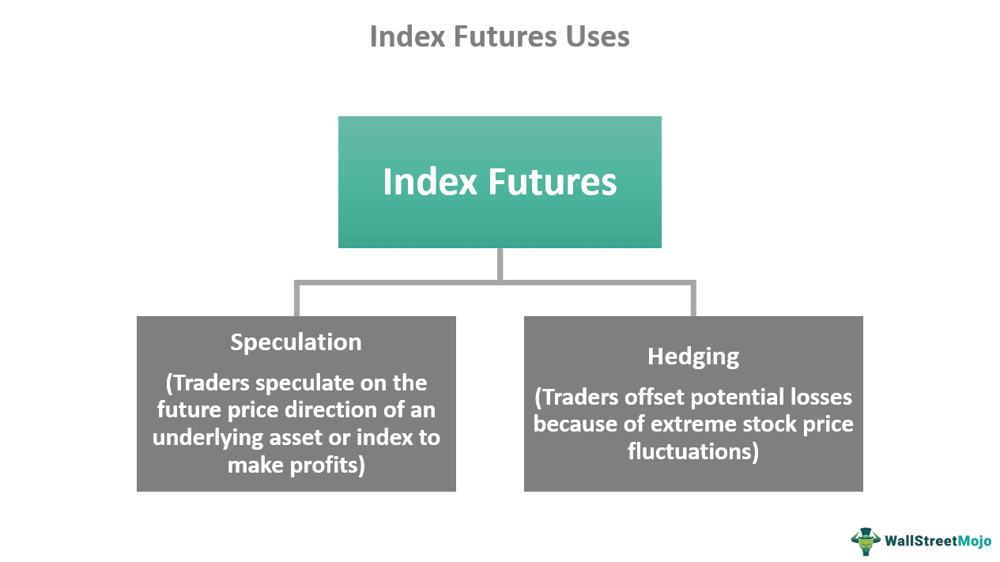

## Table of Contents

## What are index futures and how do they work?

Index futures are financial contracts that allow investors to buy or sell a specific stock market index at a future date for a set price. The most common type of index futures are based on broad market indices like the S&P 500 or the Dow Jones Industrial Average. When you trade index futures, you're not buying the actual stocks in the index, but rather a contract that tracks the performance of that index. This means you can bet on whether you think the overall market will go up or down without having to buy all the individual stocks.

Index futures work by setting a contract size and an expiration date. For example, if you buy an S&P 500 futures contract, you're agreeing to buy or sell the value of the S&P 500 index at a specific future date. The price of the futures contract will move up and down based on what people think the S&P 500 will be worth at that future date. If you think the market will go up, you can buy a futures contract, and if you think it will go down, you can sell one. At the end of the contract, you'll either make money if you guessed right or lose money if you guessed wrong. It's a way to try to make money from predicting market movements without buying the stocks themselves.

## What is the purpose of using index futures?

Index futures are used by investors to bet on the future direction of the stock market without having to buy all the individual stocks in an index. For example, if someone thinks the S&P 500 will go up in the next few months, they can buy an S&P 500 futures contract. This way, they can potentially make money if the market goes up, without having to buy hundreds of different stocks. It's like a shortcut to betting on the whole market at once.

Another purpose of index futures is to help investors manage risk. If someone owns a lot of stocks and is worried that the market might go down, they can sell index futures to protect themselves. This is called hedging. By selling a futures contract, they can offset potential losses in their stock portfolio if the market does go down. So, index futures can be used both to try to make money and to try to protect money that's already been invested.

## How can index futures be used for hedging?

Index futures can be used for hedging to protect against losses in a stock portfolio. Imagine you own a lot of stocks and you're worried that the market might go down. You can sell an index futures contract that matches the index your stocks are part of. If the market does go down, the value of your stocks will drop, but the futures contract you sold will gain value. This gain can help offset the losses in your stock portfolio, so you're protected.

Using index futures for hedging is like buying insurance for your investments. Just like you pay for car insurance to protect against accidents, you can use index futures to protect against a falling market. By selling a futures contract, you're essentially locking in a price for the index at a future date. If the market goes down, you'll lose money on your stocks, but you'll make money on the futures contract, balancing things out. This way, you can sleep better at night knowing you've got a safety net in place.

## What are the key differences between index futures and stock futures?

Index futures and stock futures are both types of futures contracts, but they work a bit differently. Index futures are based on stock market indices, like the S&P 500 or the Dow Jones. When you trade an index future, you're betting on the overall movement of the market, not on any single stock. This means you can try to make money or protect your investments based on what you think the whole market will do, without having to buy or sell individual stocks.

Stock futures, on the other hand, are based on the price of a specific company's stock. When you trade a stock future, you're betting on the future price of just one stock, like Apple or Microsoft. This can be riskier because the price of one stock can be more unpredictable than the overall market. But it can also be more rewarding if you pick the right stock. So, the main difference is that index futures let you bet on the whole market, while stock futures let you bet on one specific stock.

## How do you calculate the value of an index futures contract?

To calculate the value of an index futures contract, you need to know the contract's price and the contract's multiplier. The contract's price is what the market thinks the index will be worth at the future date, and the multiplier is a number set by the exchange that helps turn the index value into a dollar amount. For example, if you're trading an S&P 500 futures contract, the multiplier is usually $250. So, if the S&P 500 futures price is 4,000, you multiply 4,000 by $250 to get the total value of the contract, which would be $1,000,000.

The value of an index futures contract can change every day as the price of the index goes up or down. If the S&P 500 goes up to 4,050, the value of your futures contract would go up to $1,012,500. If it goes down to 3,950, the value would drop to $987,500. This means you can make or lose money based on the movements of the index, without having to buy all the stocks in the index. It's a way to bet on the market's direction with just one contract.

## What are the risks associated with trading index futures?

Trading index futures can be risky. One big risk is that the market can move in the opposite direction of what you expect. If you buy an index future thinking the market will go up, but it goes down instead, you can lose a lot of money. This is called market risk. Another risk is leverage, which means you only have to put down a small amount of money to control a big contract. While this can help you make more money if you're right, it can also make you lose more if you're wrong. It's like borrowing money to bet on the market, and if you lose, you still have to pay back what you borrowed.

Another risk is liquidity risk. Sometimes, it can be hard to buy or sell index futures quickly because there aren't enough people trading them. If you need to get out of a trade fast and can't find someone to take the other side, you might have to sell at a bad price. There's also the risk of margin calls. If the market moves against you, your broker might ask you to put more money into your account to cover potential losses. If you can't come up with the money, your broker could close your position, which might mean selling at a loss. So, trading index futures can be exciting, but it's important to understand these risks before you start.

## How does margin work in index futures trading?

When you trade index futures, you don't have to pay the full value of the contract upfront. Instead, you only need to put down a smaller amount of money called the initial margin. This is like a deposit that shows you're serious about the trade. The initial margin is set by the exchange and can change based on how risky they think the market is. For example, if you want to trade an S&P 500 futures contract worth $1,000,000, you might only need to put down $10,000 as the initial margin. This lets you control a big contract with a small amount of money, which is called leverage.

But there's a catch. If the market moves against you, the value of your futures contract can drop, and you might need to put more money into your account to keep the trade open. This is called a margin call. The exchange sets a maintenance margin, which is the minimum amount of money you need to have in your account. If your account balance falls below this level, your broker will ask you to add more money to bring it back up to the initial margin. If you can't do that, your broker might close your position to limit their risk, which could mean selling at a loss. So, while margin lets you trade with less money upfront, it also means you need to be ready to add more money if the market goes the wrong way.

## What strategies can be employed using index futures?

One common strategy for using index futures is called speculation. This means you're trying to make money by guessing which way the market will go. If you think the market will go up, you can buy an index future. If it does go up, you can sell the future later at a higher price and make a profit. If you think the market will go down, you can sell an index future. If the market does go down, you can buy it back later at a lower price and make money that way. It's like betting on the market, but you can do it without buying all the stocks in the index.

Another strategy is hedging. This is when you use index futures to protect your investments from losing too much money if the market goes down. If you own a lot of stocks and you're worried about a market drop, you can sell an index future. If the market does go down, the value of your stocks will drop, but the futures contract you sold will gain value. This gain can help offset the losses in your stock portfolio, so you're not hit as hard. It's like buying insurance for your investments, and it can help you sleep better at night knowing you've got a safety net in place.

## How do index futures impact the broader market?

Index futures can have a big impact on the broader market. When people buy or sell index futures, they're betting on where they think the market will go in the future. If a lot of people start buying index futures, it can make other investors think the market will go up. This can make them want to buy more stocks, pushing the market higher. On the other hand, if a lot of people start selling index futures, it can make other investors think the market will go down. This can make them want to sell their stocks, pushing the market lower. So, the actions of people trading index futures can influence what other investors do, and this can move the whole market.

Another way index futures impact the broader market is through something called arbitrage. This is when traders try to make money from small differences in price between the futures market and the stock market. If the futures price is higher than the stock market index, traders might buy the stocks in the index and sell the futures. This can push up the stock market. If the futures price is lower than the stock market index, traders might sell the stocks in the index and buy the futures. This can push down the stock market. So, arbitrage can help keep the futures market and the stock market in line, but it can also add to the ups and downs of the market.

## What are the tax implications of trading index futures?

When you trade index futures, you need to think about taxes. In the United States, the money you make from trading index futures is usually taxed at a special rate called the 60/40 rule. This means 60% of your profits are taxed as long-term capital gains, which is usually a lower rate, and 40% are taxed as short-term capital gains, which is usually a higher rate. This can be good for you because you end up paying less in taxes than if all your profits were taxed as regular income.

But there are other things to think about too. You can't use losses from index futures to reduce your regular income right away. Instead, you have to use them to offset gains from other futures or options trades. If you have more losses than gains, you can carry those losses forward to future years. Also, you need to keep good records of all your trades because you'll need to report them on your tax return. It's a good idea to talk to a tax professional to make sure you're doing everything right and taking advantage of all the tax breaks you can.

## How do global events influence index futures prices?

Global events can have a big impact on index futures prices. When something important happens around the world, like a war, a big election, or a natural disaster, it can make investors worried or hopeful about the future. If investors think the event will be bad for the economy, they might start selling index futures, which makes the prices go down. If they think the event will be good for the economy, they might start buying index futures, which makes the prices go up. For example, if there's a war in a country that produces a lot of oil, investors might worry about higher oil prices and a weaker economy, so they sell index futures and the prices drop.

These reactions to global events can happen really fast because the futures market is open almost all the time and traders can react to news as soon as it happens. Sometimes, the initial reaction to an event can be strong, but then the prices might change as more information comes out and people understand the event better. For example, if there's a big election and the winner is expected to help the economy, index futures prices might go up right away. But if the new leader's policies turn out to be different than expected, the prices might go back down. So, global events can make index futures prices move a lot, and it's important for traders to keep an eye on what's happening around the world.

## What advanced analytical tools are used to predict index futures movements?

To predict how index futures will move, traders use a lot of advanced analytical tools. One popular tool is technical analysis, which looks at past price movements and patterns to guess what might happen next. Traders use charts and indicators like moving averages, the Relative Strength Index (RSI), and the Moving Average Convergence Divergence (MACD) to find trends and possible turning points in the market. These tools help traders see if the market is going up, down, or sideways, and they can use this information to make better trading decisions.

Another important tool is [fundamental analysis](/wiki/fundamental-analysis), which looks at the overall health of the economy and how it might affect the market. Traders look at things like interest rates, employment numbers, and company earnings to see if the economy is strong or weak. They also pay attention to news and global events that could change how investors feel about the market. By combining technical and fundamental analysis, traders can get a better idea of where index futures might be headed and make more informed trades.

## What is the understanding of Financial Markets and Index Futures?

Financial markets are structured venues where a variety of financial instruments, including securities, commodities, derivatives, and other financial assets, are traded. These markets facilitate price discovery, provide [liquidity](/wiki/liquidity-risk-premium), and enable efficient capital allocation within an economy. Among the various instruments traded in financial markets, index futures serve as pivotal tools for both hedging and speculation.

Index futures are a type of derivative contract that obliges the holder to buy or sell the value of a specific stock index at a predetermined future date. Unlike futures for physical commodities, index futures do not involve the delivery of physical goods. Instead, they settle in cash based on the index's adjusted closing price on the expiration date. This makes them an attractive option for traders who wish to speculate on or hedge against movements in the broader market, without dealing with the complexities of physical delivery.

The fundamental appeal of index futures lies in their capacity to mirror the market's expectations for the future performance of an underlying index. Traders commonly use these contracts to hedge existing positions, thereby reducing portfolio risk linked to adverse price movements. Alternatively, index futures can be employed for speculative purposes, where traders seek to profit from predictions about future market directions.

Understanding index futures requires a grasp of their pricing dynamics, which are influenced by the cost-of-[carry](/wiki/carry-trading) model. This model acknowledges factors such as the [interest rate](/wiki/interest-rate-trading-strategies) and dividends of the underlying assets. The theoretical price of an index future ($F$) can be calculated using this formula:

$$
F = S \times e^{(r-d) \times T}
$$

where:
- $S$ is the current spot price of the underlying index.
- $r$ is the risk-free interest rate.
- $d$ is the dividend yield.
- $T$ is the time to maturity in years.

This formula highlights how interest rates and dividends affect futures pricing, ensuring that traders who wish to effectively leverage index futures understand these dynamics. By comprehending the relationships within the cost-of-carry model, traders can make informed decisions, utilizing index futures to their strategic advantage in pursuit of hedging or gaining from anticipated price movements.

 to Algorithmic Trading

Algorithmic trading, commonly referred to as algo trading, is a method of executing orders that relies on pre-programmed instructions to make trading decisions. These algorithms can range from simple rule-based systems, such as moving average crossovers, to complex models leveraging advanced data analytics and [machine learning](/wiki/machine-learning) strategies. This type of trading enhances efficiency by assessing market conditions and executing trades at speeds unattainable by human traders, all while minimizing human errors influenced by emotional and psychological biases.

Algo trading operates on defined criteria including timing, price, quantity, or complex mathematical models of market behavior. It aims to capitalize on trading opportunities with precision and speed, aspects crucial for seizing short-lived [arbitrage](/wiki/arbitrage) possibilities and optimizing the timing for trade execution. One basic example involves moving averages, where the algorithm buys or sells based on the crossover of different period moving averages, indicating potential upward or downward trends.

The Python code snippet below provides a simple demonstration of a moving average crossover strategy:

```python
import numpy as np
import pandas as pd

# Sample data, in practice fetched dynamically from market data
data = pd.DataFrame({'Price': [101, 102, 104, 103, 105, 106, 108, 107, 109, 111]})

# Calculate moving averages
data['Short_MA'] = data['Price'].rolling(window=2).mean()
data['Long_MA'] = data['Price'].rolling(window=4).mean()

# Generate buy/sell signals based on crossover
data['Signal'] = np.where(data['Short_MA'] > data['Long_MA'], 1, 0)  # Buy signal
data['Position'] = data['Signal'].diff()  # Detect change in signals

print(data)
```

In financial markets, [algorithmic trading](/wiki/algorithmic-trading) is utilized by both institutional and individual traders. Institutions, such as hedge funds and investment banks, are able to manage large volumes and achieve better execution prices through reduced market impact. Individual traders can leverage the automation and scalability of algorithms to enhance their investment strategies and manage portfolios more efficiently.

Algo trading is pivotal for modern trading, given its capability to process vast datasets and react to dynamic market conditions in real-time. As the algorithm analyzes market data, it optimizes trade executions for cost efficiency and leverages statistical models to forecast price movements, offering a significant competitive edge to traders and investors alike.

## What is the synergy between index futures and algo trading?

The integration of algorithmic trading in index futures offers numerous advantages, significantly enhancing trading operations. Algorithms are adept at swiftly analyzing vast quantities of market data and executing trades in milliseconds, far surpassing human capabilities. This speed is crucial in the highly dynamic futures market, where prices can change rapidly. 

By incorporating algorithms, traders can capitalize on arbitrage opportunities. Arbitrage involves taking advantage of price discrepancies between related financial instruments, such as an index future and its underlying index. Algorithms can detect these discrepancies nearly instantaneously and execute trades to exploit them for profit. The formula for arbitrage profit $P$ can be expressed as:

$$
P = \sum_{i=1}^{n} (S_i - F_i - T_i)
$$

where $S_i$ is the spot price, $F_i$ is the future price, and $T_i$ represents transaction costs associated with the trade.

Moreover, algorithms provide traders with the capability to construct and deploy advanced models predicting future price movements. These models can incorporate a wide range of variables, from historical price data to real-time market indicators, enhancing decision-making. For instance, algorithms can implement complex strategies like regression models or machine learning techniques to forecast price trends. In Python, implementing a simple linear regression model to predict price movements could look like this:

```python
import numpy as np
from sklearn.linear_model import LinearRegression

# Historical data
X = np.array([[1], [2], [3], [4], [5]])  # Time or other independent variable
y = np.array([10, 12, 15, 18, 19])       # Dependent variable: index price

# Create and train the model
model = LinearRegression().fit(X, y)

# Make predictions
future_time = np.array([[6]])
predicted_price = model.predict(future_time)
print(f"Predicted future price: {predicted_price[0]}")
```

This synergy between index futures and algorithmic trading is instrumental for traders and institutions aiming to optimize their strategies. By leveraging the power of algorithms, they can both react to immediate market changes and anticipate future trends effectively, thereby gaining a competitive edge.

## References & Further Reading

[1]: Bergstra, J., Bardenet, R., Bengio, Y., & Kégl, B. (2011). ["Algorithms for Hyper-Parameter Optimization."](https://dl.acm.org/doi/10.5555/2986459.2986743) Advances in Neural Information Processing Systems 24.

[2]: ["Advances in Financial Machine Learning"](https://www.amazon.com/Advances-Financial-Machine-Learning-Marcos/dp/1119482089) by Marcos Lopez de Prado

[3]: ["Evidence-Based Technical Analysis: Applying the Scientific Method and Statistical Inference to Trading Signals"](https://www.amazon.com/Evidence-Based-Technical-Analysis-Scientific-Statistical/dp/0470008741) by David Aronson

[4]: ["Machine Learning for Algorithmic Trading"](https://github.com/stefan-jansen/machine-learning-for-trading) by Stefan Jansen

[5]: ["Quantitative Trading: How to Build Your Own Algorithmic Trading Business"](https://www.amazon.com/Quantitative-Trading-Build-Algorithmic-Business/dp/1119800064) by Ernest P. Chan