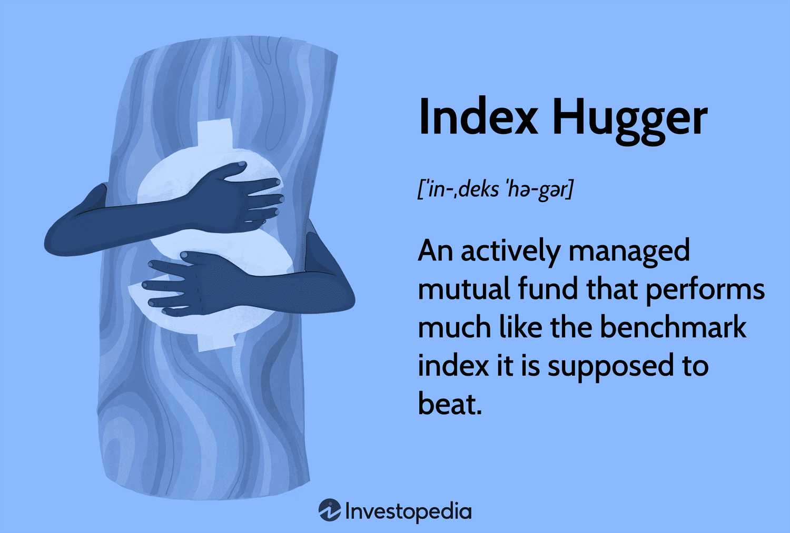

The importance of SEO in today’s digital landscape cannot be overstated. With businesses vying for online visibility, SEO practices become essential for enhancing site reach. As a multifaceted discipline, SEO (Search Engine Optimization) involves various strategies and techniques designed to improve a website's visibility on search engines such as Google and Bing. SEO is not just about ranking high in search results; it is about creating an efficient, user-friendly experience that appeals to search engine algorithms and users alike.

Effective SEO implementation focuses on integrating a blend of on-page optimizations, technical considerations, and off-page credibility-building practices. In this article, we will explore how SEO practices are applied effectively, analyze the function and significance of index huggers within the trading sector, and understand the relationship between algorithmic trading and optimized data feeds. Each topic will highlight the critical role SEO plays in enhancing online presence and how it can provide a competitive edge in a crowded digital marketplace.



With this comprehensive guide, you will gain insights into necessary SEO practices that can be employed to strengthen your digital presence and outperform competitors across various sectors. The insights and methodologies shared in this article will serve as a foundation upon which effective SEO strategies can be built, ensuring your business maintains a prominent position within the digital landscape.

## Table of Contents

## Understanding SEO Fundamentals

SEO encompasses a comprehensive array of on-page, off-page, and technical strategies aimed at enhancing a website's ranking across search engine results pages (SERPs). Understanding these core components is essential for crafting effective SEO strategies.

On-page SEO involves the optimization of various elements within a website. This includes the strategic integration of keywords, which are terms or phrases your target audience frequently searches for. The appropriate usage of title tags, meta descriptions, and headers (H1, H2, H3, etc.) is pivotal. These elements not only serve to inform search engine crawlers of the site's content but also entice users by providing concise, compelling summaries in search results. Moreover, optimizing content for readability and engagement, including multimedia elements such as images and videos, enhances both user experience and SEO effectiveness.

On the other hand, off-page SEO concentrates on building a site’s credibility and authority through external links. The primary focus here is on acquiring high-quality backlinks from reputable websites. These backlinks act as endorsements, signaling the site's relevance and authority to search engines. Off-page SEO also includes promoting content across social media platforms and engaging in community discussions that can drive traffic and enhance link profiles.

Technical SEO is imperative to ensure that a website is efficiently crawled and indexed by search engines. This involves optimizing site architecture, implementing structured data, enhancing mobile friendliness, and reducing page load times. A technically sound site allows search engines to better understand its content, which can lead to improved rankings. Regular technical audits help identify and rectify issues such as broken links, indexation errors, or duplicate content, all of which can adversely affect a site’s SEO performance.

In summary, successful SEO strategies require a balanced approach, integrating on-page, off-page, and technical activities. Keyword research forms the foundation, guiding content creation and optimization. Building a robust backlink profile enhances a site's credibility, while technical SEO ensures that search engines can efficiently crawl and index the website, ultimately boosting its organic visibility.

## Effective SEO Practices

Effective SEO practices are fundamental for enhancing a website's visibility and attracting the right audience. One of the key practices is thorough keyword research. Understanding the terms your target audience frequently searches for allows you to integrate these keywords naturally into your content, thereby increasing the likelihood of your site appearing in search results. Tools like Google Keyword Planner or SEMrush can assist in identifying high-[volume](/wiki/volume-trading-strategy), relevant keywords that align with your content strategy.

The correct use of title tags and meta descriptions is crucial. Title tags should succinctly describe the content of a page and include primary keywords where possible. Meta descriptions, while not directly influencing search rankings, play a significant role in enticing clicks from search results by summarizing the content effectively and including a call to action. Both title tags and meta descriptions contribute to the user's decision-making process when browsing search results.

The use of headings such as H1, H2, and H3 tags is another effective practice when structuring content. Headings not only break up text for readability but also help search engines understand the hierarchy and importance of content sections. The H1 tag should contain the main topic of the page and include relevant keywords. Subsequent headings (H2, H3, etc.) should organize content into logical sub-sections, facilitating easier navigation for both users and search engine crawlers.

Regular technical audits are essential for maintaining and improving SEO performance. These audits involve checking for issues that could hinder site performance, such as broken links, improper redirects, or slow page load times. Tools like Google Search Console or Screaming Frog SEO Spider can help identify such issues. Addressing these problems not only enhances user experience but also ensures that search engines can efficiently crawl and index the website, contributing to better search rankings.

Implementing these SEO practices consistently can significantly impact a website's performance, driving more organic traffic and achieving higher visibility in search engine results.

## Index Huggers in the Trading Sector

Index huggers refer to a type of managed fund that closely tracks the performance of a market index while charging higher fees than typical index funds. These funds are a part of active management strategies where fund managers oversee portfolios designed to follow a specified index, such as the S&P 500 or the NASDAQ Composite, while attempting to capture excess returns by making minor adjustments.

The primary operational strategy of index huggers involves maintaining a portfolio composition that mirrors the index it aims to track. This approach allows them to provide returns that are nearly identical to those of the index. However, the allure of index huggers is often their potential for outperformance over traditional passive index funds. This potential stems from the active managers making slight trades based on economic indicators, or corporate developments, in an attempt to edge past the benchmark index slightly.

For investors, understanding index huggers is important for crafting a nuanced investment strategy. Unlike passive index funds that solely aim to replicate market performance with minimal tracking error, index huggers take an active stance. This can appeal to investors looking for a balance between the predictability of an index fund and the potential for enhanced gains. However, the higher fees associated with index huggers necessitate careful consideration since these can erode the excess returns they seek to provide.

The efficacy of index huggers often depends on the skills of the fund manager and their capacity to precisely predict smaller market shifts and leverage those predictions effectively. Investors should assess whether the potential for additional returns justifies the increased management fees, often comparing historical performance with that of simple index funds.

In summary, index huggers offer a middle ground between passive investing and active management, attempting to provide returns mirroring index performance with the prospect of additional gains. Their higher fees, however, remain a crucial point of evaluation. Understanding the positioning and strategy behind these funds is essential for any investor considering a nuanced approach to index-based investment.

## Algorithmic Trading and SEO's Role

Algorithmic trading represents a significant advancement in financial markets, allowing traders to automate decisions and execute orders at speeds unattainable by manual trading. It leverages complex algorithms and vast data sets to evaluate potential trading opportunities based on defined criteria, reducing human error and increasing efficiency. The strategy predominantly relies on data feeds that are optimized for timely and relevant information, ensuring decisions are made rapidly in response to market changes.

A critical aspect of enhancing the prominence and effectiveness of [algorithmic trading](/wiki/algorithmic-trading) platforms is Search Engine Optimization (SEO). SEO strategies are vital in enhancing online visibility, attracting potential investors, and creating profitable trading opportunities. By employing SEO, algorithmic trading platforms can improve their rankings in search engine results, making them more accessible to users searching for trading tools and resources. This increased visibility can lead to a larger user base, thus providing the platform with more data, which is essential for optimizing algorithms.

There are several SEO strategies that can be employed to maximize the visibility and performance of algorithmic trading platforms. Firstly, optimized content strategies involve creating and disseminating content that is both informative and aligned with popular search queries related to trading and finance. This might include educational articles, tutorials on algorithmic trading, and updates on financial markets. Keywords relevant to algorithmic trading need to be integrated seamlessly into content to ensure search engines can identify and prioritize these platforms in search results.

Moreover, technical SEO—which ensures that the site is easily navigable and accessible for search engine crawlers—is imperative. This includes optimizing page load speeds, securing the site with HTTPS, and ensuring mobile compatibility, all of which contribute to a higher search ranking. Effective backlinking strategies also play a critical role. Establishing quality backlinks from reputable financial websites or academic publications can augment a platform’s credibility, elevating its position in search rankings.

Utilizing Python to aid in SEO for algorithmic trading platforms can also be a powerful strategy. For example, developers might write scripts to automate data collection and analysis, optimizing web content based on user behavior or current market trends. Here is a simplified example of how Python could be used to parse search analytics and suggest keywords for SEO:

```python
import pandas as pd
from wordcloud import WordCloud
import matplotlib.pyplot as plt

# Load search data analytics
data = pd.read_csv('search_data.csv')

# Extract relevant keywords
keywords = data['keywords'].value_counts().head(50)

# Generate a word cloud for visualization
wordcloud = WordCloud(width=800, height=400, max_font_size=100).generate_from_frequencies(keywords)
plt.figure(figsize=(10, 5))
plt.imshow(wordcloud, interpolation='bilinear')
plt.axis('off')
plt.show()
```

In this code block, a CSV of search data is loaded to identify frequently used keywords, which can then be targeted to improve SEO efforts. Visualization through a word cloud helps in understanding keyword relevance quickly and effectively. Thus, the synergy between algorithmic trading and SEO can be leveraged to enhance digital presence, ensuring platforms remain competitive and attract meaningful interactions in a crowded market landscape.

## Integrating SEO with Algo Trading Strategies

A combined approach that integrates SEO with algorithmic trading strategies can significantly enhance both web visibility and the precision of trading decisions. This dual strategy leverages the strengths of both disciplines to attract more targeted traffic and ensure that trading platforms perform optimally.

SEO plays a crucial role in branding and establishing the credibility of algorithmic trading platforms. By carefully crafting content and optimizing it for search engines, traders can position their platforms as reliable and authoritative sources. This credibility is essential for gaining the trust of potential users or investors who may be wary of lesser-known or unverified platforms. Techniques such as creating engaging content that aligns with trading insights and frequently updating the site with relevant news can enhance search engine rankings and build a strong online presence.

SEO insights also contribute significantly to strategic decision-making by helping algorithmic traders understand the content preferences and search behaviors of their target audiences. With tools that analyze search trends and keywords, platforms can identify which topics are gaining traction among users, thus informing the development of content that resonates with the intended audience. For example, if a particular trading strategy such as "[momentum](/wiki/momentum) trading" is gaining search popularity, creating detailed guides or whitepapers about it can attract users seeking information, thereby increasing traffic.

Additionally, data from SEO analytics can be integrated into algorithmic trading models to provide insights into market sentiment. For instance, a high volume of searches related to market [volatility](/wiki/volatility-trading-strategies) could indicate shifting market conditions that traders might [factor](/wiki/factor-investing) into their algorithmic models for predictive analysis. Python scripts can be scripted to automatically gather search data from platforms such as Google Trends and use this data to tweak trading algorithms. Here's an example of a simple Python code snippet that fetches such data:

```python
from pytrends.request import TrendReq

def fetch_trend_data(keyword):
    pytrends = TrendReq(hl='en-US', tz=360)
    pytrends.build_payload([keyword], timeframe='now 1-d')
    data = pytrends.interest_over_time()
    return data

trend_data = fetch_trend_data('market volatility')
print(trend_data)
```

Overall, integrating SEO with algorithmic trading strategies provides valuable insights that can improve user engagement and enhance the refinement of trading algorithms. By continuously adapting to SEO analytics, trading platforms can not only attract the right audience but also ensure their algorithms are informed by current market trends, improving trading efficiency and potential profitability.

## Best Practices for SEO in 2025

As the digital landscape evolves, staying updated on algorithm changes from major search engines is crucial for maintaining visibility and relevance. Search engines like Google continuously refine their algorithms to deliver more relevant and high-quality search results. Being aware of these changes allows businesses to adapt their SEO strategies accordingly. For instance, Google's Core Web Vitals initiative focuses on user experience by emphasizing loading performance, interactivity, and visual stability. Websites that optimize for these aspects are more likely to achieve higher rankings and better user engagement.

Building a strong backlink profile remains a fundamental aspect of SEO, contributing significantly to a site's domain authority and perceived credibility. Backlinks act as endorsements from other websites, signaling to search engines that the content is trustworthy and valuable. Effective strategies for building backlinks include creating high-quality, shareable content, guest blogging on reputable sites, and utilizing social media to amplify reach. It's important to ensure that the backlinks come from diverse and authoritative sources to avoid any perception of manipulation.

Local SEO strategies are essential for businesses targeting specific geographical areas. By optimizing for local search, businesses can engage directly with their local audience and increase foot traffic or local online interactions. Key local SEO tactics include optimizing Google My Business listings, encouraging customer reviews, and ensuring that NAP (Name, Address, Phone number) information is consistent across all online platforms. Incorporating localized keywords in website content and metadata, as well as leveraging local backlinks, enhances a site's local search visibility.

These best practices exemplify the adaptive nature of SEO, highlighting the importance of vigilance and proactive measures to maintain and enhance online visibility.

## Conclusion

SEO is an evolving field that requires constant monitoring and adaptability to stay ahead. The dynamic nature of search algorithms and user behavior demands that marketers continually update their strategies. New technologies and methodologies emerge frequently, reshaping the landscape and presenting new opportunities for optimization. For instance, advancements in [artificial intelligence](/wiki/ai-artificial-intelligence) and [machine learning](/wiki/machine-learning) are beginning to play crucial roles in tailoring SEO strategies suitable for the modern digital arena.

Successful SEO practices significantly enhance a site's visibility and reputation, positioning it favorably in search engine results, and fostering greater online interaction. A well-executed SEO strategy optimizes how search engines perceive and rank a site, increasing organic traffic and engagement. This, in turn, leads to higher conversion rates and an improved return on investment. As competition for online visibility intensifies, businesses that leverage SEO effectively are better positioned to outperform competitors and secure a larger online market share.

Staying informed on new trends and technologies empowers marketers to implement effective SEO strategies. By keeping abreast of the latest updates in search algorithms, content creation, and user experience design, marketers can craft strategies that align with current best practices and anticipate future changes in the digital landscape. This proactive approach ensures that businesses remain competitive, adapting swiftly to algorithm changes and evolving user expectations.

In conclusion, the continuous adaptation and strategic implementation of SEO practices are indispensable for achieving and maintaining digital success. As the field progresses, the ability to leverage new tools and insights will become increasingly critical for businesses aiming to maximize their online presence and influence.

## References & Further Reading

[1]: ["Search Engine Optimization (SEO) Starter Guide"](https://developers.google.com/search/docs/fundamentals/seo-starter-guide) by Google 

[2]: ["The Art of SEO: Mastering Search Engine Optimization"](https://www.amazon.com/Art-SEO-Mastering-Search-Optimization/dp/1491948965) by Eric Enge, Stephan Spencer, & Jessie Stricchiola

[3]: ["SEO: Search Engine Optimization Bible"](https://books.google.com/books/about/SEO_Search_Engine_Optimization_Bible.html?id=sgmxo1Alq_4C) by Jerri L. Ledford

[4]: Hendershott, T., Jones, C. M., & Menkveld, A. J. (2011). ["Does Algorithmic Trading Improve Liquidity?"](https://onlinelibrary.wiley.com/doi/full/10.1111/j.1540-6261.2010.01624.x) Journal of Finance, 66(1), 1-33.

[5]: ["Algorithmic Trading and DMA: An Introduction to Direct Access Trading Strategies"](https://www.amazon.com/Algorithmic-Trading-DMA-introduction-strategies/dp/0956399207) by Barry Johnson

[6]: ["Technical SEO for Beginners: A Complete Guide"](https://backlinko.com/technical-seo-guide) by Moz