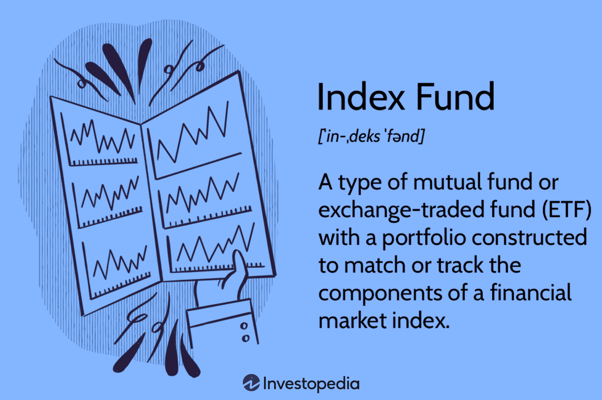

## Table of Contents

## What is index investing?

Index investing is a way of investing where you buy a bunch of stocks or bonds that make up a specific market index, like the S&P 500. Instead of picking individual stocks, you're investing in the whole market or a big part of it. This is usually done through something called an index fund or an ETF (exchange-traded fund). These funds try to match the performance of the index they're based on, so if the index goes up, your investment goes up too.

The main idea behind index investing is that it's simpler and often cheaper than trying to pick individual stocks. Since you're buying the whole market, you don't have to worry about one company doing badly. Over time, the market usually grows, so your investment can grow too. Plus, index funds often have lower fees than actively managed funds, which means you get to keep more of your money. This makes index investing a popular choice for people who want to grow their savings without a lot of fuss.

## How does index investing differ from active investing?

Index investing and active investing are two different ways to put your money into the stock market. Index investing means you buy a fund that tries to match the performance of a big group of stocks, like the S&P 500. You're not trying to pick winners; you're just riding along with the whole market. This is usually cheaper because you're not paying someone to pick stocks for you, and it's simpler because you don't have to keep an eye on which stocks are doing well or badly.

Active investing, on the other hand, is when you or a fund manager try to beat the market by [picking](/wiki/asset-class-picking) specific stocks or making trades. The goal is to do better than the average return of the market. This can be exciting because you're trying to find the best stocks, but it's also riskier and usually more expensive. You have to pay for the fund manager's time and expertise, and there's no guarantee that they'll pick the right stocks. Active investing takes more work and can be more stressful, but some people like the challenge and the potential for higher rewards.

## What are the benefits of index investing for beginners?

Index investing is great for beginners because it's really easy to get started. You don't need to know a lot about the stock market or spend time picking which stocks to buy. All you do is buy a fund that follows a big group of stocks, like the S&P 500. This way, you're investing in the whole market, not just one company. It's like buying a little bit of everything, which makes it less risky than trying to pick the best stocks on your own.

Another big benefit is that index funds usually have lower fees than other types of funds. When you invest in an actively managed fund, you pay someone to pick stocks for you, and that costs money. But with an index fund, the fees are lower because the fund just follows the market. Over time, those lower fees can add up to a lot more money in your pocket. Plus, since you're investing in the whole market, your investment can grow steadily as the market grows, which is a good way to build your savings over the long run.

## What are some common indices used for index investing?

Some of the most common indices used for index investing are the S&P 500, the Dow Jones Industrial Average, and the Nasdaq Composite. The S&P 500 is a big one because it includes 500 of the biggest companies in the U.S. It's a good way to invest in the overall health of the American economy. The Dow Jones Industrial Average, or just the Dow, is made up of 30 big companies, and it's been around for a long time, so a lot of people pay attention to it. The Nasdaq Composite includes a lot of tech companies, so it's a good choice if you want to focus on that part of the market.

Another popular index is the Russell 2000, which focuses on smaller companies. This can be a good way to diversify your investments because smaller companies can sometimes grow faster than big ones. For people interested in the global market, there's the MSCI World Index, which includes companies from all over the world. Each of these indices offers a different way to invest, so you can pick the one that fits your goals and how much risk you're okay with taking.

## How can someone start investing in an index fund?

To start investing in an index fund, the first thing you need to do is open a brokerage account. This is like a bank account, but for buying and selling investments. You can do this online with many different companies, like Vanguard, Fidelity, or Charles Schwab. Once your account is set up, you'll need to put some money into it. This is called funding your account. After that, you can look for an index fund that follows the index you're interested in, like the S&P 500. You can usually find these funds by searching on the brokerage's website.

Once you've picked your index fund, you can buy shares of it. This is as simple as clicking a button and entering how much you want to invest. Many people start with a small amount of money, and you can always add more later. After you've bought your shares, you don't need to do much else. The fund will automatically follow the index, so your investment will go up and down with the market. It's a good idea to keep adding money to your investment over time, a process called dollar-cost averaging, which can help you grow your savings without trying to time the market.

## What are the costs associated with index investing?

When you invest in index funds, there are a few costs you should know about. The main cost is the expense ratio, which is a small percentage of your investment that the fund charges every year to cover its operating costs. This fee is usually much lower for index funds than for actively managed funds. For example, you might see expense ratios around 0.03% to 0.20% for an S&P 500 index fund. Over time, these low fees can make a big difference in how much money you keep.

Another cost to think about is the trading fee, which some brokerages charge when you buy or sell shares of the fund. However, many brokerages now offer no-fee trading for index funds and ETFs, so it's a good idea to look for one of these if you can. There might also be small costs for things like account maintenance or paper statements, but these are usually pretty low or can be avoided by managing your account online. Overall, the costs of index investing are usually lower than other types of investing, which is one reason it's popular with people who want to keep more of their money working for them.

## How do index funds track their underlying indices?

Index funds track their underlying indices by trying to own the same stocks or bonds in the same proportions as the index. For example, if the S&P 500 index has a lot of Apple stock, the index fund will also have a lot of Apple stock. The fund manager's job is to keep the fund's holdings as close as possible to the index. This is called "replicating" the index. Sometimes, if the index is too big or has too many small stocks, the fund might use a method called "sampling," where it picks a smaller group of stocks that are similar to the whole index.

This process of tracking the index happens automatically. The fund manager doesn't try to pick winners or losers; they just follow the index. If the index changes, like when a company is added or removed, the fund will buy or sell stocks to match these changes. This way, the value of the index fund goes up and down with the index it's tracking. Over time, this means the returns of the index fund should be very close to the returns of the index, minus the small fees the fund charges.

## What are the risks involved in index investing?

Index investing is generally considered safer than picking individual stocks, but it still has some risks. One big risk is that the whole market can go down. If you're invested in an index like the S&P 500 and the market drops, your investment will drop too. This can happen because of big events like a recession or a financial crisis. Another risk is that you might not be as diversified as you think. If you only invest in one index, like the S&P 500, you're mostly investing in big U.S. companies. If something bad happens to those companies or the U.S. economy, your investment could suffer.

Another thing to think about is inflation risk. Over time, if the returns from your index fund don't keep up with inflation, the buying power of your money could go down. This means your money won't be worth as much in the future. There's also the risk that comes from the fees you pay. Even though index funds usually have low fees, those fees can add up over time and eat into your returns. It's important to pick funds with low expense ratios to keep more of your money. Overall, while index investing is a good way to grow your savings, it's still important to understand these risks and plan for them.

## Can index investing be part of a diversified investment strategy?

Yes, index investing can be part of a diversified investment strategy. Diversification means spreading your money across different types of investments to lower your risk. When you invest in an index fund, you're buying a little bit of a lot of different companies. For example, an S&P 500 index fund gives you a piece of 500 big U.S. companies. This spreads out your risk because if one company does badly, it won't hurt your whole investment too much. But to be really diversified, you might want to add other types of index funds too, like ones that focus on smaller companies, international companies, or bonds.

Adding different index funds to your portfolio can help you cover more parts of the market. For example, you could invest in a fund that follows the Russell 2000 for smaller U.S. companies, and another that tracks the MSCI World Index for companies all over the world. You could also add a bond index fund to balance out the risk from stocks. By mixing these different types of index funds, you can build a diversified portfolio that's less likely to be hit hard by any one bad event. This way, you can still enjoy the benefits of index investing while spreading your risk across different areas of the market.

## How do tax considerations affect index investing?

When you invest in index funds, you need to think about taxes. One big thing to know is that index funds can be more tax-efficient than other types of investments. This is because they don't trade stocks as much as actively managed funds. When funds buy and sell stocks, they can create capital gains, which you have to pay taxes on. But index funds usually hold onto their stocks for a long time, so they don't create as many taxable events. This means you might pay less in taxes each year.

Another tax thing to consider is where you put your index funds. If you put them in a tax-advantaged account like an IRA or a 401(k), you won't have to pay taxes on the gains until you take the money out. This can help your investment grow faster because you're not losing money to taxes every year. But if you have index funds in a regular brokerage account, you'll have to pay taxes on any dividends and capital gains. So, thinking about where to put your index funds can make a big difference in how much you end up paying in taxes.

## What are some advanced strategies for optimizing returns in index investing?

One advanced strategy for optimizing returns in index investing is called tax-loss harvesting. This means you sell some of your investments that have gone down in value to get a tax break. You can use that tax break to lower the taxes you pay on other investments that have gone up. Then, you can buy similar but not identical investments right away, so you stay invested in the market. This can help you keep more of your money and let it grow over time.

Another strategy is to use asset location wisely. This means putting different types of index funds in different types of accounts to save on taxes. For example, you can put bond index funds, which often pay a lot of interest, in a tax-advantaged account like an IRA. This way, you don't have to pay taxes on that interest every year. On the other hand, you can put stock index funds, which might have lower dividends, in a regular brokerage account. This can help you lower your overall tax bill and keep more of your investment returns.

## How has the performance of index investing compared to active management over the long term?

Over the long term, index investing has often done better than active management. Studies show that most actively managed funds don't beat the market after you take out their fees. This is because index funds have lower costs, and those lower costs can make a big difference over many years. When you invest in an index fund, you're not trying to pick the best stocks; you're just following the whole market. This means you don't have to worry about one company doing badly, and you can grow your money steadily as the market grows.

Active management can be exciting because you're trying to find the best stocks and beat the market. But it's hard to do this year after year. Even professional fund managers often can't beat the market over the long term. Plus, actively managed funds usually have higher fees because you're paying someone to pick stocks for you. These higher fees can eat into your returns. So, for most people, index investing is a simpler and often more effective way to grow their savings over the long run.

## References & Further Reading

[1]: ["A Random Walk Down Wall Street: The Time-Tested Strategy for Successful Investing"](https://www.academia.edu/10850809/A_Random_Walk_Down_Wall_Street_The_Time_Tested_Strategy_for_Successful_Investing) by Burton G. Malkiel

[2]: ["Common Sense on Mutual Funds: New Imperatives for the Intelligent Investor"](https://www.amazon.com/Common-Sense-Mutual-Funds-Imperatives/dp/0471392286) by John C. Bogle

[3]: ["Trading and Exchanges: Market Microstructure for Practitioners"](https://www.amazon.com/Trading-Exchanges-Market-Microstructure-Practitioners/dp/0195144708) by Larry Harris

[4]: ["Algorithmic Trading: Winning Strategies and Their Rationale"](https://www.amazon.com/Algorithmic-Trading-Winning-Strategies-Rationale-ebook/dp/B00CY5HC0U) by Ernie Chan

[5]: ["The Little Book of Common Sense Investing: The Only Way to Guarantee Your Fair Share of Stock Market Returns"](https://www.amazon.com/Little-Book-Common-Sense-Investing/dp/1119404509) by John C. Bogle